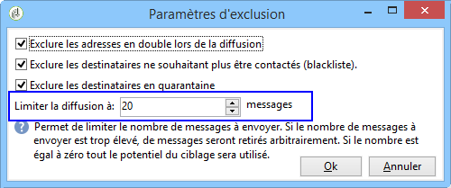

# Coupons personnalisés{#personalized-coupons}

Le fait d&#39;ajouter des coupons à vos diffusions peut donner une valeur ajoutée à vos destinataires en termes de produits et services. Le module coupon de Campaign permet de créer un jeu de coupons à ajouter à des offres marketing à venir. Lorsque vous êtes prêt à créer une diffusion, assignez les coupons applicables. Dans la mesure où les coupons sont valables pendant une période définie, un coupon assigné est lié de façon unique à son message de diffusion. De plus, Campaign confirme qu&#39;il y a suffisamment de coupons par rapport au nombre de messages avant l&#39;envoi de la diffusion.

>[!NOTE]
>
>La gestion des bons est un pack qui doit être installé. Pour confirmer que vous disposez de la gestion Bon, cochez la case **[!UICONTROL Administration > Configuration > Package management > Installed packages.]**
>
>Les données des coupons peuvent être importées et exportée à l&#39;aide de formats CSV et XML. Pour plus d&#39;informations sur l&#39;import et l&#39;export, voir [cette section](../../platform/using/generic-imports-and-exports.md).

## Créer un coupon {#creating-a-coupon}

Le module coupon offre le choix entre deux options lors de la création de coupons :

* **Anonyme** : un coupon générique pour des destinataires précis ou une liste de destinataires.
* **Individuel **: un coupon personnalisé pour des destinataires précis.

Avant d&#39;appliquer les étapes ci-dessous, vérifiez que vous savez quel type de coupon vous souhaitez créer.

1. Dans l&#39;arborescence de la campagne, accédez à **[!UICONTROL Resources > Campaign management > Coupons]**.

   

1. Cliquez sur le **[!UICONTROL New]** bouton.
1. Entrez le nom du bon dans le **[!UICONTROL Label]** champ. Un code unique a été saisi automatiquement **[!UICONTROL Coupon code]**. Vous pouvez conserver le code ou en saisir un nouveau.

   

1. Choisissez **[!UICONTROL Start date]** et **[!UICONTROL End date]** définissez la période de validité du bon.
1. Dans **[!UICONTROL Coupon type]**, sélectionnez Anonyme ou Individuel.

   **[!UICONTROL Anonymous coupons]** : Un bon anonyme est identique pour tous les destinataires. Vérifiez que l’option Anonymous est sélectionnée dans le menu Type **de** bon et cliquez sur **Enregistrer** pour générer le bon.

   **[!UICONTROL Individual coupons]** : Un bon individuel peut être personnalisé avec des codes de bons supplémentaires. Par exemple, un bon individuel est créé pour une vente dans un magasin d’équipements sportifs. Cependant, la liste des lauréats est longue et ils ne partagent pas le même enthousiasme pour un seul sport. Vous pouvez ajouter des noms de code pour chaque coupon en fonction d’un sport (football, football, baseball, etc.) et envoyer chaque code aux destinataires concernés.

   1. Lorsque vous sélectionnez Individuel, un nouvel onglet, Bons, s’affiche dans le coin inférieur gauche. Accédez à l’ **[!UICONTROL Coupons]** onglet et cliquez sur **[!UICONTROL Add]**.
   1. Lorsque la fenêtre contextuelle vous y invite, saisissez un code unique pour le coupon individuel.
   1. Click **[!UICONTROL Save]** to generate the coupon.
   Pour plus d’informations sur l’onglet Bons, voir [Configuration de bons](#configuring-individual-coupons)individuels.

   >[!NOTE]
   >
   >Les coupons individuels peuvent être importés en masse. Pour plus de détails sur l&#39;import et l&#39;export, voir [cette section](../../platform/using/generic-imports-and-exports.md).

### Configuration de coupons individuels {#configuring-individual-coupons}

L&#39;onglet Coupons n&#39;est disponible qu&#39;avec les Coupons Individuels. Une fois qu&#39;un coupon est associé à une diffusion, l&#39;onglet Coupon fournit les détails suivants :

* **[!UICONTROL Status]** : Disponibilité des bons.
* **[!UICONTROL Redeemed on]** : Date à laquelle le bon est échangé.
* **[!UICONTROL Channel]** : Canal utilisé pour envoyer le bon.
* **[!UICONTROL Address]** : Adresses électroniques des destinataires.

Les valeurs **[!UICONTROL status]**, **[!UICONTROL channel]** et **[!UICONTROL address]** sont automatiquement renseignées. Toutefois, les valeurs de **[!UICONTROL redeemed on]** ne sont pas récupérées par Campaign. Ils peuvent être complétés en important un fichier contenant les détails du remboursement des bons.

## Insérer un coupon dans une diffusion email {#inserting-a-coupon-into-an-email-delivery}

Dans l&#39;exemple ci-dessous, la diffusion est créée à partir de la Page d&#39;accueil. Pour des consignes détaillées de création d&#39;une diffusion, voir [cette section](../../delivery/using/about-email-channel.md). Il est également possible d&#39;ajouter un coupon à une diffusion dans un workflow.

1. Allez à **[!UICONTROL Campaigns]** et choisissez **[!UICONTROL Deliveries]**.
1. Clics **[!UICONTROL Create]**.

   

1. Entrez un nom dans **[!UICONTROL Label]** et cliquez sur **[!UICONTROL Continue]**.
1. Click **[!UICONTROL To]** to add recipients.
1. Cliquez sur **[!UICONTROL Add]** pour sélectionner les destinataires de la remise. Une fois que vous avez sélectionné vos destinataires, cliquez **[!UICONTROL Ok]** pour revenir à la remise.

   

1. Saisissez un objet et ajoutez du contenu au message.

   

1. In the toolbar, click **[!UICONTROL Properties]** and choose the **[!UICONTROL Advanced]** tab.
1. Cliquez sur l’icône de dossier pour **[!UICONTROL Coupon management]**.

   

1. Sélectionnez le bon et cliquez sur **[!UICONTROL Ok]**. Cliquez **[!UICONTROL Ok]** de nouveau sur.

   

1. Cliquez sur le message pour choisir l&#39;emplacement du coupon.

   

1. Cliquez sur l&#39;icône de personnalisation pour choisir l&#39;une des options suivantes en fonction du type de coupon :

   * Bon anonyme : **[!UICONTROL Coupon > Coupon code]**

      

   * Bon individuel : **[!UICONTROL Coupon value > Coupon code]**

      

      Le coupon est inséré dans le message sous forme de code et non du nom qui lui est assigné. Le code est utilisé dans le cadre du modèle de données standard Campaign.
   

1. Exécutez un test pour confirmer le nom que vous avez attribué au bon. Accédez à l’ **[!UICONTROL Preview]** onglet et cliquez sur **[!UICONTROL Test personalization]**. Sélectionnez un destinataire pour le test.

   

   A la suite du test, le coupon devrait apparaître sous forme du nom assigné et non du code.

   

1. In the toolbar, click **[!UICONTROL Send]** (upper left) and choose how you want to send the delivery.

   

1. Clics **[!UICONTROL Analyze]**. If the analysis log confirms that there are enough coupons for all recipients, click **[!UICONTROL Confirm delivery]** to send it.

   

>[!NOTE]
>
>For instructions on how to manage insufficient coupons for a delivery, see [Managing insufficient coupons](#managing-insufficient-coupons)

Pour confirmer que la diffusion a abouti :

1. Go to **[!UICONTROL Explorer > Resources > Campaign management > Coupons]**.
1.  Cliquez sur l’ **[!UICONTROL Deliveries]** onglet.

   

   The status reads as **[!UICONTROL Finished]** for a successful delivery.

>[!NOTE]
>
>Par défaut, le module de gestion des coupons utilise une table **nms:recipient**. Pour des consignes concernant l&#39;utilisation des autres tables, voir [Edition des schémas](../../configuration/using/data-schemas.md).

## Gestion des coupons insuffisants {#managing-insufficient-coupons}

L&#39;analyse de la diffusion s&#39;arrête s&#39;il y a moins de coupons que de messages. Dans ce cas, vous pouvez importer plus de coupons ou restreindre le nombre de messages. Pour limiter le nombre de messages, suivez les consignes ci-dessous.

1. Allez dans la fenêtre de diffusion email.
1. Clics **[!UICONTROL To]**.
1. Dans **[!UICONTROL Select target]**, accédez à l&#39; **[!UICONTROL Exclusions]** onglet.

   

1. In the exclusion settings section, click **[!UICONTROL Edit]**.
1. Entrez le nombre de messages à envoyer **[!UICONTROL Limit delivery to...messages]** et cliquez sur **[!UICONTROL Ok]**. Vous pouvez envoyer la livraison.

   

>[!NOTE]
>
>En cas de gestion d&#39;un nombre limité de coupons, un workflow de diffusion vous permet de diviser la diffusion en fonction de vos critères. Cette option est adaptée pour l&#39;envoi de coupons à une population précise sans limiter la cible.
