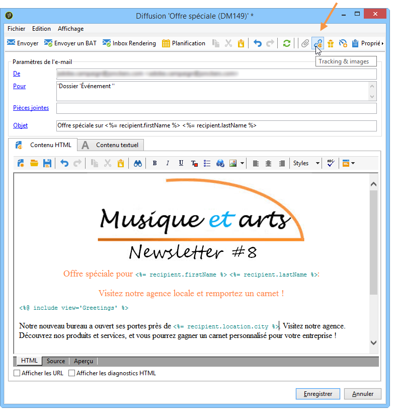
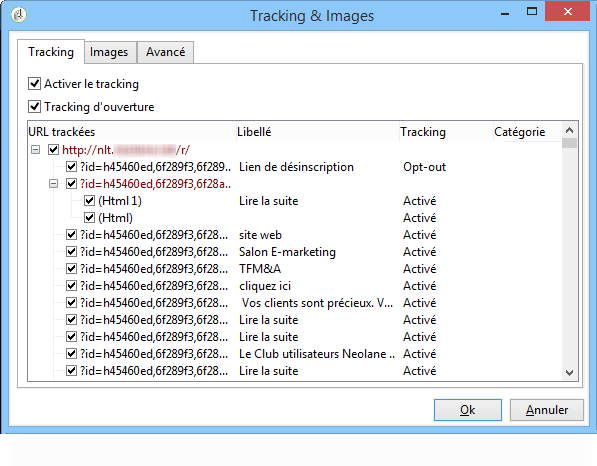
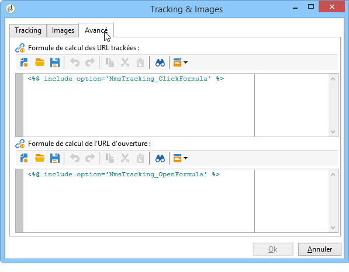

# Configurer les options de suivi d’URL{#personalizing-url-tracking}

Les paramètres avancés du tracking des messages sont accessibles à partir de l’icône **[!UICONTROL Tracking &amp; images]** située dans la barre d’outils de l’assistant de diffusion.

>[!NOTE]
>
>La gestion des images dans les e-mails est également paramétrée depuis cette fenêtre. Voir la [documentation de Campaign v8](https://experienceleague.adobe.com/docs/campaign/campaign-v8/send/emails/defining-the-email-content.html?lang=fr#adding-images){target="_blank"}.

Vous pouvez configurer les options de tracking :

* Activer/Désactiver le tracking des URL de tous les messages.

  >[!CAUTION]
  >
  >Lorsque le tracking n&#39;est pas activé sur une diffusion (c&#39;est-à-dire, l&#39;option **[!UICONTROL Activer le tracking]** n&#39;est pas sélectionnée), les rapports et les données associés au tracking ne sont pas disponibles : les rapports Ouvertures, Hot click et URL suivies ne contiendront aucune donnée et les onglets **[!UICONTROL Logs de tracking]** ne seront pas affichés pour cette diffusion.

* Activer/Désactiver le tracking à l&#39;ouverture du message.

Les URL trackées sont listées dans la fenêtre centrale, sous la forme d&#39;une arborescence.

Vous pouvez activer ou désactiver unitairement le tracking pour chaque URL du message. Pour plus d’informations, consultez [cette section](how-to-configure-tracked-links.md).

L&#39;onglet **[!UICONTROL Avancé]** permet de personnaliser les formules de calcul des URL trackées et de l&#39;URL d&#39;ouverture.

>[!CAUTION]
>
>Les paramètres de cet onglet ne peuvent être modifiés que par des utilisateurs experts.
