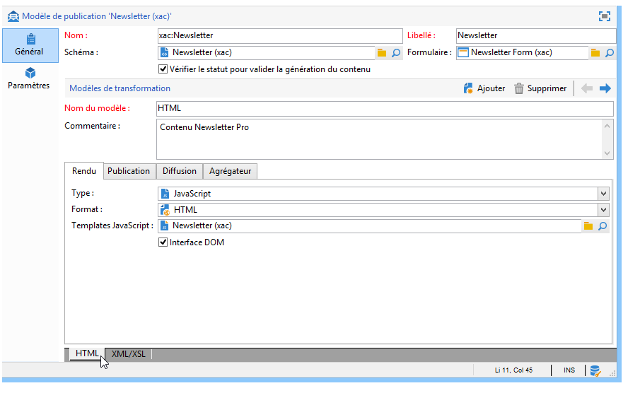
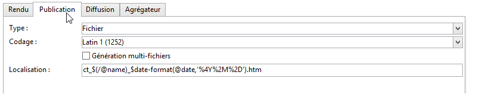
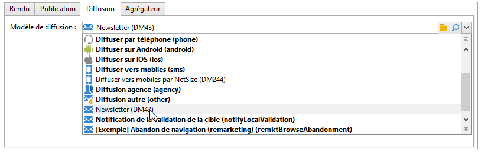
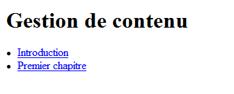
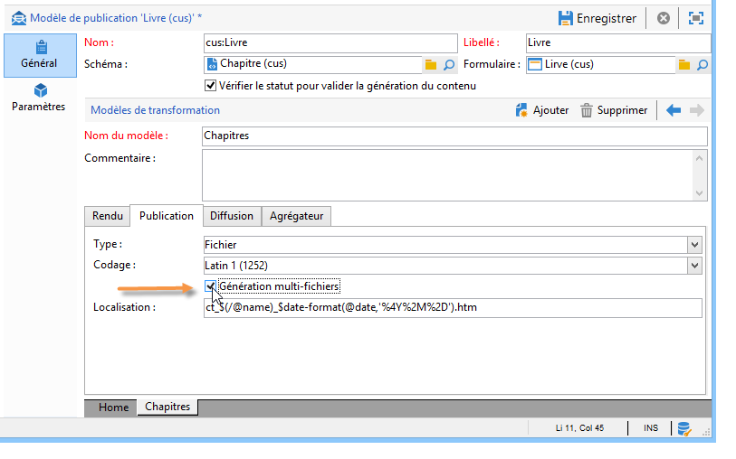

# Modèles de publication{#publication-templates}

## À propos des modèles de publication {#about-publication-templates}

Le modèle de publication référence les ressources utilisées dans le processus de publication, à savoir :

* le schéma de données,
* le formulaire de saisie,
* les modèles de transformation pour chaque document de sortie.

## Identification d&#39;un modèle de publication {#identification-of-a-publication-template}

Un modèle de publication est identifié par son nom et son espace de noms.

La clé d&#39;identification d&#39;une feuille de style est une chaîne construite avec l&#39;espace de noms et le nom séparés par le caractère &#39;:&#39; (par exemple : **xac:newsletter**).

>[!NOTE]
>
>Dans la pratique, il est recommandé d&#39;utiliser la même clé pour le schéma, le formulaire et le modèle de publication.

## Création et configuration du modèle {#creating-and-configuring-the-template}

Les modèles de publication sont stockés par défaut dans la variable **[!UICONTROL Administration > Paramétrage > Modèles de publication]** noeud . Pour créer un modèle, cliquez sur le bouton **[!UICONTROL Nouveau]** au-dessus de la liste des modèles.

Pour paramétrer le modèle de publication, indiquez le nom du modèle (c&#39;est-à-dire la clé d&#39;identification composée du nom et de l&#39;espace de noms), son libellé, le schéma de données et le formulaire de saisie auxquels il est associé.



>[!NOTE]
>
>Le libellé apparaîtra lors de la création d&#39;un contenu à partir de ce modèle de publication.

L’option **Vérifier le statut pour valider la génération du contenu** force la vérification du statut « Validé » des instances de contenu pour autoriser la génération du fichier. Pour plus d’informations, consultez la section [Publication](#publication).

Un modèle de transformation doit être ajouté pour chaque document de sortie. Vous pouvez créer autant de modèles de transformation que nécessaire.

Le champ **[!UICONTROL Nom du modèle]** est un libellé libre qui décrit le type de rendu en sortie. Pour chaque modèle de transformation, les paramètres de publication sont renseignés dans les onglets.

### Rendu {#rendering}

Dans l&#39;onglet **[!UICONTROL Rendu]**, choisissez :

* le type de rendu utilisé pour la projection du document de sortie : feuille de style XSL ou template JavaScript,
* le format du document de sortie : HTML, Texte, XML ou RTF,
* le modèle contenant les informations de construction, c&#39;est-à-dire la feuille de style ou le template JavaScript à utiliser.

### Publication {#publication}

La publication consiste à générer le document de sortie sous la forme d&#39;un fichier. Pour cela, vous devez sélectionner le type **[!UICONTROL Fichier]**.



Les options de publication disponibles sont les suivantes :

* Il est possible de forcer le jeu de caractères d&#39;encodage du fichier en sortie à partir du champ **[!UICONTROL Codage]**. Le jeu de caractères Latin 1 (1252) est le mode par défaut.
* L&#39;option **[!UICONTROL génération multi-fichiers]** active un mode particulier de publication de documents : cette option consiste à renseigner une balise de découpe en début de chaque page du document en sortie. La génération du contenu produira autant de fichiers que de balises de découpe renseignées. Ce mode est utilisé pour la génération de mini-sites à partir d&#39;un contenu. Voir à ce propos [Génération multi-fichiers](#multi-file-generation)
* Le champ d&#39;édition **[!UICONTROL Localisation]** contient le nom du fichier en sortie. Le nom peut être construit à partir de variables afin de générer un nom de fichier automatique.

  Une variable est renseignée avec le format suivant : **`$(<xpath>)`**, où **`<xpath>`** est le chemin d’un champ du schéma de données du modèle de publication.

  Le nom d’un fichier peut être composé d’un champ de type date. Pour formater correctement ce champ, utilisez la méthode **$date-format** , en utilisant le chemin du champ et le format de sortie comme paramètres.

  Par défaut, le format de construction du nom du fichier utilise les variables sur les champs &quot;@name&quot; et &quot;@date&quot; :

  ```
  ct_$(@name)_$date-format(@date,'%4Y%2M%2D').htm
  ```

  Le nom du fichier généré sera donc composé comme suit : ct_news12_20110901.htm.

  >[!NOTE]
  >
  >Pour plus d’informations sur la génération du contenu, consultez la section [Création d’une instance de contenu](using-a-content-template.md#creating-a-content-instance).

### Diffusion {#delivery}

Cet onglet permet de sélectionner un scénario afin de lancer une diffusion directement sur le contenu. Le contenu de lʼe-mail sera automatiquement renseigné en fonction des formats de sortie HTML ou Texte.



>[!NOTE]
>
>Pour découvrir un exemple de création de diffusion à partir dʼun contenu, consultez la section [Diffusion dʼune instance de contenu](using-a-content-template.md#delivering-a-content-instance).

### Agrégateur {#aggregator}

Un traitement d&#39;agrégation de données à partir d&#39;un script ou d&#39;une liste de requêtes permet d&#39;enrichir le document XML des données du contenu. Le principe est de compléter certaines informations référencées par des liens, ou d&#39;ajouter des éléments provenant de la base de données.

### Génération multi-fichiers {#multi-file-generation}

Pour activer la génération multi-fichiers, cochez l&#39;option **[!UICONTROL Génération multi-fichiers]** dans le modèle de publication. Cette option permet de renseigner dans la feuille de style des balises de découpe en début de chaque page du document en sortie. La génération du contenu produira autant de fichiers que de balises de découpe rencontrées.

La balise de découpe à intégrer dans la feuille de style est la suivante :

**`<xsl:comment> #nl:output_replace(<name_of_file>) </xsl:comment>`** où **`<name_of_file>`** correspond au nom de fichier de la page à générer.

**Exemple :** Génération multi-fichiers en reprenant le schéma &quot;cus:livre&quot;.

Le principe consiste à générer une page principale énumérant la liste des chapitres, avec possibilité d&#39;afficher le détail du chapitre dans une page externe.



La feuille de style (&quot;cus:livre.xsl&quot;) correspondante est la suivante :

```
<?xml version="1.0" encoding="ISO-8859-1" ?>
<xsl:stylesheet xmlns:xsl="http://www.w3.org/1999/XSL/Transform" version="1.0">
  <xsl:output encoding="ISO-8859-1" method="html"/>

  <!-- Style sheet entry point -->
  <xsl:template match="/book">
    <html>
      <body>
        <h1><xsl:value-of select="@name"/></h1>
        <lu>
          <xsl:for-each select="chapter">
            <li><a target="_blank" href="chapter{@id}.htm"><xsl:value-of select="@name"/></a></li>  
          </xsl:for-each>
       </lu>
      </body>
    </html>
   </xsl:template>
</xsl:stylesheet>
```

Une deuxième feuille de style (&quot;cus:chapitre.xsl&quot;) est nécessaire pour générer le détail des chapitres :

```
<?xml version="1.0" encoding="ISO-8859-1" ?>
<xsl:stylesheet xmlns:xsl="http://www.w3.org/1999/XSL/Transform" version="1.0">
  <xsl:output encoding="ISO-8859-1" method="html"/>

  <!-- Detail of a chapter -->
  <xsl:template match="chapter">
    <!-- Cut tag -->   
    <xsl:comment> #nl:output_replace($(path)/chapter<xsl:value-of select="@id"/>.htm)</xsl:comment>
    
    <html>
      <body>
        <h1><xsl:value-of select="@name"/></h1>
        <xsl:value-of select="page" disable-output-escaping="yes"/>
      </body>
    </html>
  </xsl:template>

  <!-- Style sheet entry point -->
  <xsl:template match="/book">
    <xsl:apply-templates/>
   </xsl:template>
</xsl:stylesheet>
```

La balise de découpe est renseignée en début de page à inclure dans le fichier à générer.

```
<xsl:comment> #nl:output_replace($(path)/<xsl:value-of select="@id"/>.htm)</xsl:comment>
```

Le nom du fichier est construit avec la variable **$(path)** contenant le chemin de publication et **`<xsl:value-of select="@id" />`**, qui correspond à l&#39;identifiant du chapitre dans le document en entrée.

Le modèle de publication doit être renseigné avec les deux feuilles de style &quot;cus:livre.xsl&quot; et &quot;cus:chapitre.xsl&quot;.

L&#39;option **[!UICONTROL Génération multi-fichiers]** doit être active sur le modèle de transformation des chapitres :



Le champ **[!UICONTROL Localisation]** n&#39;est pas utilisé dans la génération multi-fichiers, vous devez toutefois renseigner ce champ afin d&#39;éviter une erreur lors de la publication.
