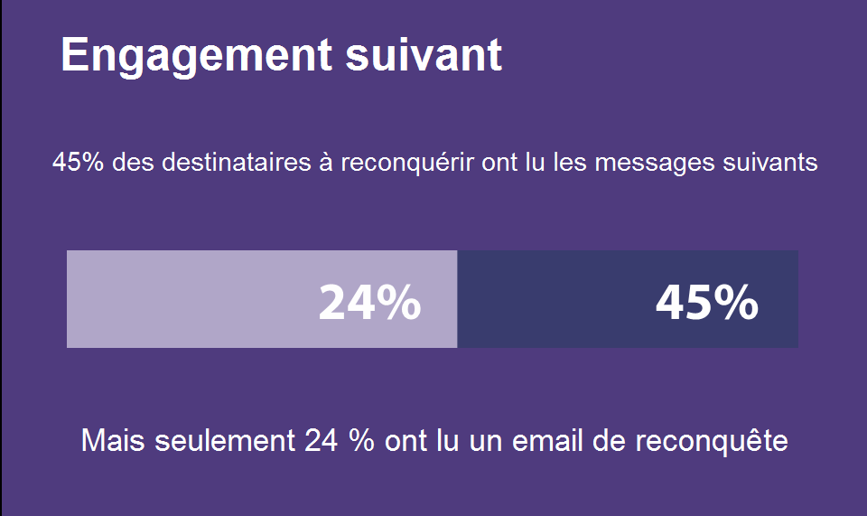
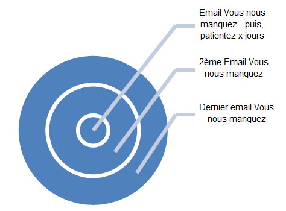
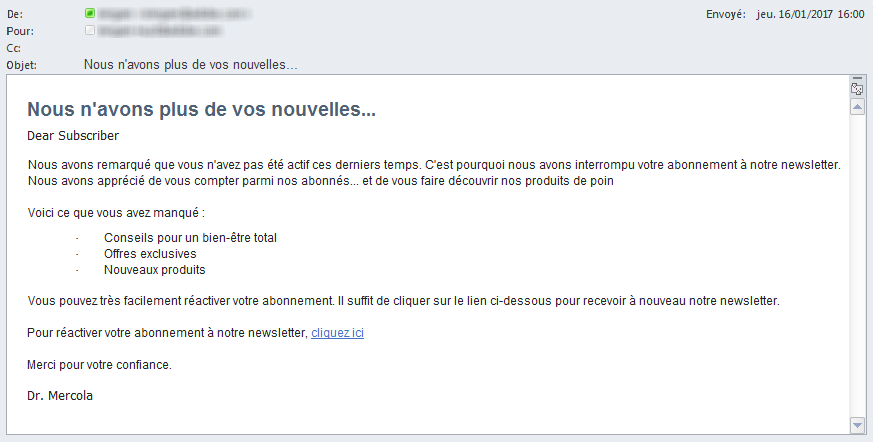
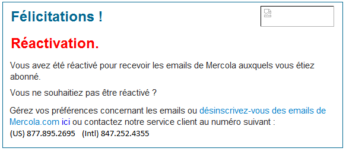

# Améliorer la délivrabilité par le réengagement{#re-engagement}

Tout en mettant en oeuvre la délivrabilité, certaines des meilleures pratiques consistent à essayer de maintenir une base d&#39;abonnés saine et d&#39;améliorer la délivrabilité par le biais de stratégies de réengagement.

* Le maintien d&#39;une base d&#39;abonnés saine est l&#39;un des principaux aspects qui permettent d&#39;assurer une bonne et cohérente prestation des services. De nombreux problèmes de délivrabilité sont dus à des pratiques et à une maintenance inadéquates des données.
* L’un des problèmes les plus courants auxquels les marketeurs sont confrontés aujourd’hui est l’activité inactive des abonnés (également appelée faible ou non-engagement), qui peut avoir un impact négatif sur la remise des courriers électroniques et un faible retour sur investissement.

>[!NOTE]
>
>Pour plus d’informations sur les stratégies de campagne de réengagement et les services de délivrabilité d’Adobe, contactez votre consultant en délivrabilité ou contactez votre agent commercial Adobe.

## How do ISPs view non-engagement activity? {#how-do-isps-view-non-engagement-activity-}

Pendant des années, les FAI ont utilisé les mesures de retour de l&#39;engagement des utilisateurs pour décider où envoyer les messages et s&#39;ils doivent être diffusés. L&#39;engagement des utilisateurs consiste en des retours positif et négatif qui sont suivis constamment par les FAI. Un non-engagement est sans doute le signe le plus évident d&#39;un engagement négatif. Du point de vue de la délivrabilité, l&#39;envoi systématique de campagnes à des utilisateurs qui ne montrent aucun engagement peut également entacher la réputation globale de votre adresse IP et de vos domaines.

Les FAI comme AOL, Gmail, Microsoft et Yahoo! interprètent le non-engagement comme un email indésirable et redirigent les messages vers le dossier de spam. De plus, ces abonnés peuvent ne plus disposer du compte de messagerie, qui peut être utilisé comme spam trap « recyclé ». Cela signifie que l&#39;adresse est invalide depuis un certain temps et tous les messages sont refusés. Si votre système de gestion des abonnés ne supprime pas les adresses « rebond hard », il est fort probable que les spam traps posent des problèmes de diffusion importants.

## How should you approach inactivity? {#how-should-you-approach-inactivity-}

Les clients qui utilisent la plate-forme Adobe Campaign peuvent visualiser l&#39;inactivité dans leur instance en examinant les données d&#39;ouverture et de clic selon le segment. Comme le non-engagement peut entraver la diffusion, la première réaction peut être de supprimer les abonnés de la base de données. Cela peut être une mauvaise solution dans certains cas. Une stratégie de réengagement (également appelée reconquête) est donc la meilleure recommandation pour fidéliser les abonnés qui souhaitent recevoir des emails et éliminer graduellement ceux qui ne montrent plus d&#39;activité.

## Do re-engagement campaigns really work? {#do-re-engagement-campaigns-really-work-}

Selon une étude Return Path, les campagnes de réengagement ont un taux d&#39;ouverture de 12 % par rapport à une moyenne de 14 % pour les campagnes normales. Bien que seulement 24 % des abonnés aient lu la campagne de réengagement, environ 45 % d&#39;entre eux ont lu les messages suivants.

## How do you create a re-engagement campaign? {#how-do-you-create-a-re-engagement-campaign-}

### Phase 1 {#phase-1}

* La première étape consiste à identifier les abonnés qui ont une activité très faible d&#39;ouverture ou de clic ou qui n&#39;ont pas d&#39;activité du tout et à segmenter en conséquence ce groupe en fonction d&#39;un délai défini. Une règle de base consiste à examiner les abonnés qui n&#39;ont pas ouvert un email ou cliqué dessus au cours des 90 derniers jours. Ce délai peut toutefois varier en fonction de la nature de l&#39;entreprise (envoi saisonnier, par exemple).
* Un autre point à garder à l&#39;esprit lors de la définition des délais est que les FAI et les sociétés de blacklistage considèrent l&#39;engagement dans un délai entre 1,5 et 1,8 ans et les activités comportementales telles que les achats et l&#39;activité du site web, ou d&#39;autres points de contact, comme les préférences pendant la phase d&#39;inscription ou le premier point de contact.

### Phase 2 {#phase-2}

* Une fois un segment défini, l&#39;étape suivante consiste à créer une campagne de réengagement qui répond aux besoins de l&#39;abonné selon les mesures identifiées. La création d&#39;une ligne d&#39;objet permet de susciter l&#39;intérêt de l&#39;abonné. Selon une étude Return Path, les lignes d&#39;objet et le contenu qui laissent penser que les abonnés manquent à la marque génèrent des taux de réponse supérieurs à ceux qui demandent le retour des abonnés.
* Une incitation peut également être proposée dans le cadre du réengagement. Lors du choix des offres avec remises, il est préférable d&#39;utiliser des montants en euros plutôt que des pourcentages. Return Path suggère également de le faire car cela entraîne des taux de réponse supérieurs. Enfin, la réalisation de tests A/B pour examiner les taux de réponse et de succès s&#39;avère également utile.

### Phase 3 {#phase-3}

L&#39;étape suivante consiste à déterminer la fréquence de la campagne de réengagement. Contrairement aux messages de reconfirmation, les campagnes de réengagement ont pour but de reconquérir les abonnés grâce à des emails envoyés au fil du temps. L&#39;exemple suivant illustre la fréquence.

Les abonnés qui interagissent pendant la campagne en suivant l&#39;activité d&#39;ouverture ou de clic sont ajoutés à la liste des abonnés engagés.

### Phase 4 {#phase-4}

* La phase suivante consiste à identifier les abonnés n&#39;ayant aucune activité et à réduire progressivement l&#39;envoi des emails à ces derniers. En cas d&#39;inactivité au cours de l&#39;année passée, il est conseillé de suspendre l&#39;inscription des abonnés. Bien que le contenu de l&#39;email ne les ai pas intéressés, il est encore possible de les faire réactiver leur inscription en envoyant une campagne unique de reconfirmation.
* Les campagnes de reconfirmation sont un bon moyen de demander aux abonnés inactifs depuis une longue période s&#39;ils souhaitent être conservés dans la liste d&#39;inscription. Lors de la création de la campagne, il est préférable d&#39;ajouter un lien « cliquez ici » afin que les abonnés puissent confirmer l&#39;action et vérifier leur adresse. De cette façon, l&#39;action peut être enregistrée dans la base de données. Voici un exemple d&#39;email de reconfirmation :

   

   Une fois que l&#39;abonné a exécuté une action, une landing page avec la confirmation de la réinscription peut être proposée. Voici un exemple de landing page :

   
