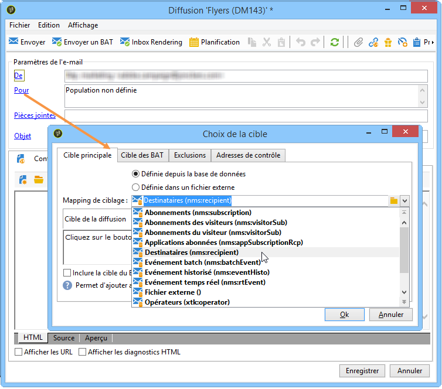

# Sélection d’un mapping de ciblage{#selecting-a-target-mapping}

Par défaut, les modèles de diffusion ciblent les **[!UICONTROL Destinataires]**. Leur mapping de ciblage utilise donc les champs de la table **nms:recipient**. Adobe Campaign propose d&#39;autres mappings de ciblage pour vos diffusions que vous pouvez utiliser selon vos besoins.

Ces mappings sont les suivants :

| Nom | Utilisation | Schéma standard |
|---|---|---|
| Destinataires | Diffuser aux destinataires de la base Adobe Campaign | nms:recipient |
| Visiteurs | Diffuser aux visiteurs dont les profils ont été collectés par exemple via un parrainage (marketing viral), via les réseaux sociaux (Facebook, Twitter), etc. | mns:visitor |
| Abonnements  | Diffuser aux destinataires abonnés à un service d&#39;information, par exemple une newsletter | nms:subscription |
| Abonnements des visiteurs | Diffuser à des visiteurs abonnés à un service d&#39;information | nms:visitorSub |
| Service | Publier sur un compte Twitter ou une page Facebook | nms:service |
| Les opérateurs | Diffuser aux opérateurs Adobe Campaign | nms:operator |
| Fichier externe | Diffuser depuis un fichier contenant les toutes informations nécessaires à la diffusion | Aucun schéma associé, aucune cible renseignée |

>[!NOTE]
>
>Il est possible de créer dʼautres mappings de ciblage. Cette opération est toutefois réservée à des utilisateurs avancés. Pour plus d’informations, consultez [cette section](../../configuration/using/target-mapping.md).
