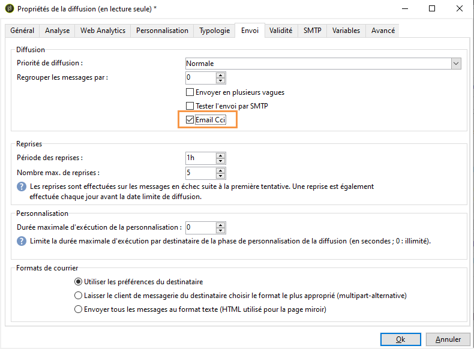
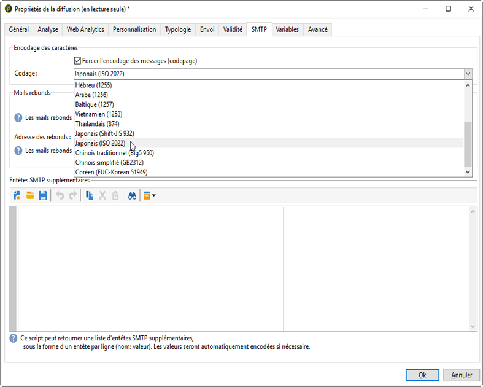

# Sending an email{#sending-an-email}

To approve your email and send it to the recipients of the delivery being created, click **[!UICONTROL Send]**.

Le processus détaillé lors de la validation et l&#39;envoi d&#39;une diffusion est présenté dans les sections ci-dessous :

* [Valider la diffusion](../../delivery/using/steps-validating-the-delivery.md)
* [Envoyer la diffusion](../../delivery/using/steps-sending-the-delivery.md)

Les sections ci-dessous détaillent les paramètres spécifiques à la diffusion des courriers électroniques.

## Archiver des emails {#archiving-emails}

Adobe Campaign vous permet de stocker des emails sur un système externe via Cci en ajoutant simplement une adresse email en Cci à votre cible de message. Une fois l&#39;option activée, une copie exacte de tous les messages envoyés sera conservée pour cette diffusion.

Pour plus d&#39;informations sur le paramétrage d&#39;un Cci d&#39;email, consultez [cette section](../../installation/using/email-archiving.md).

>[!NOTE]
>
>Cette fonctionnalité est en option. Vérifiez votre contrat de licence et contactez votre chargé de compte pour l&#39;activer.

Lors de la création d&#39;une diffusion ou d&#39;un modèle de diffusion, l&#39;option Email BCC n&#39;est pas activée par défaut, même si elle a été achetée. Vous devez l&#39;activer manuellement dans chaque diffusion ou modèle où vous souhaitez l&#39;utiliser.

Pour ce faire, procédez comme suit :

1. Accédez à **[!UICONTROL Gestion de campagne]** > **[!UICONTROL Diffusions]** ou **[!UICONTROL Ressources]** > **[!UICONTROL Modèles]** > **[!UICONTROL Modèles de diffusion]**.
1. Sélectionnez la diffusion de votre choix ou dupliquez le modèle d&#39;usine **Diffusion email**, puis sélectionnez le modèle dupliqué.
1. Cliquez sur le bouton **Propriétés**.
1. Sélectionnez l&#39;onglet **[!UICONTROL Diffusion]**.
1. Cochez la case **Archiver les emails** pour conserver une copie de tous les messages envoyés pour cette diffusion ou pour chaque diffusion basée sur ce modèle.

   

   >[!NOTE]
   >
   >Si les emails envoyés à l&#39;adresse en bcc sont ouverts et font l&#39;objet de clics, cela sera pris en compte dans les **[!UICONTROL Ouvertures totales]** et les **[!UICONTROL Clics]** provenant de l&#39;analyse d&#39;envoi, ce qui pourrait entraîner des erreurs de calcul.

## Générer la page miroir {#generating-the-mirror-page}

La page miroir est une page HTML accessible en ligne via un navigateur web et dont le contenu est identique à celui de l&#39;email.

Par défaut, la page miroir est générée si le lien est inséré dans le contenu du courrier. Pour plus d’informations sur l’insertion de blocs de personnalisation, reportez-vous à la section Blocs de [personnalisation](../../delivery/using/personalization-blocks.md).

Dans les propriétés de diffusion, le champ **[!UICONTROL Mode]** de l&#39;onglet **[!UICONTROL Validité]** vous permet de modifier le mode de génération de la page.

>[!CAUTION]
>
>Un contenu HTML doit avoir été défini pour la diffusion pour que la page miroir soit créée.

Outre le mode par défaut, les options disponibles sont les suivantes :

* **[!UICONTROL Forcer la génération de la page miroir]** : même si aucun lien vers la page miroir n&#39;est inséré dans la diffusion, la page miroir sera créée.
* **[!UICONTROL Ne pas générer de page miroir]** : aucune page miroir n&#39;est générée, même si le lien est présent dans la diffusion.
* **[!UICONTROL Générer une page miroir accessible depuis l&#39;identifiant du message]** : cette option permet d&#39;accéder au contenu de la page miroir, avec les informations de personnalisation, dans la fenêtre des logs de diffusion. Pour cela, une fois la diffusion terminée, cliquez sur l&#39;onglet **[!UICONTROL Diffusion]** et sélectionnez la ligne du destinataire dont vous souhaitez visualiser la page miroir. Cliquez ensuite sur le lien **[!UICONTROL Afficher la page miroir de ce message...]**.

   

## Gérer les mails rebonds {#managing-bounce-emails}

L&#39;onglet **[!UICONTROL SMTP]** des paramètres de la diffusion permet de paramétrer la gestion des mails rebonds.

Par défaut, les mails rebonds sont réceptionnés dans la boîte d&#39;erreur de la plateforme. Vous pouvez toutefois définir une adresse d&#39;erreur spécifique pour une diffusion.

Vous pouvez également définir une adresse spécifique depuis cet écran afin d&#39;investiguer sur les causes du rebond des mails n&#39;ayant pas pu être automatiquement qualifiés par l&#39;application. Pour chacun de ces champs, l&#39;icône d&#39;ajout de champs personnalisés permet d&#39;ajouter des paramètres de personnalisation.

## Encodage des caractères {#character-encoding}

Dans l’onglet **[!UICONTROL SMTP]** des paramètres de remise, la section Codage **[!UICONTROL des]** caractères vous permet de définir un codage spécifique.

Le codage par défaut est UTF-8. Si certains fournisseurs de messagerie de vos destinataires ne prennent pas en charge le codage UTF-8 standard, vous pouvez définir un codage spécifique pour afficher correctement les caractères spéciaux sur les destinataires de vos courriels.

Par exemple, vous souhaitez envoyer un courrier électronique contenant des caractères japonais. Pour vous assurer que tous les caractères s’afficheront correctement à vos destinataires au Japon, vous pouvez utiliser un encodage prenant en charge les caractères japonais plutôt que le format UTF-8 standard.

Pour ce faire, sélectionnez l’option **[!UICONTROL Forcer le codage utilisé pour les messages]** dans la section Codage **** Caractère, puis choisissez un codage dans la liste déroulante qui s’affiche.

## Ajouter des en-têtes SMTP {#adding-smtp-headers}

Vous pouvez ajouter des en-têtes SMTP supplémentaires à vos diffusions. Pour cela, utilisez la section correspondante dans l&#39;onglet **[!UICONTROL SMTP]** des propriétés de la diffusion.

Le script saisi dans cette fenêtre doit référencer un en-tête par ligne, sous la forme **nom: valeur**.

Les valeurs sont automatiquement encodées, si nécessaire.

>[!CAUTION]
>
>L&#39;ajout d&#39;un script pour l&#39;insertion d&#39;en-têtes SMTP supplémentaires est réservé aux utilisateurs expérimentés.
>
>La syntaxe de ce script doit être strictement conforme aux exigences de ce type de contenu : aucun espace superflu, aucune ligne vide, etc.
