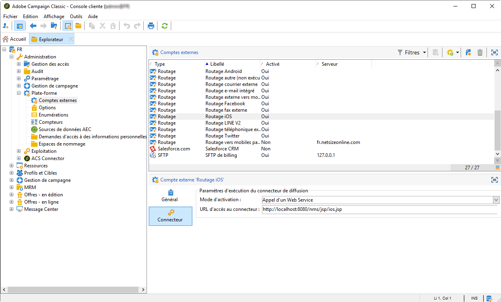
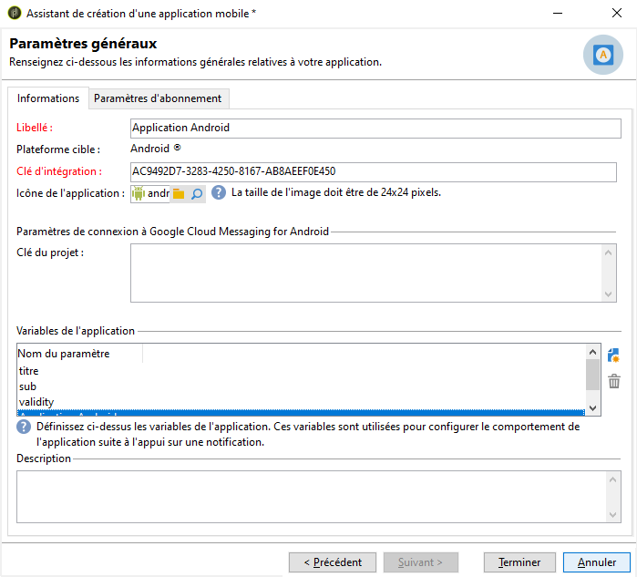
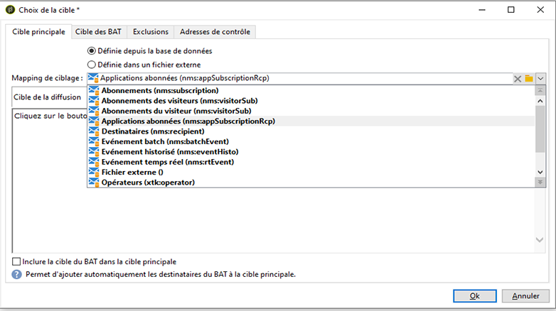

# Configuration de Mobile App Channel{#setting-up-mobile-app-channel}

## Introduction {#introduction}

>[!CAUTION]
>
>La mise en œuvre de Mobile App Channel doit être effectuée par des utilisateurs experts. Si vous avez besoin d&#39;aide, contactez votre chargé de compte Adobe ou votre partenaire de services professionnels.

Vous pouvez créer plusieurs versions de votre application mobile (iOS, Android) : l’option Canal applications mobiles (Mobile App Channel) vous permet d’envoyer des notifications aux terminaux sur lesquels l’application mobile est installée.

Pour utiliser les fonctionnalités du Canal applications mobiles (Mobile App Channel) Adobe Campaign, vous devez modifier/adapter votre application mobile de façon à l’intégrer à la plate-forme Adobe Campaign.

Deux SDK Campaign Classic sont disponibles, l’un pour Android et l’autre pour iOS, pour une intégration aisée de votre application mobile avec Adobe Campaign. Une connaissance technique approfondie de Java et Objective-C est nécessaire. Vous trouverez une description détaillée du SDK de campagne dans [Intégration du SDK de campagne dans l’application](#integrating-campaign-sdk-into-the-mobile-application)mobile.

>[!NOTE]
>
>Les bibliothèques fournies par Adobe Campaign sont conçues pour être utilisées avec Xcode (iOS) et Android Studio (Android).

## Connecteurs {#connectors}

### Connecteurs iOS {#ios-connectors}

Deux connecteurs sont disponibles pour iOS :

* Le connecteur binaire iOS envoie des notifications au serveur APNS binaire.
* Le connecteur HTTP/2 iOS envoie des notifications à l&#39;APNS HTTP/2.

Pour sélectionner le connecteur à utiliser, procédez comme suit :

1. Go to **[!UICONTROL Administration > Platform > External accounts]**.
1. Sélectionnez le compte externe de routage iOS.
1. Dans l’ **[!UICONTROL Connector]** onglet, renseignez le **[!UICONTROL Access URL of the connector]** champ :

   Pour le connecteur binaire iOS : https://localhost:8080/nms/jsp/ios.jsp

   Pour le connecteur HTTP2 iOS : http://localhost:8080/nms/jsp/iosHTTP2.jsp

   

### Connecteurs Android {#android-connectors}

Deux connecteurs sont disponibles pour Android :

* Le connecteur V1 permet une connexion par MTA child.
* Le connecteur V2 permet plusieurs connexions simultanées avec le serveur FCM pour améliorer le débit.

Pour sélectionner le connecteur à utiliser, procédez comme suit :

1. Go to **[!UICONTROL Administration > Platform > External accounts]**.
1. Sélectionnez le compte **[!UICONTROL Android routing]** externe.
1. Dans l’ **[!UICONTROL Connector]** onglet, renseignez le **[!UICONTROL JavaScript used in the connector]** champ :

   Pour Android V1 : https://localhost:8080/nms/jsp/androidPushConnector.js

   Pour Android V2 : https://localhost:8080/nms/jsp/androidPushConnectorV2.js

   

1. Pour Android V2, un paramètre supplémentaire est disponible dans le fichier de configuration du serveur Adobe (serverConf.xml) :

   * **maxGCMConnectPerChild** : limite maximale du nombre de requêtes HTTP parallèles sur le serveur FCM initiées par chaque serveur fils (8 par défaut).

## Etapes de configuration {#configuration-steps}

### Créer l&#39;application {#creating-the-application}

Si vous n’avez pas d’application mobile (application), le développeur d’applications doit la créer et intégrer le SDK. Si l’application mobile existe, le développeur doit l’adapter en intégrant le SDK Adobe Campaign et en ajoutant les paramètres spécifiques au service. Pour une description du SDK, reportez-vous à la section [Intégration du SDK de campagne dans l’application](#integrating-campaign-sdk-into-the-mobile-application)mobile.

>[!CAUTION]
>
>L&#39;application doit avoir été configurée pour des actions de Push AVANT toute intégration au SDK Adobe Campaign.
>
>Si ce n&#39;est pas le cas, veuillez consulter [cette page](https://developer.apple.com/library/archive/documentation/NetworkingInternet/Conceptual/RemoteNotificationsPG/).

### Collecter les informations {#collecting-information-}

Pour réaliser le paramétrage de l&#39;application, vous devez collecter les informations nécessaires dans un cahier des charges technique. Il doit définir l&#39;ensemble des paramètres permettant à Adobe Campaign et à l&#39;application mobile de communiquer. Ces paramètres sont les suivants :

* **la clé** d’intégration : chaque application possède une clé unique. Cette clé vous permet de lier le service Adobe Campaign et l’application mobile. Reportez-vous aux informations [](#general-information)générales.
* **les variables**: définissez le comportement de l’application lorsque vous activez la notification. Reportez-vous aux informations [](#general-information)générales.
* **les paramètres** d’abonnement : par défaut, Adobe Campaign récupère le champ **@userKey** qui permet de concilier les périphériques mobiles avec les destinataires de la base de données. Si vous souhaitez collecter des données supplémentaires (une clé de rapprochement complexe, par exemple), vous pouvez définir des paramètres d’abonnement. Reportez-vous à la section Paramètres [d’](#subscription-settings)abonnement.
* **les sons** (iOS uniquement) : si le son sélectionné n&#39;est pas un son système, le fichier audio doit être incorporé dans l&#39;application mobile. Reportez-vous à la section [Sons](#application-sounds)de l’application.
* **l’URL du serveur marketing et du serveur** de suivi : l’administrateur d’Adobe Campaign doit fournir au développeur d’applications les URL du serveur marketing et celles du serveur de suivi. Pour plus d’informations à ce sujet, voir : [Intégration du SDK de campagne dans l’application](#integrating-campaign-sdk-into-the-mobile-application)mobile.

### Créer le service {#creating-the-service}

L’administrateur Adobe Campaign doit créer et configurer un service lié à l’application mobile. For more on this, refer to [Configuring the mobile application in Adobe Campaign](#configuring-the-mobile-application-in-adobe-campaign).

### Tester l&#39;application {#testing-the-application}

Sur iOS, vous devez créer une application utilisant le mode sandbox sur laquelle vous effectuerez vos tests et validations. Vous devez ensuite créer, au sein du même service Adobe Campaign, une nouvelle application de type production et renseigner le certificat correspondant. Référez-vous à la documentation sur le service de notifications Apple.

Sur Android, vous ne créez qu&#39;une seule application. Vous devez tester l&#39;ensemble du processus de collecte des abonnements et de diffusion sur votre application avant de la rendre publique.

## Parcours des données {#data-path}

Les schémas suivants présentent les étapes permettant à une application mobile d&#39;échanger des données avec Adobe Campaign. Ce processus comporte trois acteurs :

* l&#39;application mobile
* le service de notification : APNS (Apple Push Notification Service) pour Apple et FCM (Firebase Cloud Messaging) pour Android
* Adobe Campaign

Les trois grandes étapes du processus de notification sont : l&#39;enregistrement de l&#39;application dans Adobe Campaign (collecte des abonnements), les diffusions et le tracking.

### Etape 1 : collecte des abonnements {#step-1--subscription-collection}

L&#39;application mobile est téléchargée par l&#39;utilisateur sur l&#39;App Store ou Google Play. Cette application contient, entre autres, les paramètres de connexion (certificat pour iOS et clé de projet pour Android) et la clé d&#39;intégration. Lors du premier lancement de l&#39;application, l&#39;utilisateur peut être amené (selon la configuration de l&#39;application) à renseigner une information d&#39;enregistrement (@userKey : par exemple l&#39;email ou le numéro de compte). Au même moment, l&#39;application interroge le service de notification pour récupérer un identifiant de notification (push id). Toutes ces informations (paramètres de connexion, clé d&#39;intégration, identifiant de notification, userKey) sont envoyées à Adobe Campaign.


### Etape 2 : diffusion {#step-2--delivery}

Le marketeur cible les abonnés d&#39;une application. Le processus de diffusion envoie au service de notifications les paramètres de connexion (certificat pour iOS et clé de projet pour Android), l&#39;identifiant de notification (push id), et le contenu de la notification. Le service de notification envoie les notifications sur les terminaux ciblés.

Les informations suivantes sont remontées dans Adobe Campaign :

* Android uniquement : nombre d&#39;appareils ayant affiché la notification (impressions)
* Android et iOS : nombre d&#39;appuis sur la notification (clics sur notification)


Le serveur Adobe Campaign doit pouvoir contacter le serveur APNS sur les ports suivants :

* 2195 (envoi) et 2186 (feedback service) pour le connecteur binaire iOS
* 443 pour le connecteur HTTP/2 iOS

Pour en tester le bon fonctionnement, utilisez les commandes suivantes :

* Pour les tests :

   ```
   telnet gateway.sandbox.push.apple.com
   ```

* En production :

   ```
   telnet gateway.push.apple.com
   ```

Si un connecteur binaire iOS est utilisé, le MTA et le serveur web doivent pouvoir contacter l&#39;APNS sur le port 2195 (envoi), le serveur de workflow doit pouvoir contacter l&#39;APNS sur le port 2196 (feedback service).

Si un connecteur HTTP/2 iOS est utilisé, le MTA, le serveur web et le serveur de workflow doivent pouvoir contacter l&#39;APNS sur le port 443.

## Intégrer le SDK Campaign dans l’application mobile {#integrating-campaign-sdk-into-the-mobile-application}

Les SDK Campaign pour iOS et Android sont des composants du module Canal applications mobiles (Mobile App Channel).

>[!NOTE]
>
>Pour obtenir le SDK Campaign (anciennement connu sous le nom de SDK Neolane), contactez l’assistance client Adobe.

L&#39;intérêt du SDK est de faciliter l&#39;intégration d&#39;une application mobile à la plateforme Adobe Campaign.

Pour plus d&#39;informations sur les différentes versions Android et iOS prises en charge, consultez la [matrice de compatibilité](https://helpx.adobe.com/campaign/kb/compatibility-matrix.html#MobileSDK) .

### Charger le SDK Campaign {#loading-campaign-sdk}

* **Sous Android** : le fichier **neolane_sdk-release.aar** doit être lié au projet.

   La permission suivante permet l&#39;accès au serveur Adobe Campaign :

   ```
   Neolane.getInstance().setIntegrationKey("your Adobe mobile app integration key");
   Neolane.getInstance().setMarketingHost("https://yourMarketingHost:yourMarketingPort/");
   Neolane.getInstance().setTrackingHost("https://yourTrackingHost:yourTrackingPort/");
   ```

   La permisson suivante permet de récupérer un identifiant unique par téléphone :

   ```
   <uses-permission android:name="android.permission.READ_PHONE_STATE" /> 
   ```

   A partir de la version 1.0.24 du SDK, cette permission est uniquement utilisée pour les versions antérieures à Android 6.0.

   A partir de la version 1.0.26 du SDK, cette permission n&#39;est plus utilisée.

* **Sous iOS** : les fichiers **libNeolaneSDK.a** et **Neolane_SDK.h** doivent être liés au projet. A partir de la version 1.0.24 du SDK, l&#39;option **ENABLE_BITCODE** est activée.

   >[!NOTE]
   >
   >Pour la version 1.0.25 du SDK, les quatre architectures sont disponibles dans le fichier **Neolane_SDK.h**.

### Déclarer les paramètres d’intégration {#declaring-integration-settings}

Afin d’intégrer le SDK Campaign dans l’application mobile, l’administrateur fonctionnel doit fournir au développeur les informations suivantes :

* **Une clé d&#39;intégration** permettant à la plateforme Adobe Campaign d&#39;identifier l&#39;application mobile.

   >[!NOTE]
   >
   >This integration key is entered in the Adobe Campaign console, in the **[!UICONTROL Information]** tab of service dedicated to the mobile application. Reportez-vous aux informations [](#general-information)générales.

* **Une URL de tracking** correspondant à l&#39;adresse du serveur de tracking Adobe Campaign.
* **Une URL marketing** permettant de collecter les abonnements.

* **Sous Android** :

   ```
   Neolane.getInstance().setIntegrationKey("your Adobe mobile app integration key");
   Neolane.getInstance().setMarketingHost("https://yourMarketingHost:yourMarketingPort/");
   Neolane.getInstance().setTrackingHost("https://yourTrackingHost:yourTrackingPort/"); 
   ```

* **Sous iOS** :

   ```
   Neolane_SDK *nl = [Neolane_SDK getInstance];
   [nl setMarketingHost:strMktHost];
   [nl setTrackingHost:strTckHost];
   [nl setIntegrationKey:strIntegrationKey];
   ```

### Fonction d&#39;enregistrement {#registration-function}

La fonction d&#39;enregistrement permet :

* d&#39;envoyer l&#39;identifiant de notification ou push id (deviceToken pour iOS et registrationID pour Android) à Adobe Campaign.
* de récupérer la clé de réconciliation ou userKey (par exemple l&#39;adresse email ou le numéro de compte)

* **Sous Android** :

   ```
   void registerInNeolane(String registrationId, String userKey, Context context)
   {
    try{
     Neolane.getInstance().registerDevice(registrationToken, userKey, null, context);
    } catch (NeolaneException e){
     //...
    } catch (IOException e){
     //...
    }
   }
   ```

   Si vous utilisez FCM (Firebase Cloud Messaging), nous vous conseillons d&#39;utiliser la fonction **registerDevice** lors de l&#39;appel de la fonction **onTokenRefresh** pour notifier Adobe Campaign du changement de token de l&#39;appareil mobile de l&#39;utilisateur.

   ```
   public class NeoTripFirebaseInstanceIDService extends FirebaseInstanceIdService {
     @Override
     public void onTokenRefresh() {
       String registrationToken = FirebaseInstanceId.getInstance().getToken();
       NeolaneAsyncRunner neolaneAs = new NeolaneAsyncRunner(Neolane.getInstance());
       ...
       ...
       // Neolane Registration
       neolaneAs.registerDevice(registrationToken, userKey, additionnalParam, this, new NeolaneAsyncRunner.RequestListener() {
       public void onComplete(String e, Object state) { ... }
       public void onNeolaneException(NeolaneException e, Object state) { ... }
       public void onIOException(IOException e, Object state) { ... }
       });
       ...
       ...
     }
   }
   ```

* **Sous iOS** :

   ```
   // Callback called on successful registration to the APNS
   - (void)application:(UIApplication*)application didRegisterForRemoteNotificationsWithDeviceToken:(NSData*)deviceToken
   {
       // Pass the token to Adobe Campaign
       Neolane_SDK *nl = [Neolane_SDK getInstance];
       [nl registerDevice:tokenString:self.userKey:dic];
   }
   ```

### Fonction de tracking {#tracking-function}

* **Sous Android** :

   Les fonctions de tracking permettent de tracker l&#39;affichage de la notification (impression sur écran) et l&#39;activation des notifications (ouvertures).

   To track the notification display (done by calling the **notifyReceive** function of the SDK), follow the implementation below. Note that if you use FCM (Firebase Cloud Messaging), we advise you to use the **notifyReceive** function when the **onMessageReceived** function is called by the Android system.

   ```
   package com.android.YourApplication;
   
   import android.content.Context;
   import android.content.SharedPreferences;
   import android.os.Bundle;
   import android.util.Log;
   
   import com.google.firebase.messaging.FirebaseMessagingService;
   import com.google.firebase.messaging.RemoteMessage;
   
   import java.util.Iterator;
   import java.util.Map;
   import java.util.Map.Entry;
   
   public class YourApplicationFirebaseMessagingService extends FirebaseMessagingService {
     private static final String TAG = "MyFirebaseMsgService";
   
     @Override
     public void onMessageReceived(RemoteMessage message) {
       Log.d(TAG, "Receive message from: " + message.getFrom());
       Map<String,String> payloadData = message.getData();
       final Bundle extras = new Bundle();
       final Iterator<Entry<String, String>> iter = payloadData.entrySet().iterator();
       while(iter.hasNext())
       {
         final Entry<String, String>  entry =iter.next();
         extras.putString(entry.getKey(), entry.getValue());
       }
   
       SharedPreferences settings = this.getSharedPreferences(YourApplicationActivity.APPLICATION_PREF_NAME, Context.MODE_PRIVATE);
       String mesg = payloadData.get("_msg");
       String title = payloadData.get("title");
       String url = payloadData.get("url");
       String messageId = payloadData.get("_mId");
       String deliveryId = payloadData.get("_dId");
       YourApplicationActivity.handleNotification(this, mesg, title, url, messageId, deliveryId, extras);
     }
   }
   ```

   ```
   public static void handleNotification(Context context, String message, String title, String url, String messageId, String deliveryId, Bundle extras){
       if( message == null ) message = "No Content";
       if( title == null )   title = "No title";
       if( url == null )     url = "https://www.tripadvisor.fr";
       int iconId = R.drawable.notif_neotrip;
   
       // notify Neolane that a notification just arrived
       NeolaneAsyncRunner nas = new NeolaneAsyncRunner(Neolane.getInstance());
       nas.notifyReceive(Integer.valueOf(messageId), deliveryId, new NeolaneAsyncRunner.RequestListener() {
         public void onNeolaneException(NeolaneException arg0, Object arg1) {}
         public void onIOException(IOException arg0, Object arg1) {}
         public void onComplete(String arg0, Object arg1){}
       });
       if (yourApplication.isActivityVisible())
       {
         Log.i("INFO", "The application has the focus" );
         ...
       }
       else
       {
         // notification creation :
         NotificationManager notificationManager = (NotificationManager) context.getSystemService(Context.NOTIFICATION_SERVICE);
         Notification notification;
   
         // Activity to start :
         Intent notifIntent = new Intent(context.getApplicationContext(), NotificationActivity.class);
         notifIntent.putExtra("notificationText", message);
         notifIntent.putExtra(NotificationActivity.NOTIFICATION_URL_KEYNAME, url);
         notifIntent.putExtra("_dId", deliveryId);
         notifIntent.putExtra("_mId", messageId);
         notifIntent.addFlags(Intent.FLAG_ACTIVITY_NEW_TASK);
         PendingIntent contentIntent = PendingIntent.getActivity(context, 1, notifIntent, PendingIntent.FLAG_UPDATE_CURRENT);
   
         notification = new Notification.Builder(context)
                 .setContentTitle(title)
                 .setContentText(message)
                 .setSmallIcon(iconId)
                 .setContentIntent(contentIntent)
                 .build();
   
         // launch the notification :
         notification.flags |= Notification.FLAG_AUTO_CANCEL;
         notificationManager.notify(Integer.valueOf(messageId), notification);
       }
   }
   ```

   Voici un exemple d&#39;implémentation pour le tracking de l&#39;ouverture d&#39;une notification (réalisé via l&#39;appel de la fonction **notifyOpening** du SDK). La classe **NotificationActivity** correspond à celle utilisée pour créer l&#39;objet **notifIntent** dans l&#39;exemple précédent.

   ```
   public class NotificationActivity extends Activity {
    public static final String NOTIFICATION_URL_KEYNAME = "NotificationUrl";
    .....
    public void onCreate(Bundle savedBundle) {
     super.onCreate(savedBundle);
     setContentView(R.layout.notification_viewer);  
     .....  
     Bundle extra = getIntent().getExtras();  
     .....  
     //get the messageId and the deliveryId to do the tracking  
     String deliveryId = extra.getString("_dId");
     String messageId = extra.getString("_mId");
     if (deliveryId != null && messageId != null) {
      NeolaneAsyncRunner neolaneAs = new NeolaneAsyncRunner(Neolane.getInstance());
      neolaneAs.notifyOpening(Integer.valueOf(messageId), deliveryId, new NeolaneAsyncRunner.RequestListener() {
       public void onNeolaneException(NeolaneException arg0, Object arg1) {}
       public void onIOException(IOException arg0, Object arg1) {}
       public void onComplete(String arg0, Object arg1) {}
       });
     }
    }
   }
   ```

* **Sous iOS** :

   La fonction de tracking permet de tracker l&#39;activation des notifications (ouvertures).

   ```
   (void)application:(UIApplication *)application didReceiveRemoteNotification:(NSDictionary *)launchOptions
   fetchCompletionHandler:(void (^)(UIBackgroundFetchResult))completionHandler
   {
   if( launchOptions ) { // Retrieve notification parameters here ... // Track application opening Neolane_SDK
   *nl = [Neolane_SDK getInstance]; [nl track:launchOptions:NL_TRACK_CLICK]; } 
   ...  
   completionHandler(UIBackgroundFetchResultNoData);
   }
   ```

   >[!NOTE]
   >
   >A partir de la version 7.0, lorsque la fonction **application:didReceiveRemoteNotification:fetchCompletionHandler** est implémentée, le système d&#39;exploitation appelle uniquement cette fonction. La fonction **application:didReceiveRemoteNotification** n&#39;est alors pas appellée.

### Tracking des notifications silencieuses {#silent-notification-tracking}

iOS permet d&#39;envoyer des notifications silencieuses, des notifications ou des données qui seront directement envoyées à une application mobile sans les afficher. Adobe Campaign vous permet de les tracker.

Pour tracker votre notification silencieuse, suivez l&#39;exemple ci-après.

```
// AppDelegate.m
...
...
#import "AppDelegate.h"
#import "Neolane_SDK.h"
...
...
// Callback called when the application is already launched (whether the application is running foreground or background)
- (void)application:(UIApplication *)application didReceiveRemoteNotification:(NSDictionary *)launchOptions fetchCompletionHandler:(void (^)(UIBackgroundFetchResult))completionHandler
{
 NSLog(@"IN didReceiveRemoteNotification:fetchCompletionHandler");
 if (launchOptions) NSLog(@"IN launchOptions: %@", [launchOptions description]);
 NSLog(@"Application state: %ld", (long)application.applicationState);

 // Silent Notification (specific case, can use NL_TRACK_RECEIVE as the user doesn't have click/open the notification)
 if ([launchOptions[@"aps"][@"content-available"] intValue] == 1 )
       {
  NSLog(@"Silent Push Notification");
  ...  
  ...
  //Call receive tracking
        Neolane_SDK *nl = [Neolane_SDK getInstance];
  [nl track:launchOptions:NL_TRACK_RECEIVE];

  completionHandler(UIBackgroundFetchResultNoData); //Do not show notification
  return;
 }  
 ...
 ...
        completionHandler(UIBackgroundFetchResultNoData);
}
```

### Délégué RegisterDeviceStatus {#registerdevicestatus-delegate}

>[!NOTE]
>
>Ceci s&#39;applique exclusivement à iOS.

Sous iOS, le protocole délégué vous permet d’obtenir le résultat de l’appel de **registerDevice** et peut être utilisé pour déterminer si une erreur s’est produite pendant l’enregistrement.

Le prototype de **registerDeviceStatus** est le suivant :

```
- (void) registerDeviceStatus: (ACCRegisterDeviceStatus) status:(NSString *) errorReason;
```

**Status** permet de déterminer si un enregistrement a été effectué avec succès ou si une erreur s&#39;est produite.

**ErrorReason** fournit des informations supplémentaires sur les erreurs qui se sont produites. Pour en savoir plus sur les erreurs disponibles et leur description, reportez-vous au tableau ci-dessous.

<table> 
 <thead>
  <tr>
   <th> Status<br /> </th>
   <th> Description<br /> </th>
   <th> ErrorReason<br /> </th>
  </tr>
 </thead>
 <tbody>
  <tr>
   <td> ACCRegisterDeviceStatusSuccess <br /> </td>
   <td> Succès de l'enregistrement<br /> </td>
   <td> EMPTY<br /> </td>
  </tr>
  <tr> 
   <td> ACCRegisterDeviceStatusFailureMarketingServerHostnameEmpty <br /> </td>
   <td> Le nom d'hôte du serveur marketing ACC est vide ou non défini.<br /> </td>
   <td> EMPTY<br /> </td>
  </tr>
  <tr> 
   <td> ACCRegisterDeviceStatusFailureIntegrationKeyEmpty <br /> </td>
   <td> La clé d'intégration est vide ou non définie.<br /> </td>
   <td> EMPTY<br /> </td>
  </tr>
  <tr> 
   <td> ACCRegisterDeviceStatusFailureConnectionIssue<br /> </td>
   <td> Problème de connexion lié à ACC<br /> </td>
   <td> Informations supplémentaires (dans la langue actuelle du système d'exploitation)<br /> </td>
  </tr>
  <tr> 
   <td> ACCRegisterDeviceStatusFailureUnknownUUID<br /> </td>
   <td> L'UUID indiqué (clé d'intégration) est inconnu.<br /> </td>
   <td> EMPTY<br /> </td>
  </tr>
  <tr> 
   <td> ACCRegisterDeviceStatusFailureUnexpectedError<br /> </td>
   <td> Une erreur inattendue a été retournée au serveur ACC.<br /> </td>
   <td> Message d'erreur retourné à ACC.<br /> </td>
  </tr>
 </tbody>
</table>

Le protocole **Neolane_SDKDelegate** et la définition du délégué **registerDeviceStatus** sont les suivants :

```
//  Neolane_SDK.h
//  Neolane SDK
..
.. 
// Register Device Status Enum
typedef NS_ENUM(NSUInteger, ACCRegisterDeviceStatus) {
 ACCRegisterDeviceStatusSuccess,                               // Resistration Succeed
 ACCRegisterDeviceStatusFailureMarketingServerHostnameEmpty,   // The ACC marketing server hostname is Empty or not set
 ACCRegisterDeviceStatusFailureIntegrationKeyEmpty,            // The integration key is empty or not set
 ACCRegisterDeviceStatusFailureConnectionIssue,                // Connection issue with ACC, more information in errorReason
 ACCRegisterDeviceStatusFailureUnknownUUID,                    // The provided UUID (integration key) is unknown
 ACCRegisterDeviceStatusFailureUnexpectedError                 // Unexpected error returned by ACC server, more information in errorReason
};
// define the protocol for the registerDeviceStatus delegate
@protocol Neolane_SDKDelegate <NSObject>
@optional
- (void) registerDeviceStatus: (ACCRegisterDeviceStatus) status :(NSString *) errorReason;
@end
@interface Neolane_SDK: NSObject {
} 
...
...
// registerDeviceStatus delegate
@property (nonatomic, weak) id <Neolane_SDKDelegate> delegate;
...
...
@end
```

Pour implémenter le délégué **registerDeviceStatus**, procédez comme suit :

1. Implémentez **setDelegate** pendant l&#39;initialisation du SDK.

   ```
   // AppDelegate.m
   ...
   ... 
   - (BOOL)application:(UIApplication *)application didFinishLaunchingWithOptions:(NSDictionary *)launchOptions
   {
   ...
   ...
    // Get the stored settings
   
    NSUserDefaults *defaults = [NSUserDefaults standardUserDefaults];
    NSString *strMktHost = [defaults objectForKey:@"mktHost"];
    NSString *strTckHost = [defaults objectForKey:@"tckHost"];
    NSString *strIntegrationKey = [defaults objectForKey:@"integrationKey"];
    userKey = [defaults objectForKey:@"userKey"];
   
    // Configure Neolane SDK on first launch
    Neolane_SDK *nl = [Neolane_SDK getInstance];
    [nl setMarketingHost:strMktHost];
    [nl setTrackingHost:strTckHost];
    [nl setIntegrationKey:strIntegrationKey];
    [nl setDelegate:self];    // HERE
   ...
   ...
   }
   ```

1. Ajoutez le protocole à l&#39;**@interface** de votre classe.

   ```
   //  AppDelegate.h
   
   #import <UIKit/UIKit.h>
   #import <CoreLocation/CoreLocation.h>
   #import "Neolane_SDK.h"
   
   @class LandingPageViewController;
   
   @interface AppDelegate : UIResponder <UIApplicationDelegate, CLLocationManagerDelegate, Neolane_SDKDelegate> {
       CLLocationManager *locationManager;
       NSString *userKey;
       NSString *mktServerUrl;
       NSString *tckServerUrl;
       NSString *homeURL;
       NSString *strLandingPageUrl;
       NSTimer *timer;
   }
   ```

1. Implémentez le délégué dans **AppDelegate**.

   ```
   //  AppDelegate.m
   
   #import "AppDelegate.h"
   #import "Neolane_SDK.h"
   #import "LandingPageViewController.h"
   #import "RootViewController.h"
   ...
   ...
   - (void) registerDeviceStatus: (ACCRegisterDeviceStatus) status :(NSString *) errorReason
   {
       NSLog(@"registerStatus: %lu",status);
   
       if ( errorReason != nil )
           NSLog(@"errorReason: %@",errorReason);
   
       if( status == ACCRegisterDeviceStatusSuccess )
       {
           // Registration successful
           ...
           ...
       }
       else { // An error occurred
           NSString *message;
           switch ( status ){
               case ACCRegisterDeviceStatusFailureUnknownUUID:
                   message = @"Unkown IntegrationKey (UUID)";
                   break;
               case ACCRegisterDeviceStatusFailureMarketingServerHostnameEmpty:
                   message = @"Marketing URL not set or Empty";
                   break;
               case ACCRegisterDeviceStatusFailureIntegrationKeyEmpty:
                   message = @"Integration Key not set or empty";
                   break;
               case ACCRegisterDeviceStatusFailureConnectionIssue:
                   message = [NSString stringWithFormat:@"%@ %@",@"Connection issue:",errorReason];
                   break;
               case ACCRegisterDeviceStatusFailureUnexpectedError:
               default:
                   message = [NSString stringWithFormat:@"%@ %@",@"Unexpected Error",errorReason];
                   break;
           }
    ...
    ...
       }
   }
   @end
   ```

### Variables {#variables}

Les variables vous permettent de définir le comportement des applications mobiles après réception d’une notification. Ces variables doivent être définies dans le code de l’application mobile et dans la console Adobe Campaign, dans l’ **[!UICONTROL Variables]** onglet du service d’applications mobiles dédié (voir Informations [](#general-information)générales). Voici un exemple de code qui permet à une application mobile de collecter toutes les variables ajoutées dans une notification. Dans notre exemple, nous utilisons la variable &quot;VAR&quot;.

* **Sous Android** :

   ```
   public void onReceive(Context context, Intent intent) {
        ...
       String event = intent.getStringExtra("VAR");
        ...
   }
   ```

* **Sous iOS** :

   ```
   - (BOOL)application:(UIApplication *)application didFinishLaunchingWithOptions:(NSDictionary *)launchOptions
   {
       ....
       if( launchOptions )
       {
           // When application is not already launched, the notification data if any are stored in the key 'UIApplicationLaunchOptionsRemoteNotificationKey'
           NSDictionary *localLaunchOptions = [launchOptions objectForKey:@"UIApplicationLaunchOptionsRemoteNotificationKey"];
           if( localLaunchOptions )
           {
            ...
            [localLaunchOptions objectForKey:@"VAR"];
           ...
           }
      }
   }
   
   // Callback called when the application is already launched (whether the application is running foreground or background)
   - (void)application:(UIApplication *)application didReceiveRemoteNotification:(NSDictionary *)launchOptions
   {
       if( launchOptions )
       {
        ...
           [launchOptions objectForKey:@"VAR"];
       }
   }
   ```

>[!CAUTION]
>
>Adobe recommande de choisir des noms de variables courts car la taille des notifications est limitée : 4 ko pour iOS et Android.

## Paramétrage de l&#39;application mobile dans Adobe Campaign {#configuring-the-mobile-application-in-adobe-campaign}

Vous trouverez ci-dessous un exemple de configuration pour une entreprise qui vend des forfaits de vacances en ligne. Elle propose son application mobile (Neotrips) en deux versions : Neotrips pour Android et Neotrips pour iOS. Pour configurer l’application mobile dans Adobe Campaign, vous devez procéder comme suit :

1. Create a **[!UICONTROL Mobile application]** type [information service](#creating-the-service-and-collecting-subscriptions) for the Neotrips mobile application.
1. Ajoutez, à ce service, les versions iOS et Android de l&#39;application.


>[!NOTE]
>
>Go to the **[!UICONTROL Subscriptions]** tab of the service to view the list of subscribers to the service, i.e. all people who have installed the application on their mobile and agreed to receive notifications.

### Création du service et collecte des abonnements {#creating-the-service-and-collecting-subscriptions}

1. Accédez au **[!UICONTROL Profiles and Targets > Services and subscriptions]** noeud et cliquez sur **[!UICONTROL New]**.

   

1. Définissez un **[!UICONTROL Label]** et un **[!UICONTROL Internal name]**.
1. Accédez au **[!UICONTROL Type]** champ et sélectionnez **[!UICONTROL Mobile application]**.

   >[!NOTE]
   >
   >Le mappage **[!UICONTROL Subscriber applications (nms:appSubscriptionRcp)]** cible par défaut est lié à la table des destinataires. Si vous souhaitez utiliser un mappage de cible différent, vous devez créer un mappage de cible et le saisir dans le **[!UICONTROL Target mapping]** champ du service. Pour plus d’informations sur la création du mappage des cibles, reportez-vous au guide [de](../../configuration/using/about-custom-recipient-table.md)configuration.

1. Then click the **[!UICONTROL Add]** button to define the various versions of your mobile application (iOS, Android).

   

Les étapes de paramétrage de chaque version de l&#39;application sont présentées dans les sections suivantes.

>[!NOTE]
>
>Lorsque vous créez une application iOS, l&#39;assistant vous invite à configurer la version de développement (sandbox) et la version de production de l&#39;application. A la suite de la création, les deux versions de l&#39;application sont ajoutées.

### Informations générales {#general-information}


1. Start by entering the **[!UICONTROL Label]**.
1. Assurez-vous que la même **[!UICONTROL Integration key]** est définie dans Adobe Campaign et dans le code de l’application (via le SDK). Pour plus d’informations à ce sujet, voir : [Intégration du SDK de campagne dans l’application](#integrating-campaign-sdk-into-the-mobile-application)mobile. Cette clé d’intégration, spécifique à chaque application, vous permet de lier l’application mobile à la plateforme Adobe Campaign.
1. Si votre application gère une icône d’application (dans le coin supérieur gauche de la notification), vous pouvez l’ajouter ici afin que l’aperçu soit plus fidèle au style réel de la remise. Pour ajouter une image dans le contenu (notification enrichie), reportez-vous à la section [Notifications](#rich-notifications) riches.

   >[!CAUTION]
   >
   >La résolution de l&#39;image doit être de 48x48 pixels pour iOS.

1. Pour Android, renseignez les paramètres de connexion de l&#39;application : saisissez la clé de projet qui vous a été fournie par le développeur de l&#39;application mobile.
1. Renseignez enfin les variables de l&#39;application.

   

   Les variables vous permettent de définir le comportement de l’application après réception d’une notification : par exemple, vous pouvez configurer un écran spécifique à une application pour qu’il s’affiche lorsque l’utilisateur active la notification. Ces variables doivent être définies dans le code de votre application mobile. Cliquez sur le **[!UICONTROL Add]** bouton pour les ajouter à Adobe Campaign.

   L’assistant de remise vous permet de définir les valeurs de ces variables. Refer to [Creating notifications](../../delivery/using/creating-notifications.md).

### Paramètres d&#39;abonnement {#subscription-settings}

>[!NOTE]
>
>La configuration de cet onglet n&#39;est nécessaire que si vous souhaitez collecter des données additionnelles.


Par défaut, Adobe Campaign enregistre une clé dans le champ **[!UICONTROL User identifier]** (@userKey) de la **[!UICONTROL Subscriber applications (nms:appSubscriptionRcp)]** table. Cette clé vous permet de lier un abonnement à un destinataire. Pour collecter des données supplémentaires (par exemple, une clé de rapprochement complexe), vous devez appliquer la configuration suivante :

1. Créez une extension du **[!UICONTROL Subscriber applications (nms:appsubscriptionRcp)]** schéma et définissez les nouveaux champs.
1. Définissez le mappage dans l’ **[!UICONTROL Subscription parameters]** onglet.

   >[!CAUTION]
   >
   >Make sure the configuration names in the **[!UICONTROL Subscription parameters]** tab are the same as those in the mobile application code. Reportez-vous à la section [Intégration du SDK de campagne dans l’application](#integrating-campaign-sdk-into-the-mobile-application) mobile.

### Sons de l&#39;application {#application-sounds}

>[!NOTE]
>
>Cet onglet n&#39;est disponible que pour les versions iOS des applications.


Si votre application iOS comporte des sons intégrés, utilisez cet onglet pour les ajouter. Vous pourrez alors utiliser l’assistant de diffusion pour sélectionner l’un des sons à lire lors de la réception de la notification. Pour plus d’informations, reportez-vous à la page [Envoi de notifications sur iOS](../../delivery/using/creating-notifications.md#sending-notifications-on-ios).

>[!NOTE]
>
>Il est également possible de définir, dans cet écran des sons système.

Dans l’ **[!UICONTROL Application setting]** écran, le **[!UICONTROL Internal name]** champ doit contenir le nom du fichier incorporé dans l’application ou le nom du son système. La valeur saisie dans le **[!UICONTROL Label]** champ apparaît dans la liste **[!UICONTROL Play a sound]** déroulante de l’assistant de remise.

### Certificat {#certificate}

>[!NOTE]
>
>Cet onglet n&#39;est disponible que pour les versions iOS des applications.

Dans cet écran, renseignez les paramètres de connexion de l&#39;application.


Click the **[!UICONTROL Enter the certificate...]** link then select the authentication certificate and enter the password that was provided by the mobile application developer.

>[!NOTE]
>
>Assurez-vous que vous n&#39;utilisez pas le même certificat pour la version de développement (sandbox) et la version de production de l&#39;application.

## Notifications enrichies {#rich-notifications}

Une notification enrichie vous permet d&#39;ajouter tout type de fichier multimédia (images, vidéos, etc.) à vos notifications.

### Android {#android}

Adobe Campaign vous permet de définir des variables d’application en plus du contenu (voir [Envoi de notifications sous Android](../../delivery/using/creating-notifications.md#sending-notifications-on-android)). Ces variables peuvent être utilisées pour fournir des informations telles que l’URL de l’image vers l’application mobile. L’application mobile peut alors générer une notification personnalisée.

Vous devez d&#39;abord créer une application mobile dans Adobe Campaign et définir les variables de cette application.

1. Go to **[!UICONTROL Profiles and Targets]** > **[!UICONTROL Services and Subscriptions]**.
1. Click **[!UICONTROL New]** to create a service.
1. Dans l’ **[!UICONTROL Edit]** onglet, sélectionnez **[!UICONTROL Mobile application]** comme **[!UICONTROL Type]** et (nms:appSubscriptionRcp) comme **[!UICONTROL Subscriber application]** **[!UICONTROL Target mapping]**.
1. Dans la **[!UICONTROL List of mobile applications that use the service]** section, ajoutez une nouvelle application et sélectionnez **[!UICONTROL Create an Android application]**.
1. Clics **[!UICONTROL Next]**.
1. In the **[!UICONTROL Information]** tab of the creation wizard, enter a label.
1. In the **[!UICONTROL Application variables]** field, add the parameters that you want to use for sending a rich push:

   * title
   * sub
   * validity
   * imageURL
   * webpageURL

1. Click **[!UICONTROL Finish]** and save the service.

   

Vous devez ensuite créer un modèle de diffusion et l&#39;associer à l&#39;application mobile que vous avez créée.

1. Go to **[!UICONTROL Resources]** > **[!UICONTROL Templates]** > **[!UICONTROL Delivery templates]**.
1. Dupliquez le **[!UICONTROL Deliver on Android]** modèle.
1. Change the label and click **[!UICONTROL Continue]**.
1. Click the **[!UICONTROL To]** link to target the application&#39;s subscribers.
1. Remplacez le **[!UICONTROL Target mapping]** par **[!UICONTROL Subscriber applications (nms:appSubscriptionRcp)]**.

   

1. Cliquez sur **[!UICONTROL Add]**, sélectionnez **[!UICONTROL Subscribers of an Android mobile application]** , puis cliquez **[!UICONTROL Next]**.
1. Saisissez un libellé, sélectionnez le service que vous avez créé et l&#39;application mobile que vous avez créée dans ce service.

   

1. Clics **[!UICONTROL Finish]**.

Les paramètres que vous avez créés dans votre application mobile sont affichés dans le champ **Variables de l&#39;application**.


Enfin, créez une diffusion Android et ajoutez les valeurs que vous souhaitez pour les paramètres définis dans l&#39;application mobile.

1. Go to **[!UICONTROL Campaign management]** > **[!UICONTROL Deliveries]**.
1. Clics **[!UICONTROL New]**.
1. Select the delivery template that you just created and click **[!UICONTROL Continue]**.
1. In the **[!UICONTROL Application variables]** field, add the values of your choice for the different parameters.

   

1. Click **[!UICONTROL Save]** and send your delivery.

L&#39;image et la page web doivent s&#39;afficher dans la notification push lors de la réception sur les appareils Android des abonnés.

### iOS {#ios}

Avec iOS 10 ou version ultérieure, il est possible de générer des notifications enrichies. Adobe Campaign peut envoyer des notifications à l&#39;aide de variables qui permettront à l&#39;appareil d&#39;afficher des notifications enrichies.

>[!NOTE]
>
>Si vous souhaitez utiliser des notifications enrichies, vous devez utiliser le connecteur HTTP/2 iOS. Refer to the [Connectors](#connectors) section.

Dans Adobe Campaign, les paramètres suivants doivent être envoyés à l&#39;application mobile :

* Cochez la **[!UICONTROL Mutable content]** case dans la fenêtre de modification de la notification. L’application mobile pourra ainsi télécharger du contenu multimédia.
* Le **[!UICONTROL Category]** champ doit être défini. La valeur doit correspondre à l’une des extensions de contenu de l’application mobile (paramètre **UNNotificationExtensionCategory**).
* Dans les variables de l&#39;application, ajoutez l&#39;URL du fichier multimédia qui doit être téléchargé et affiché par l&#39;application mobile.

   

Pour implémenter les notifications enrichies dans l&#39;application mobile, vous devez ajouter les extensions suivantes à votre projet :

* Extension du service de notification
* Extension du contenu de notification (une ou plusieurs extensions selon votre implémentation)

**Extension du service de notification**

Le média doit être téléchargé au niveau de l&#39;extension du service de notification.

```
#import "NotificationService.h"

@interface NotificationService ()

@property (nonatomic, strong) void (^contentHandler)(UNNotificationContent *contentToDeliver);
@property (nonatomic, strong) UNMutableNotificationContent *bestAttemptContent;

@end

@implementation NotificationService

- (void)didReceiveNotificationRequest:(UNNotificationRequest *)request withContentHandler:(void (^)(UNNotificationContent * _Nonnull))contentHandler {
    NSDictionary *userInfo = nil;
    NSString *url = nil;

    self.contentHandler = contentHandler;
    self.bestAttemptContent = [request.content mutableCopy];

    userInfo = request.content.userInfo;
    if ( userInfo != nil )
    {
        url = userInfo[@"mediaUrl"];  // Get the url of the media to download (Adobe Campaign additional variable)
    }
    ...
    // Perform the download to local storage
```

**Extension du contenu de notification**

A ce niveau, vous devez effectuer les opérations suivantes :

* Associer votre extension de contenu à la catégorie envoyée par Adobe Campaign :

   Si vous souhaitez que l&#39;application mobile affiche une image, définissez la valeur de la catégorie dans Adobe Campaign, par exemple &quot;image&quot;. Dans l&#39;application mobile, vous créez une extension de notification avec le paramètre **UNNotificationExtensionCategory** ayant pour valeur &quot;image&quot;. Lorsque la notification push est reçue sur l&#39;appareil, l&#39;extension est appelée selon la valeur de la catégorie définie.

* Définir le style de la notification

   Vous devez définir le style avec les widgets adéquats. Pour une image, c&#39;est le widget **UIImageView**.

* Afficher le contenu multimédia

   Vous devez ajouter du code pour alimenter le widget avec les données multimédia. Voici un exemple de code pour une image :

   ```
   #import "NotificationViewController.h"
   #import <UserNotifications/UserNotifications.h>
   #import <UserNotificationsUI/UserNotificationsUI.h>
   
   @interface NotificationViewController () <UNNotificationContentExtension>
   
   @property (strong, nonatomic) IBOutlet UIImageView *imageView;
   @property (strong, nonatomic) IBOutlet UILabel *notifContent;
   @property (strong, nonatomic) IBOutlet UILabel *label;
   
   @end
   
   @implementation NotificationViewController
   
   - (void)viewDidLoad {
       [super viewDidLoad];
       // Do any required interface initialization here.
   }
   
   - (void)didReceiveNotification:(UNNotification *)notification {
       self.label.text = notification.request.content.title;
       self.notifContent.text = notification.request.content.body;
       UNNotificationAttachment *attachment = [notification.request.content.attachments objectAtIndex:0];
       if ([attachment.URL startAccessingSecurityScopedResource])
       {
         NSData * imageData = [[NSData alloc] initWithContentsOfURL:attachment.URL];
         self.imageView.image =[UIImage imageWithData: imageData];
         [attachment.URL stopAccessingSecurityScopedResource];
       }
   }
   @end
   ```
