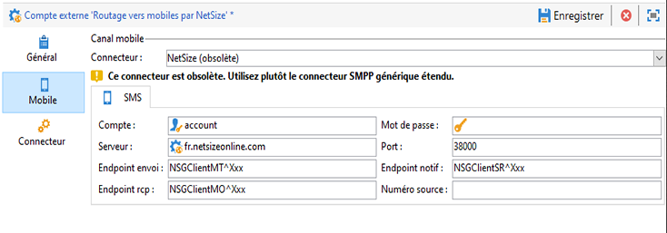
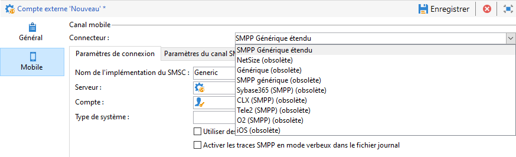
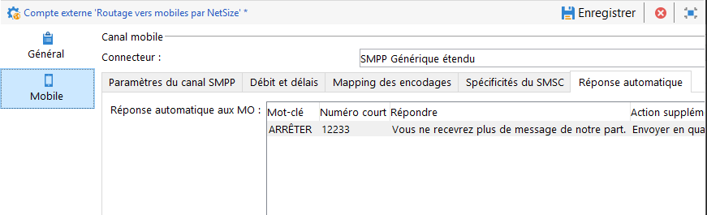
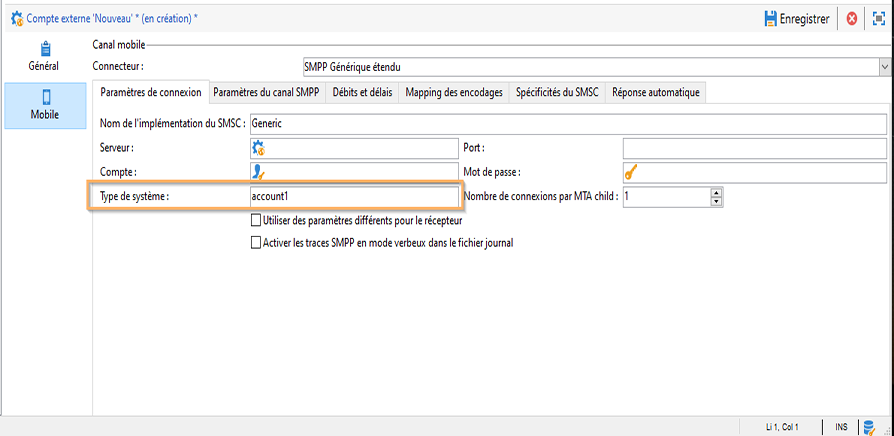
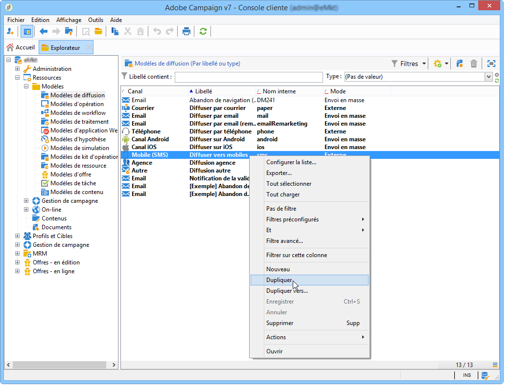
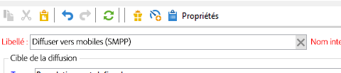
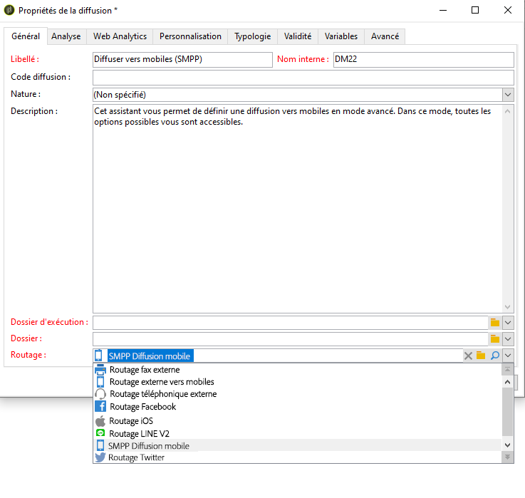
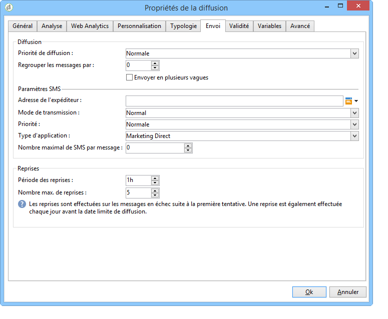
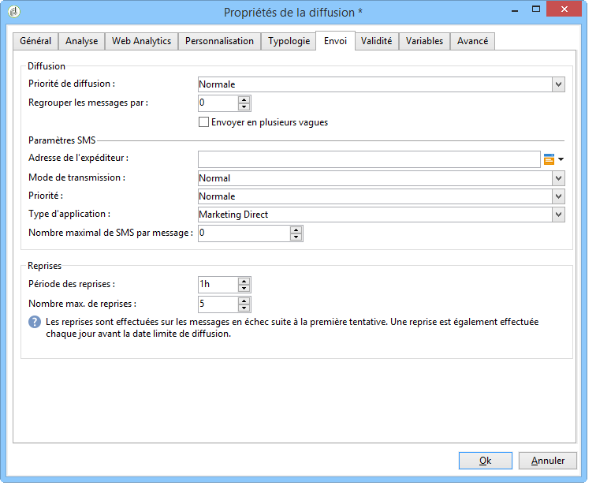

# Canal SMS{#sms-channel}

Adobe Campaign vous permet d&#39;effectuer des diffusions personnalisées en masse de messages SMS. Les profils de destinataires doivent contenir au moins un numéro de téléphone portable.

>[!NOTE]
>
>Adobe Campaign permet également d&#39;adresser des notifications sur les terminaux mobiles, via son option **Mobile App Channel (NMAC)**.
> 
>For more on this, refer to the [About mobile app channel](../../delivery/using/about-mobile-app-channel.md) section.

Les sections ci-dessous fournissent des informations spécifiques au canal SMS. Pour plus d’informations sur la création d’une diffusion, voir[cette section](../../delivery/using/steps-about-delivery-creation-steps.md).

## Configuration du canal SMS {#setting-up-sms-channel}

Pour diffuser vers un téléphone mobile, vous devez avoir :

1. un compte externe spécifiant un connecteur et un type de message,

   Les connecteurs disponibles sont NetSize, SMPP Générique (SMPP version 3.4 avec support du mode binaire), Sybase365 (SAP SMS 365), CLX Communications, Tele2, O2 et SMPP Générique étendu.

1. un modèle de diffusion dans lequel est référencé ce compte externe.

### Activation d&#39;un compte externe {#activating-an-external-account}

The list of external accounts can be found in the **[!UICONTROL Platform]** > **[!UICONTROL External accounts]** node of the Adobe Campaign explorer tree.

* Par exemple, accédez au compte par défaut appelé **[!UICONTROL NetSize mobile delivery]**.
* Dans l’ **[!UICONTROL General]** onglet, cochez la **[!UICONTROL Enabled]** case.

   

* Check that the **[!UICONTROL Mobile]** option is selected for the **[!UICONTROL Channel]** field.
* Dans le **[!UICONTROL Mobile]** panneau, sélectionnez un connecteur dans la liste déroulante : NetSize, Generic SMPP, Sybase365 (SAP SMS 365), CLX Communications, Tele2, O2 ou Extended generic SMPP. Pour plus d&#39;informations sur le connecteur SMPP générique étendu, consultez la section [Création d&#39;un compte](#creating-an-smpp-external-account) externe SMPP.

   

* Configurez le connecteur en fonction des informations données par votre fournisseur. Dans l&#39;exemple ci-dessous, l&#39;opérateur est NetSize.

   

* Dans l’ **[!UICONTROL Connector]** onglet, laissez le mode **[!UICONTROL Call Web Service]** d’activation sélectionné par défaut.

   

* Si l’ **[!UICONTROL Connector]** onglet est affiché, spécifiez l’URL d’accès du connecteur. L’adresse doit se terminer par **netsize.jsp** si votre fournisseur est NetSize. Pour tous les autres connecteurs, l’adresse URL se termine par **smpp34.jsp**.

### Création d&#39;un compte externe SMPP {#creating-an-smpp-external-account}

Si vous souhaitez utiliser le protocole SMPP, vous pouvez également créer un compte externe.

Pour plus d&#39;informations sur le protocole et les paramètres SMS, consultez cette [note technique](https://helpx.adobe.com/campaign/kb/sms-connector-protocol-and-settings.html).

Pour ce faire, procédez comme suit :

1. Dans le noeud **[!UICONTROL Platform]** > **[!UICONTROL External accounts]** de l’arborescence, cliquez sur l’ **[!UICONTROL New]** icône .
1. Définissez le type de compte sur **Routage**, le canal sur **Mobile (SMS)** et le mode de diffusion sur **Envoi en masse**.

   

1. Cochez la **[!UICONTROL Enabled]** case.
1. Dans l’ **[!UICONTROL Mobile]** onglet, sélectionnez **[!UICONTROL Extended generic SMPP]** dans la liste **[!UICONTROL Connector]** déroulante.

   

   Cette **[!UICONTROL Enable verbose SMPP traces in the log file]** option vous permet de vider tout le trafic SMPP dans les fichiers journaux. Cette option doit être activée pour dépanner le connecteur et pour comparer le trafic affiché chez le fournisseur.

1. Contact your SMS service provider who will explain to you how to complete the different external account fields from the **[!UICONTROL Connection settings]** tab.

   Then, contact your provider, depending on the one chosen, who will give you the value to enter into the **[!UICONTROL SMSC implementation name]** field.

   Vous pouvez définir le nombre de connexions au fournisseur par MTA child. Par défaut, ce nombre est défini sur 1.

1. Par défaut, le nombre de caractère d&#39;un SMS respecte la norme de téléphonie mobile GSM.

   Les SMS utilisant l&#39;encodage GSM sont limités à 160 caractères, ou 153 caractères par SMS pour les messages envoyés en plusieurs parties.

   >[!NOTE]
   >
   >Certains caractères comptent pour deux (accolades, crochets, symbole de l&#39;euro, etc.).
   >
   >La liste des caractères GSM disponibles est présentée ci-dessous.

   Vous pouvez si vous le souhaitez autoriser la translittération des caractères en cochant la case correspondante.

   

   Voir à ce propos [cette section](#about-character-transliteration).

1. In the **[!UICONTROL Throughput and delays]** tab, you can specify the maximum throughput of outbound messages (&quot;MT&quot;, Mobile Terminated) in MT per second. Si vous indiquez &quot;0&quot; dans le champ correspondant, le débit ne sera pas limité.

   Les valeurs de tous les champs correspondant à des délais sont à renseigner en secondes.

1. Dans l’ **[!UICONTROL Mapping of encodings]** onglet, vous pouvez définir des encodages.

   Voir à ce propos [cette section](#about-text-encodings).

1. Dans le **[!UICONTROL SMSC specificities]** panneau, l’ **[!UICONTROL Send full phone number]** option est désactivée par défaut. Ne l&#39;activez pas si vous voulez respecter le protocole SMPP et transférer uniquement les chiffres au serveur du fournisseur SMS (SMSC).

   Cependant, étant donné que certains fournisseurs requièrent l&#39;utilisation du préfixe &#39;+&#39;, consultez votre propre fournisseur qui vous invitera à activer cette option le cas échéant.

   La **[!UICONTROL Enable TLS over SMPP]** case à cocher vous permet de chiffrer le trafic SMPP. For more on this, refer to this [technical note](https://helpx.adobe.com/campaign/kb/sms-connector-protocol-and-settings.html).

1. If you are configuring an **[!UICONTROL Extended generic SMPP]** connector, you can set up automatic replies.

   Voir à ce propos [cette section](#automatic-reply).

### A propos de la translittération des caractères {#about-character-transliteration}

La translittération des caractères peut être configurée dans un compte externe de routage vers mobiles par SMPP dans l&#39;onglet **[!UICONTROL Mobile]**.

La translittération consiste à remplacer un caractère d&#39;un SMS par un autre lorsque ce caractère n&#39;est pas pris en charge par la norme GSM.

* If transliteration is **[!UICONTROL authorized]**, each character that is not taken into account is replaced by a GSM character when the message is sent. Par exemple, la lettre &quot;ë&quot; est remplacée par &quot;e&quot;. Le message est alors légèrement altéré, mais la limite du nombre de caractères demeure identique.
* When transliteration is **[!UICONTROL not authorized]**, each message that contains characters that are not taken into account is sent in binary format (Unicode): all of the characters are therefore sent as they are. Or les SMS utilisant l&#39;encodage Unicode sont limités à 70 caractères (ou 67 caractères par SMS pour les messages envoyés en plusieurs parties). Si le nombre de caractères maximal est dépassé, plusieurs messages sont alors envoyés, ce qui peut générer des coûts supplémentaires.

>[!CAUTION]
>
>L&#39;insertion de champs de personnalisation dans le contenu du SMS peut introduire des caractères non pris en charge par l&#39;encodage GSM.

Par défaut, la translittération des caractères est désactivée. Si vous souhaitez que tous les caractères de vos SMS soient conservés, pour ne pas altérer les noms propres par exemple, il est recommandé de ne pas activer cette option.

En revanche, si vos SMS contiennent beaucoup de caractères générant des messages Unicode, vous pouvez choisir d&#39;activer cette option afin de limiter le coût de vos envois.

Le tableau ci-après présente les caractères pris en charge par la norme GSM. Tout caractère inséré dans le corps du message autre que ceux mentionnés ci-dessous convertit le message complet en binaire (Unicode) et le limite donc à 70 caractères.

**Caractères simples**

<table> 
 <tbody> 
  <tr> 
   <td> @ </td> 
   <td>  </td> 
   <td> SP </td> 
   <td> 0 </td> 
   <td> ¡ </td> 
   <td> p </td> 
   <td> ¿ </td> 
   <td> p </td> 
  </tr> 
  <tr> 
   <td> £ </td> 
   <td> _ </td> 
   <td> ! </td> 
   <td> 1 </td> 
   <td> a </td> 
   <td> q </td> 
   <td> a </td> 
   <td> q </td> 
  </tr> 
  <tr> 
   <td> $ </td> 
   <td>  </td> 
   <td> " </td> 
   <td> 2 </td> 
   <td> b </td> 
   <td> r </td> 
   <td> b </td> 
   <td> r </td> 
  </tr> 
  <tr> 
   <td> ¥ </td> 
   <td>  </td> 
   <td> # </td> 
   <td> 3 </td> 
   <td> c </td> 
   <td> s </td> 
   <td> c </td> 
   <td> s </td> 
  </tr> 
  <tr> 
   <td> è </td> 
   <td>  </td> 
   <td> ¤ </td> 
   <td> 4 </td> 
   <td> D </td> 
   <td> T </td> 
   <td> d </td> 
   <td> t </td> 
  </tr> 
  <tr> 
   <td> é </td> 
   <td>  </td> 
   <td> % </td> 
   <td> 5 </td> 
   <td> e </td> 
   <td> u </td> 
   <td> e </td> 
   <td> u </td> 
  </tr> 
  <tr> 
   <td> ù </td> 
   <td>  </td> 
   <td> &amp; </td> 
   <td> 6 </td> 
   <td> f </td> 
   <td> v </td> 
   <td> f </td> 
   <td> v </td> 
  </tr> 
  <tr> 
   <td> ì </td> 
   <td>  </td> 
   <td> ' </td> 
   <td> 7 </td> 
   <td> g </td> 
   <td> w </td> 
   <td> g </td> 
   <td> w </td> 
  </tr> 
  <tr> 
   <td> ò </td> 
   <td>  </td> 
   <td> ( </td> 
   <td> 8 </td> 
   <td> h </td> 
   <td> X </td> 
   <td> h </td> 
   <td> x </td> 
  </tr> 
  <tr> 
   <td> Ç </td> 
   <td>  </td> 
   <td> ) </td> 
   <td> 9 </td> 
   <td> i </td> 
   <td> y </td> 
   <td> i </td> 
   <td> y </td> 
  </tr> 
  <tr> 
   <td> LF </td> 
   <td>  </td> 
   <td> * </td> 
   <td> : </td> 
   <td> j </td> 
   <td> z </td> 
   <td> j </td> 
   <td> z </td> 
  </tr> 
  <tr> 
   <td> Ø </td> 
   <td> ESC </td> 
   <td> + </td> 
   <td> ; </td> 
   <td> k </td> 
   <td> Ä </td> 
   <td> k </td> 
   <td> ä </td> 
  </tr> 
  <tr> 
   <td> ø </td> 
   <td> Æ </td> 
   <td> , </td> 
   <td> &lt; </td> 
   <td> l </td> 
   <td> Ö </td> 
   <td> l </td> 
   <td> ö </td> 
  </tr> 
  <tr> 
   <td> CR </td> 
   <td> æ </td> 
   <td> - </td> 
   <td> = </td> 
   <td> M </td> 
   <td> Ñ </td> 
   <td> m </td> 
   <td> ñ </td> 
  </tr> 
  <tr> 
   <td> Å </td> 
   <td> ß </td> 
   <td> . </td> 
   <td> &gt; </td> 
   <td> n </td> 
   <td> Ü </td> 
   <td> n </td> 
   <td> ü </td> 
  </tr> 
  <tr> 
   <td> å </td> 
   <td> É </td> 
   <td> / </td> 
   <td> ? </td> 
   <td> o </td> 
   <td> § </td> 
   <td> o </td> 
   <td> à </td> 
  </tr> 
 </tbody> 
</table>

SP : espace (Space)

ESC : caractère d&#39;échappement (Escape)

LF : saut de ligne (Line Feed)

CR : retour chariot (Carriage Return)

**Caractères doubles**

^ { } `[ ~ ]` | €

### A propos des encodages de texte {#about-text-encodings}

Lors de l&#39;envoi d&#39;un SMS, Adobe Campaign peut utiliser un ou plusieurs encodages de texte. Chaque encodage possède un jeu de caractères disponibles qui lui est propre, et le nombre de caractères qu&#39;il est possible de mettre dans un SMS dépend de l&#39;encodage.

When configuring a new SMPP mobile delivery external account, you can define the **[!UICONTROL Mapping of encodings]** in the **[!UICONTROL Mobile]** tab: the **[!UICONTROL data_coding]** field allows Adobe Campaign to communicate which encoding is used to the SMSC.

>[!NOTE]
>
>La correspondance entre la valeur du **data_coding** et l&#39;encodage réellement utilisé est standardisée. Cependant, certains SMSC possèdent une correspondance qui leur est propre : dans ce cas, votre administrateur **Adobe Campaign** doit déclarer cette correspondance. Consultez votre fournisseur pour en savoir plus.

Vous pouvez déclarer des **data_coding** et forcer l&#39;encodage si besoin : pour ce faire, spécifiez un seul encodage dans le tableau.

* Lorsqu&#39;aucun mapping des encodages n&#39;est défini, le connecteur a un comportement générique :

   * Il tente d&#39;utiliser l&#39;encodage GSM et lui affecte la valeur **data_coding = 0**.
   * Si l&#39;encodage GSM échoue, il utilise l&#39;encodage **UCS2** et lui affecte la valeur **data_coding = 8**.

* Lorsque vous définissez les encodages que vous souhaitez utiliser ainsi que les valeurs du champ **[!UICONTROL data_coding]** associées, Adobe Campaign tentera d&#39;utiliser le premier encodage de la liste, puis le suivant, si l&#39;encodage se révèle impossible.

>[!CAUTION]
>
>L&#39;ordre de déclaration est important : il est recommandé d&#39;ordonner la liste par ordre croissant **de coût**, afin de favoriser les encodages permettant de mettre le plus de caractères possible dans chaque SMS.
>
>Ne déclarez que les encodages que vous souhaitez utiliser. Si certains encodages fournis par le SMSC ne correspondent pas à votre utilisation, ne les déclarez pas dans la liste.

### Réponse automatique {#automatic-reply}

Lors du paramétrage d&#39;un connecteur SMPP Générique étendu, vous pouvez paramétrer des réponses automatiques.

When a subscriber replies to an SMS message which was sent to them via Adobe Campaign and their message contains a keyword such as &quot;STOP&quot;, you can configure messages which are automatically sent back to them in the **[!UICONTROL Automatic reply sent to the MO]** section.

>[!NOTE]
>
>Les mots-clés ne respectent pas la casse.

Pour chaque mot-clé, indiquez un numéro court (short code), c&#39;est-à-dire un numéro habituellement utilisé pour envoyer les diffusions et qui servira de nom d&#39;expéditeur, puis saisissez le message qui sera adressé à l&#39;abonné.

Vous pouvez également lier une action à votre réponse automatique : **[!UICONTROL Send to quarantine]** ou **[!UICONTROL Remove from quarantine]**. Par exemple, si un destinataire envoie le mot-clé &quot;STOP&quot;, il reçoit automatiquement une confirmation de désabonnement et est envoyé en quarantaine.



If you link the **[!UICONTROL Remove from quarantine]** action to an automatic response, the recipients sending the corresponding keyword are automatically removed from quarantine.

Les destinataires sont répertoriés dans le **[!UICONTROL Non deliverables and addresses]** tableau disponible dans le menu **[!UICONTROL Administration]** > **[!UICONTROL Campaign Management]** > **[!UICONTROL Non deliverables Management]** .

* To send the same reply no matter what the short code, leave the **[!UICONTROL Short code]** column empty.
* To send the same reply no matter what the keyword, leave the **[!UICONTROL Keyword]** column empty.
* To carry out an action without sending a response, leave the **[!UICONTROL Response]** column empty. Par exemple, cela vous permet de supprimer de la quarantaine un utilisateur qui répond avec un message autre que &quot;STOP&quot;.

Si vous disposez de plusieurs comptes externes utilisant le connecteur SMPP générique étendu avec le même compte fournisseur, le problème suivant peut se produire : lors de l&#39;envoi d&#39;une réponse à un code court, il peut être reçu sur n&#39;importe quelle connexion de votre compte externe. Par conséquent, la réponse automatique envoyée ne pouvait pas être le message attendu.
Pour éviter cela, appliquez l’une des solutions suivantes, selon le fournisseur utilisé :
* Créez un compte fournisseur pour chaque compte externe.
* Utilisez le **[!UICONTROL System type]** champ de l’onglet **[!UICONTROL Mobile]** > **[!UICONTROL Connection settings]** pour distinguer chaque code court. Demandez à votre fournisseur une valeur différente pour chaque compte.

   

La procédure de configuration d’un compte externe à l’aide du connecteur SMPP générique étendu est détaillée dans la section [Création d’un compte](../../delivery/using/sms-channel.md#creating-an-smpp-external-account) externe SMPP.

### Modifier le modèle de diffusion {#changing-the-delivery-template}

Adobe Campaign vous fournit un modèle de diffusion vers les mobiles. Ce modèle est disponible dans le **[!UICONTROL Resources > Templates > Delivery templates]** noeud. Voir à ce propos la section [Modèles](../../delivery/using/about-templates.md).

Pour diffuser par le canal SMS, vous devez créer un modèle dans lequel le connecteur du canal est référencé.

Afin de conserver le modèle de diffusion natif, nous vous conseillons de le dupliquer puis de le paramétrer.

Dans l&#39;exemple ci-dessous, nous créons un modèle pour diffuser des messages par l&#39;intermédiaire du compte NetSize que nous avons activé précédemment. Pour cela :

1. Accédez au **[!UICONTROL Delivery templates]** noeud.
1. Cliquez avec le bouton droit sur le **[!UICONTROL Send to mobiles]** modèle, puis sélectionnez **[!UICONTROL Duplicate]**.

   

1. Modifiez le libellé du modèle.

   

1. Clics **[!UICONTROL Properties]**.
1. In the **[!UICONTROL General]** tab, select a routing mode that corresponds to an external account that you configured, for example **[!UICONTROL NetSize mobile delivery]**.

   

1. Click **[!UICONTROL Save]** to create the template.

   

Vous disposez à présent d&#39;un compte externe et d&#39;un modèle de diffusion qui vous permettent de diffuser via SMS.

## Création d&#39;une diffusion SMS {#creating-a-sms-delivery}

### Choisir le canal de diffusion {#selecting-the-delivery-channel}

Pour créer une diffusion SMS, procédez comme suit :

>[!NOTE]
>
>Les concepts généraux relatifs à la création d&#39;une diffusion sont présentés dans [cette section](../../delivery/using/steps-about-delivery-creation-steps.md).

1. Créez une diffusion, par exemple depuis le tableau de bord des diffusions.
1. Sélectionnez le modèle de remise **[!UICONTROL Send to mobiles (NetSize)]** que vous avez créé précédemment. For more on this, refer to the [Changing the delivery template](#changing-the-delivery-template) section.

   

1. Identifiez la diffusion avec un libellé, un code et une description. Voir à ce propos [cette section](../../delivery/using/steps-create-and-identify-the-delivery.md#identifying-the-delivery).
1. Click **[!UICONTROL Continue]** to confirm this information and display the message configuration window.

## Définir le contenu du SMS {#defining-the-sms-content}

Pour définir le contenu du SMS, procédez comme suit :

1. Entrez le contenu du message dans la **[!UICONTROL Text content]** section de l’assistant. Les boutons de la barre d’outils vous permettent d’importer, d’enregistrer ou de rechercher du contenu. Le dernier bouton est utilisé pour insérer des champs de personnalisation.

   

   The use of personalization fields is presented in the [About personalization](../../delivery/using/about-personalization.md) section.

1. Cliquez **[!UICONTROL Preview]** au bas de la page pour afficher le rendu du message avec sa personnalisation. Pour lancer l’aperçu, sélectionnez un destinataire à l’aide du **[!UICONTROL Test personalization]** bouton de la barre d’outils. Vous pouvez sélectionner un destinataire parmi les cibles définies ou en choisir un autre.

   

   Vous pouvez valider le message SMS. Vous pouvez également visualiser le contenu du SMS sur l&#39;écran du téléphone mobile affiché à la droite de l&#39;éditeur de contenu. Cliquez sur l&#39;écran pour faire défiler le contenu avec la souris.

   

1. Click the **[!UICONTROL Data loaded]** link to view the information concerning the recipient.

   

   >[!NOTE]
   >
   >Les messages SMS sont limités à 160 caractères si la page de code Latin-1 (ISO-8859-1) est utilisée. Si le message est écrit en Unicode, il ne doit pas dépasser 70 caractères. Certains caractères spéciaux peuvent affecter la longueur du message. Pour plus d’informations sur la longueur du message, reportez-vous à la section [A propos de la translittération](#about-character-transliteration) des caractères.
   >
   >Lors de la présence de champs de personnalisation ou de contenu conditionnel, la taille du message varie d&#39;un destinataire à l&#39;autre. La longueur du message doit être évaluée une fois la personnalisation effectuée.
   >
   >Lorsque vous lancez l&#39;analyse, la longueur des messages est contrôlée et un message d&#39;avertissement est affiché en cas de dépassement.

1. Si vous utilisez le connecteur NetSize ou un connecteur SMPP, vous pouvez personnaliser le nom de l’expéditeur de la remise. For more on this, refer to the [Advanced parameters](#advanced-parameters) section.

## Choisir la population cible {#selecting-the-target-population}

Le processus détaillé lors de la sélection de la population cible d&#39;une diffusion est présenté dans [cette section](../../delivery/using/steps-defining-the-target-population.md).

For more on the use of personalization fields, refer to [About personalization](../../delivery/using/about-personalization.md).

For more on the inclusion of a seed list, refer to [About seed addresses](../../delivery/using/about-seed-addresses.md).

## Envoyer les SMS {#sending-sms-messages}

To approve your message and send it to the recipients of the delivery being created, click **[!UICONTROL Send]**.

Le processus détaillé lors de la validation et l&#39;envoi d&#39;une diffusion est présenté dans les sections ci-dessous :

* [Valider la diffusion](../../delivery/using/steps-validating-the-delivery.md)
* [Envoyer la diffusion](../../delivery/using/steps-sending-the-delivery.md)

### Paramètres avancés {#advanced-parameters}

Le **[!UICONTROL Properties]** bouton donne accès au paramètre de remise avancé. Les paramètres spécifiques aux livraisons SMS se trouvent dans la **[!UICONTROL SMS parameters]** section de l&#39; **[!UICONTROL Delivery]** onglet.

Les options disponibles sont les suivantes :

* **Adresse de l&#39;expéditeur** (uniquement pour le connecteur Netsize et les connecteurs SMPP) : permet de personnaliser le nom de l&#39;émetteur de la diffusion à l&#39;aide d&#39;une chaîne de caractères alphanumérique limitée à onze caractères. Le champ ne doit pas être composé exclusivement de chiffres. Il est possible de définir une condition pour afficher, par exemple, des noms différents en fonction de l&#39;indicatif du numéro du destinataire :

   ```
   <% if( String(recipient.mobilePhone).indexOf("+1") == 0){ %>NeoShopUS<%} else %>
   ```

   >[!CAUTION]
   >
   >Vérifiez la loi en vigueur dans votre pays concernant la modification du nom de l&#39;expéditeur. Vérifiez également auprès de votre opérateur s&#39;il propose cette fonctionnalité.

* **Mode de transmission** : moyen d&#39;acheminement des messages par SMS.
* **Priorité**: niveau d’importance attribué à un message. **[!UICONTROL Normal]** la priorité est sélectionnée par défaut. Demandez à votre fournisseur de services quel est le coût des SMS envoyés avec **[!UICONTROL High]** priorité.
* **Type de demande**: choisissez l&#39;application que vous souhaitez affecter à votre diffusion SMS. L’ **[!UICONTROL Direct Marketing]** option est sélectionnée par défaut et est la plus utilisée.

**Paramètres propres au connecteur NetSize**



* **Utiliser plusieurs SMS pour un seul message** : permet d&#39;envoyer un message de plus de 160 caractères via plusieurs SMS.

**Paramètres propres à un connecteur SMPP**



* **Nombre maximal de SMS par message** : cette option vous permet de régler le nombre de SMS à utiliser pour envoyer un message. Si le nombre est fixé à 0, vous pouvez utiliser un SMS pour diffuser votre message par SMS. Si le nombre de SMS est fixé à 1 ou 2 par exemple, et que le message dépasse ce nombre, le message ne sera pas envoyé.

## Suivi et tracking des diffusions SMS {#monitoring-and-tracking-sms-deliveries}

Une fois les messages envoyés, vous pouvez effectuer le suivi et le tracking des diffusions. Voir à ce sujet les sections suivantes :

* [Contrôler une diffusion](../../delivery/using/monitoring-a-delivery.md)
* [Comprendre les diffusions en échec](../../delivery/using/understanding-delivery-failures.md)
* [A propos du tracking des messages](../../delivery/using/about-message-tracking.md)

## Traitement des messages entrants {#processing-inbound-messages}

Le module **nlserver sms** interroge à intervalle régulier le routeur des messages SMS. Cela permet à Adobe Campaign de collecter les états d&#39;avancement des diffusions et de gérer les accusés de réception et les désinscriptions des destinataires.

* **Accusés de réception** : consultez les logs de diffusion pour connaître le statut de vos messages.

   >[!NOTE]
   >
   >Tout SMS envoyé est lié à un compte externe par la clé primaire de celui-ci. De cette manière :
   >
   > * Les accusés de réception d&#39;un compte externe de SMS effacé ne sont pas traités correctement.
   > * Un compte SMS ne peut être associé qu&#39;à un seul compte externe afin que les accusés de réception soient correctement attribués à ce dernier


* **Désinscription** : les destinataires qui ne souhaitent plus recevoir de diffusions par SMS peuvent renvoyer un message contenant le mot STOP. Si votre fournisseur vous le permet contractuellement, vous avez la possibilité de récupérer ses messages via l&#39;activité de workflow **Réception de SMS** puis de créer une requête afin que l&#39;option **Ne plus contacter cette personne** soit activée pour les destinataires concernés.

   Reportez-vous au guide [Workflows](../../workflow/using/executing-a-workflow.md#architecture).

## Schéma InSMS {#insms-schema}

Le schéma InSMS contient les informations relatives aux SMS entrants. Une description de ces champs est disponible via l&#39;attribut desc de ces derniers.

* **message** : contenu du message SMS reçu.
* **origin** : numéro du mobile de l&#39;expéditeur du message.
* **providerId** : identifiant du message retourné par le SMSC (centre de messagerie).
* **created** : date d&#39;insertion du message entrant dans Adobe Campaign.
* **extAccount** : compte externe Adobe Campaign.

   >[!CAUTION]
   >
   >Les champs suivants sont spécifiques à Netsize.
   >
   >Si l&#39;opérateur utilisé n&#39;est pas Netsize, ces champs sont considérés comme vides.

* **alias** : alias du message entrant.
* **separator** : séparateur entre l&#39;alias et le corps du message.
* **messageDate** : date du message selon l&#39;opérateur.
* **receivalDate** : date de réception du message en provenance de l&#39;opérateur par le SMSC (centre de messagerie).
* **deliveryDate** : date d&#39;envoi du message par le SMSC (centre de messagerie).
* **largeAccount** : code du compte client associé au SMS entrant.
* **countryCode** : code pays de l&#39;opérateur.
* **operatorCode** : code du réseau de l&#39;opérateur.
* **linkedSmsId** : identifiant Adobe Campaign (broadlogId) associé au SMS sortant, dont ce SMS est la réponse.

## Gestion des réponses automatiques (réglementation américaine) {#managing-automatic-replies--american-regulation-}

Lorsqu&#39;un abonné répond à un SMS qui lui a été envoyé via Adobe Campaign par un message contenant un mot-clé tel que STOP, HELP ou YES, il est obligatoire sur le marché américain de configurer les messages qui lui sont automatiquement renvoyés.

Par exemple, si un destinataire envoie le mot-clé STOP, il reçoit automatiquement une confirmation de désinscription.

Le nom d&#39;expéditeur de ce type de messages est un numéro court (short code) habituellement utilisé pour envoyer les diffusions.

>[!CAUTION]
>
>La procédure détaillée suivante n&#39;est valide que pour les connecteurs SMPP, à l&#39;exception du connecteur SMPP générique étendu. Pour plus d’informations, reportez-vous à la section [Création d’un compte](#creating-an-smpp-external-account) externe SMPP.
>
>Elle entre dans le cadre du processus de certification effectué par les opérateurs américains pour les campagnes marketing aux Etats-Unis. Ces SMS doivent notamment parvenir immédiatement à l&#39;abonné qui a envoyé le mot-clé.

1. Créez un fichier XML de ce type :

   ```
   <autoreply>
     <shortcode name="12345">
       <reply keyword="STOP" text="You will not receive SMS anymore" />
       <reply keyword="HELP" text="Powered by Adobe Campaign" />
     </shortcode>
     <shortcode name="43115">
       <reply keyword="STOP" text="Vous ne recevrez plus de SMS" />
       <reply keyword="HELP" text="Service rendu par Adobe Campaign" />
     </shortcode>
     <shortcode name="*">
       <reply keyword="ADOBE" text="This text is replied when you send ADOBE to any short code" />
     </shortcode>
   </autoreply>
   ```

1. For the **name** attribute of the **`<shortcode>`** tag, specify the short code that will be displayed in the place of the message sender name.

   In each **`<reply>`** tag, enter the **keyword** attribute with a keyword and the **text** attribute with the message that you would like to send for this keyword.

   >[!NOTE]
   >
   >Chaque mot-clé doit être écrit en majuscules.

   Si vous voulez envoyer le même message pour plusieurs mots-clés, dupliquez la ligne correspondante.

   Par exemple :

   ```
   <reply keyword="STOP" text="You will not receive SMS anymore" />
   <reply keyword="QUIT" text="You will not receive SMS anymore" />
   ```

1. Une fois complété, enregistrez ce fichier sous le nom **smsAutoReply.xml**.

   Notez que le nom de ce fichier est sensible à la casse sous Linux.

1. Copiez ce fichier dans le répertoire **conf** d&#39;Adobe Campaign, à l&#39;endroit où se trouve le serveur Web.

>[!CAUTION]
>
>Il n&#39;existe aucun historique pour ce type de messages automatiques. Ils ne figurent donc pas dans le [tableau de bord des diffusions](../../delivery/using/monitoring-a-delivery.md#delivery-dashboard).
>
>Ces messages ne sont pas non plus comptabilisés dans les [règles de pression commerciale](../../campaign/using/pressure-rules.md).
