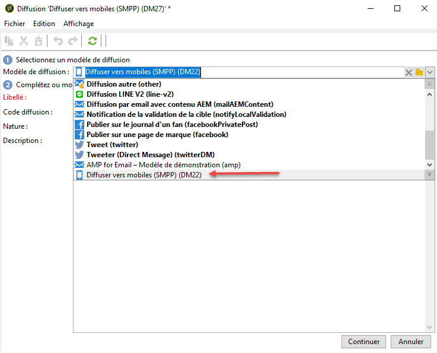
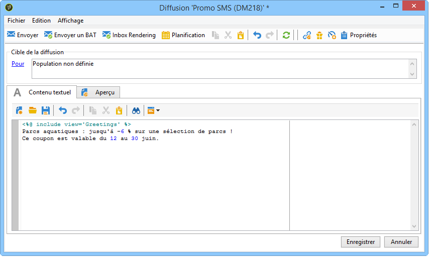
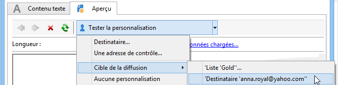

# Créer une diffusion SMS {#creating-a-sms-delivery}

## Choisir le canal de diffusion {#selecting-the-delivery-channel}

Pour créer une diffusion SMS, procédez comme suit :

>[!NOTE]
>
>Les concepts généraux relatifs à la création d&#39;une diffusion sont présentés dans [cette section](steps-about-delivery-creation-steps.md).

1. Créez une diffusion, par exemple depuis le tableau de bord des diffusions.
1. Sélectionnez le modèle de diffusion **Envoyé vers mobiles (SMPP)** que vous avez créé précédemment. Pour plus d&#39;informations, consultez la section [Modifier le modèle de diffusion](sms-set-up.md#changing-the-delivery-template).

   

1. Identifiez votre diffusion avec un libellé, un code et une description. Pour plus d’informations, consultez [cette section](steps-create-and-identify-the-delivery.md#identifying-the-delivery).
1. Cliquez sur **[!UICONTROL Continuer]** pour valider ces informations et afficher la fenêtre de configuration du message.

## Définition du contenu du SMS {#defining-the-sms-content}

Pour définir le contenu du SMS, procédez comme suit :

1. Saisissez le contenu du message dans la section **[!UICONTROL Contenu texte]** de l&#39;assistant. Les boutons de la barre d&#39;outils permettent d&#39;importer, d&#39;enregistrer ou de rechercher dans un contenu. Le dernier bouton permet d&#39;insérer des champs de personnalisation.

   

   L&#39;utilisation des champs de personnalisation est présentée dans la section [À propos de la personnalisation](about-personalization.md).

1. Cliquez sur l&#39;onglet **[!UICONTROL Aperçu]** en bas de page afin de visualiser le rendu du message, avec sa personnalisation. Pour lancer la visualisation, vous devez choisir un destinataire à partir du bouton **[!UICONTROL Tester la personnalisation]** situé dans la barre d&#39;outils. Sélectionnez un individu parmi la ou les cibles définies ou choisissez une autre personne.

   

   Vous pouvez valider le message SMS. Vous pouvez également visualiser le contenu du SMS sur l&#39;écran du téléphone mobile affiché à la droite de l&#39;éditeur de contenu. Cliquez sur l&#39;écran pour faire défiler le contenu avec la souris.

   

1. Cliquez sur le lien **[!UICONTROL Données chargées]** pour visualiser les informations concernant le destinataire.

   

   >[!NOTE]
   >
   >La longueur des messages SMS est limitée à 160 caractères si la page de code Latin-1 (ISO-8859-1) est utilisée. Si le message est rédigé en unicode, il ne peut dépasser 70 caractères. Certains caractères spéciaux peuvent avoir une influence sur la longueur du message. Pour plus d’informations sur la longueur des messages, voir la section [Translittération des caractères SMS](#about-character-transliteration).
   >
   >Lors de la présence de champs de personnalisation ou de contenu conditionnel, la taille du message varie d&#39;un destinataire à l&#39;autre. La longueur du message doit être évaluée une fois la personnalisation effectuée.
   >
   >Lorsque vous lancez l&#39;analyse, la longueur des messages est contrôlée et un message d&#39;avertissement est affiché en cas de dépassement.

1. Si vous utilisez le connecteur NetSize ou un connecteur SMPP, il est possible de personnaliser le nom de l&#39;émetteur de la diffusion. Pour plus d&#39;informations, consultez la section [Paramètres avancés](#advanced-parameters).

## Choisir la population cible {#selecting-the-target-population}

Le processus détaillé de sélection de la population cible d’une diffusion est présenté dans [cette section](steps-defining-the-target-population.md).

Pour plus d’informations sur l’utilisation des champs de personnalisation, consultez [cette section](about-personalization.md).

Pour plus d’informations sur l’inclusion d’une liste de contrôle, consultez [cette page](about-seed-addresses.md).
