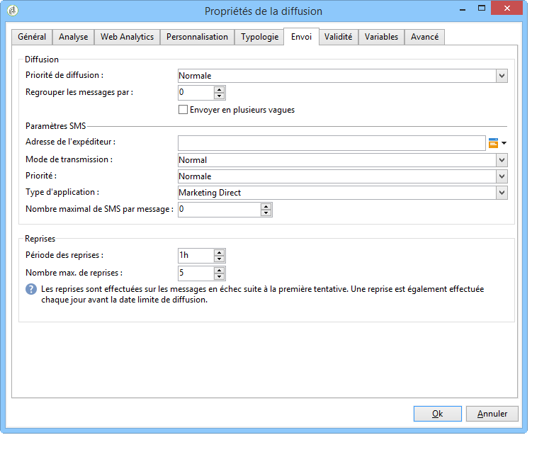
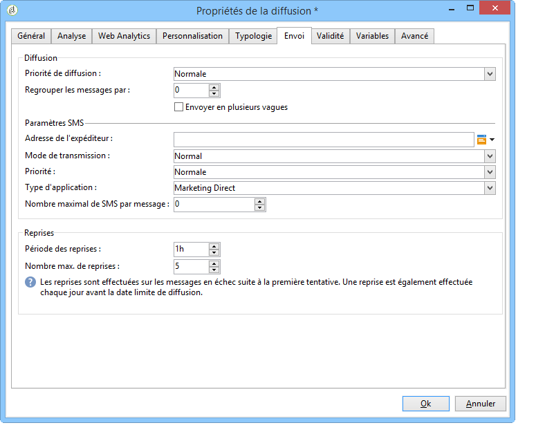

# Envoi, surveillance et suivi de diffusions par SMS{#sms-properties}

## Envoi de messages SMS {#sending-sms-messages}

Pour valider votre message et le diffuser aux destinataires de la diffusion en cours de création, cliquez sur **[!UICONTROL Envoyer]**.

Le processus détaillé lors de la validation et l&#39;envoi d&#39;une diffusion est présenté dans les sections ci-dessous :

* [Validation de la diffusion](steps-validating-the-delivery.md)
* [Envoi de la diffusion](steps-sending-the-delivery.md)

## Paramètres avancés {#advanced-parameters}

La variable **[!UICONTROL Propriétés]** donne accès au paramètre de diffusion avancé. Les paramètres spécifiques aux diffusions SMS se trouvent dans la variable **[!UICONTROL Paramètres SMS]** de la **[!UICONTROL Diffusion]** .

Les options disponibles sont les suivantes :

* **Adresse expéditeur** : permet de personnaliser le nom de l’expéditeur de la diffusion en utilisant une chaîne de caractères alphanumériques limités à onze caractères. Le champ ne doit pas être exclusivement composé de chiffres. Vous pouvez définir une condition pour afficher, par exemple, différents noms selon l’indicatif régional du destinataire :

  ```
  <% if( String(recipient.mobilePhone).indexOf("+1") == 0){ %>NeoShopUS<%} else %>
  ```

  >[!IMPORTANT]
  >
  >Vérifiez la loi en vigueur dans votre pays concernant la modification du nom de l&#39;expéditeur. Vérifiez également auprès de votre opérateur s&#39;il propose cette fonctionnalité.

* **Mode de transmission** : moyen d&#39;acheminement des messages par SMS.
* **Priorité**: niveau d’importance attribué à un message. **[!UICONTROL Normal]** La priorité est sélectionnée par défaut. Demandez à votre prestataire quel est le coût des SMS envoyés avec **[!UICONTROL Élevée]** priorité.
* **Type d’application**: choisissez l&#39;application que vous souhaitez affecter à votre diffusion SMS. La variable **[!UICONTROL Marketing direct]** est sélectionnée par défaut et est la plus courante.

**Paramètres propres au connecteur NetSize**



* **Utiliser plusieurs SMS pour un seul message** : permet d&#39;envoyer un message de plus de 160 caractères via plusieurs SMS.

**Paramètres propres à un connecteur SMPP**



* **Nombre maximal de SMS par message** : cette option vous permet de régler le nombre de SMS à utiliser pour envoyer un message. Si le nombre est fixé à 0, vous pouvez utiliser un SMS pour diffuser votre message par SMS. Si le nombre de SMS est fixé à 1 ou 2 par exemple, et que le message dépasse ce nombre, le message ne sera pas envoyé.

## Surveillance et suivi de SMS {#monitoring-and-tracking-sms-deliveries}

Après l&#39;envoi des messages, vous pouvez surveiller et suivre vos diffusions. Pour plus d’informations, consultez les sections suivantes :

* [Surveillance d’une diffusion](about-delivery-monitoring.md)
* [Présentation des diffusions en échec](understanding-delivery-failures.md)
* [À propos du tracking des messages](about-message-tracking.md)

## Traitement des messages entrants {#processing-inbound-messages}

Le module **nlserver sms** interroge à intervalle régulier le routeur des messages SMS. Cela permet à Adobe Campaign de collecter les états d&#39;avancement des diffusions et de gérer les accusés de réception et les désinscriptions des destinataires.

* **Accusés de réception** : consultez les logs de diffusion pour connaître le statut de vos messages.

  >[!NOTE]
  >
  >Tout SMS envoyé est lié à un compte externe par la clé primaire de celui-ci. De cette manière :
  >
  > * Les accusés de réception d&#39;un compte externe de SMS effacé ne sont pas traités correctement.
  > * Un compte SMS ne peut être associé qu&#39;à un seul compte externe afin que les accusés de réception soient correctement attribués à ce dernier

* **Désabonnement**: les destinataires qui souhaitent arrêter de recevoir des diffusions SMS peuvent renvoyer un message contenant le mot STOP. Si votre fournisseur l&#39;autorise en vertu des termes du contrat, vous pouvez récupérer les messages via la variable **Réception de SMS** activité de workflow , puis créez une requête pour activer la fonction **Ne plus contacter ce destinataire** pour les destinataires concernés.

  Reportez-vous au guide [Workflows](../../workflow/using/architecture.md).

## Schéma InSMS {#insms-schema}

Le schéma InSMS contient les informations relatives aux SMS entrants. Une description de ces champs est disponible via l&#39;attribut desc de ces derniers.

* **message** : contenu du SMS reçu.
* **origin** : numéro du mobile de l&#39;expéditeur du message.
* **providerId** : identifiant du message retourné par le SMSC (centre de messagerie).
* **created** : date d&#39;insertion du message entrant dans Adobe Campaign.
* **extAccount** : compte externe Adobe Campaign.

  >[!IMPORTANT]
  >
  >Les champs suivants sont spécifiques à Netsize.
  >
  >Si l&#39;opérateur utilisé n&#39;est pas Netsize, ces champs sont considérés comme vides.

* **alias** : alias du message entrant.
* **separator** : séparateur entre l&#39;alias et le corps du message.
* **messageDate** : date du message selon l&#39;opérateur.
* **receivalDate** : date de réception du message en provenance de l&#39;opérateur par le SMSC (centre de messagerie).
* **deliveryDate** : date d&#39;envoi du message par le SMSC (centre de messagerie).
* **largeAccount** : code du compte client associé au SMS entrant.
* **countryCode** : code pays de l&#39;opérateur.
* **operatorCode** : code du réseau de l&#39;opérateur.
* **linkedSmsId** : identifiant Adobe Campaign (broadlogId) associé au SMS sortant, dont ce SMS est la réponse.

## Gestion des réponses automatiques (réglementation américaine) {#managing-automatic-replies--american-regulation-}

Lorsqu&#39;un abonné répond à un SMS qui lui a été envoyé via Adobe Campaign par un message contenant un mot-clé tel que STOP, HELP ou YES, il est obligatoire sur le marché américain de configurer les messages qui lui sont automatiquement renvoyés.

Par exemple, si un destinataire envoie le mot-clé STOP, il reçoit automatiquement une confirmation de désinscription.

Le nom d&#39;expéditeur de ce type de messages est un numéro court (short code) habituellement utilisé pour envoyer les diffusions.

>[!IMPORTANT]
>
>La procédure détaillée suivante n&#39;est valide que pour les connecteurs SMPP, à l&#39;exception du connecteur SMPP générique étendu. Voir à ce sujet la section [Création d’un compte externe SMPP](sms-set-up.md#creating-an-smpp-external-account).
>
>Elle entre dans le cadre du processus de certification effectué par les opérateurs américains pour les campagnes marketing aux Etats-Unis. Ces SMS doivent notamment parvenir immédiatement à l&#39;abonné qui a envoyé le mot-clé.

1. Créez un fichier XML de ce type :

   ```
   <autoreply>
     <shortcode name="12345">
       <reply keyword="STOP" text="You will not receive SMS anymore" />
       <reply keyword="HELP" text="Powered by Adobe Campaign" />
     </shortcode>
     <shortcode name="43115">
       <reply keyword="STOP" text="Vous ne recevrez plus de SMS" />
       <reply keyword="HELP" text="Service rendu par Adobe Campaign" />
     </shortcode>
     <shortcode name="*">
       <reply keyword="ADOBE" text="This text is replied when you send ADOBE to any short code" />
     </shortcode>
   </autoreply>
   ```

1. Pour l&#39;attribut **name** de la balise **`<shortcode>`**, indiquez le code court qui s&#39;affichera à la place du nom de l&#39;expéditeur du message.

   Dans chaque balise **`<reply>`**, renseignez l&#39;attribut **keyword** avec un mot-clé et l&#39;attribut **text** avec le message que vous souhaitez envoyer pour ce mot-clé.

   >[!NOTE]
   >
   >Chaque mot-clé doit être écrit en majuscules.

   Si vous voulez envoyer le même message pour plusieurs mots-clés, dupliquez la ligne correspondante.

   Par exemple :

   ```
   <reply keyword="STOP" text="You will not receive SMS anymore" />
   <reply keyword="QUIT" text="You will not receive SMS anymore" />
   ```

1. Une fois complété, enregistrez ce fichier sous le nom **smsAutoReply.xml**.

   Notez que le nom de ce fichier est sensible à la casse sous Linux.

1. Copiez ce fichier dans le répertoire **conf** d&#39;Adobe Campaign, à l&#39;endroit où se trouve le serveur Web.

>[!IMPORTANT]
>
>Il n’existe aucun historique pour ce type de messages automatiques. Ils ne figurent donc pas dans le tableau de bord des diffusions. [En savoir plus](delivery-dashboard.md).
>
>Ces messages ne sont pas pris en compte dans les règles de pression commerciale. [En savoir plus](../../campaign-opt/using/pressure-rules.md).
