# Configurer le canal SMS sur une infrastructure midsourcing {#setting-up-sms-channel}

Pour diffuser vers un téléphone mobile avec des serveurs mid, vous devez avoir :

1. un opérateur SMS créé sur le serveur mid, utilisé pour le compte de SMS externe créé sur le serveur Marketing ;

1. un compte externe sur le serveur Marketing, spécifiant le Canal et le mode de Diffusion ;

1. un compte externe sur le serveur mid, détaillant le connecteur et le type de message ;

1. un modèle de diffusion qui référence le compte externe pour rationaliser le processus d’envoi.

>[!NOTE]
>
> Pour les diffusions SMS, la typologie doit utiliser une affinité SMS spécifique créée dans **un** conteneur de serveur d’applications dédié. [En savoir plus](../../installation/using/configure-delivery-settings.md#managing-outbound-smtp-traffic-with-affinities)

## Créer l&#39;opérateur SMS sur le serveur mid {#create-sms-operator}

Pour démarrer le processus de configuration, vous devez créer un opérateur SMS sur le serveur mid spécifiquement pour le compte externe.

>[!IMPORTANT]
>
>Chaque connecteur SMS nécessite un opérateur SMS unique.

1. Dans le nœud **[!UICONTROL Administration]** > **[!UICONTROL Gestion des accès]** > **[!UICONTROL Nœud des opérateurs]** de l’arborescence, cliquez sur l’icône **[!UICONTROL Nouveau]**.

   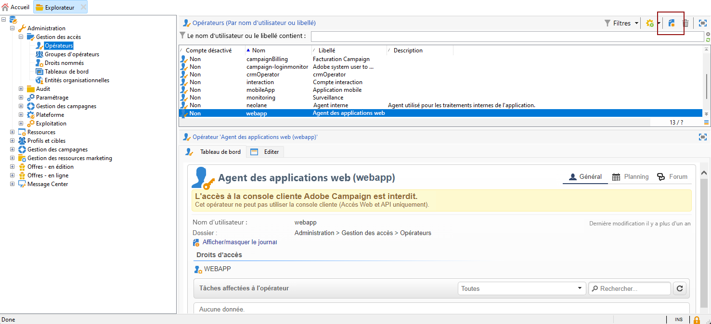

1. Spécifiez les **[!UICONTROL Paramètres d&#39;identification]** de l’utilisateur ou de l’utilisatrice. Incluez son login, son mot de passe et son nom. Le login et le mot de passe sont nécessaires pour que l’opérateur puisse se connecter en toute sécurité à Adobe Campaign.

   Notez que le **[!UICONTROL Nom (login)]** sera utilisé ultérieurement pour nommer votre compte externe SMPP dans le serveur MID.

   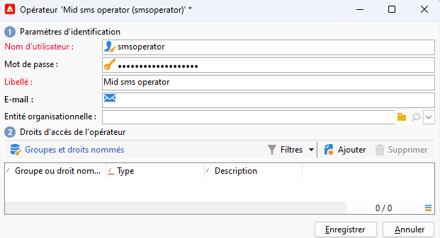

1. Sélectionnez les autorisations accordées à l’opérateur ou à l’opératrice dans la section Droits d’accès de l’opérateur.

   Pour octroyer des droits à l’opérateur ou à l’opératrice, cliquez sur le bouton **[!UICONTROL Ajouter]** situé au-dessus de la liste des droits. Sélectionnez ensuite un **[!UICONTROL Groupe d&#39;opérateurs]** ou des **[!UICONTROL Droits nommés]** dans la liste des groupes disponibles.

   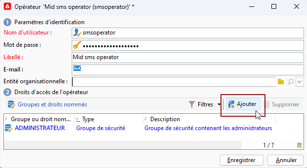

1. Cliquez sur **[!UICONTROL Enregistrer]** pour finaliser la création de l’opérateur ou de l’opératrice. Le profil est désormais inclus dans la liste des opératrices et opérateurs existants.

## Créer un compte SMS externe sur le serveur Marketing {#create-accound-mkt}

Pour envoyer un SMS à un téléphone mobile avec des serveurs mid, vous devez d’abord créer votre compte SMS externe sur le serveur Marketing.

1. Dans le nœud **[!UICONTROL Plateforme]** > **[!UICONTROL Comptes externes]**, cliquez sur l&#39;icône **[!UICONTROL Nouveau]**.

   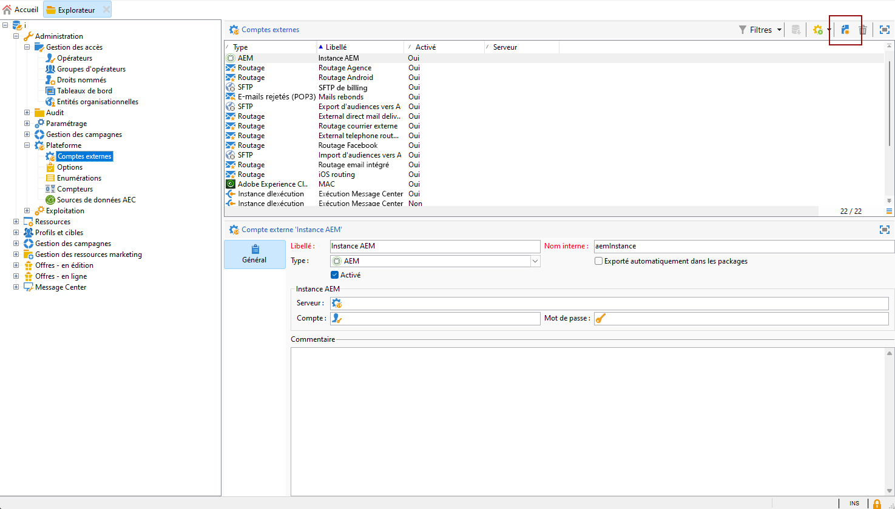

1. Saisissez votre **[!UICONTROL Libellé]** et votre **[!UICONTROL Nom interne]**. Notez que le nom interne sera utilisé ultérieurement pour nommer votre compte externe SMPP dans le serveur mid.

1. Définissez le type de compte sur **[!UICONTROL Routage]**, le canal sur **[!UICONTROL Mobile (SMS)]** et le mode de diffusion sur **[!UICONTROL Mid-sourcing]**.

   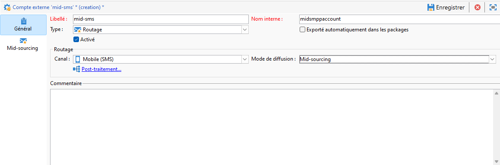

1. Dans l&#39;onglet **[!UICONTROL Mid-Sourcing]**, indiquez les paramètres de connexion au serveur de midsourcing.

   Saisissez les détails du [connecteur SMS créé précédemment](#create-sms-operator) dans les champs **[!UICONTROL Compte]** et **[!UICONTROL Mot de passe]**.

   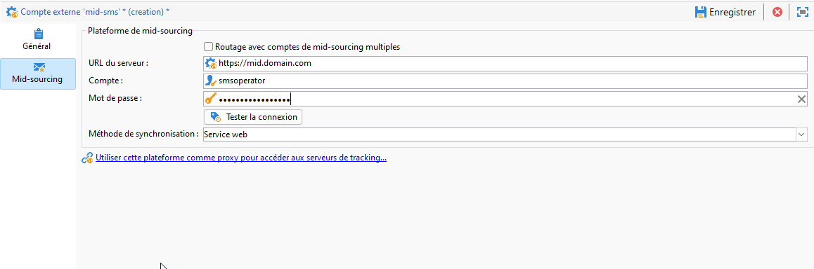

1. Validez votre paramétrage en cliquant sur **[!UICONTROL Tester la connexion]**.

1. Cliquez sur **[!UICONTROL Enregistrer]**.

## Créer un compte externe SMPP sur le serveur mid {#creating-smpp-mid}

>[!IMPORTANT]
>
>L’utilisation du même compte et du même mot de passe pour plusieurs comptes SMS externes peut entraîner des conflits et des chevauchements entre les comptes. Reportez-vous à la [page de résolution des problèmes de SMS](troubleshooting-sms.md#external-account-conflict).

Une fois que vous avez correctement configuré votre compte externe SMS sur le serveur Marketing, l’étape suivante consiste à établir votre compte externe SMPP sur le serveur mid.

Pour plus d’informations sur les paramètres et le protocole SMS, reportez-vous à cette [page](sms-protocol.md).

Pour ce faire, procédez comme suit :

1. Dans le nœud **[!UICONTROL Plateforme]** > **[!UICONTROL Comptes externes]**, cliquez sur l&#39;icône **[!UICONTROL Nouveau]**.

1. Saisissez votre **[!UICONTROL Libellé]** et votre **[!UICONTROL Nom interne]**.

   >[!WARNING]
   >
   >Lors de l’attribution d’un **[!UICONTROL Nom interne]**, veillez à respecter la convention de nommage spécifiée :
   >  `SMS Operator Name_Internal Name of the Marketing SMS external account`

   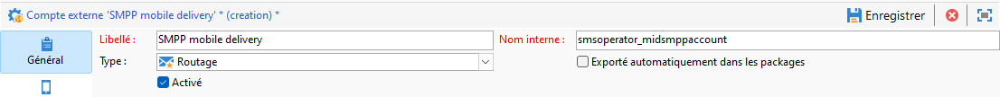

1. Définissez le type de compte sur **Routage**, le canal sur **Mobile (SMS)** et le mode de diffusion sur **Envoi en masse**.

   

1. Cochez la case **[!UICONTROL Activé]**.

1. Dans l&#39;onglet **[!UICONTROL Mobile]**, sélectionnez **[!UICONTROL SMPP Générique étendu]** dans la liste déroulante **[!UICONTROL Connecteur]**.

   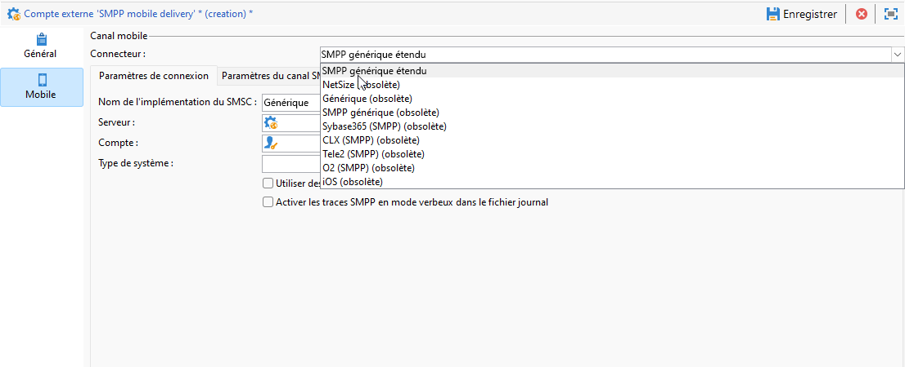

1. L’option **[!UICONTROL Activer les traces SMPP en mode verbeux dans le fichier de log]** permet de vider tout le trafic SMPP des fichiers journaux. Cette option doit être uniquement activée pour dépanner le connecteur et pour comparer le trafic affiché chez le fournisseur.

1. Adressez-vous à votre fournisseur de service SMS pour qu&#39;il vous explique comment renseigner dans l&#39;onglet **[!UICONTROL Paramètres de connexion]** les différents champs du compte externe.

   Contactez ensuite votre fournisseur qui vous donnera la valeur à saisir dans le champ **[!UICONTROL Nom de l&#39;implémentation du SMSC]**, en fonction du fournisseur que vous aurez choisi.

   Vous pouvez définir le nombre de connexions au fournisseur par MTA enfant. Par défaut, ce nombre est défini sur 1.

1. Par défaut, le nombre de caractère d&#39;un SMS respecte la norme de téléphonie mobile GSM.

   Les SMS utilisant l&#39;encodage GSM sont limités à 160 caractères, ou 153 caractères par SMS pour les messages envoyés en plusieurs parties.

   >[!NOTE]
   >
   >Certains caractères comptent pour deux (accolades, crochets, symbole de l&#39;euro, etc.).
   >
   >La liste des caractères GSM disponibles est présentée dans [cette section](sms-set-up.md#about-character-transliteration).

   Vous pouvez également autoriser la translittération des caractères en cochant la case correspondante.

   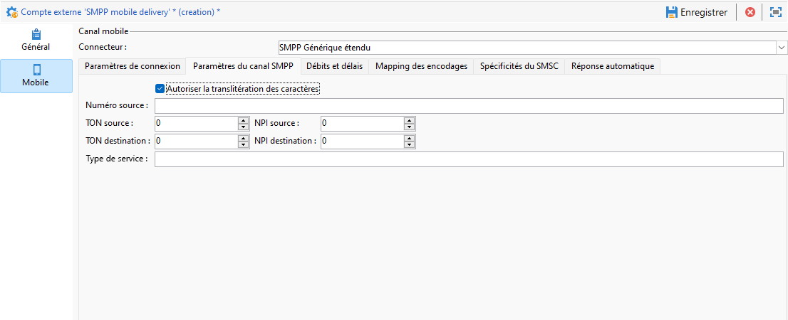

1. Dans l&#39;onglet **[!UICONTROL Débit et délais]**, vous pouvez indiquer le débit maximum des messages sortants (&quot;MT&quot;, Mobile Terminated) en MT par seconde. Si vous indiquez &quot;0&quot; dans le champ correspondant, le débit ne sera pas limité.

   Les valeurs de tous les champs correspondant à des délais sont à renseigner en secondes.

1. Dans l&#39;onglet **[!UICONTROL Mapping des encodages]**, vous pouvez définir les encodages.

   Pour plus d’informations, consultez [cette section](sms-set-up.md#about-text-encodings).

1. Dans l&#39;onglet **[!UICONTROL Spécificités du SMSC]**, l&#39;option **[!UICONTROL Envoyer le numéro de téléphone complet]** est désactivée par défaut. Ne l&#39;activez pas si vous souhaitez respecter le protocole SMPP et ne transmettre que des chiffres au serveur du fournisseur SMS (SMSC).

   Cependant, étant donné que certains fournisseurs requièrent l&#39;utilisation du préfixe &#39;+&#39;, consultez votre propre fournisseur qui vous invitera à activer cette option le cas échéant.

   La case à cocher **[!UICONTROL Activer TLS par SMPP]** permet de chiffrer le trafic SMPP. Pour plus d’informations à ce sujet, consultez cette [page](sms-protocol.md).

1. Si vous paramétrez un connecteur **[!UICONTROL SMPP Générique étendu]**, vous pouvez configurer des réponses automatiques.

   Pour plus d’informations, consultez [cette section](sms-set-up.md#automatic-reply).

## Modifier le modèle de diffusion {#changing-the-delivery-template}

Adobe Campaign met à disposition un modèle de diffusion mobile situé dans le nœud **[!UICONTROL Ressources > Modèles > Modèles de diffusion]** . Pour en savoir plus, consultez la [documentation de Campaign v8](https://experienceleague.adobe.com/fr/docs/campaign/campaign-v8/send/create-templates.html?lang=fr){target="_blank"}.

Pour envoyer des messages par le biais du canal SMS, vous devez créer un modèle qui inclut une référence au connecteur du canal.

Pour conserver le modèle de diffusion natif, nous vous recommandons de le dupliquer d’abord, puis de le configurer.

Dans l’exemple ci-dessous, nous allons générer un modèle afin de faciliter la diffusion des messages via le compte SMPP créé précédemment. Pour cela :

1. Dans le nœud **[!UICONTROL Ressources]** > **[!UICONTROL Modèles]** > **[!UICONTROL Modèles de diffusion]** de l’arborescence, cliquez avec le bouton droit sur le modèle **[!UICONTROL Diffuser vers mobiles]** et sélectionnez **[!UICONTROL Dupliquer]**.

   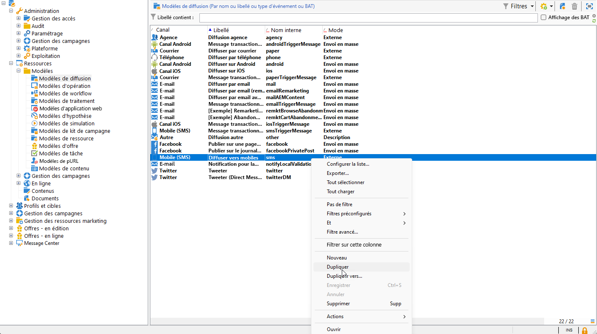

1. Modifiez le libellé du modèle, par exemple **Envoyé vers mobiles (SMPP)**.

   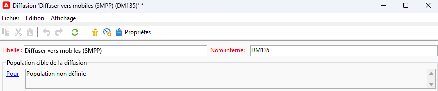

1. Cliquez sur **[!UICONTROL Propriétés]**.

1. Dans l’onglet **[!UICONTROL Général]**, sélectionnez un mode de routage correspondant au compte externe que vous avez créé dans la section [Créer un compte externe SMS sur le serveur Marketing](#create-accound-mkt).

   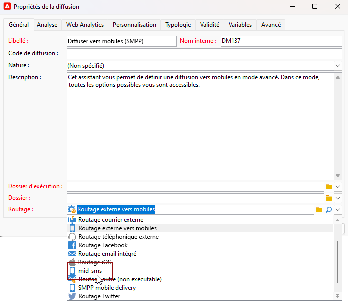

1. Cliquez sur **[!UICONTROL Enregistrer]** pour créer le modèle.

   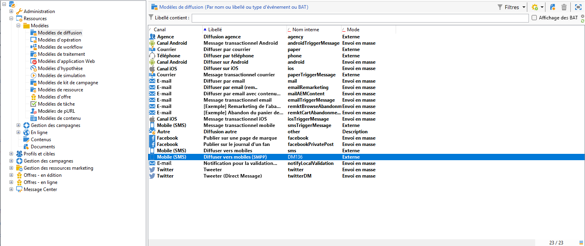

Vous disposez à présent d&#39;un compte externe et d&#39;un modèle de diffusion qui vous permettent de diffuser via SMS.

## Rubriques connexes {#related-topics}

* [Translittération de caractères SMS](sms-set-up.md#about-character-transliteration)
* [Encodages de texte](sms-set-up.md#about-text-encodings)
* [Réponse automatique](sms-set-up.md#automatic-reply)
