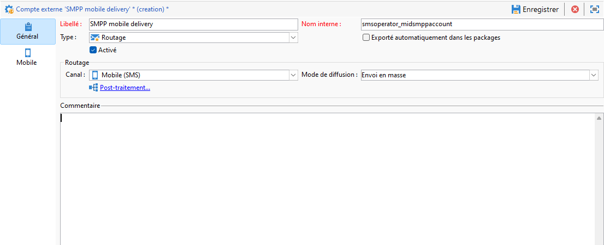

# Configuration du canal SMS sur une infrastructure de mid-sourcing {#setting-up-sms-channel}

Pour envoyer vers un téléphone mobile avec des mid-serveurs, vous devez :

1. Opérateur SMS créé sur le Mid-server utilisé pour le compte externe SMS créé sur le serveur Marketing.

1. un compte externe sur le serveur marketing, spécifiant le mode Canal et Diffusion ;

1. un compte externe sur le Mid-server, détaillant le connecteur et le type de message.

1. Un modèle de diffusion qui référence le compte externe pour rationaliser le processus d&#39;envoi.

>[!NOTE]
>
> Pour les diffusions SMS, la typologie doit utiliser une affinité SMS spécifique créée dans **un** conteneur de serveur d’applications dédié. [En savoir plus](../../installation/using/configure-delivery-settings.md#managing-outbound-smtp-traffic-with-affinities)

## Création de l&#39;opérateur SMS sur le Mid-server {#create-sms-operator}

Pour lancer le processus de configuration, vous devez créer un opérateur SMS sur le Mid-server spécifiquement pour le compte externe.

>[!IMPORTANT]
>
>Chaque connecteur SMS nécessite un opérateur SMS unique.

1. Dans le **[!UICONTROL Administration]** > **[!UICONTROL Gestion des accès]** > **[!UICONTROL Noeud des opérateurs]** du noeud de l’arborescence, cliquez sur le bouton **[!UICONTROL Nouveau]** Icône

   

1. Spécification de la variable **[!UICONTROL Paramètres d&#39;identification]**, y compris leur identifiant, mot de passe et leur nom d’utilisateur. Le login et le mot de passe sont nécessaires pour que l&#39;opérateur puisse se connecter en toute sécurité à Adobe Campaign.

   Notez que la variable **[!UICONTROL Nom (login)]** doit être utilisé ultérieurement pour nommer votre compte externe SMPP dans le Mid-server.

   

1. Sélectionnez les permissions accordées à l&#39;opérateur dans la section Droits d&#39;accès de l&#39;opérateur .

   Pour attribuer des droits à l&#39;opérateur, cliquez sur le bouton **[!UICONTROL Ajouter]** situé au-dessus de la liste des droits. Sélectionnez ensuite un **[!UICONTROL Groupe d&#39;opérateurs]** ou **[!UICONTROL Droits nommés]** dans la liste des groupes disponibles.

   

1. Cliquez sur **[!UICONTROL Enregistrer]** pour finaliser la création de l&#39;opérateur. Le profil est désormais inclus dans la liste des opérateurs existants.

## Création d&#39;un compte externe SMS sur le serveur marketing {#create-accound-mkt}

Pour envoyer un SMS à un téléphone mobile avec les Mid-servers, vous devez d&#39;abord créer votre compte externe SMS sur le serveur Marketing.

1. Dans le nœud **[!UICONTROL Plateforme]** > **[!UICONTROL Comptes externes]**, cliquez sur l&#39;icône **[!UICONTROL Nouveau]**.

   

1. Saisissez votre **[!UICONTROL Libellé]** et **[!UICONTROL Nom interne]**. Notez que le nom interne doit être utilisé ultérieurement pour nommer votre compte externe SMPP dans le Mid-server.

1. Définissez le type de compte sur **[!UICONTROL Routage]**, le canal est défini sur **[!UICONTROL Mobile (SMS)]**, et le mode de diffusion comme **[!UICONTROL Mid-sourcing]**.

   

1. Dans l&#39;onglet **[!UICONTROL Mid-Sourcing]**, indiquez les paramètres de connexion au serveur de mid-sourcing.

   Saisissez les détails du [connecteur SMS créé précédemment](#create-sms-operator) dans le **[!UICONTROL Compte]** et **[!UICONTROL Password]** des champs.

   

1. Validez votre paramétrage en cliquant sur **[!UICONTROL Tester la connexion]**.

1. Cliquez sur **[!UICONTROL Enregistrer]**.

## Création d&#39;un compte externe SMPP sur le Mid-server {#creating-smpp-mid}

>[!IMPORTANT]
>
>L’utilisation du même compte et du même mot de passe pour plusieurs comptes SMS externes peut entraîner des conflits et des chevauchements entre les comptes. Reportez-vous à la [page de résolution des problèmes de SMS](troubleshooting-sms.md#external-account-conflict).

Une fois que vous avez correctement configuré votre compte externe SMS sur le serveur marketing, l&#39;étape suivante consiste à établir votre compte externe SMPP sur le serveur intermédiaire.

Pour plus d’informations sur les paramètres et le protocole SMS, reportez-vous à cette [page](sms-protocol.md).

Pour ce faire, procédez comme suit :

1. Dans le nœud **[!UICONTROL Plateforme]** > **[!UICONTROL Comptes externes]**, cliquez sur l&#39;icône **[!UICONTROL Nouveau]**.

1. Saisissez votre **[!UICONTROL Libellé]** et **[!UICONTROL Nom interne]**.

   >[!WARNING]
   >
   >Lors de l’attribution d’une **[!UICONTROL Nom interne]**, veillez à respecter la convention d’affectation des noms spécifiée :
   >  `SMS Operator Name_Internal Name of the Marketing SMS external account`

   

1. Définissez le type de compte sur **Routage**, le canal sur **Mobile (SMS)** et le mode de diffusion sur **Envoi en masse**.

   

1. Cochez la case **[!UICONTROL Activé]**.

1. Dans l&#39;onglet **[!UICONTROL Mobile]**, sélectionnez **[!UICONTROL SMPP Générique étendu]** dans la liste déroulante **[!UICONTROL Connecteur]**.

   

1. La variable **[!UICONTROL Activer les traces SMPP en mode verbeux dans le fichier journal]** vous permet de vider tout le trafic SMPP dans les fichiers journaux. Cette option ne doit être activée que pour dépanner le connecteur et pour comparer le trafic affiché par le fournisseur.

1. Adressez-vous à votre fournisseur de service SMS pour qu&#39;il vous explique comment renseigner dans l&#39;onglet **[!UICONTROL Paramètres de connexion]** les différents champs du compte externe.

   Contactez ensuite votre fournisseur qui vous donnera la valeur à saisir dans le champ **[!UICONTROL Nom de l&#39;implémentation du SMSC]**, en fonction du fournisseur que vous aurez choisi.

   Vous pouvez définir le nombre de connexions au fournisseur par MTA enfant. Par défaut, ce nombre est défini sur 1.

1. Par défaut, le nombre de caractère d&#39;un SMS respecte la norme de téléphonie mobile GSM.

   Les SMS utilisant l&#39;encodage GSM sont limités à 160 caractères, ou 153 caractères par SMS pour les messages envoyés en plusieurs parties.

   >[!NOTE]
   >
   >Certains caractères comptent pour deux (accolades, crochets, symbole de l&#39;euro, etc.).
   >
   >La liste des caractères GSM disponibles est présentée dans la section [cette section](sms-set-up.md#about-character-transliteration).

   Vous pouvez également autoriser la translittération des caractères en cochant la case correspondante.

   

1. Dans l&#39;onglet **[!UICONTROL Débit et délais]**, vous pouvez indiquer le débit maximum des messages sortants (&quot;MT&quot;, Mobile Terminated) en MT par seconde. Si vous indiquez &quot;0&quot; dans le champ correspondant, le débit ne sera pas limité.

   Les valeurs de tous les champs correspondant à des délais sont à renseigner en secondes.

1. Dans l&#39;onglet **[!UICONTROL Mapping des encodages]**, vous pouvez définir les encodages.

   Pour plus d’informations, consultez [cette section](sms-set-up.md#about-text-encodings).

1. Dans l&#39;onglet **[!UICONTROL Spécificités du SMSC]**, l&#39;option **[!UICONTROL Envoyer le numéro de téléphone complet]** est désactivée par défaut. Ne l&#39;activez pas si vous souhaitez respecter le protocole SMPP et ne transmettre que des chiffres au serveur du fournisseur SMS (SMSC).

   Cependant, étant donné que certains fournisseurs requièrent l&#39;utilisation du préfixe &#39;+&#39;, consultez votre propre fournisseur qui vous invitera à activer cette option le cas échéant.

   La case à cocher **[!UICONTROL Activer TLS par SMPP]** permet de chiffrer le trafic SMPP. Pour plus d’informations à ce sujet, consultez cette [page](sms-protocol.md).

1. Si vous paramétrez un connecteur **[!UICONTROL SMPP Générique étendu]**, vous pouvez configurer des réponses automatiques.

   Pour plus d’informations, consultez [cette section](sms-set-up.md#automatic-reply).

## Modifier le modèle de diffusion {#changing-the-delivery-template}

Adobe Campaign propose un modèle de diffusion mobile situé dans le **[!UICONTROL Ressources > Modèles > Modèles de diffusion]** noeud . Pour plus d&#39;informations, consultez la section [Modèles](about-templates.md).

Pour envoyer des messages par le biais du canal SMS, vous devez créer un modèle incluant une référence au connecteur du canal.

Pour conserver le modèle de diffusion natif, il est recommandé de le dupliquer puis de le paramétrer.

Dans l&#39;exemple ci-dessous, nous allons générer un modèle afin de faciliter la diffusion des messages via le compte SMPP créé précédemment. Pour cela :

1. Dans le **[!UICONTROL Ressources]** > **[!UICONTROL Modèles]** > **[!UICONTROL Modèles de diffusion]** du noeud de l’arborescence, cliquez avec le bouton droit de la souris sur le noeud **[!UICONTROL Envoyer vers mobiles]** et sélectionnez **[!UICONTROL Dupliquer]**.

   

1. Modifiez le libellé du modèle, par exemple **Envoyé vers mobiles (SMPP)**.

   

1. Cliquez sur **[!UICONTROL Propriétés]**.

1. Dans le **[!UICONTROL Général]** sélectionnez un mode de routage correspondant au compte externe que vous avez créé dans la section . [Création d&#39;un compte externe SMS sur le serveur marketing](#create-accound-mkt).

   

1. Cliquez sur **[!UICONTROL Enregistrer]** pour créer le modèle.

   

Vous disposez à présent d&#39;un compte externe et d&#39;un modèle de diffusion qui vous permettent de diffuser via SMS.

## Rubriques connexes {#related-topics}

* [Translittération de caractères SMS](sms-set-up.md#about-character-transliteration)
* [Codages de texte](sms-set-up.md#about-text-encodings)
* [Réponse automatique](sms-set-up.md#automatic-reply)

