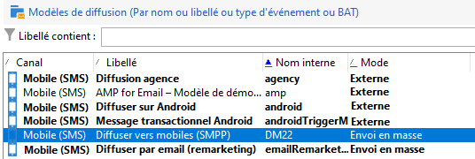

# Configurer le canal SMS {#setting-up-sms-channel}

Pour diffuser vers un téléphone mobile, vous devez avoir :

1. un compte externe spécifiant un connecteur et un type de message,

   Notez que les anciens connecteurs sont désormais obsolètes. Les fonctionnalités obsolètes sont toujours disponibles, mais elles ne seront ni améliorées ni prises en charge. En savoir plus [sur cette page](../../rn/using/deprecated-features.md).

1. un modèle de diffusion dans lequel est référencé ce compte externe.

>[!NOTE]
>
> Pour les diffusions SMS, la typologie doit utiliser une affinité SMS spécifique créée dans **un** conteneur de serveur d’applications dédié. [En savoir plus](../../installation/using/configure-delivery-settings.md#managing-outbound-smtp-traffic-with-affinities)

## Créer un compte externe SMPP {#creating-an-smpp-external-account}

>[!IMPORTANT]
>
>L’utilisation du même compte et du même mot de passe pour plusieurs comptes SMS externes peut entraîner des conflits et des chevauchements entre les comptes. Reportez-vous à la [page de résolution des problèmes de SMS](troubleshooting-sms.md#external-account-conflict).

Pour envoyer un SMS à un téléphone mobile, vous devez d’abord créer votre compte externe SMPP.
Pour plus d’informations sur les paramètres et le protocole SMS, reportez-vous à cette [page](sms-protocol.md).

Pour ce faire, procédez comme suit :

1. Dans le nœud **[!UICONTROL Plateforme]** > **[!UICONTROL Comptes externes]**, cliquez sur l&#39;icône **[!UICONTROL Nouveau]**.
1. Définissez le type de compte sur **Routage**, le canal sur **Mobile (SMS)** et le mode de diffusion sur **Envoi en masse**.

   

1. Cochez la case **[!UICONTROL Activé]**.
1. Dans l&#39;onglet **[!UICONTROL Mobile]**, sélectionnez **[!UICONTROL SMPP Générique étendu]** dans la liste déroulante **[!UICONTROL Connecteur]**.

   

   >[!CAUTION]
   >
   > À partir de la version 20.2, les anciens connecteurs sont abandonnés et ne sont plus pris en charge. Nous vous recommandons d’utiliser le connecteur **[!UICONTROL SMPP générique étendu]**. Pour plus d’informations sur la migration vers le connecteur recommandé, voir cette [page](unsupported-connector-migration.md).

1. L&#39;option **[!UICONTROL Activer les traces SMPP en mode verbeux dans le fichier journal]** vous permet de sauvegarder tout le trafic SMPP dans les fichiers journaux. Cette option doit être activée pour résoudre les problèmes liés au connecteur et pour effectuer une comparaison avec le trafic observé par le fournisseur.

1. Adressez-vous à votre fournisseur de service SMS pour qu&#39;il vous explique comment renseigner dans l&#39;onglet **[!UICONTROL Paramètres de connexion]** les différents champs du compte externe.

   Contactez ensuite votre fournisseur qui vous donnera la valeur à saisir dans le champ **[!UICONTROL Nom de l&#39;implémentation du SMSC]**, en fonction du fournisseur que vous aurez choisi.

   Vous pouvez définir le nombre de connexions au fournisseur par MTA enfant. Par défaut, ce nombre est défini sur 1.

1. Par défaut, le nombre de caractère d&#39;un SMS respecte la norme de téléphonie mobile GSM.

   Les SMS utilisant l&#39;encodage GSM sont limités à 160 caractères, ou 153 caractères par SMS pour les messages envoyés en plusieurs parties.

   >[!NOTE]
   >
   >Certains caractères comptent pour deux (accolades, crochets, symbole de l&#39;euro, etc.).
   >
   >La liste des caractères GSM disponibles est présentée ci-dessous.

   Vous pouvez si vous le souhaitez autoriser la translittération des caractères en cochant la case correspondante.

   

   Pour plus d’informations, consultez [cette section](#about-character-transliteration).

1. Dans l&#39;onglet **[!UICONTROL Débit et délais]**, vous pouvez indiquer le débit maximum des messages sortants (&quot;MT&quot;, Mobile Terminated) en MT par seconde. Si vous indiquez &quot;0&quot; dans le champ correspondant, le débit ne sera pas limité.

   Les valeurs de tous les champs correspondant à des délais sont à renseigner en secondes.

1. Dans l&#39;onglet **[!UICONTROL Mapping des encodages]**, vous pouvez définir les encodages.

   Pour plus d’informations, consultez [cette section](#about-text-encodings).

1. Dans l&#39;onglet **[!UICONTROL Spécificités du SMSC]**, l&#39;option **[!UICONTROL Envoyer le numéro de téléphone complet]** est désactivée par défaut. Ne l&#39;activez pas si vous souhaitez respecter le protocole SMPP et ne transmettre que des chiffres au serveur du fournisseur SMS (SMSC).

   Cependant, étant donné que certains fournisseurs requièrent l&#39;utilisation du préfixe &#39;+&#39;, consultez votre propre fournisseur qui vous invitera à activer cette option le cas échéant.

   La case à cocher **[!UICONTROL Activer TLS par SMPP]** permet de chiffrer le trafic SMPP. Pour plus d’informations à ce sujet, consultez cette [page](sms-protocol.md).

1. Si vous paramétrez un connecteur **[!UICONTROL SMPP Générique étendu]**, vous pouvez configurer des réponses automatiques.

   Pour plus d’informations, consultez [cette section](#automatic-reply).

## Translittération de caractères SMS {#about-character-transliteration}

La translittération des caractères peut être configurée dans un compte externe de routage vers mobiles par SMPP dans l&#39;onglet **[!UICONTROL Mobile]**.

La translittération consiste à remplacer un caractère d&#39;un SMS par un autre lorsque ce caractère n&#39;est pas pris en charge par la norme GSM.

* Lorsque la translittération est **[!UICONTROL autorisée]**, chaque caractère non pris en charge est remplacé par un caractère GSM lors de l&#39;envoi du message. Par exemple, la lettre &quot;ë&quot; est remplacée par &quot;e&quot;. Le message est alors légèrement altéré, mais la limite du nombre de caractères demeure identique.
* Lorsque la translittération **[!UICONTROL n&#39;est pas autorisée]**, chaque message contenant des caractères non pris en charge est envoyé au format binaire (Unicode) : tous les caractères sont transmis tels quels. Or les SMS utilisant l&#39;encodage Unicode sont limités à 70 caractères (ou 67 caractères par SMS pour les messages envoyés en plusieurs parties). Si le nombre de caractères maximal est dépassé, plusieurs messages sont alors envoyés, ce qui peut générer des coûts supplémentaires.

>[!IMPORTANT]
>
>L&#39;insertion de champs de personnalisation dans le contenu du SMS peut introduire des caractères non pris en charge par l&#39;encodage GSM.

Par défaut, la translittération des caractères est désactivée. Si vous souhaitez que tous les caractères de vos SMS soient conservés, pour ne pas altérer les noms propres par exemple, il est recommandé de ne pas activer cette option.

En revanche, si vos SMS contiennent beaucoup de caractères générant des messages Unicode, vous pouvez choisir d&#39;activer cette option afin de limiter le coût de vos envois.

Le tableau ci-après présente les caractères pris en charge par la norme GSM. Tout caractère inséré dans le corps du message autre que ceux mentionnés ci-dessous convertit le message complet en binaire (Unicode) et le limite donc à 70 caractères.

**Caractères simples**

<table> 
 <tbody> 
  <tr> 
   <td> @ </td> 
   <td>  </td> 
   <td> SP </td> 
   <td> 0 </td> 
   <td> ¡ </td> 
   <td> p </td> 
   <td> ¿ </td> 
   <td> p </td> 
  </tr> 
  <tr> 
   <td> £ </td> 
   <td> _ </td> 
   <td> ! </td> 
   <td> 1 </td> 
   <td> a </td> 
   <td> q </td> 
   <td> a </td> 
   <td> q </td> 
  </tr> 
  <tr> 
   <td> $ </td> 
   <td>  </td> 
   <td> " </td> 
   <td> 2 </td> 
   <td> b </td> 
   <td> r </td> 
   <td> b </td> 
   <td> r </td> 
  </tr> 
  <tr> 
   <td> ¥ </td> 
   <td>  </td> 
   <td> # </td> 
   <td> 3 </td> 
   <td> c </td> 
   <td> s </td> 
   <td> c </td> 
   <td> s </td> 
  </tr> 
  <tr> 
   <td> è </td> 
   <td>  </td> 
   <td> ¤ </td> 
   <td> 4 </td> 
   <td> D </td> 
   <td> T </td> 
   <td> d </td> 
   <td> t </td> 
  </tr> 
  <tr> 
   <td> é </td> 
   <td>  </td> 
   <td> % </td> 
   <td> 5 </td> 
   <td> e </td> 
   <td> u </td> 
   <td> e </td> 
   <td> u </td> 
  </tr> 
  <tr> 
   <td> ù </td> 
   <td>  </td> 
   <td> &amp; </td> 
   <td> 6 </td> 
   <td> f </td> 
   <td> v </td> 
   <td> f </td> 
   <td> v </td> 
  </tr> 
  <tr> 
   <td> ì </td> 
   <td>  </td> 
   <td> ' </td> 
   <td> 7 </td> 
   <td> g </td> 
   <td> w </td> 
   <td> g </td> 
   <td> w </td> 
  </tr> 
  <tr> 
   <td> ò </td> 
   <td>  </td> 
   <td> ( </td> 
   <td> 8 </td> 
   <td> h </td> 
   <td> X </td> 
   <td> h </td> 
   <td> x </td> 
  </tr> 
  <tr> 
   <td> Ç </td> 
   <td>  </td> 
   <td> ) </td> 
   <td> 9 </td> 
   <td> i </td> 
   <td> y </td> 
   <td> i </td> 
   <td> y </td> 
  </tr> 
  <tr> 
   <td> LF </td> 
   <td>  </td> 
   <td> * </td> 
   <td> : </td> 
   <td> j </td> 
   <td> z </td> 
   <td> j </td> 
   <td> z </td> 
  </tr> 
  <tr> 
   <td> Ø </td> 
   <td> ESC </td> 
   <td> + </td> 
   <td> ; </td> 
   <td> k </td> 
   <td> Ä </td> 
   <td> k </td> 
   <td> ä </td> 
  </tr> 
  <tr> 
   <td> ø </td> 
   <td> Æ </td> 
   <td> , </td> 
   <td> &lt; </td> 
   <td> l </td> 
   <td> Ö </td> 
   <td> l </td> 
   <td> ö </td> 
  </tr> 
  <tr> 
   <td> CR </td> 
   <td> æ </td> 
   <td> - </td> 
   <td> = </td> 
   <td> M </td> 
   <td> Ñ </td> 
   <td> m </td> 
   <td> ñ </td> 
  </tr> 
  <tr> 
   <td> Å </td> 
   <td> ß </td> 
   <td> . </td> 
   <td> &gt; </td> 
   <td> n </td> 
   <td> Ü </td> 
   <td> n </td> 
   <td> ü </td> 
  </tr> 
  <tr> 
   <td> å </td> 
   <td> É </td> 
   <td> / </td> 
   <td> ? </td> 
   <td> o </td> 
   <td> § </td> 
   <td> o </td> 
   <td> à </td> 
  </tr> 
 </tbody> 
</table>

SP : espace (Space)

ESC : caractère d&#39;échappement (Escape)

LF : saut de ligne (Line Feed)

CR : retour chariot (Carriage Return)

**Caractères doubles**

^ { } `[ ~ ]` | €

## Codages de texte {#about-text-encodings}

Lors de l&#39;envoi d&#39;un SMS, Adobe Campaign peut utiliser un ou plusieurs encodages de texte. Chaque encodage possède un jeu de caractères disponibles qui lui est propre, et le nombre de caractères qu&#39;il est possible de mettre dans un SMS dépend de l&#39;encodage.

Lors du paramétrage d&#39;un nouveau compte externe de routage vers mobiles par SMPP, vous pouvez définir le **[!UICONTROL Mapping des encodages]** dans l&#39;onglet **[!UICONTROL Mobile]** : le champ **[!UICONTROL data_coding]** permet à Adobe Campaign de communiquer les encodages utilisés au SMSC.

>[!NOTE]
>
>La correspondance entre la valeur du **data_coding** et l&#39;encodage réellement utilisé est standardisée. Cependant, certains SMSC possèdent une correspondance qui leur est propre : dans ce cas, votre administrateur **Adobe Campaign** doit déclarer cette correspondance. Consultez votre fournisseur pour en savoir plus.

Vous pouvez déclarer des **data_coding** et forcer l&#39;encodage si besoin : pour ce faire, spécifiez un seul encodage dans le tableau.

* Lorsqu&#39;aucun mapping des encodages n&#39;est défini, le connecteur a un comportement générique :

   * Il tente d&#39;utiliser l&#39;encodage GSM et lui affecte la valeur **data_coding = 0**.
   * Si l&#39;encodage GSM échoue, il utilise l&#39;encodage **UCS2** et lui affecte la valeur **data_coding = 8**.

* Lorsque vous définissez les encodages que vous souhaitez utiliser ainsi que les valeurs du champ **[!UICONTROL data_coding]** associées, Adobe Campaign tentera d&#39;utiliser le premier encodage de la liste, puis le suivant, si l&#39;encodage se révèle impossible.

>[!IMPORTANT]
>
>L&#39;ordre de déclaration est important : il est recommandé d&#39;ordonner la liste par ordre croissant **de coût**, afin de favoriser les encodages permettant de mettre le plus de caractères possible dans chaque SMS.
>
>Ne déclarez que les encodages que vous souhaitez utiliser. Si certains encodages fournis par le SMSC ne correspondent pas à votre utilisation, ne les déclarez pas dans la liste.

## Réponse automatique {#automatic-reply}

Lors du paramétrage d&#39;un connecteur SMPP Générique étendu, vous pouvez paramétrer des réponses automatiques.

Lorsqu&#39;un abonné répond à un SMS qui lui a été envoyé via Adobe Campaign par un message contenant un mot-clé tel que &quot;STOP&quot;, vous pouvez configurer les messages qui lui sont automatiquement renvoyés dans la section **[!UICONTROL Réponse automatique aux MO]**.

>[!NOTE]
>
>Les mots-clés ne respectent pas la casse.

Pour chaque mot-clé, indiquez un numéro court (short code), c&#39;est-à-dire un numéro habituellement utilisé pour envoyer les diffusions et qui servira de nom d&#39;expéditeur, puis saisissez le message qui sera adressé à l&#39;abonné.

Vous pouvez également associer une action à votre réponse automatique : **[!UICONTROL Envoyer en quarantaine]** ou **[!UICONTROL Sortir de la quarantaine]**. Par exemple, si un destinataire envoie le mot-clé « STOP », il reçoit automatiquement une confirmation de désinscription et il est mis en quarantaine.

Si vous associez l’action **[!UICONTROL Sortir de quarantaine]** à une réponse automatique, les destinataires qui envoient le mot-clé correspondant sont automatiquement retirés de la quarantaine.

Les destinataires sont répertoriés dans la table **[!UICONTROL NP@I et Adresses]** accessible via le menu **[!UICONTROL Administration]** > **[!UICONTROL Gestion de campagne]** > **[!UICONTROL Gestion des NP@I]**.

* Pour envoyer la même réponse quel que soit le numéro court, laissez la colonne **[!UICONTROL Numéro court]** vide.
* Pour envoyer la même réponse quel que soit le mot-clé, laissez la colonne &quot;**[!UICONTROL Mot-clé]**&quot; vide.
* Pour effectuer une action sans envoyer de réponse, laissez la colonne **[!UICONTROL Réponse]** vide. Cela permet notamment de retirer de la quarantaine un utilisateur qui envoie un message autre que « STOP ».

Si vous disposez de plusieurs comptes externes utilisant le connecteur SMPP générique étendu avec le même compte fournisseur, le problème suivant peut se produire : lors de l&#39;envoi d&#39;une réponse à un code court, il peut être reçu sur n&#39;importe quelle connexion de votre compte externe. La réponse automatique envoyée pourrait donc ne pas être le message attendu.
Pour éviter cela, appliquez l&#39;une des solutions suivantes, selon le fournisseur utilisé :

* Créez un compte fournisseur pour chaque compte externe.
* Utilisez le champ **[!UICONTROL Type de système]** dans l&#39;onglet **[!UICONTROL Mobile]** > **[!UICONTROL Paramètres de connexion]** pour distinguer chaque code court. Demandez à votre fournisseur une valeur différente pour chaque compte.

  

La procédure de configuration d’un compte externe à l’aide du connecteur SMPP générique étendu est détaillée dans la section [Création d’un compte externe SMPP](#creating-an-smpp-external-account).

## Modifier le modèle de diffusion {#changing-the-delivery-template}

Adobe Campaign met à votre disposition un modèle de diffusion vers mobiles. Ce modèle est disponible dans le nœud **[!UICONTROL Ressources > Modèles > Modèles de diffusion.]** Pour plus d&#39;informations, consultez la section [Modèles](about-templates.md).

Pour diffuser par le canal SMS, vous devez créer un modèle dans lequel le connecteur du canal est référencé.

Afin de conserver le modèle de diffusion natif, nous vous conseillons de le dupliquer puis de le paramétrer.

Dans l’exemple ci-dessous, nous créons un modèle pour diffuser des messages par l’intermédiaire du compte SMPP activé précédemment. Pour cela :

1. Positionnez-vous au niveau du nœud **[!UICONTROL Modèles de diffusion]**.
1. Cliquez avec le bouton droit sur le modèle **[!UICONTROL Diffuser vers mobiles]** et sélectionnez **[!UICONTROL Dupliquer]**.

   

1. Modifiez le libellé du modèle, par exemple **Envoyé vers mobiles (SMPP)**.

   

1. Cliquez sur **[!UICONTROL Propriétés]**.
1. Dans l’onglet **[!UICONTROL Général]**, sélectionnez un mode de routage correspondant au compte externe créé lors des étapes précédentes.

   

1. Cliquez sur **[!UICONTROL Enregistrer]** pour créer le modèle.

   

Vous disposez à présent d&#39;un compte externe et d&#39;un modèle de diffusion qui vous permettent de diffuser via SMS.
