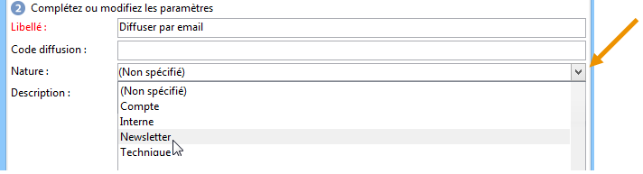

# Création et identification de la diffusion {#create-and-identify-the-delivery}

## Création de la diffusion {#creating-the-delivery}

Vous pouvez créer une diffusion par le biais de la vue d&#39;ensemble ou du menu **[!UICONTROL Créer > Diffusion]**.

Pour créer une diffusion, cliquez sur **[!UICONTROL Créer]** au-dessus de la liste des diffusions. Lorsque vous créez une diffusion, vous devez indiquer le canal de diffusion utilisé. Pour cela, sélectionnez le modèle de diffusion approprié dans la liste déroulante du **[!UICONTROL Modèle de diffusion]** champ .

Par défaut, un modèle est fourni pour chaque canal installé : publipostage direct, e-mail, fax, téléphone, canal mobile (SMS), Facebook, X (anciennement Twitter), etc.

>[!NOTE]
>
>Les canaux proposés dans cette liste dépendent de votre contrat de licence.

Vous pouvez créer de nouveaux modèles de diffusion afin de préconfigurer des paramètres spécifiques en fonction de vos besoins. Pour plus d’informations sur les modèles, consultez [cette section](about-templates.md).

## Identification de la diffusion {#identifying-the-delivery}

Vous devez renseigner des paramètres pour identifier la diffusion. Pour cela :

1. Saisissez un nom pour le diffusion dans le champ **[!UICONTROL Libellé]**.

   Un code de diffusion peut également être attribué à la diffusion. Le nom de la diffusion et son code apparaissent dans la liste des diffusions, mais ne sont pas visibles par les destinataires.

1. Ajoutez une description dans le champ **[!UICONTROL Description]**.
1. Sélectionnez la nature de la diffusion dans le champ correspondant. Cette information est notamment utile pour le rtacking des diffusions : vous pouvez filtrer sur ce critère dans la liste des diffusions ou construire des requêtes en utilisant ce critère de sélection.

   

1. Cliquez sur **[!UICONTROL Continuer]** pour valider ces informations et afficher la fenêtre de configuration du message.

Le contenu de la diffusion est prêt à être configuré. La définition du contenu de diffusion est spécifique à chaque canal. Voir à ce sujet la section dédiée :

* [Définition du contenu de l’e-mail](defining-the-email-content.md)
* [Définition du contenu des SMS](sms-create.md#defining-the-sms-content)
* [Définition du contenu du publipostage direct](defining-the-direct-mail-content.md)
* [Notifications push](about-mobile-app-channel.md)
