# Définition de la population cible {#defining-the-target-population}

Pour chaque diffusion, vous pouvez définir plusieurs types de populations cible :

* **Audience principale :** profils qui recevront des messages. [En savoir plus](steps-defining-the-target-population.md#selecting-the-main-target)
* **BAT** : destinataires des messages BAT, concernés par le cycle de validation. [En savoir plus](steps-defining-the-target-population.md#defining-a-specific-proof-target)
* **Adresses de contrôle** : destinataires ne figurant pas dans la cible mais qui recevront la diffusion (uniquement dans le cadre d’une campagne de marketing). [En savoir plus](about-seed-addresses.md)
* **Populations témoins** : population qui ne recevra pas la diffusion, servant à suivre le comportement et l’impact de la campagne (uniquement dans le cadre d’une campagne de marketing). [En savoir plus](../../campaign/using/marketing-campaign-target.md#defining-a-control-group).

## Sélection des principaux destinataires de la diffusion {#selecting-the-main-target}

Dans la plupart des cas, la cible principale est extraite de la base de données Adobe Campaign (mode par défaut). Cependant, il est également possible de stocker les destinataires dans un fichier externe. En savoir plus dans [cette section](steps-defining-the-target-population.md#selecting-external-recipients).

Pour sélectionner les destinataires d’une diffusion, procédez comme suit :

1. Dans l’éditeur de diffusion, sélectionnez **[!UICONTROL Pour]**.
1. Si les destinataires sont stockés dans la base de données, sélectionnez la première option.

   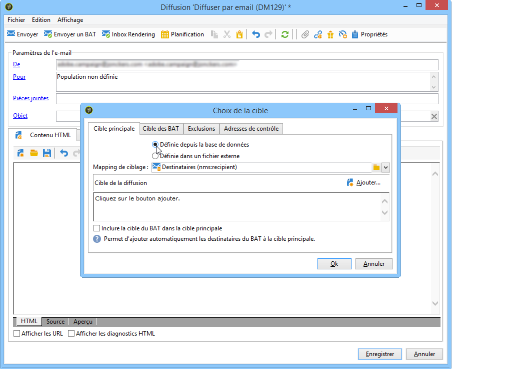

1. Sélectionnez le mapping de ciblage dans la liste déroulante **[!UICONTROL Mapping de ciblage]** . Le mapping de ciblage par défaut d&#39;Adobe Campaign est **[!UICONTROL Destinataire]**, selon le schéma **nms:destinataire**.

   D’autres mappings de ciblage sont disponibles et certains d’entre eux peuvent être liés à votre configuration spécifique. Pour plus d’informations sur les mappings de ciblage, consultez la section [Sélection dʼun mapping de ciblage](selecting-a-target-mapping.md).

1. Cliquez sur le bouton **[!UICONTROL Ajouter]** pour définir les filtres de restriction.

   Vous pouvez alors sélectionner le type de filtrage à appliquer :

   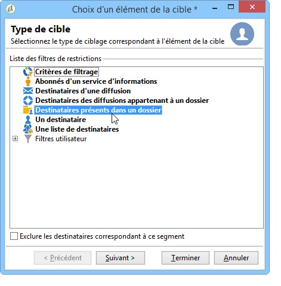

   Vous pouvez sélectionner les destinataires en utilisant les types de ciblage définis dans la base. Pour utiliser un type de cible, sélectionnez-le et cliquez sur **[!UICONTROL Suivant]**. Pour chaque cible, vous pouvez visualiser les destinataires concernés en cliquant sur l&#39;onglet **[!UICONTROL Aperçu]**. Pour certains types de cibles, le bouton **[!UICONTROL Affiner la cible]** permet de conjuguer plusieurs critères de ciblage.

   Par défaut, les types de cibles suivants sont proposés :

   * **[!UICONTROL Critères de filtrage]** : cette option permet de définir une requête et d&#39;en visualiser le résultat. Le mode de définition des requêtes est présenté dans [cette section](../../platform/using/creating-filters.md#creating-an-advanced-filter).
   * **[!UICONTROL Abonnés d&#39;un service d&#39;information]** : cette option vous permet de sélectionner une newsletter à laquelle les destinataires doivent être abonnés pour être ciblés par la diffusion en cours de création.

      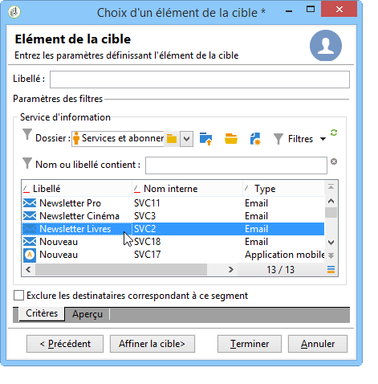

   * **[!UICONTROL Destinataires d&#39;une diffusion]** : cette option permet de définir comme critère de ciblage les destinataires d&#39;une diffusion existante. Vous devez alors sélectionner la diffusion dans la liste :

      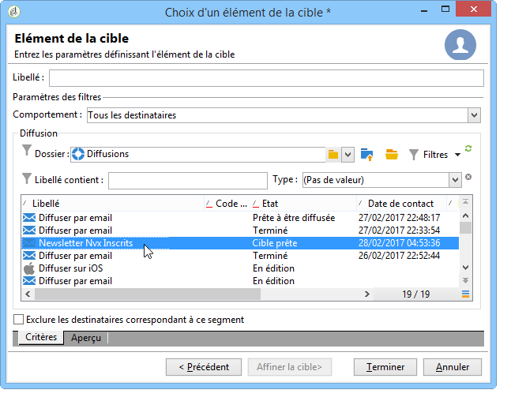

   * **[!UICONTROL Destinataires des diffusions appartenant à un dossier]** : cette option permet de sélectionner un dossier de diffusions et de cibler les destinataires des diffusions contenues dans ce dossier.

      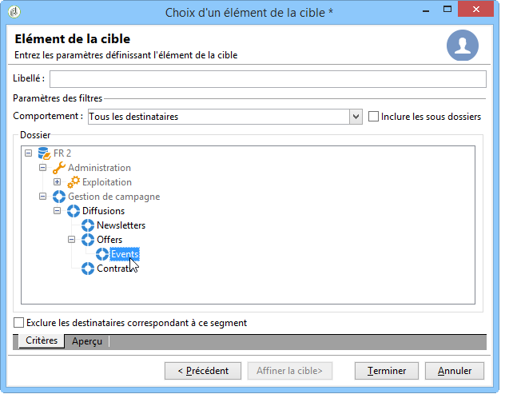

      Vous pouvez filtrer sur le comportement des destinataires en le sélectionnant depuis la liste déroulante :

      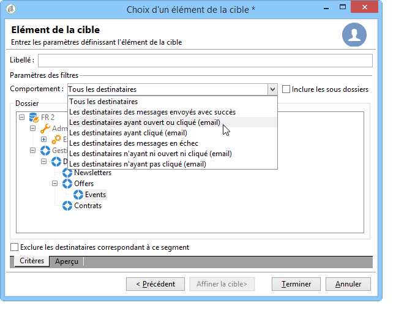

      >[!NOTE]
      >
      >L&#39;option **[!UICONTROL Inclure les sous-dossiers]** permet de cibler également sur les diffusions contenues dans les dossiers situés en sous-arborescence du noeud sélectionné.

   * **[!UICONTROL Destinataires présents dans un dossier]** : cette option permet de cibler les profils contenus dans un dossier spécifique de l&#39;arborescence.
   * **[!UICONTROL Un destinataire]** : cette option permet de sélectionner un destinataire spécifique parmi les profils de la base.
   * **[!UICONTROL Une liste de destinataires]** : cette option permet de cibler une liste de destinataires. Les listes sont présentées dans [cette section](../../platform/using/creating-and-managing-lists.md).
   * **[!UICONTROL Filtres utilisateurs]** : cette option permet d&#39;accéder aux filtres préconfigurés disponibles afin de les utiliser comme critères de filtrage des profils de la base. Les filtres préconfigurés sont présentés dans [cette section](../../platform/using/creating-filters.md#saving-a-filter).
   * L&#39;option **[!UICONTROL Exclure les destinataires correspondant à ce segment]** permet de cibler sur les destinataires ne répondant pas au(x) critère(s) de ciblage défini(s). Pour utiliser cette option, cochez la case correspondante puis opérez un ciblage, comme défini précédemment, pour exclure les profils en résultant.

      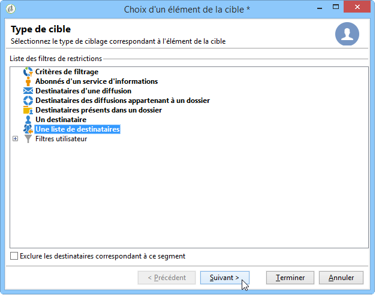

1. Saisissez un nom pour ce ciblage dans le champ **[!UICONTROL Libellé]**. Par défaut, le libellé sera celui correspondant au premier critère de ciblage. En cas de combinaison, il est préférable d&#39;utiliser un nom explicite.
1. Cliquez sur **[!UICONTROL Terminer]** pour valider le ciblage paramétré.

   Les critères de ciblage définis sont résumés dans la section centrale de l&#39;onglet de paramétrage de la cible principale. Cliquez sur un critère pour en visualiser le contenu (paramétrage et aperçu). Cliquez sur la croix située après le libellé d&#39;un critère pour le supprimer.

   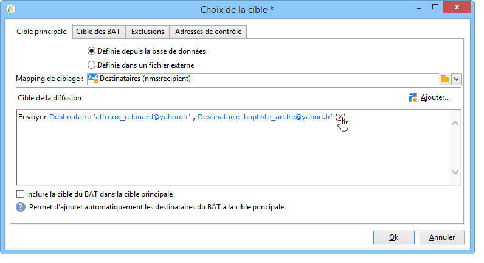

### Sélection de destinataires externes {#selecting-external-recipients}

Vous pouvez choisir de lancer une diffusion sur des destinataires non enregistrés dans la base mais stockés dans un fichier externe. Nous allons par exemple envoyer ici une diffusion à des destinataires importés depuis un fichier texte.

Pour cela :

1. Cliquez sur le lien **[!UICONTROL Pour]** afin de sélectionner les destinataires de la diffusion.
1. Sélectionnez l&#39;option **[!UICONTROL Définie dans un fichier externe]**.

   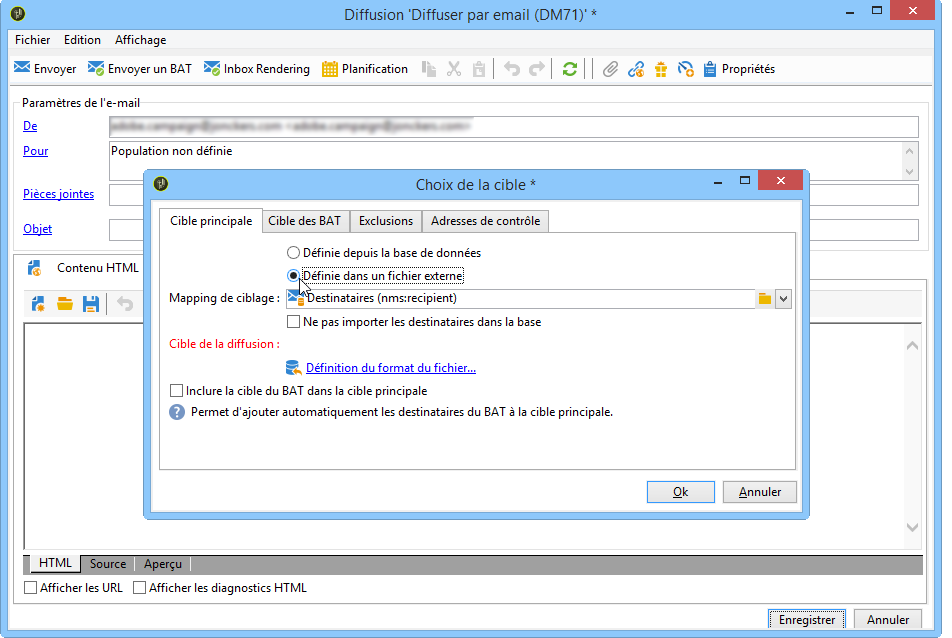

1. Par défaut, les destinataires sont importés dans la base de données. Vous devez sélectionner le **[!UICONTROL Mapping de ciblage]**. Pour plus d’informations sur les mappings de ciblage, consultez la section [Sélection dʼun mapping de ciblage](selecting-a-target-mapping.md).

   Vous pouvez également sélectionner **[!UICONTROL Ne pas importer les destinataires dans la base]**.

1. Lors de l&#39;import des destinataires, cliquez sur le lien **[!UICONTROL Définition du format du fichier...]** pour sélectionner et configurer le fichier externe.

   Pour plus d&#39;informations sur l&#39;import de données, consultez [cette section](../../platform/using/executing-import-jobs.md#step-2---source-file-selection).

1. Cliquez sur **[!UICONTROL Terminer]** et configurez votre diffusion comme une diffusion standard.

>[!CAUTION]
>
>Lors de la définition du contenu du message, pour une diffusion email, vous ne devez pas inclure de lien vers la page miroir : elle ne pourra pas être générée dans ce mode de diffusion.

### Définition des paramètres d’exclusion {#define-exclusion-settings}

Les erreurs sur les adresses ainsi que l&#39;indice de qualité des adresses sont communiqués par le prestataire (FAI). Ces informations sont mises à jour automatiquement dans le profil du destinataire suite aux actions de diffusion et au chargement des fichiers de retour en provenance du prestataire. Elles sont consultables dans le profil, mais ne peuvent être modifiées.

Vous pouvez choisir d&#39;exclure les adresses pour lesquelles un nombre d&#39;erreurs consécutives est atteint, ou dont l&#39;indice de qualité est inférieur au seuil spécifié dans cette fenêtre. Vous pouvez également choisir d&#39;autoriser ou non les adresses non-qualifiées, c&#39;est-à-dire celles pour lesquelles aucune information n&#39;a été remontée.

>[!NOTE]
>
>Si deux destinataires possèdent les mêmes prénom, nom, code postal et ville dans une diffusion courrier, une erreur se produit et le doublon n&#39;est pas pris en compte.

L&#39;onglet **[!UICONTROL Exclusions]** permet de limiter le nombre de messages.

>[!NOTE]
>
>Bien que les paramètres par défaut soient recommandés, vous pouvez adapter les paramètres selon vos besoins. Ces options ne doivent toutefois être modifiées que par un utilisateur expert afin d&#39;éviter toute mauvaise utilisation et erreur.

Cliquez sur le lien **[!UICONTROL Editer]** pour modifier la configuration par défaut.

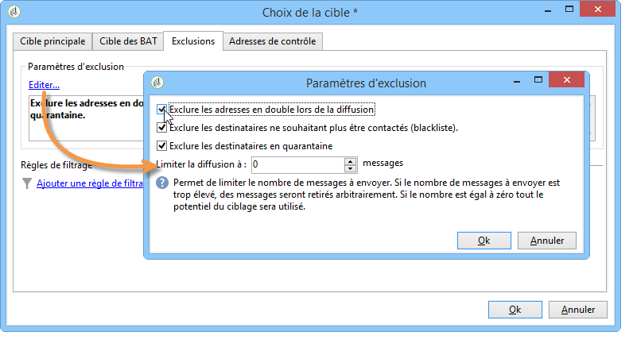

Les options disponibles sont les suivantes :

* **[!UICONTROL Exclure les adresses en double lors de la diffusion]** : cette option, active par défaut, permet d’effectuer un dédoublonnage des adresses email lors de la diffusion. La stratégie adoptée peut être variable en fonction de l’utilisation d’Adobe Campaign et de la nature des données dans la base de données.

   La valeur par défaut de l&#39;option est paramétrable pour chaque modèle de diffusion.

   Par exemple :

   * Diffusion d&#39;une newsletter ou distribution électronique de documents : pas de dédoublonnage, dans certains cas, si les données ne comportent nativement pas de doublons. Un couple s&#39;inscrivant avec la même adresse email pourrait s&#39;attendre à recevoir deux emails spécifiques personnalisés à leurs nom et prénom respectifs. Dans ce cas, cette option peut être décochée.
   * Diffusion d&#39;une campagne marketing : le dédoublonnage est fondamental pour éviter l&#39;envoi d&#39;un trop grand nombre de messages à un même destinataire. Dans ce cas, cette option doit être cochée.

      Si vous décochez cette option, vous avez accès à une option supplémentaire : **[!UICONTROL Conserver les enregistrements ciblés en double (même identifiant)]**. Elle permet d&#39;autoriser des envois multiples vers les destinataires qui correspondent à plusieurs critères de ciblage.

      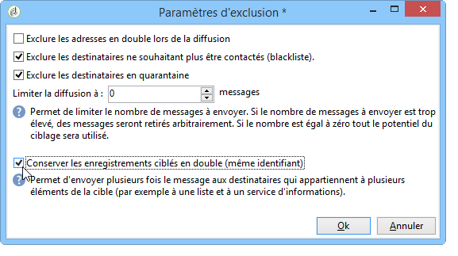

* **[!UICONTROL Exclure les destinataires qui ne veulent plus être contactés]**, c&#39;est-à-dire les destinataires dont les adresses email se trouvent sur une liste bloquée (&#39;opt out&#39;). Cette option doit rester sélectionnée afin de respecter l&#39;éthique professionnelle du e-marketing et les lois régissant le e-commerce.
* **[!UICONTROL Exclure les destinataires en quarantaine]** : cette option permet dʼexclure de la cible les profils dont les adresses ne répondent pas. Il est vivement recommandé de NE PAS décocher cette option.

   >[!NOTE]
   >
   >Pour plus d’informations sur la gestion des quarantaines, consultez la section [Compréhension de la gestion des quarantaines](understanding-quarantine-management.md).

* **[!UICONTROL Limiter la diffusion]** à un nombre donné de messages : cette option permet de saisir le nombre maximal de messages à envoyer. Si le contenu de la cible est supérieur au nombre de messages indiqué, une sélection aléatoire est appliquée sur la cible.

### Réduction de la taille de la population cible {#reducing-the-size-of-the-target-population}

Vous pouvez réduire la taille de la population cible. Pour ce faire, indiquez le nombre de destinataires à exporter dans le champ **[!UICONTROL Quantité demandée]**.

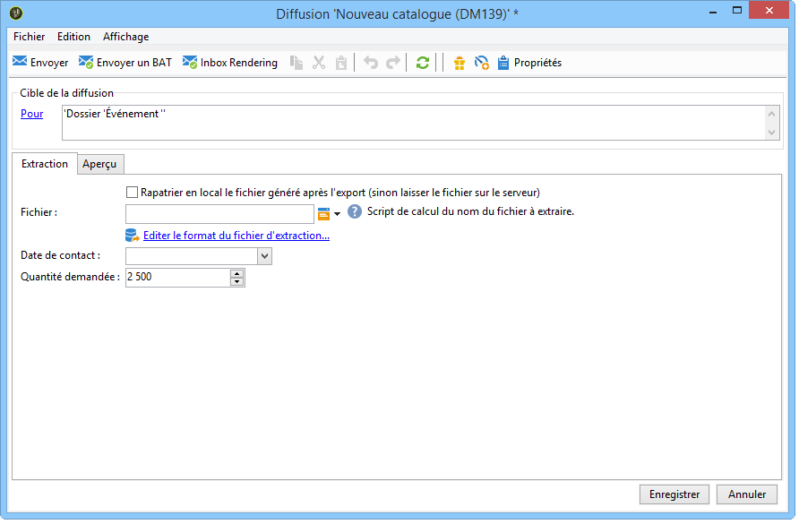

## Sélection des destinataires des messages de BAT {#selecting-the-proof-target}

Le Bon à Tirer (BAT) est un message spécifique qui permet de tester une diffusion avant l&#39;envoi à la cible principale. Les destinataires du BAT sont chargés de la validation du message, tant sur son contenu que sur sa forme.

 [Découvrez cette fonctionnalité en vidéo](#seeds-and-proofs-video)

Pour sélectionner la cible des BAT, procédez comme suit :

1. Cliquez sur le lien **[!UICONTROL Pour]**.
1. Cliquez sur l&#39;onglet **[!UICONTROL Cible des BAT]**.
1. Cliquez sur le champ **[!UICONTROL Mode de ciblage]** pour sélectionner la méthode à appliquer : **[!UICONTROL Définition d&#39;une cible spécifique au BAT]**, **[!UICONTROL Substitution de l&#39;adresse]**, **[!UICONTROL Adresses de contrôle]** ou **[!UICONTROL Cible spécifique et Adresses de contrôle]**.

>[!NOTE]
>
>En règle générale, la cible du BAT peut être ajoutée à la cible principale. Pour cela, cochez l&#39;option correspondante dans la section inférieure de l&#39;onglet **[!UICONTROL Cible principale]**.

## Définition dʼune cible spécifique au BAT {#defining-a-specific-proof-target}

Lorsque vous sélectionnez la cible du BAT, l&#39;option **[!UICONTROL Définition d&#39;une cible spécifique au BAT]** vous permet de sélectionner les destinataires du BAT parmi les profils de la base de données.

Sélectionnez cette option pour choisir les destinataires via le bouton **[!UICONTROL Ajouter]**, comme pour la définition de la cible principale. Pour plus dʼinformations, consultez la section [Sélection de la cible principale](steps-defining-the-target-population.md#selecting-the-main-target).

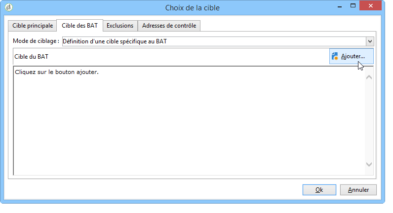

Pour plus d’informations sur l’envoi de BAT, consultez [cette section](steps-validating-the-delivery.md#sending-a-proof).

### Utilisation dʼune substitution de lʼadresse dans le BAT {#using-address-substitution-in-proof}

Au lieu de sélectionner des destinataires dédiés dans la base de données, vous pouvez utiliser l&#39;option **[!UICONTROL Substitution de l&#39;adresse]**.

Cette option permet d&#39;utiliser les profils des destinataires de la diffusion en remplaçant leurs adresses email par une ou plusieurs autres adresses qui recevront le BAT.

Lorsque cette option est sélectionnée, les adresses du BAT sont renseignées via un éditeur spécifique qui permet de paramétrer la ou les substitutions.

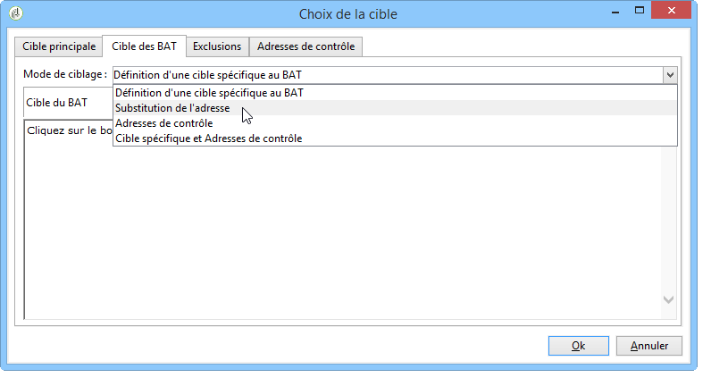

Le mode de paramétrage est le suivant :

1. Cliquez sur l&#39;icône **[!UICONTROL Ajouter]** pour définir une substitution.
1. Saisissez l&#39;adresse du destinataire à utiliser ou sélectionnez-la dans la liste.
1. Sélectionnez le profil à utiliser dans le BAT : conservez la valeur **[!UICONTROL Aléatoire]** dans la colonne **[!UICONTROL Profil à utiliser]** pour utiliser les données de n&#39;importe quel profil de la cible dans le BAT.

   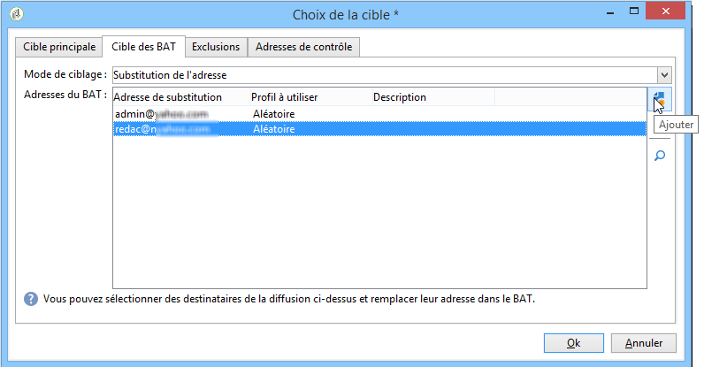

1. Cliquez sur l&#39;icône **[!UICONTROL Détail]** pour sélectionner un profil de la cible principale, comme dans l&#39;exemple ci-dessous :

   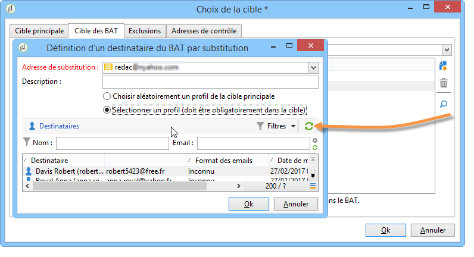

   Vous pouvez définir autant d&#39;adresses de substitution que nécessaire.

## Utilisation des adresses de contrôle en tant que BAT {#using-seed-addresses-as-proof}

Vous pouvez utiliser des **[!UICONTROL Adresses de contrôle]** en tant que cible des BAT : cette option permet d&#39;utiliser ou d&#39;importer une liste d&#39;adresses de contrôle existantes.

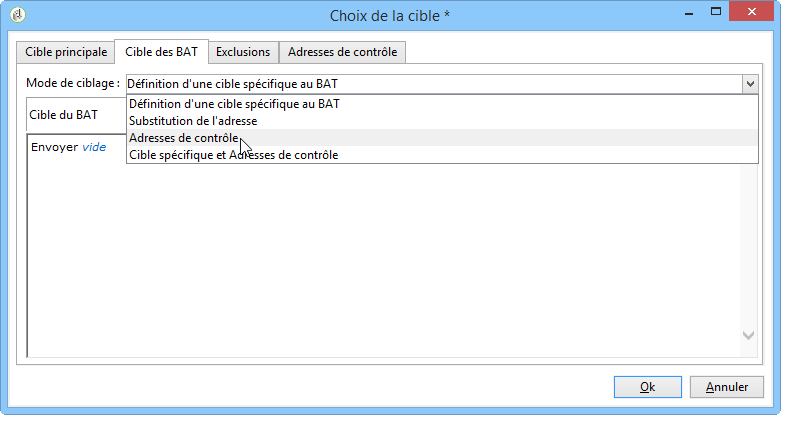

>[!NOTE]
>
>Les adresses de contrôle sont présentées dans la section [À propos des adresses de contrôle](about-seed-addresses.md).

A l&#39;aide de l&#39;option **[!UICONTROL Cible spécifique et Adresses de contrôle]**, vous pouvez cumuler la définition d&#39;une cible spécifique au BAT et l&#39;utilisation des adresses de contrôle. Les paramétrages correspondants sont alors définis dans deux sous-onglets distincts.

Voir aussi :

* [Sélection de la cible du BAT](#selecting-the-proof-target)
* [À propos des adresses de contrôle](about-seed-addresses.md)
* [Cas pratique : sélection des adresses de contrôle selon des critères](use-case--selecting-seed-addresses-on-criteria.md)

## Tutoriel vidéo {#seeds-and-proofs-video}

Dans cette vidéo, vous apprendrez comment ajouter des adresses de contrôle et des BAT à un email existant et comment l’envoyer.

>[!VIDEO](https://video.tv.adobe.com/v/25606?quality=12)

D’autres vidéos pratiques sur Campaign Classic sont disponibles [ici](https://experienceleague.adobe.com/docs/campaign-classic-learn/tutorials/overview.html?lang=fr).
