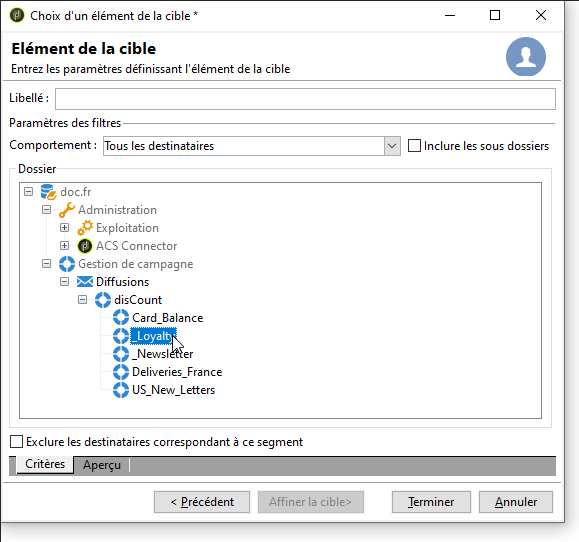
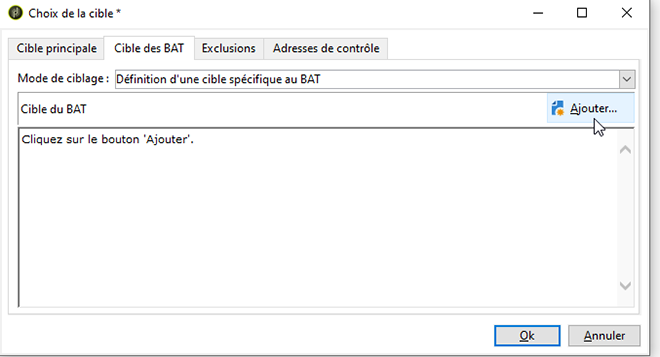

# Définir la population cible {#defining-the-target-population}

## A propos des populations ciblées {#about-target-populations}

Pour chaque diffusion, vous pouvez définir plusieurs types de populations cibles. La section ci-dessous fournit plus d’informations sur la manière de sélectionner :

* **Les principaux destinataires de la remise**. [En savoir plus](../../delivery/using/steps-defining-the-target-population.md#selecting-the-main-target).
* **Destinataires des messages** de preuve, afin de configurer un cycle de validation. [En savoir plus](../../delivery/using/steps-defining-the-target-population.md#defining-a-specific-proof-target).

De plus, vous pouvez également définir des adresses de base et des groupes [de](../../campaign/using/marketing-campaign-deliveries.md#defining-a-control-group)contrôle. si la diffusion est incluse dans une campagne marketing.

## Sélection des principaux destinataires de la remise {#selecting-the-main-target}

Dans la plupart des cas, la cible principale est extraite de la base de données Campaign (mode par défaut).

Les destinataires peuvent également être stockés dans un fichier externe. The configuration of this type of delivery is presented in [Selecting external recipients](../../delivery/using/steps-defining-the-target-population.md#selecting-external-recipients).

Pour sélectionner les destinataires de la diffusion en cours de création, procédez comme suit :

1. Cliquez sur le **[!UICONTROL To]** lien.
1. Si les destinataires sont stockés en base, sélectionnez la première option.

   

1. Sélectionnez le mappage de cible dans la liste **[!UICONTROL Target mapping]** déroulante. Le mappage de cible par défaut d’Adobe Campaign est **[!UICONTROL Recipients]**.

   D’autres mappages de cibles sont disponibles et certains peuvent être liés à votre configuration spécifique. Pour plus d’informations sur les mappages de cibles, voir [Sélection d’un mappage](../../delivery/using/selecting-a-target-mapping.md)de cibles.

1. Click the **[!UICONTROL Add]** button to define restriction filters.

   Vous pouvez alors sélectionner le type de filtrage à appliquer :

   

   Vous pouvez sélectionner des destinataires à l’aide des types de ciblage définis dans la base de données. Pour utiliser un type de cible, sélectionnez-le et cliquez sur **[!UICONTROL Next]**. Pour chaque cible, vous pouvez afficher les destinataires concernés en cliquant sur l’ **[!UICONTROL Preview]** onglet. Pour certains types de cible, le **[!UICONTROL Refine target]** bouton permet de combiner plusieurs critères de ciblage.

   Par défaut, les types de cibles suivants sont proposés :

   * **[!UICONTROL Filtering conditions]** : cette option vous permet de définir une requête et d’afficher le résultat. La méthode de définition des requêtes est présentée dans [cette section](../../platform/using/creating-filters.md#creating-an-advanced-filter).
   * **[!UICONTROL Subscribers of an information service]** : cette option vous permet de sélectionner un bulletin d’information auquel les destinataires doivent s’abonner pour être ciblés par la diffusion en cours de création.

      

   * **[!UICONTROL Recipients of a delivery]** : cette option vous permet de définir les destinataires d’une diffusion existante comme critère de ciblage. Vous devez ensuite sélectionner la diffusion dans la liste :

      

   * **[!UICONTROL Delivery recipients belonging to a folder]** : cette option vous permet de sélectionner un dossier de remise et de cibler les destinataires des livraisons dans ce dossier.

      

      Vous pouvez filtrer sur le comportement des destinataires en le sélectionnant depuis la liste déroulante :

      

      >[!NOTE]
      >
      >The **[!UICONTROL Include sub-folders]** option also lets you target the deliveries contained in folders located in the tree structure below the selected node.

   * **[!UICONTROL Recipients included in a folder]** : cette option vous permet de cibler les profils contenus dans un dossier spécifique de l’arborescence.
   * **[!UICONTROL A recipient]** : cette option vous permet de sélectionner un destinataire spécifique dans les profils de la base de données.
   * **[!UICONTROL A list of recipients]** : cette option vous permet de cibler une liste de destinataires. Les listes sont présentées dans [cette section](../../platform/using/creating-and-managing-lists.md).
   * **[!UICONTROL User filters]** : cette option vous permet d’accéder aux filtres préconfigurés pour les utiliser comme critères de filtrage pour les profils de la base de données. Les filtres préconfigurés sont présentés dans [cette section](../../platform/using/creating-filters.md#saving-a-filter).
   * Cette option **[!UICONTROL Exclude recipients corresponding to this segment]** vous permet de cibler les destinataires qui ne répondent pas aux critères de ciblage définis. Pour utiliser cette option, sélectionnez la zone appropriée, puis appliquez le ciblage, comme défini précédemment, pour exclure les profils résultants.

      

1. Entrez un nom pour ce ciblage dans le **[!UICONTROL Label]** champ. Par défaut, le libellé sera celui du premier critère de ciblage. Pour une combinaison, il est préférable d’utiliser un nom explicite.
1. Click **[!UICONTROL Finish]** to validate the configured targeting.

   Les critères de ciblage définis sont résumés dans la section centrale de l&#39;onglet de paramétrage de la cible principale. Cliquez sur un critère pour en visualiser le contenu (paramétrage et aperçu). Cliquez sur la croix située après le libellé d&#39;un critère pour le supprimer.

   

### Sélectionner les destinataires externes {#selecting-external-recipients}

Vous pouvez choisir de lancer une diffusion sur des destinataires non enregistrés dans la base mais stockés dans un fichier externe. Nous allons par exemple envoyer ici une diffusion à des destinataires importés depuis un fichier texte.

Pour cela :

1. Click the **[!UICONTROL To]** link to select the recipients of your delivery.
1. Select the **[!UICONTROL Defined in an external file]** option.

   

1. Par défaut, les destinataires sont importés dans la base de données. Vous devez sélectionner le **[!UICONTROL Target mapping]**. Pour plus d’informations sur les mappages de cibles, voir [Sélection d’un mappage de cibles.](../../delivery/using/selecting-a-target-mapping.md)

   Vous pouvez également choisir **[!UICONTROL Do not import the recipients into the database]**.

1. When importing the recipients, click the **[!UICONTROL File format definition...]** link to select and configure the external file.

   Pour plus d&#39;informations sur l&#39;import de données, consultez [cette section](../../platform/using/importing-data.md#step-2---source-file-selection).

1. Click **[!UICONTROL Finish]** and configure your delivery as a standard delivery.

>[!CAUTION]
>
>Lors de la définition du contenu du message, pour une diffusion email, vous ne devez pas inclure de lien vers la page miroir : elle ne pourra pas être générée dans ce mode de diffusion.

### Configuration des paramètres d’exclusion {#customizing-exclusion-settings}

Les erreurs sur les adresses ainsi que l&#39;indice de qualité des adresses sont communiqués par le prestataire (FAI). Ces informations sont mises à jour automatiquement dans le profil du destinataire suite aux actions de diffusion et au chargement des fichiers de retour en provenance du prestataire. Elles sont consultables dans le profil, mais ne peuvent être modifiées.

Vous pouvez choisir d&#39;exclure les adresses pour lesquelles un nombre d&#39;erreurs consécutives est atteint, ou dont l&#39;indice de qualité est inférieur au seuil spécifié dans cette fenêtre. Vous pouvez également choisir d&#39;autoriser ou non les adresses non-qualifiées, c&#39;est-à-dire celles pour lesquelles aucune information n&#39;a été remontée.

>[!NOTE]
>
>Si deux destinataires possèdent les mêmes prénom, nom, code postal et ville dans une diffusion courrier, une erreur se produit et le doublon n&#39;est pas pris en compte.

L&#39;onglet **[!UICONTROL Exclusions]** permet de limiter le nombre de messages.

>[!NOTE]
>
>Bien que les paramètres par défaut soient recommandés, vous pouvez adapter les paramètres selon vos besoins. Ces options ne doivent toutefois être modifiées que par un utilisateur expert afin d&#39;éviter toute mauvaise utilisation et erreur.

Click the **[!UICONTROL Edit...]** link to modify the default configuration.

Les options disponibles sont les suivantes :

* **[!UICONTROL Exclude duplicate addresses during delivery]**. Cette option est active par défaut : il vous permet d’éliminer les adresses électroniques en double lors de la remise. La stratégie appliquée peut varier en fonction de l’utilisation d’Adobe Campaign et du type de données dans la base de données.

   La valeur par défaut de l&#39;option est paramétrable pour chaque modèle de diffusion.

   Par exemple :

   * Diffusion d&#39;une newsletter ou distribution électronique de documents : pas de dédoublonnage, dans certains cas, si les données ne comportent nativement pas de doublons. Un couple s&#39;inscrivant avec la même adresse email pourrait s&#39;attendre à recevoir deux emails spécifiques personnalisés à leurs nom et prénom respectifs. Dans ce cas, cette option peut être décochée.
   * Diffusion d&#39;une campagne marketing : le dédoublonnage est fondamental pour éviter l&#39;envoi d&#39;un trop grand nombre de messages à un même destinataire. Dans ce cas, cette option doit être cochée.

      If you unselect this option, you can access an additional option: **[!UICONTROL Keep duplicate records (same identifier)]**. It lets you authorize multiple deliveries to recipients who satisfy several targeting criteria.

      

* **[!UICONTROL Exclude recipients who no longer want to be contacted]** , c&#39;est-à-dire les destinataires dont l&#39;adresse électronique figure sur une liste noire (&quot;exclusion&quot;). Cette option doit rester sélectionnée pour respecter l&#39;éthique professionnelle du e-marketing et les lois régissant le commerce électronique.
* **[!UICONTROL Exclude quarantined recipients]**. Cette option vous permet d’exclure de la cible les profils avec une adresse qui ne répond pas. Nous vous recommandons vivement de conserver cette option sélectionnée.

   >[!NOTE]
   >
   >Pour plus d&#39;informations sur la gestion de la quarantaine, consultez [Présentation de la gestion](../../delivery/using/understanding-quarantine-management.md)de la quarantaine.

* **[!UICONTROL Limit delivery]** à un nombre donné de messages. Cette option vous permet de saisir le nombre maximal de messages à envoyer. Si le contenu de la cible dépasse le nombre de messages indiqué, une sélection aléatoire est appliquée à la cible.

### Réduire la taille de la population cible {#reducing-the-size-of-the-target-population}

Vous pouvez réduire la taille de la population cible. Pour ce faire, indiquez le nombre de destinataires à exporter dans le **[!UICONTROL Requested quantity]** champ.

## Sélection des destinataires des messages de preuve {#selecting-the-proof-target}

Le Bon à Tirer (BAT) est un message spécifique qui permet de tester une diffusion avant l&#39;envoi à la cible principale. Les destinataires du BAT sont chargés de la validation du message, tant sur son contenu que sur sa forme.

Pour sélectionner la cible des BAT, procédez comme suit :

1. Cliquez sur le **[!UICONTROL To]** lien.
1.  Cliquez sur l’ **[!UICONTROL Target of the proofs]** onglet.
1. Cliquez sur le **[!UICONTROL Targeting mode]** champ pour choisir la méthode à appliquer : **[!UICONTROL Definition of a specific proof target]** , **[!UICONTROL Substitution of the address]** , **[!UICONTROL Seed addresses]** ou **[!UICONTROL Specific target and seed addresses]**.

>[!NOTE]
>
>En général, la cible de la preuve peut être ajoutée à la cible principale. Pour ce faire, sélectionnez l’option appropriée dans la section inférieure de l’ **[!UICONTROL Main target]** onglet.

## Définir une cible spécifique au BAT {#defining-a-specific-proof-target}

When selecting the proof target, the **[!UICONTROL Definition of a specific proof target]** option lets you select the proof recipients from the profiles in the database.

Select this option to choose recipients using the **[!UICONTROL Add]** button, as in the case of defining the main target. See [Selecting the main target](../../delivery/using/steps-defining-the-target-population.md#selecting-the-main-target).

For more on proof sending, refer to [this section](../../delivery/using/steps-validating-the-delivery.md#sending-a-proof).

### Utiliser une substitution de l&#39;adresse dans le BAT {#using-address-substitution-in-proof}

Instead of selecting dedicated recipients in the database, you can use the **[!UICONTROL Substitution of the address]** option.

Cette option permet d&#39;utiliser les profils des destinataires de la diffusion en remplaçant leurs adresses email par une ou plusieurs autres adresses qui recevront le BAT.

Lorsque cette option est sélectionnée, les adresses du BAT sont renseignées via un éditeur spécifique qui permet de paramétrer la ou les substitutions.

Le mode de paramétrage est le suivant :

1. Click the **[!UICONTROL Add]** icon to define a substitution.
1. Saisissez l&#39;adresse du destinataire à utiliser ou sélectionnez-la dans la liste.
1. Select the profile to use in the proof: save the **[!UICONTROL Random]** value in the **[!UICONTROL Profile to use]** column to use the data of any profile of the target in the proof.

   

1. Click the **[!UICONTROL Detail]** icon to select a profile from the main target, as in the following example:

   

   Vous pouvez définir autant d&#39;adresses de substitution que nécessaire.

## Utiliser des adresses de contrôle en tant que BAT {#using-seed-addresses-as-proof}

You can use **[!UICONTROL Seed addresses]** as target of the proofs: this option lets you use or import a list of existing seed addresses.

>[!NOTE]
>
>Les adresses de départ sont présentées dans [A propos des adresses](../../delivery/using/about-seed-addresses.md)de départ.

Vous pouvez combiner la définition d’une cible de preuve spécifique et l’utilisation d’adresses de départ à l’aide de l’ **[!UICONTROL Specific target and Seed addresses]** option. Les configurations associées sont ensuite définies dans deux sous-onglets distincts.
