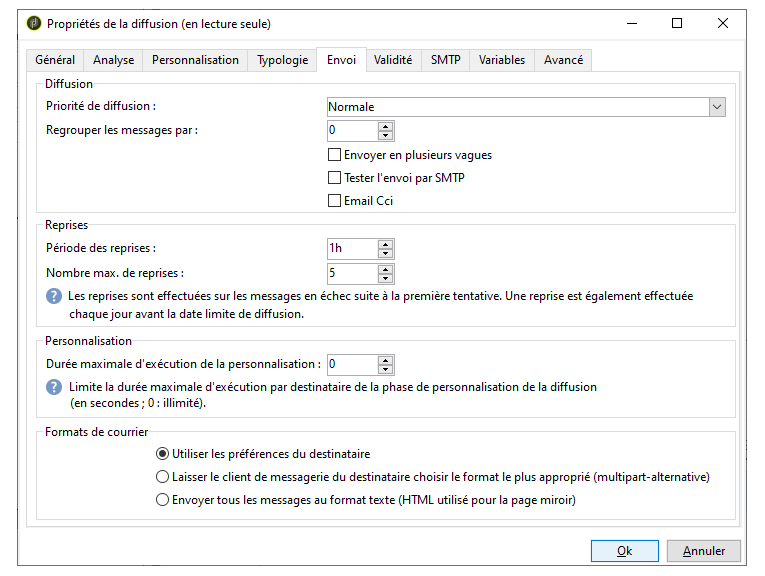

# Configuration et envoi de la diffusion {#configuring-and-sending-the-delivery}

>[!NOTE]
>
>Seul le propriétaire d&#39;une diffusion peut démarrer cette dernière. Pour qu&#39;un autre opérateur (ou un groupe d&#39;opérateurs) puisse démarrer une diffusion, vous devez l&#39;ajouter comme validant au niveau du champ **[!UICONTROL Démarrage de la diffusion]**.
>
>Pour plus d&#39;informations, voir [cette section](../../campaign/using/marketing-campaign-approval.md#selecting-reviewers).

## Livraison de paramètres supplémentaires {#delivery-additiona-parameters}

Avant d&#39;envoyer la diffusion, vous pouvez définir les paramètres d&#39;envoi dans les propriétés de la diffusion, via l&#39;onglet **[!UICONTROL Diffusion]**.

* **[!UICONTROL Priorité]** de remise : Cette option vous permet d&#39;influencer l&#39;ordre d&#39;envoi de vos livraisons en indiquant leur niveau de priorité (normal, élevé ou faible). Vous pouvez ainsi classer par priorité la commande de certaines livraisons plus urgentes que d’autres.

* **[!UICONTROL Quantité]** du lot de messages : Cette option vous permet de définir le nombre de messages regroupés dans le même package de remise XML. Si le paramètre est défini sur 0, les messages sont automatiquement regroupés. La taille du paquet est définie par le calcul `<delivery size>/1024`, avec un minimum de 8 et un maximum de 256 messages par paquet.

   >[!CAUTION]
   >
   >Lorsque la diffusion est dupliquée, le paramètre est remis à zéro.

* **[!UICONTROL Envoyer à l’aide de plusieurs ondes]**: Pour plus d’informations, reportez-vous à la section [Envoi à l’aide de plusieurs ondes](#sending-using-multiple-waves).

* **[!UICONTROL Test de la diffusion]** SMTP : Cette option vous permet de tester l’envoi d’une remise via SMTP. La diffusion est traitée jusqu’à la connexion au serveur SMTP mais n’est pas envoyée.

   >[!NOTE]
   >
   >L&#39;utilisation de cette option est déconseillée dans le cas d&#39;une installation en mid-sourcing afin de ne pas faire appel au mta.
   >
   >Pour plus d&#39;informations sur la configuration d&#39;un serveur SMTP, voir [cette section](../../installation/using/configuring-campaign-server.md#personalizing-delivery-parameters).

* **[!UICONTROL Archiver les courriels]**: Cette option vous permet de stocker des courriers électroniques sur un système externe via BCC en ajoutant simplement une adresse de courriel BCC à votre cible de message. For more on this, refer to [Archiving emails](../../delivery/using/sending-messages.md#archiving-emails).

Une fois la remise configurée et prête à être envoyée, vérifiez que vous avez exécuté l’analyse [de la](../../delivery/using/steps-validating-the-delivery.md#analyzing-the-delivery)remise. Une fois terminé, cliquez sur **[!UICONTROL Confirmer la remise]** pour lancer la remise des messages.

Vous pouvez ensuite fermer l&#39;assistant de diffusion et suivre l&#39;exécution de la diffusion depuis l&#39;onglet **[!UICONTROL Diffusion]** accessible à partir du détail de cette diffusion ou depuis la liste des diffusions.

Une fois les messages envoyés, vous pouvez effectuer le suivi et le tracking des diffusions. Voir à ce sujet les sections suivantes :

* [Contrôler une diffusion](../../delivery/using/monitoring-a-delivery.md)
* [Comprendre les diffusions en échec](../../delivery/using/understanding-delivery-failures.md)
* [A propos du tracking des messages](../../delivery/using/about-message-tracking.md)

## Planifier l&#39;envoi de diffusion {#scheduling-the-delivery-sending}

Vous pouvez différer la diffusion des messages pour planifier l&#39;envoi ou pour gérer la pression commerciale afin de ne pas sur-solliciter une population.

1. Click the **[!UICONTROL Send]** button and select the **[!UICONTROL Postpone delivery]** option.

1. Indiquez une date de démarrage dans le champ **[!UICONTROL Date de contact]**.

1. Vous pouvez ensuite lancer l’analyse de remise, puis confirmer l’envoi de remise. Toutefois, l’envoi de la livraison ne démarrera pas avant la date indiquée dans le champ Date **[!UICONTROL du]** contact.

>[!CAUTION]
>
>Une fois que vous avez lancé l&#39;analyse, la date de contact que vous avez définie est figée. Si vous modifiez cette date, veillez à relancer l&#39;analyse pour que vos modifications soient bien prises en compte.

Dans la liste de diffusion, la remise s’affiche avec l’état **[!UICONTROL En attente]** .

Scheduling can also be configured upstream via the **[!UICONTROL Scheduling]** button of the delivery.

Elle vous permet de différer la diffusion à une date ultérieure ou enregistrer la diffusion dans le calendrier prévisionnel.

* L&#39;option **[!UICONTROL Planifier la diffusion (pas d&#39;exécution automatique)]** permet de planifier une analyse prévisionnelle de la diffusion.

   Lorsque ce paramétrage est enregistré, la diffusion passe alors dans l&#39;état **[!UICONTROL Ciblage en attente]**. L&#39;analyse sera lancée à la date indiquée.

* L&#39;option **[!UICONTROL Planifier la diffusion (exécution automatique à la date prévue)]** permet d&#39;indiquer la date de contact.

   Cliquez sur le bouton **[!UICONTROL Envoyer]** et choisissez **[!UICONTROL Différer la diffusion]** puis lancez l&#39;analyse et confirmez l&#39;envoi. Une fois l&#39;analyse terminée, la cible de la diffusion est prête et les messages seront automatiquement envoyés à la date indiquée.

Les dates et heures sont entendues dans le fuseau horaire de l&#39;opérateur courant. La liste déroulante **[!UICONTROL Fuseau horaire]** située sous la zone de saisie de la date de contact permet d&#39;adapter automatiquement la date et l&#39;heure saisie dans le fuseau horaire sélectionné.

Ainsi, si vous planifiez une diffusion pour qu&#39;elle s&#39;exécute automatiquement à 8h heure de Londres, l&#39;heure est automatiquement convertie dans le fuseau sélectionné :

## Envoyer en plusieurs vagues {#sending-using-multiple-waves}

Pour équilibrer la charge, vous pouvez répartir les envois en plusieurs lots. Configurez le nombre de lots et leur proportion par rapport à l&#39;ensemble de la diffusion.

>[!NOTE]
>
>Vous pouvez uniquement définir la taille et le délai entre deux vagues consécutives. Le critère de sélection des destinataires pour chaque vague n&#39;est pas paramétrable.

1. Ouvrez la fenêtre des propriétés de la diffusion, puis cliquez sur l&#39;onglet **[!UICONTROL Diffusion]**.
1. Sélectionnez l&#39;option **[!UICONTROL Envoyer en plusieurs vagues]**, puis cliquez sur le lien **[!UICONTROL Définition des vagues...]**.

   

1. Pour configurer des vagues, vous pouvez effectuer l&#39;une des opérations suivantes :

   * Définissez la taille de chaque vague. Par exemple, si vous saisissez **[!UICONTROL 30 %]** dans le champ correspondant, chaque vague représentera 30 % des messages inclus dans l&#39;envoi, à l&#39;exception de la dernière vague qui représentera 10 % des messages.

      Dans le champ **[!UICONTROL Période]**, définissez le délai entre le démarrage de deux vagues consécutives. Par exemple, si vous saisissez **[!UICONTROL 2j]**, la première vague démarre immédiatement, la deuxième démarre dans deux jours, la troisième dans quatre jours, etc.

      

   * Définissez un calendrier pour l&#39;envoi de chaque vague.

      Dans la colonne **[!UICONTROL Démarrage]**, indiquez le délai entre le démarrage de deux vagues consécutives. Dans la colonne **[!UICONTROL Taille]**, saisissez un nombre fixe ou un pourcentage.

      Dans l&#39;exemple ci-dessous, la première vague représente 25 % du nombre total des messages inclus dans l&#39;envoi et démarre immédiatement. Les deux vagues suivantes terminent l&#39;envoi et sont définies pour démarrer à six heures d&#39;intervalle.

      
   Une règle de typologie spécifique, la vérification **[!UICONTROL de la planification des]** vagues, garantit que la dernière vague est planifiée avant la limite de validité de la remise. Campaign typologies and their rules, configured in the **[!UICONTROL Typology]** tab of the delivery properties, are presented in [Validation process with typologies](../../delivery/using/steps-validating-the-delivery.md#validation-process-with-typologies).

   >[!CAUTION]
   >
   >Veillez à ce que les dernières vagues ne dépassent pas la date limite d&#39;envoi qui est définie dans l&#39;onglet **[!UICONTROL Validité]**. Sinon, certains messages peuvent ne pas être envoyés.
   >
   >Vous devez également prévoir suffisamment de temps pour les tentatives lors de la configuration des dernières vagues. Reportez-vous à [cette section](../../delivery/using/steps-sending-the-delivery.md#configuring-retries).

1. Pour suivre vos envois, accédez aux logs de diffusion. Voir à ce sujet [cette page](../../delivery/using/monitoring-a-delivery.md#delivery-logs-and-history).

   Vous pouvez visualiser les diffusions qui ont déjà été envoyées dans les vagues traitées (statut **[!UICONTROL Envoyé]**) et celles à envoyer dans les vagues restantes (statut **[!UICONTROL En attente]**).

Les deux exemples ci-dessous constituent les cas d&#39;utilisation les plus fréquents de plusieurs vagues.

* **Lors de la phase de démarrage**

   Lorsque vous envoyez des emails à l&#39;aide d&#39;une nouvelle plate-forme, rien n&#39;est plus suspect pour un FAI (fournisseur d&#39;accès internet) que les adresses IP qui ne sont pas reconnues. Si des emails sont subitement envoyés en masse, le FAI les range souvent dans le courrier indésirable.

   Pour éviter que les emails soient marqués comme spam, vous pouvez augmenter progressivement le volume envoyé à l&#39;aide de vagues. Cela permet d&#39;entamer la phase de démarrage en douceur et de réduire le nombre total d&#39;adresses invalides.

   Pour ce faire, utilisez l&#39;option **[!UICONTROL Planifier les vagues selon un calendrier]**. Par exemple, définissez la première vague sur 10 %, la deuxième sur 15 %, etc.

   

* **Campagnes impliquant un centre d&#39;appels**

   Lorsque vous gérez une campagne téléphonique de fidélisation, votre entreprise a une capacité de traitement des appels limitée pour contacter les abonnés.

   Grâce aux vagues, vous pouvez limiter le nombre des messages à 20 par jour, ce qui correspond à la capacité de traitement quotidien d&#39;un centre d&#39;appels.

   Pour ce faire, sélectionnez l&#39;option **[!UICONTROL Planifier plusieurs vagues de même taille]**. Saisissez **[!UICONTROL 20]** pour la taille de la vague et **[!UICONTROL 1j]** dans le champ **[!UICONTROL Période]**.

   

## Paramétrer les reprises {#configuring-retries}

Les messages temporairement non diffusés en raison d&#39;une erreur **Soft** ou **Ignoré** sont soumis à une nouvelle reprise automatique. Les types et les raisons d&#39;échec de diffusion sont présentés dans cette [section](../../delivery/using/understanding-delivery-failures.md#delivery-failure-types-and-reasons).

La section centrale de l&#39;onglet **[!UICONTROL Envoi]** des paramètres de la diffusion indique combien de reprises doivent être effectuées le premier jour après l&#39;envoi de la diffusion ainsi que le délai minimum entre deux reprises.

Par défaut, cinq nouvelles tentatives sont planifiées pour le premier jour de la livraison avec un intervalle minimum d’une heure réparti sur les 24 heures du jour. One retry per day is programmed after that and until the delivery deadline, which is defined in the **[!UICONTROL Validity]** tab (see [Defining validity period](../../delivery/using/steps-sending-the-delivery.md#defining-validity-period)).

>[!NOTE]
>
>Pour les installations hébergées ou hybrides, si vous avez effectué la mise à niveau vers la MTA améliorée, les paramètres de nouvelle tentative dans la diffusion ne sont plus utilisés par Campaign. Les tentatives de rebonds discrets et la durée entre elles sont déterminées par la MTA améliorée en fonction du type et de la gravité des réponses de rebonds provenant du domaine de courriel du message.
>
>Tous les impacts sont détaillés dans le document MTA [amélioré d’](https://helpx.adobe.com/campaign/kb/campaign-enhanced-mta.html) Adobe Campaign.

## Définir la période de validité {#defining-validity-period}

Une fois la diffusion lancée, les messages (et les éventuelles reprises) peuvent être envoyés jusqu&#39;à la limite de la diffusion. Elle est indiquée dans les propriétés de la diffusion, à partir de l&#39;onglet **[!UICONTROL Validité]**.

* Le champ **[!UICONTROL Durée de diffusion]** permet de saisir la limite pour des reprises globales de diffusion. Concrètement, Adobe Campaign diffuse les messages à partir de la date de lancement. Puis, pour les messages en erreur uniquement, des reprises régulières et paramétrables sont effectuées tant que la limite de diffusion n&#39;est pas atteinte.

   Vous pouvez également choisir de spécifier des dates. Pour cela, cochez l&#39;option **[!UICONTROL Fixer explicitement les dates de validité]**. Dans ce cas, les dates limites de diffusion et de validité permettent de préciser également l&#39;heure. Cette heure correspond par défaut à l&#39;heure courante mais peut être modifiée directement dans le champ de saisie.

* **Limite de validité des ressources**: Le champ Limite **[!UICONTROL de]** validité est utilisé pour les ressources téléchargées, principalement pour la page miroir et les images. Les ressources de cette page ont une durée de validité limitée (afin d&#39;économiser de l&#39;espace disque).

   Dans ce champ, les valeurs peuvent être exprimées dans les unités listées dans [cette section](../../platform/using/adobe-campaign-workspace.md#default-units).

>[!NOTE]
>
>Pour les installations hébergées ou hybrides, si vous avez effectué la mise à niveau vers la MTA améliorée, le paramètre de durée **[!UICONTROL de]** remise dans vos livraisons de campagne ne sera utilisé que si défini sur **3,5** jours ou moins. Si vous définissez une valeur supérieure à 3,5 jours, elle ne sera pas prise en compte.
>
>Tous les impacts sont détaillés dans le document MTA [amélioré d’](https://helpx.adobe.com/campaign/kb/campaign-enhanced-mta.html) Adobe Campaign.
