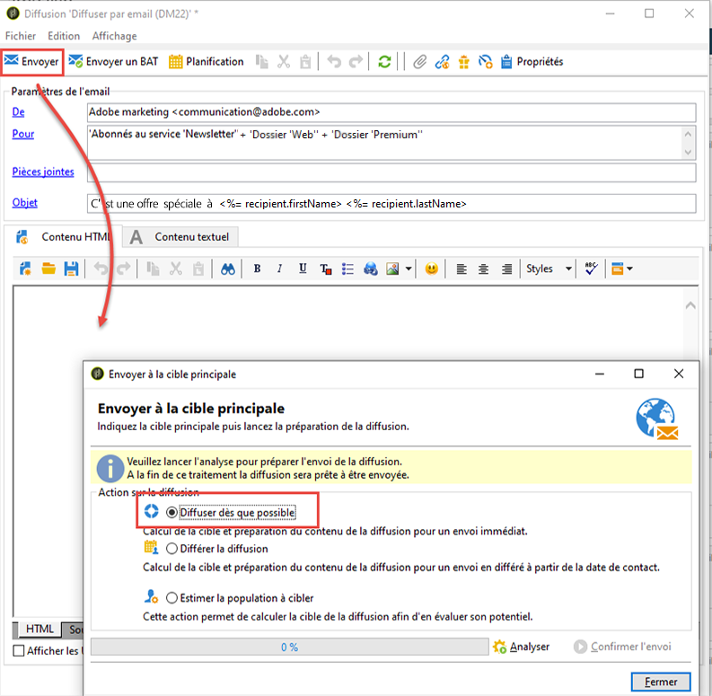

# Configurer et envoyer la diffusion {#configuring-and-sending-the-delivery}

## Autorisations{#delivery-permissions}

Seule la personne propriétaire de la diffusion peut démarrer une diffusion. Pour que d’autres opérateurs (ou groupes d’opérateurs) puissent démarrer une diffusion, ajoutez-les en tant que validants dans le champ **[!UICONTROL Démarrage de la diffusion :]**. [En savoir plus](../../campaign/using/marketing-campaign-approval.md#selecting-reviewers).

## Paramètres supplémentaires de diffusion {#delivery-additiona-parameters}

Avant d’envoyer la diffusion, vous pouvez définir les paramètres d’envoi dans les propriétés de la diffusion, via l’onglet **[!UICONTROL Diffusion]**.

* **[!UICONTROL Priorité de diffusion]** : cette option vous permet de modifier l’ordre d’envoi des diffusions en indiquant leur niveau de priorité (normal, élevé ou faible).

* **[!UICONTROL Nombre de messages groupés]** : cette option permet de définir le nombre de messages regroupés dans un même package d’envoi XML. Si le paramètre est défini sur 0, les messages sont automatiquement regroupés. La taille du paquet est définie par le calcul `<delivery size>/1024`, avec un minimum de 8 messages et un maximum de 256 messages par package.

  >[!IMPORTANT]
  >
  >Lorsque vous créez la diffusion en dupliquant une diffusion existante, vous réinitialisez également ce paramètre.

* **[!UICONTROL Envoyer en plusieurs vagues]** : cette option vous permet d’envoyer vos messages par lots, plutôt qu’à toute votre audience en même temps. [En savoir plus](#sending-using-multiple-waves).

* **[!UICONTROL Tester la diffusion via SMTP]** : cette option vous permet de tester la diffusion par SMTP. La diffusion est traitée jusqu’à la connexion au serveur SMTP mais n’est pas envoyée : pour chaque destinataire de la diffusion, Campaign se connecte au serveur du fournisseur SMTP, exécute la commande SMTP RCPT TO et ferme la connexion avant la commande SMTP DATA.

  >[!NOTE]
  >
  >* Cette option ne doit pas être définie en midsourcing.
  >
  >* Pour en savoir plus sur la configuration du serveur SMTP, voir [cette section](../../installation/using/configure-delivery-settings.md).

* **[!UICONTROL E-mail Cci]** : cette option vous permet de stocker vos e-mails dans un système externe à l’aide de l’option Cci en ajoutant simplement une adresse e-mail à la cible des messages. [En savoir plus](sending-messages.md#archiving-emails).

## Confirmer la diffusion {#confirming-delivery}

Une fois la diffusion paramétrée et prête à être envoyée, effectuez son analyse.

Pour ce faire, cliquez sur **[!UICONTROL Envoyer]**, sélectionnez l’action souhaitée et cliquez sur **[!UICONTROL Analyser]**. [En savoir plus](steps-validating-the-delivery.md#analyzing-the-delivery).

Une fois que vous avez terminé, cliquez sur **[!UICONTROL Confirmer l’envoi]** pour lancer la diffusion des messages.

Vous pouvez ensuite fermer l&#39;assistant de diffusion et suivre l&#39;exécution de la diffusion depuis l&#39;onglet **[!UICONTROL Diffusion]** accessible à partir du détail de cette diffusion ou depuis la liste des diffusions.

Après l&#39;envoi des messages, vous pouvez surveiller et suivre vos diffusions. Pour plus d’informations, consultez les sections suivantes :

* [Surveillance d’une diffusion](about-delivery-monitoring.md)
* [Présentation des diffusions en échec](understanding-delivery-failures.md)
* [À propos du tracking des messages](about-message-tracking.md)

## Planification de lʼenvoi de la diffusion {#scheduling-the-delivery-sending}

Vous pouvez reporter l’envoi du message en planifiant la diffusion.

1. Cliquez sur le bouton **[!UICONTROL Envoyer]** et sélectionnez l’option **[!UICONTROL Différer la diffusion]**.

1. Indiquez une date de démarrage dans le champ **[!UICONTROL Date de contact]**.

1. Vous pouvez ensuite lancer l’analyse de la diffusion, puis confirmer son envoi. Toutefois, cet envoi ne démarrera pas avant la date indiquée dans le champ **[!UICONTROL Date de contact]**.

>[!IMPORTANT]
>
>Une fois l’analyse lancée, la date de contact que vous avez définie est fixe. Si vous modifiez cette date, vous devrez relancer l’analyse afin que vos modifications soient prises en compte.

Dans la liste des diffusions, la diffusion apparaît avec le statut **[!UICONTROL En attente]**.

La planification peut aussi être paramétrée en amont via le bouton **[!UICONTROL Planification]** de la diffusion.

Elle vous permet de différer la diffusion à une date ultérieure ou enregistrer la diffusion dans le calendrier prévisionnel.

* L&#39;option **[!UICONTROL Planifier la diffusion (pas d&#39;exécution automatique)]** permet de planifier une analyse prévisionnelle de la diffusion.

  Lorsque ce paramétrage est enregistré, la diffusion passe alors dans l&#39;état **[!UICONTROL Ciblage en attente]**.L&#39;analyse sera lancée à la date indiquée.

* L&#39;option **[!UICONTROL Planifier la diffusion (exécution automatique à la date prévue)]** permet d&#39;indiquer la date de contact.

  Cliquez sur le bouton **[!UICONTROL Envoyer]** et choisissez **[!UICONTROL Différer la diffusion]** puis lancez l&#39;analyse et confirmez l&#39;envoi. Une fois l&#39;analyse terminée, la cible de la diffusion est prête et les messages seront automatiquement envoyés à la date indiquée.

Les dates et heures sont entendues dans le fuseau horaire de l&#39;opérateur courant. La liste déroulante **[!UICONTROL Fuseau horaire]** située sous la zone de saisie de la date de contact permet d&#39;adapter automatiquement la date et l&#39;heure saisie dans le fuseau horaire sélectionné.

Ainsi, si vous planifiez une diffusion pour qu&#39;elle s&#39;exécute automatiquement à 8h heure de Londres, l&#39;heure est automatiquement convertie dans le fuseau sélectionné :

## Envoi en plusieurs vagues {#sending-using-multiple-waves}

Pour équilibrer la charge, vous pouvez répartir les envois en plusieurs lots. Configurez le nombre de lots et leur proportion par rapport à l&#39;ensemble de la diffusion.

>[!NOTE]
>
>Vous pouvez uniquement définir la taille et le délai entre deux vagues consécutives. Le critère de sélection des destinataires pour chaque vague n&#39;est pas paramétrable.

1. Ouvrez la fenêtre des propriétés de la diffusion, puis cliquez sur l&#39;onglet **[!UICONTROL Diffusion]**.
1. Sélectionnez l&#39;option **[!UICONTROL Envoyer en plusieurs vagues]**, puis cliquez sur le lien **[!UICONTROL Définition des vagues...]**.

   

1. Pour configurer des vagues, vous pouvez effectuer l&#39;une des opérations suivantes :

   * Définissez la taille de chaque vague. Par exemple, si vous saisissez **[!UICONTROL 30 %]** dans le champ correspondant, chaque vague représentera 30 % des messages inclus dans l’envoi, à l’exception de la dernière vague qui représentera 10 % des messages.

     Dans le champ **[!UICONTROL Période]**, définissez le délai entre le démarrage de deux vagues consécutives. Par exemple, si vous saisissez **[!UICONTROL 2 j]**, la première vague démarre immédiatement, la deuxième démarre dans deux jours, la troisième dans quatre jours, etc.

     

   * Définissez un calendrier pour l&#39;envoi de chaque vague.

     Dans la colonne **[!UICONTROL Début]**, indiquez le délai entre le démarrage de deux vagues consécutives. Dans la colonne **[!UICONTROL Taille]**, saisissez un nombre fixe ou un pourcentage.

     Dans l’exemple ci-dessous, la première vague représente 25 % du nombre total des messages inclus dans l’envoi et démarre immédiatement. Les deux vagues suivantes terminent l’envoi et sont définies pour démarrer à six heures d’intervalle.

     

   Une règle de typologie spécifique, la **[!UICONTROL Vérification de la planification des vagues]**, garantit que la dernière vague est planifiée avant la limite de validité de la diffusion. Les typologies de campagne et leurs règles, paramétrées dans l’onglet **[!UICONTROL Typologie]** des propriétés d’une diffusion, sont présentées dans la section [Processus de validation avec des typologies](steps-validating-the-delivery.md#validation-process-with-typologies).

   >[!IMPORTANT]
   >
   >Veillez à ce que les dernières vagues ne dépassent pas la date limite d&#39;envoi qui est définie dans l&#39;onglet **[!UICONTROL Validité]**.Sinon, certains messages peuvent ne pas être envoyés.
   >
   >Lors de la configuration des dernières vagues, veillez également à prévoir assez de temps pour les reprises. Consultez [cette section](steps-sending-the-delivery.md#configuring-retries).

1. Pour suivre vos envois, accédez aux logs de diffusion. Voir [cette page](delivery-dashboard.md#delivery-logs-and-history).

   Vous pouvez visualiser les diffusions qui ont déjà été envoyées dans les vagues traitées (statut **[!UICONTROL Envoyé]**) et celles à envoyer dans les vagues restantes (statut **[!UICONTROL En attente]**).

Les deux exemples ci-dessous constituent les cas d&#39;utilisation les plus fréquents de plusieurs vagues.

* **Lors de la phase de démarrage**

  Lorsque vous envoyez des emails à l&#39;aide d&#39;une nouvelle plateforme, rien n&#39;est plus suspect pour un FAI (fournisseur d&#39;accès internet) que les adresses IP qui ne sont pas reconnues. Si des emails sont subitement envoyés en masse, le FAI les range souvent dans le courrier indésirable.

  Pour éviter que les emails soient marqués comme spam, vous pouvez augmenter progressivement le volume envoyé à l&#39;aide de vagues. Cela permet d&#39;entamer la phase de démarrage en douceur et de réduire le nombre total d&#39;adresses invalides.

  Pour ce faire, utilisez l’option **[!UICONTROL Planifier les vagues selon un calendrier]**. Par exemple, définissez la première vague sur 10 %, la deuxième sur 15 %, etc.

  

* **Campagnes impliquant un centre d&#39;appels**

  Lors de la gestion d’une campagne de fidélité par téléphone, votre entreprise dispose d’une capacité limitée de traitement du nombre d’appels pour contacter les abonnés.

  Grâce aux vagues, vous pouvez limiter le nombre de messages à 20 par jour, en tenant compte par exemple de la capacité de traitement quotidien d&#39;un centre d&#39;appels.

  Pour ce faire, sélectionnez l’option **[!UICONTROL Planification de plusieurs vagues de même taille]**. Saisissez **[!UICONTROL 20]** comme taille de vague et **[!UICONTROL 1 j]** dans le champ **[!UICONTROL Période]**.

  

## Configuration des reprises {#configuring-retries}

Les messages temporairement non diffusés en raison d&#39;une erreur **Soft** ou **Ignoré** sont soumis à une nouvelle reprise automatique. Les types et les raisons d&#39;échec de diffusion sont présentés dans cette [section](understanding-delivery-failures.md#delivery-failure-types-and-reasons).

>[!IMPORTANT]
>
>Pour les installations hébergées ou hybrides, si vous avez effectué une mise à niveau vers le [MTA amélioré](sending-with-enhanced-mta.md), les paramètres de reprise de la diffusion ne sont plus utilisés par Campaign. Les reprises des rebonds temporaires et l’intervalle qui les sépare sont déterminés par le MTA amélioré en fonction du type et de la gravité des réponses des rebonds provenant du domaine de messagerie du message.

Pour les installations on-premise et les installations hébergées/hybrides utilisant l’ancien MTA de Campaign, la section centrale de l’onglet **[!UICONTROL Diffusion]** pour les paramètres de diffusion indique le nombre de reprises à effectuer le lendemain de la diffusion et le délai minimal entre celles-ci.

Par défaut, cinq reprises sont planifiées le premier jour de l’envoi, avec un intervalle minimum d’une heure, réparties sur les 24h de la journée. Les jours suivants, une reprise par jour est programmée jusquʼà la date limite de la diffusion, définie dans lʼonglet **[!UICONTROL Validité]**. Consultez la section [Définition de la période de validité](#defining-validity-period).

## Définition de la période de validité {#defining-validity-period}

Une fois la diffusion lancée, les messages (et les éventuelles reprises) peuvent être envoyés jusqu&#39;à la limite de la diffusion. Elle est indiquée dans les propriétés de la diffusion, à partir de l&#39;onglet **[!UICONTROL Validité]**.

* Le champ **[!UICONTROL Durée de diffusion]** permet de saisir la limite pour des reprises globales de diffusion. Concrètement, Adobe Campaign diffuse les messages à partir de la date de lancement. Puis, pour les messages en erreur uniquement, des reprises régulières et paramétrables sont effectuées tant que la limite de diffusion n’est pas atteinte.

  Vous pouvez également choisir de spécifier des dates. Pour ce faire, sélectionnez **[!UICONTROL Fixer explicitement les dates de validité]**. Dans ce cas, les dates limites de diffusion et de validité permettent également de définir l’heure. L’heure actuelle est utilisée par défaut, mais vous pouvez la modifier directement dans le champ de saisie.

  >[!IMPORTANT]
  >
  >Pour les installations hébergées ou hybrides, si vous avez effectué une mise à niveau vers le [MTA amélioré](sending-with-enhanced-mta.md), le paramètre **[!UICONTROL Durée de diffusion]** des diffusions Campaign ne sera utilisé que s’il est défini sur **3,5 jours ou moins**. Si vous définissez une valeur supérieure à 3,5 jours, elle ne sera pas prise en compte.

* **Limite de validité des ressources** : le champ **[!UICONTROL Limite de validité]** est utilisé pour les ressources téléchargées, principalement pour la page miroir et les images. Les ressources de cette page ont une durée de validité limitée (afin d&#39;économiser de l&#39;espace disque).

  Dans ce champ, les valeurs peuvent être exprimées dans les unités listées dans [cette section](../../platform/using/adobe-campaign-workspace.md#default-units).
