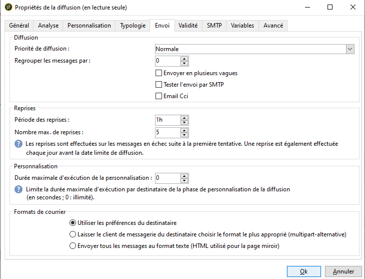
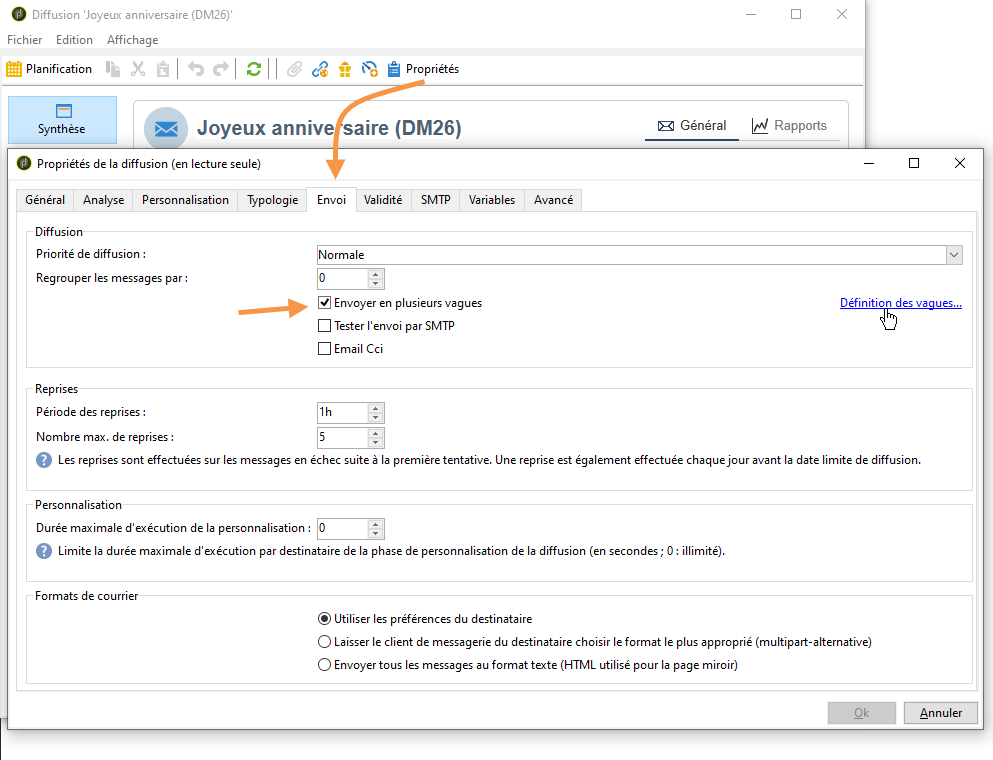

# Configuration et envoi de la diffusion {#configuring-and-sending-the-delivery}

>[!NOTE]
>
>Seul le propriétaire de la remise peut lancer une livraison. Pour qu’un autre opérateur (ou groupe d’opérateurs) puisse démarrer une diffusion, vous devez les ajouter en tant que réviseurs dans le **[!UICONTROL Delivery start:]** champ.
>
>Pour plus d&#39;informations, voir [cette section](../../campaign/using/marketing-campaign-approval.md#selecting-reviewers).

## Livraison de paramètres supplémentaires {#delivery-additiona-parameters}

Before sending the delivery, you can define the sending parameters in the delivery properties, via the **[!UICONTROL Delivery]** tab.

* **[!UICONTROL Delivery priority]**: Cette option vous permet d&#39;influencer l&#39;ordre d&#39;envoi de vos diffusions en indiquant leur niveau de priorité (normale, haute ou basse). Cela vous permet de privilégier l&#39;envoi de certaines diffusions plus urgentes que d&#39;autres.

* **[!UICONTROL Message batch quantity]**: Cette option permet de définir le nombre de messages regroupés au sein d&#39;un même paquet d&#39;envoi XML. Si le paramètre est défini sur 0, les messages sont automatiquement regroupés. La taille du paquet est définie par le calcul `<delivery size>/1024`, avec un minimum de 8 et un maximum de 256 messages par paquet.

   >[!CAUTION]
   >
   >Lorsque la diffusion est dupliquée, le paramètre est remis à zéro.

* **[!UICONTROL Send using multiple waves]**: Pour plus d’informations, reportez-vous à la section [Envoi à l’aide de plusieurs ondes](#sending-using-multiple-waves).

* **[!UICONTROL Test SMTP delivery]**: Cette option vous permet de tester l&#39;envoi de la diffusion par SMTP. La diffusion est traitée jusqu&#39;à la connexion au serveur SMTP mais n&#39;est pas envoyée.

   >[!NOTE]
   >
   >L&#39;utilisation de cette option est déconseillée dans le cas d&#39;une installation en mid-sourcing afin de ne pas faire appel au mta.
   >
   >Pour plus d&#39;informations sur la configuration d&#39;un serveur SMTP, voir [cette section](../../installation/using/configuring-campaign-server.md#personalizing-delivery-parameters).

* **[!UICONTROL Archive emails]**: Cette option vous permet de stocker des courriers électroniques sur un système externe via BCC en ajoutant simplement une adresse de courriel BCC à votre cible de message. For more on this, refer to [Archiving emails](../../delivery/using/sending-messages.md#archiving-emails).

Une fois la remise configurée et prête à être envoyée, vérifiez que vous avez exécuté l’analyse [de la](../../delivery/using/steps-validating-the-delivery.md#analyzing-the-delivery)remise. Une fois terminé, cliquez sur **[!UICONTROL Confirm delivery]** pour lancer la remise des messages.

You can then close the delivery wizard and track the execution of the delivery from the **[!UICONTROL Delivery]** tab, accessible via the detail of this delivery or via the list of deliveries.

Une fois les messages envoyés, vous pouvez effectuer le suivi et le tracking des diffusions. Voir à ce sujet les sections suivantes :

* [Contrôler une diffusion](../../delivery/using/monitoring-a-delivery.md)
* [Comprendre les diffusions en échec](../../delivery/using/understanding-delivery-failures.md)
* [A propos du tracking des messages](../../delivery/using/about-message-tracking.md)

## Planifier l&#39;envoi de diffusion {#scheduling-the-delivery-sending}

Vous pouvez différer la diffusion des messages pour planifier l&#39;envoi ou pour gérer la pression commerciale afin de ne pas sur-solliciter une population.

1. Cliquez sur le **[!UICONTROL Send]** bouton et sélectionnez l’ **[!UICONTROL Postpone delivery]** option.

1. Specify a start date in the **[!UICONTROL Contact date]** field.

1. Vous pouvez ensuite lancer l’analyse de remise, puis confirmer l’envoi de remise. Toutefois, l’envoi de la livraison ne commencera pas avant la date indiquée dans le **[!UICONTROL Contact date]** champ.

>[!CAUTION]
>
>Une fois que vous avez lancé l&#39;analyse, la date de contact que vous avez définie est figée. Si vous modifiez cette date, veillez à relancer l&#39;analyse pour que vos modifications soient bien prises en compte.

Dans la liste de diffusion, la remise s’affiche avec **[!UICONTROL Pending]** l’état.

Scheduling can also be configured upstream via the **[!UICONTROL Scheduling]** button of the delivery.

Elle vous permet de différer la diffusion à une date ultérieure ou enregistrer la diffusion dans le calendrier prévisionnel.

* Cette **[!UICONTROL Schedule delivery (no automatic execution)]** option vous permet de planifier une analyse provisoire de la remise.

   Lorsque cette configuration est enregistrée, la remise devient **[!UICONTROL Targeting pending]** état. L&#39;analyse sera lancée à la date spécifiée.

* L’ **[!UICONTROL Schedule delivery (automatic execution on planned date)]** option vous permet de spécifier la date de livraison.

   Cliquez sur **[!UICONTROL Send]** puis sélectionnez **[!UICONTROL Postpone delivery]** puis lancez l’analyse et confirmez la remise. Une fois l’analyse terminée, la cible de remise est prête et les messages sont automatiquement envoyés à la date spécifiée.

Les dates et heures sont exprimées dans le fuseau horaire de l’opérateur actuel. La liste **[!UICONTROL Time zone]** déroulante située sous le champ de saisie de date de contact vous permet de convertir automatiquement la date et l’heure saisies dans le fuseau horaire sélectionné.

Ainsi, si vous planifiez une diffusion pour qu&#39;elle s&#39;exécute automatiquement à 8h heure de Londres, l&#39;heure est automatiquement convertie dans le fuseau sélectionné :

## Envoyer en plusieurs vagues {#sending-using-multiple-waves}

Pour équilibrer la charge, vous pouvez répartir les envois en plusieurs lots. Configurez le nombre de lots et leur proportion par rapport à l&#39;ensemble de la diffusion.

>[!NOTE]
>
>Vous pouvez uniquement définir la taille et le délai entre deux vagues consécutives. Le critère de sélection des destinataires pour chaque vague n&#39;est pas paramétrable.

1. Open the delivery properties window and click the **[!UICONTROL Delivery]** tab.
1. Sélectionnez l’ **[!UICONTROL Send using multiple waves]** option et cliquez sur le **[!UICONTROL Define waves...]** lien.

   

1. Pour configurer des vagues, vous pouvez effectuer l&#39;une des opérations suivantes :

   * Définissez la taille de chaque onde. For example, if you enter **[!UICONTROL 30%]** in the corresponding field, each wave will represent 30% of the messages included in the delivery, except the last one, which will represent 10% of the messages.

      Dans le **[!UICONTROL Period]** champ, spécifiez le délai entre le début de deux vagues consécutives. Par exemple, si vous entrez **[!UICONTROL 2d]**, la première vague démarre immédiatement, la deuxième vague commence dans deux jours, la troisième vague dans quatre jours, etc.

      

   * Définissez un calendrier pour l&#39;envoi de chaque vague.

      Dans la **[!UICONTROL Start]** colonne, spécifiez le délai entre le début de deux vagues consécutives. Dans la **[!UICONTROL Size]** colonne, entrez un nombre fixe ou un pourcentage.

      Dans l&#39;exemple ci-dessous, la première vague représente 25 % du nombre total des messages inclus dans l&#39;envoi et démarre immédiatement. Les deux vagues suivantes terminent l&#39;envoi et sont définies pour démarrer à six heures d&#39;intervalle.

      
   Une règle de typologie spécifique **[!UICONTROL Wave scheduling check]**, garantit que la dernière vague est planifiée avant la limite de validité de la diffusion. Campaign typologies and their rules, configured in the **[!UICONTROL Typology]** tab of the delivery properties, are presented in [Validation process with typologies](../../delivery/using/steps-validating-the-delivery.md#validation-process-with-typologies).

   >[!CAUTION]
   >
   >Veillez à ce que les dernières vagues ne dépassent pas le délai de livraison défini dans l’ **[!UICONTROL Validity]** onglet. Dans le cas contraire, certains messages peuvent ne pas être envoyés.
   >
   >Vous devez également prévoir suffisamment de temps pour les tentatives lors de la configuration des dernières vagues. Reportez-vous à [cette section](../../delivery/using/steps-sending-the-delivery.md#configuring-retries).

1. Pour suivre vos envois, accédez aux logs de diffusion. Voir à ce sujet [cette page](../../delivery/using/monitoring-a-delivery.md#delivery-logs-and-history).

   You can see the deliveries that were already sent in the processed waves (**[!UICONTROL Sent]** status) and the deliveries to be sent in the remaining waves (**[!UICONTROL Pending]** status).

Les deux exemples ci-dessous constituent les cas d&#39;utilisation les plus fréquents de plusieurs vagues.

* **Lors de la phase de démarrage**

   Lorsque vous envoyez des emails à l&#39;aide d&#39;une nouvelle plate-forme, rien n&#39;est plus suspect pour un FAI (fournisseur d&#39;accès internet) que les adresses IP qui ne sont pas reconnues. Si des emails sont subitement envoyés en masse, le FAI les range souvent dans le courrier indésirable.

   Pour éviter que les emails soient marqués comme spam, vous pouvez augmenter progressivement le volume envoyé à l&#39;aide de vagues. Cela permet d&#39;entamer la phase de démarrage en douceur et de réduire le nombre total d&#39;adresses invalides.

   Pour ce faire, utilisez l’ **[!UICONTROL Schedule waves according to a calendar]** option. Par exemple, définissez la première vague sur 10 %, la seconde sur 15 %, etc.

   

* **Campagnes impliquant un centre d&#39;appels**

   Lorsque vous gérez une campagne téléphonique de fidélisation, votre entreprise a une capacité de traitement des appels limitée pour contacter les abonnés.

   Grâce aux vagues, vous pouvez limiter le nombre des messages à 20 par jour, ce qui correspond à la capacité de traitement quotidien d&#39;un centre d&#39;appels.

   To do this, select the **[!UICONTROL Schedule multiple waves of the same size]** option. Entrez **[!UICONTROL 20]** la taille de l’onde et **[!UICONTROL 1d]** dans le **[!UICONTROL Period]** champ.

   

## Paramétrer les reprises {#configuring-retries}

Les messages temporairement non diffusés en raison d&#39;une erreur **Soft** ou **Ignoré** sont soumis à une nouvelle reprise automatique. Les types et les raisons d&#39;échec de diffusion sont présentés dans cette [section](../../delivery/using/understanding-delivery-failures.md#delivery-failure-types-and-reasons).

The central section of the **[!UICONTROL Delivery]** tab for delivery parameters indicates how many retries should be performed the day after the delivery and the minimum delay between retries.

Par défaut, cinq nouvelles tentatives sont planifiées pour le premier jour de la livraison avec un intervalle minimum d’une heure réparti sur les 24 heures du jour. One retry per day is programmed after that and until the delivery deadline, which is defined in the **[!UICONTROL Validity]** tab (see [Defining validity period](../../delivery/using/steps-sending-the-delivery.md#defining-validity-period)).

>[!NOTE]
>
>Pour les installations hébergées ou hybrides, si vous avez effectué la mise à niveau vers la MTA améliorée, les paramètres de nouvelle tentative dans la diffusion ne sont plus utilisés par Campaign. Les tentatives de rebonds discrets et la durée entre elles sont déterminées par la MTA améliorée en fonction du type et de la gravité des réponses de rebonds provenant du domaine de courriel du message.
>
>Tous les impacts sont détaillés dans le document MTA [amélioré d’](https://helpx.adobe.com/campaign/kb/campaign-enhanced-mta.html) Adobe Campaign.

## Définir la période de validité {#defining-validity-period}

Une fois la remise lancée, les messages (et les tentatives éventuelles) peuvent être envoyés jusqu’à la date limite de remise. Ceci est indiqué dans les propriétés de diffusion, via l’ **[!UICONTROL Validity]** onglet.

* Le **[!UICONTROL Delivery duration]** champ vous permet d’entrer la limite pour les tentatives de remise globales. Cela signifie qu’Adobe Campaign envoie les messages à partir de la date de début, puis, pour les messages renvoyant une erreur uniquement, des tentatives configurables régulières sont effectuées jusqu’à ce que la limite de validité soit atteinte.

   Vous pouvez également choisir de spécifier des dates. Pour ce faire, sélectionnez **[!UICONTROL Explicitly set validity dates]**. Dans ce cas, les dates limites de remise et de validité vous permettent également de spécifier l’heure. L’heure actuelle est utilisée par défaut, mais vous pouvez la modifier directement dans le champ de saisie.

* **Limite de validité des ressources**: Le **[!UICONTROL Validity limit]** champ est utilisé pour les ressources téléchargées, principalement pour la page miroir et les images. Les ressources de cette page ont une durée de validité limitée (afin d&#39;économiser de l&#39;espace disque).

   Dans ce champ, les valeurs peuvent être exprimées dans les unités listées dans [cette section](../../platform/using/adobe-campaign-workspace.md#default-units).

>[!NOTE]
>
>Pour les installations hébergées ou hybrides, si vous avez effectué la mise à niveau vers la MTA améliorée, le **[!UICONTROL Delivery duration]** paramètre de vos livraisons de campagne ne sera utilisé que si défini sur **3,5** jours ou moins. Si vous définissez une valeur supérieure à 3,5 jours, elle ne sera pas prise en compte.
>
>Tous les impacts sont détaillés dans le document MTA [amélioré d’](https://helpx.adobe.com/campaign/kb/campaign-enhanced-mta.html) Adobe Campaign.
