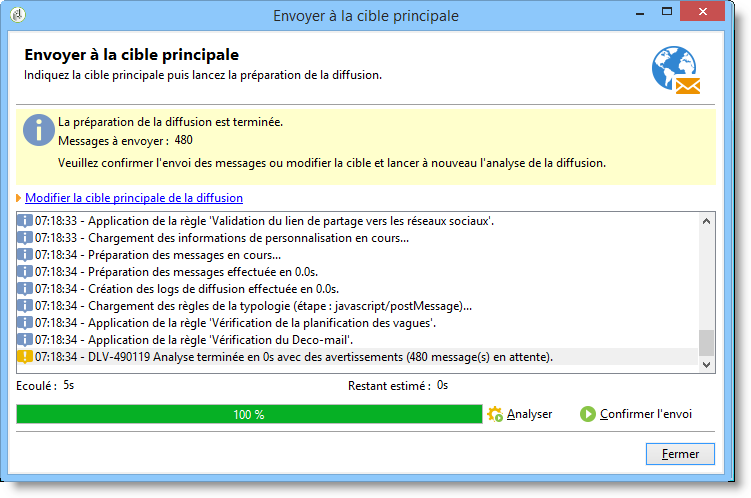

# Valider la diffusion {#validating-the-delivery}

Une fois la diffusion créée et paramétrée, vous devez la valider avant de l&#39;envoyer à la cible principale.

Pour cela :

1. **Analyser la diffusion**: cette étape vous permet de préparer les messages à diffuser. Reportez-vous à [Analyse de la diffusion](#analyzing-the-delivery).

   Les modes de validation disponibles sont détaillés dans [Modification du mode](../../delivery/using/steps-validating-the-delivery.md#changing-the-approval-mode)d’approbation.

1. **Envoyer des preuves**: cette étape vous permet d’approuver le contenu, les URL, les champs de personnalisation, etc. Reportez-vous aux sections [Envoi d’une preuve](../../delivery/using/steps-validating-the-delivery.md#sending-a-proof) et [Définition d’une cible](../../delivery/using/steps-defining-the-target-population.md#defining-a-specific-proof-target)de preuve spécifique.

>[!CAUTION]
>
>Ces deux étapes sont nécessaires et doivent être reproduites après chaque modification du contenu des messages.

## Analyser la diffusion {#analyzing-the-delivery}

L’analyse est l’étape au cours de laquelle la population cible est calculée et le contenu de la diffusion préparé. Une fois la livraison terminée, elle est prête à être envoyée. Pour lancer l’analyse de remise, cliquez sur **[!UICONTROL Envoyer]**, puis sélectionnez **[!UICONTROL Livrer le plus tôt possible]**.

Le bouton **[!UICONTROL Analyser]** permet de lancer manuellement l&#39;analyse. La barre de progression permet de visualiser l&#39;état d&#39;avancement de l&#39;analyse. La section inférieure de la fenêtre affiche le résultat de l&#39;analyse. Les avertissements sont signalés par des icônes spécifiques.

>[!NOTE]
>
>Les règles de validation sont décrites dans le processus de [validation avec des typologies](../../delivery/using/steps-validating-the-delivery.md#validation-process-with-typologies).

Vous pouvez arrêter à tout moment cette opération via le bouton **[!UICONTROL Arrêter]**.

Pendant la phase d&#39;analyse, aucun message n&#39;est envoyé. Vous pouvez donc lancer ou annuler cette opération sans aucun risque.

>[!CAUTION]
>
>L&#39;analyse fige la diffusion (ou le BAT) à l&#39;instant de l&#39;analyse. Toute modification sur la diffusion (ou le BAT) doit être suivie d&#39;une nouvelle analyse pour être prise en compte.

Le dernier message de logs affiche les erreurs éventuelles et leur nombre. Une icône spécifique permet de visualiser le type d&#39;erreur rencontrée : l&#39;icône jaune indique une erreur de traitement non bloquante, l&#39;icône rouge indique une erreur qui empêche le lancement de la diffusion.

Cliquez sur **[!UICONTROL Fermer]** pour corriger les erreurs. Une fois les modifications effectuées, vous devez relancer l&#39;analyse.

Vérifiez le résultat de l&#39;analyse avant de cliquer sur le bouton **[!UICONTROL Confirmer l&#39;envoi]** pour envoyer les messages à la cible spécifiée. Un message de confirmation vous permet de lancer la diffusion.

>[!NOTE]
>
>Cliquez sur le lien **[!UICONTROL Modifier la cible principale de la diffusion]** si le nombre de messages à envoyer ne correspond pas à votre paramétrage. Vous pourrez alors modifier la définition de la population ciblée et relancer l&#39;analyse.

L&#39;onglet **[!UICONTROL Analyse]** des paramètres de la diffusion permet de définir un ensemble d&#39;informations relatives à la préparation des messages lors de la phase d&#39;analyse.

Cet onglet permet d&#39;accéder aux options suivantes :

* **[!UICONTROL Libellé et code de diffusion]** : les options relatives à cette section de l&#39;écran permettent de calculer les valeurs de ces champs lors de la phase d&#39;analyse de la diffusion. Le champ **[!UICONTROL Calculer le dossier d&#39;exécution lors de l&#39;analyse]** permet de calculer le nom du dossier qui contiendra cette action de diffusion lors de la phase d&#39;analyse.
* **[!UICONTROL Mode]** d&#39;approbation : ce champ vous permet de sélectionner le type d’approbation de remise. Les modes d’approbation sont présentés dans le processus de [validation avec des typologies](../../delivery/using/steps-validating-the-delivery.md#validation-process-with-typologies).
* **[!UICONTROL Préparer les données de personnalisation avec un workflow]** : cette option permet de préparer les données de personnalisation contenues dans votre diffusion dans un workflow automatique. Elle améliore nettement les performances de l&#39;analyse de la diffusion lorsqu&#39;une grande quantité de données est traitée, notamment si les données de personnalisation sont issues d&#39;une table externe via FDA. Voir à ce propos la section [Accéder à une base externe (FDA)](../../platform/using/additional-options.md#optimizing-email-personalization-with-external-data).
* **[!UICONTROL Lancer le traitement dans un processus détaché]** : cette option permet de lancer l&#39;analyse de la diffusion dans un processus à part. Par défaut, la fonction d&#39;analyse utilise le processus du serveur applicatif d&#39;Adobe Campaign (nlserver web). En cochant cette option, vous êtes assuré que l&#39;analyse sera menée à son terme même en cas de défaillance du serveur applicatif.
* **[!UICONTROL Enregistrer les requêtes de ciblage et de personnalisation dans le journal]** : cette option permet d&#39;ajouter les logs des requêtes SQL dans le journal de la diffusion lors de la phase d&#39;analyse.
* **[!UICONTROL Ignorer les scripts de personnalisation lors de l’envoi]** : cette option vous permet de contourner l’interprétation des directives JavaScript trouvées dans le contenu HTML.Ils s’afficheront comme dans le contenu livré.Ces directives sont introduites avec la balise **&lt;%=** ).

### Configuration de la priorité d’analyse {#analysis-priority-}

Lorsque votre diffusion fait partie d&#39;une campagne, l&#39;onglet **[!UICONTROL Avancé]** propose une option supplémentaire : celle-ci vous permet d&#39;organiser l&#39;ordre de traitement des diffusions d&#39;une même campagne.

Avant envoi, chaque diffusion est analysée. La durée d&#39;analyse dépend de la taille du fichier d&#39;extraction de la diffusion. Plus sa taille est importante, plus l&#39;analyse est longue, ce qui met en attente les diffusions suivantes.

Les options de la section **[!UICONTROL Préparation des messages par l’ordonnanceur]** vous permettent de prioriser l’analyse des diffusions d’un workflow de campagne.

Si une diffusion est trop volumineuse, il est préférable de lui administrer une priorité basse afin de ne pas ralentir l’analyse des autres diffusions du workflow.

>[!NOTE]
>
>Pour vous assurer que l&#39;analyse des diffusions les plus volumineuses ne freine pas le déroulement de vos workflows, il vous est possible de différer leur exécution en cochant la case **[!UICONTROL Différer l&#39;exécution vers une plage horaire de faible activité]**.

## Envoyer un bon à tirer {#sending-a-proof}

Afin de détecter les éventuelles erreurs de paramétrage de vos messages, Adobe recommande vivement de mettre en place un cycle de validation de vos diffusions. Pour cela, faites-en valider le contenu autant de fois que nécessaire en envoyant des bons à tirer auprès de destinataires test. Un BAT doit être envoyé afin de valider le contenu après chaque modification.

>[!NOTE]
>
>* Les modes de validation disponibles sont détaillés dans [Modification du mode](../../delivery/using/steps-validating-the-delivery.md#changing-the-approval-mode)d’approbation.
>* La configuration de la cible d&#39;épreuve est expliquée dans [Définition d&#39;une cible](../../delivery/using/steps-defining-the-target-population.md#defining-a-specific-proof-target)d&#39;épreuve spécifique.
>

Pour envoyer un BAT, procédez comme suit :

1. Assurez-vous que la cible d&#39;épreuve a été configurée comme décrit dans [Définition d&#39;une cible](../../delivery/using/steps-defining-the-target-population.md#defining-a-specific-proof-target)d&#39;épreuve spécifique.
1. Cliquez sur **[!UICONTROL Envoyer un BAT]** dans la barre supérieure de l&#39;assistant de diffusion.

   

1. Démarrer l&#39;analyse des messages. Voir [Analyse de la diffusion](../../delivery/using/steps-validating-the-delivery.md#analyzing-the-delivery).
1. Vous pouvez maintenant envoyer la livraison (voir [Envoi de la livraison](../../delivery/using/steps-sending-the-delivery.md)).

   Une fois la livraison envoyée, la preuve apparaît dans la liste de distribution et est automatiquement créée et numérotée. Il peut être modifié si vous souhaitez accéder à son contenu et à ses propriétés. Pour plus d’informations à ce propos, consultez [cette page](../../delivery/using/monitoring-a-delivery.md#delivery-dashboard).

   

   >[!NOTE]
   >
   >Si plusieurs formats ont été créés pour la diffusion (HTML et Texte), vous pouvez choisir le format des messages à envoyer aux destinataires de la preuve dans la partie inférieure de la fenêtre.

   

En fonction des remarques du groupe de validation qui reçoit le BAT, vous serez amené à modifier le contenu de la diffusion. Une fois vos modifications effectuées, vous devez relancer l&#39;analyse puis envoyer à nouveau un BAT. Chaque nouveau BAT est numéroté et consigné dans le journal de la diffusion.

Une fois la diffusion analysée, vous pouvez en visualiser les différents BAT depuis le sous-onglet **[!UICONTROL Bons à tirer]** du journal (onglet **[!UICONTROL Suivi]**).

Vous devez envoyer autant de BAT que nécessaire jusqu&#39;à ce que le contenu de votre diffusion soit finalisé. Dès lors, vous pouvez envoyer la diffusion à la cible principale et clore le cycle de validation.

L&#39;onglet **[!UICONTROL Avancé]** des propriétés de la diffusion permet de définir les propriétés du BAT et notamment de remplacer les règles d&#39;exclusion des destinataires.

Les options disponibles sont les suivantes :

* La première option permet de conserver les doublons du BAT.
* Les deux options suivantes vous permettent de conserver les adresses et les destinataires placés sur liste noire en quarantaine. Voir la description de ces options pour la cible principale dans [Personnalisation des paramètres](../../delivery/using/steps-defining-the-target-population.md#customizing-exclusion-settings)d’exclusion. Contrairement à la cible d’une diffusion, où ces adresses sont exclues par défaut, elles sont conservées par défaut pour la cible d’une preuve.
* L&#39;option **[!UICONTROL Conserver le code diffusion pour le BAT]** permet d&#39;attribuer au BAT le même code de diffusion que celui défini pour la diffusion à laquelle il correspond : ce code est spécifié dans la première étape de l&#39;assistant de diffusion.
* Par défaut, l&#39;objet du BAT est préfixé par &quot;BAT N°&quot;, où N° correspond au numéro du BAT. Vous pouvez modifier ce préfixe dans le champ **[!UICONTROL Préfixe du libellé]**.

## Processus de validation avec des typologies {#validation-process-with-typologies}

Avant tout envoi, vous devez analyser la diffusion afin d&#39;en valider le contenu et le paramétrage. Les règles de vérification appliquées lors de la phase d&#39;analyse sont définies dans une **typologie**. Par défaut, pour les emails, l&#39;analyse porte sur les points suivants :

* validation de l&#39;objet,
* validation des URL et des images,
* validation des libellés des URL,
* validation du lien de désinscription,
* vérification de la taille des BAT,
* vérification de la durée de validité,
* vérification de la planification des vagues.

Pour chaque diffusion, la typologie à appliquer est sélectionnée dans l&#39;onglet **[!UICONTROL Typologies]** des paramètres de la diffusion.

Vous pouvez visualiser et éditer les règles de validation, leur contenu, leur ordre d&#39;exécution et leur description complète depuis le noeud **[!UICONTROL Administration > Gestion de campagnes > Gestion des typologies > Règles de typologies]**.

Vous pouvez créer de nouvelles règles et définir de nouvelles typologies depuis ce noeud. Ces opérations sont toutefois réservées à des utilisateurs experts, maîtrisant le langage JavaScript.

Vous pouvez également éditer la typologie courante en cliquant sur l&#39;icône **[!UICONTROL Editer le lien]** situé à droite du champ **[!UICONTROL Typologie]**.

L&#39;onglet **[!UICONTROL Règle]** propose la liste des règles de typologie à appliquer. Sélectionnez une règle et cliquez sur l&#39;icône **[!UICONTROL Détail...]** pour en visualiser le paramétrage :

>[!NOTE]
>
>Les typologies de type **[!UICONTROL Arbitrage]** sont utilisées dans le cadre de la gestion de la pression commerciale. Voir à ce sujet [cette section](../../campaign/using/about-marketing-resource-management.md).

## Changer le mode de validation {#changing-the-approval-mode}

L&#39;onglet **[!UICONTROL Analyse]** des propriétés de la diffusion vous permet de sélectionner le mode de validation. En effet, si des avertissements sont générés lors de l&#39;analyse (par exemple, si certains caractères sont accentués dans le sujet de la diffusion, etc.), vous pouvez paramétrer la diffusion afin de définir si elle doit toutefois être exécutée ou non. Par défaut, à la fin de la phase d&#39;analyse, l&#39;utilisateur doit valider l&#39;envoi des messages : il s&#39;agit d&#39;une validation **manuelle**.

Vous pouvez choisir un autre mode de validation dans la liste déroulante du champ correspondant.

Les modes de validation possibles sont les suivants :

* **[!UICONTROL Manuel]**: À la fin de la phase d’analyse, l’utilisateur doit confirmer la livraison pour commencer l’envoi. Pour ce faire, cliquez sur le bouton **[!UICONTROL Démarrer]** pour lancer la diffusion.
* **[!UICONTROL Semi-automatique]**: L’envoi commence automatiquement si la phase d’analyse ne génère aucun message d’avertissement.
* **[!UICONTROL Automatique]**: L’envoi commence automatiquement à la fin de la phase d’analyse, quel que soit le résultat.
