# Validation de la diffusion {#validating-the-delivery}

Une fois la diffusion créée et paramétrée, vous devez la valider avant de l&#39;envoyer à la cible principale.

Pour cela :

1. **Analyser la diffusion** : cette étape permet de procéder à la préparation des messages à envoyer. [En savoir plus](#analyzing-the-delivery).

   Les règles appliquées pendant lʼanalyse sont présentées dans [cette section](#validation-process-with-typologies). Les modes de validation disponibles sont détaillés dans la section [Modification du mode de validation](#changing-the-approval-mode).

1. **Envoi de BAT** : cette étape permet de contrôler le contenu, les URL, la personnalisation, etc. En savoir plus sur les sections [Envoyer un BAT](steps-validating-the-delivery.md#sending-a-proof) et [Définir une cible de BAT spécifique](steps-defining-the-target-population.md#defining-a-specific-proof-target).

>[!IMPORTANT]
>
>Les deux étapes ci-dessus DOIVENT être exécutées après chaque modification du contenu du message.

## Analysez la diffusion {#analyzing-the-delivery}

L’analyse est l’étape servant au calcul de la population cible et à la préparation de la diffusion. Une fois la diffusion terminée, elle est prête à être envoyée.

### Lancer l’analyse {#launching-the-analysis}

1. Pour lancer l’analyse de diffusion, cliquez sur **[!UICONTROL Envoyer]**.
1. Sélectionnez **[!UICONTROL Diffuser dès que possible]**.

   

1. Cliquez sur **[!UICONTROL Analyser]** pour lancer l’analyse manuellement.

   La barre de progression indique la progression de l’analyse.

   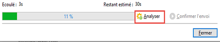

   >[!NOTE]
   >
   >Les règles de validation appliquées pendant l’analyse sont décrites dans la section [Processus de validation avec des typologies](steps-validating-the-delivery.md#validation-process-with-typologies).

1. Vous pouvez arrêter à tout moment l’analyse par le biais du bouton **[!UICONTROL Arrêter]**.

   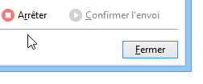

   Aucun message n’est envoyé pendant la phase de préparation. Vous pouvez donc démarrer ou annuler l’analyse sans risque.

   >[!IMPORTANT]
   >
   >Lors de l’exécution, l’analyse gèle la diffusion (ou le BAT). Toute modification apportée à la diffusion (ou au BAT) doit être suivie d’une autre analyse pour devenir applicable.

1. Attendez que l’analyse soit terminée.

   Une fois l’analyse terminée, la section supérieure de la fenêtre indique si la préparation de la diffusion est terminée ou si des erreurs se sont produites. Toutes les étapes de validation, les avertissements et les erreurs sont répertoriés. Les icônes colorées indiquent le type de message :
   * L’icône bleue indique un message informatif.
   * L’icône jaune indique une erreur de traitement non critique.
   * L’icône rouge indique une erreur critique qui empêche l’envoi de la diffusion.

   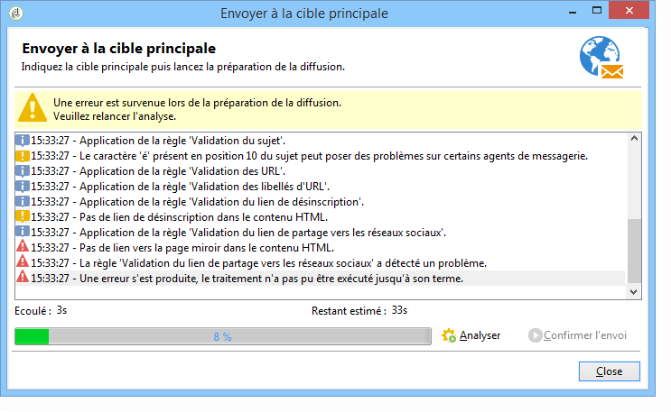

1. Cliquez sur **[!UICONTROL Fermer]** pour corriger les erreurs, le cas échéant.

1. Après avoir effectué les modifications, redémarrez l’analyse en cliquant sur **[!UICONTROL Analyser]**.

Une fois le résultat de l’analyse vérifié, vous pourrez cliquer sur **[!UICONTROL Confirmer l’envoi]** pour envoyer le message à la cible spécifiée. Un message de confirmation permet de lancer la diffusion.

>[!NOTE]
>
>Cliquez sur le lien **[!UICONTROL Modifier la cible principale de la diffusion]** si le nombre de messages à envoyer ne correspond pas à votre configuration. Vous pouvez ainsi modifier la définition de la population cible et relancer l’analyse.

### Paramètres d’analyse {#analysis-parameters}

L’onglet **[!UICONTROL Analyse]** des propriétés de la diffusion permet de définir un ensemble d’informations relatives à la préparation des messages lors de la phase d’analyse.

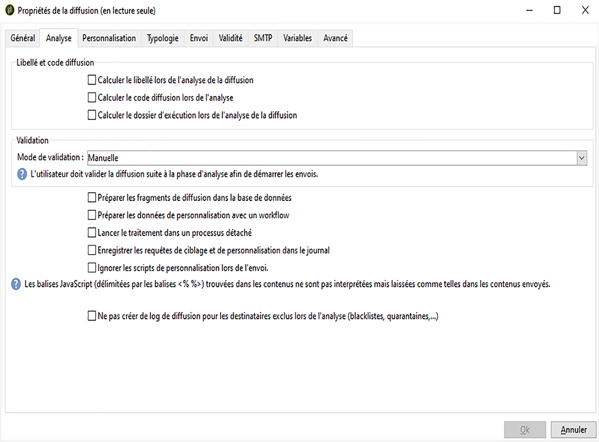

Cet onglet permet d&#39;accéder aux options suivantes :

* **[!UICONTROL Libellé et code diffusion]** : les options de cette section sont utilisées pour calculer les valeurs de ces champs pendant la phase d’analyse de diffusion. Le champ **[!UICONTROL Calculer le dossier d’exécution lors de l’analyse de la diffusion]** calcule le nom du dossier qui contiendra cette action de diffusion pendant la phase d’analyse.
* **[!UICONTROL Mode de validation]** : ce champ permet de définir une diffusion manuelle ou automatique, une fois l’analyse terminée. Les modes de validation sont présentés dans la section [Changer le mode de validation](#changing-the-approval-mode).
* **[!UICONTROL Préparer les fragments de diffusion dans la base de données]** : cette option vous permet d’améliorer les performances de l’analyse des diffusions. Voir à ce propos [cette section](#improving-delivery-analysis).
* **[!UICONTROL Préparer les données de personnalisation avec un workflow]** : cette option permet de préparer, dans un workflow automatique, les données de personnalisation contenues dans la diffusion, ce qui permet d’augmenter considérablement les performances d’exécution de la personnalisation. Pour plus d’informations à ce sujet, voir la section [Optimiser la personnalisation](personalization-fields.md#optimizing-personalization).
* **[!UICONTROL Lancer le traitement dans un processus détaché]** : cette option permet de lancer l&#39;analyse de la diffusion dans un processus à part. Par défaut, la fonction d’analyse utilise le processus du serveur applicatif d&#39;Adobe Campaign (nlserver web). En cochant cette option, vous garantissez que l’analyse sera menée à son terme même en cas de défaillance du serveur applicatif.
* **[!UICONTROL Enregistrer les requêtes SQL générées pendant l’analyse dans le journal]** : cette option permet d&#39;ajouter les logs des requêtes SQL dans le journal de la diffusion lors de la phase d’analyse.
* **[!UICONTROL Ignorer les scripts de personnalisation lors de l’envoi]** : cette option permet de contourner l’interprétation des directives JavaScript présentes dans le contenu HTML. Ils s’affichent tels quels dans le contenu diffusé. Ces directives sont introduites par la balise **&lt;%=**).

### Améliorer les performances des analyses de diffusions {#improving-delivery-analysis}

Pour accélérer la préparation de la diffusion, vous pouvez cocher l’option **[!UICONTROL Préparer les fragments de diffusion dans la base de données]** avant de lancer l’analyse.

Lorsque cette option est activée, la préparation de la diffusion est effectuée directement dans la base de données, ce qui peut accélérer considérablement l’analyse.

Actuellement, cette option n’est disponible que si les conditions suivantes sont remplies :

* La diffusion doit être un email. Les autres canaux ne sont pas pris en charge pour l’instant.
* Vous ne devez pas utiliser de routage de mid-sourcing ou externe. Seul le type de routage de diffusion en masse est possible. Vous pouvez vérifier le routage utilisé dans l’onglet **[!UICONTROL Général]** des **[!UICONTROL Propriétés de la diffusion]**.
* Vous ne pouvez pas cibler une population provenant d’un fichier externe. Pour une diffusion unique, cliquez sur le lien **[!UICONTROL À]** dans les **[!UICONTROL Paramètres de l’e-mail]** et vérifiez que l’option **[!UICONTROL Définie depuis la base de données]** est sélectionnée. Pour une diffusion utilisée dans un workflow, vérifiez que les destinataires sont **[!UICONTROL Spécifiés par le ou les événements entrants]** dans l’onglet **[!UICONTROL Diffusion]**.
* Vous devez utiliser une base de données PostgreSQL.

### Configurer la priorité d’analyse {#analysis-priority-}

Lorsque la diffusion fait partie d&#39;une campagne, l&#39;onglet **[!UICONTROL Avancé]** propose une option supplémentaire. Vous pouvez ainsi organiser l&#39;ordre de traitement des diffusions d&#39;une même campagne.

Avant envoi, chaque diffusion est analysée. La durée de l&#39;analyse dépend du fichier d&#39;extraction de la diffusion. Plus la taille du fichier est importante, plus l’analyse prend de temps, ce qui fait attendre les diffusions suivantes.

Les options de la section **[!UICONTROL Préparation des messages par l’ordonnanceur]** vous permettent de prioriser l’analyse des diffusions d’un workflow de campagne.

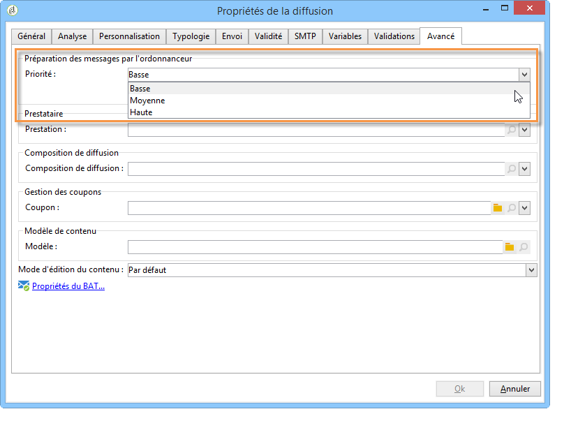

Si une diffusion est trop volumineuse, il est préférable de lui administrer une priorité basse afin de ne pas ralentir l’analyse des autres diffusions du workflow.

>[!NOTE]
>
>Pour vous assurer que l&#39;analyse des diffusions les plus volumineuses ne freine pas le déroulement de vos workflows, il vous est possible de différer leur exécution en cochant la case **[!UICONTROL Différer l&#39;exécution vers une plage horaire de faible activité]**.

## Envoi d&#39;un BAT {#sending-a-proof}

Pour détecter d’éventuelles erreurs dans la configuration des messages, Adobe recommande vivement de configurer un cycle de validation de la diffusion. Pour cela, faites-en valider le contenu autant de fois que nécessaire en envoyant des BAT auprès de destinataires test. Un BAT doit être envoyé afin de valider le contenu après chaque modification.

>[!NOTE]
>
>Les modes de validation disponibles sont présentés dans la section [Changer le mode de validation](steps-validating-the-delivery.md#changing-the-approval-mode).

Pour envoyer un BAT, procédez comme suit :

1. Vérifiez que la cible du BAT a été configurée comme décrit dans la section [Définir une cible spécifique au BAT](steps-defining-the-target-population.md#defining-a-specific-proof-target).

1. Cliquez sur **[!UICONTROL Envoyer un BAT]** dans la barre supérieure de l’assistant de diffusion.

   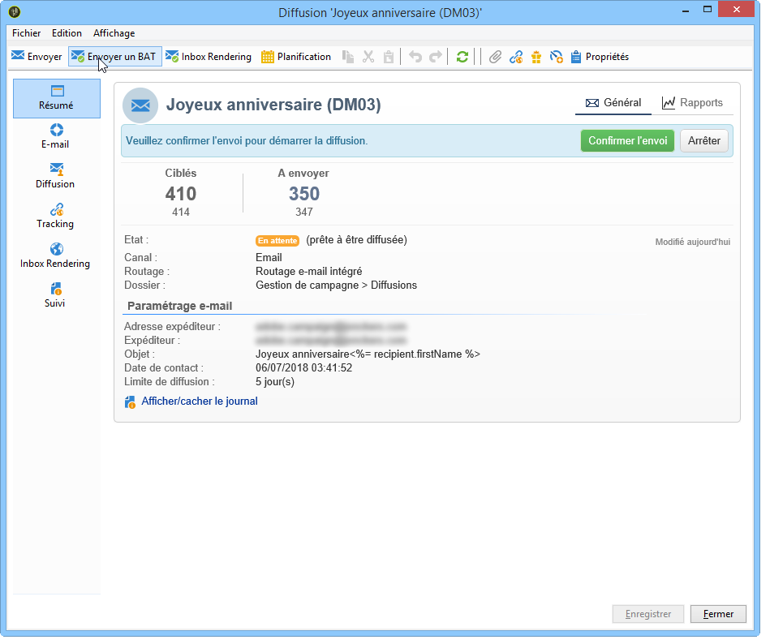

1. Lancez l’analyse des messages. Pour plus d&#39;informations, consultez la section [Analyser la diffusion](steps-validating-the-delivery.md#analyzing-the-delivery).
1. Vous pouvez maintenant envoyer la diffusion (voir la section [Envoyer la diffusion](steps-sending-the-delivery.md)).

   Une fois la diffusion envoyée, le BAT apparaît dans la liste de diffusion et est automatiquement créé et numéroté. Il peut être modifié si vous souhaitez accéder à son contenu et à ses propriétés. Voir à ce propos [cette page](about-delivery-monitoring.md).

   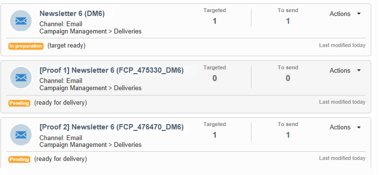

   >[!NOTE]
   >
   >Si plusieurs formats ont été créés pour la diffusion (HTML et Texte), vous pouvez choisir le format des messages à envoyer aux destinataires du BAT. Pour cela, sélectionnez l’option correspondante dans la section inférieure de la fenêtre de sélection de la cible des BAT.

   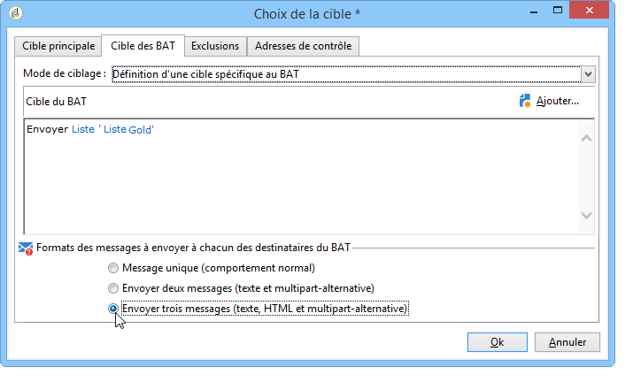

Vous souhaiterez peut-être modifier le contenu de la diffusion en raison des commentaires du groupe de validation recevant le BAT. Après avoir apporté vos modifications, vous devez relancer l’analyse, puis envoyer un autre BAT. Chaque nouveau BAT est numéroté et consigné dans le journal de diffusion.

Une fois la diffusion analysée, vous pouvez en visualiser les différents BAT depuis le sous-onglet **[!UICONTROL Bons à tirer]** du log (onglet **[!UICONTROL Suivi]**).

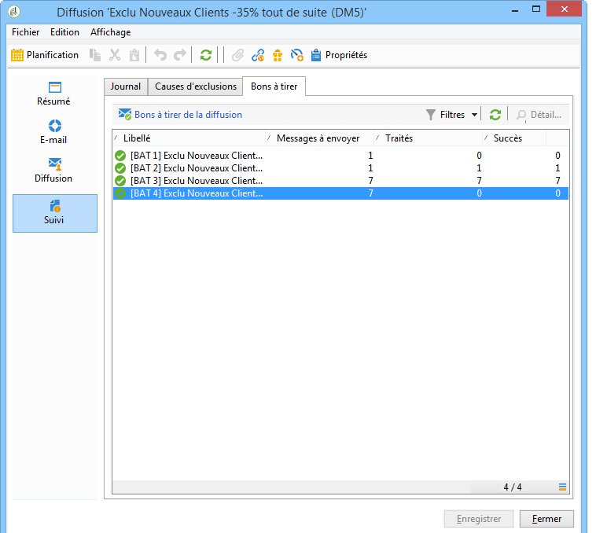

Vous devez envoyer autant de BAT que nécessaire jusqu’à ce que le contenu de la diffusion soit finalisé. Ensuite, vous pouvez envoyer la diffusion à la cible principale et fermer le cycle de validation.

L&#39;onglet **[!UICONTROL Avancé]** des propriétés de la diffusion permet de définir les propriétés du BAT. Si nécessaire, vous pouvez remplacer les règles d’exclusion des destinataires.

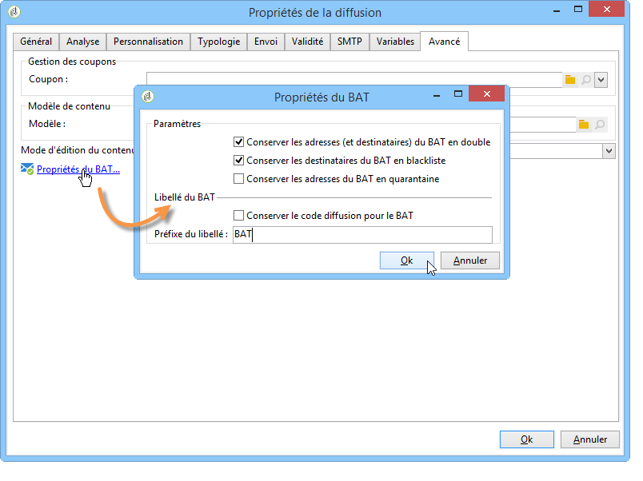

Les options disponibles sont les suivantes :

* La première option permet de conserver les doublons du BAT.
* Les deux options ci-dessous permettent de conserver les destinataires qui se trouvent sur la liste bloquée et les adresses en quarantaine. Voir la description de ces options pour la cible principale dans la section [Personnaliser les paramètres d’exclusion](steps-defining-the-target-population.md#customizing-exclusion-settings). Contrairement à la cible d’une diffusion, où ces adresses sont exclues par défaut, elles sont conservées par défaut pour la cible d’un BAT.
* L’option **[!UICONTROL Conserver le code de diffusion pour le BAT]** permet d’associer au BAT le même code de diffusion que celui défini pour la diffusion à laquelle il se rapporte. Ce code est spécifié dans la première étape de l’assistant de diffusion.
* Par défaut, l’objet du BAT est précédé du préfixe « BAT # », où # correspond au numéro du BAT. Vous pouvez modifier ce préfixe dans le champ **[!UICONTROL Préfixe de libellé]**.

## Processus de validation avec des typologies {#validation-process-with-typologies}

Avant d’envoyer des messages, vous devez analyser la campagne pour en valider le contenu et le paramétrage. Les règles de vérification appliquées lors de la phase d’analyse sont définies dans une **typologie**. Par défaut pour les e-mails, l’analyse exécute les tâches suivantes :

* validation de l&#39;objet,
* validation des URL et des images,
* validation des libellés des URL,
* validation du lien de désinscription,
* vérification de la taille des BAT,
* vérification de la durée de validité,
* vérification de la planification des vagues.

Pour chaque diffusion, la typologie à appliquer est sélectionnée dans l&#39;onglet **[!UICONTROL Typologies]** des paramètres de la diffusion.

Vous pouvez visualiser et éditer les règles de validation, leur contenu, leur ordre d&#39;exécution et leur description complète depuis le noeud **[!UICONTROL Administration > Gestion de campagnes > Gestion des typologies > Règles de typologies]**.

Vous pouvez créer des règles et définir de nouvelles typologies à partir de ce nœud. Ces tâches sont toutefois réservées aux utilisateurs experts qui connaissent JavaScript.

Pour plus d’informations sur les règles de typologie, consultez [cette page &#x200B;](../../campaign-opt/using/about-campaign-typologies.md).

Vous pouvez également éditer la typologie courante en cliquant sur l’icône **[!UICONTROL Editer le lien]** situé à droite du champ **[!UICONTROL Typologie]**.

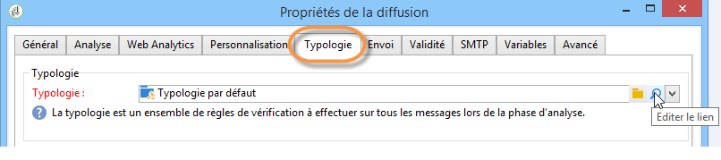

L’onglet **[!UICONTROL Règle]** donne la liste des règles de typologie à appliquer. Sélectionnez une règle et cliquez sur l’icône **[!UICONTROL Détail...]** pour en afficher la configuration :

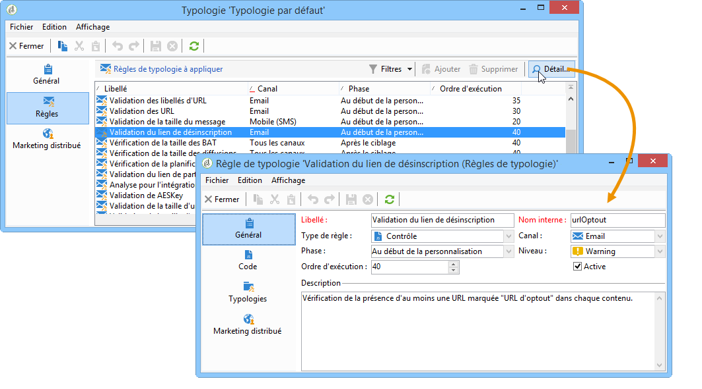

>[!NOTE]
>
>Les typologies de type **[!UICONTROL Arbitrage]** sont utilisées dans le cadre de la gestion de la pression commerciale. Pour plus d’informations, consultez [cette section](../../mrm/using/about-marketing-resource-management.md).

## Changer le mode de validation {#changing-the-approval-mode}

L’onglet **[!UICONTROL Analyse]** des propriétés de la diffusion permet de sélectionner le mode de validation. Si l’analyse génère des avertissements, (par exemple, si certains caractères sont accentués dans l’objet de la diffusion, etc.), vous pouvez choisir de continuer son exécution ou non dans les paramètres de la diffusion. Par défaut, l’utilisateur ou l’utilisatrice doit confirmer l’envoi des messages à la fin de la phase d’analyse : il s’agit d’une validation **manuelle**.

Vous pouvez choisir un autre mode de validation dans la liste déroulante du champ correspondant.

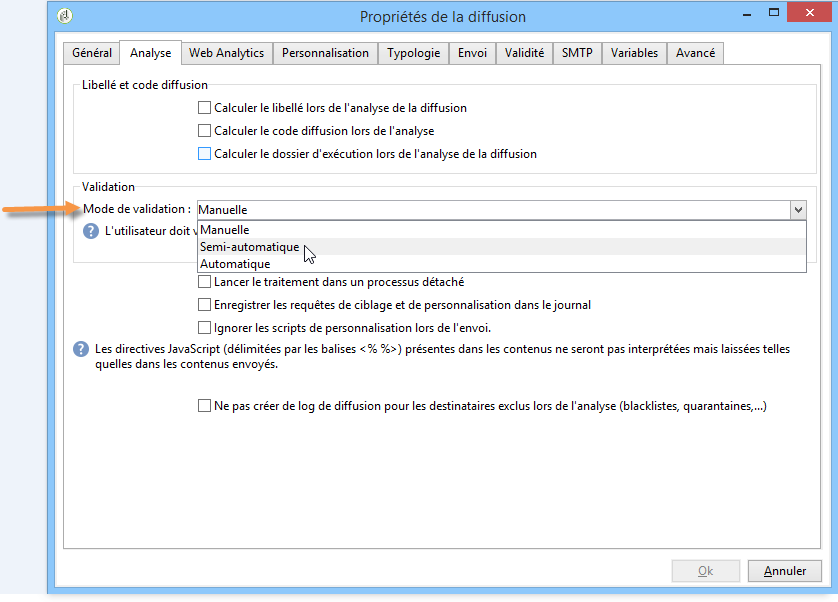

Les modes de validation possibles sont les suivants :

* **[!UICONTROL Manuel]** : à la fin de la phase d’analyse, l’utilisateur doit confirmer la diffusion pour commencer l’envoi. Pour cela, cliquez sur le bouton **[!UICONTROL Démarrer]** afin de lancer la diffusion.
* **[!UICONTROL Semi-automatique]** : les envois démarrent automatiquement si la phase d’analyse ne génère aucun message d’avertissement.
* **[!UICONTROL Automatique]** : les envois démarrent automatiquement à la fin de la phase d’analyse, quel qu’en soit le résultat.
