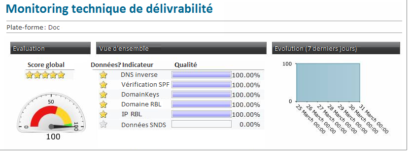

# Monitoring technique{#technical-monitoring}

## Rapport de surveillance de la délivrabilité technique {#technical-deliverability-monitoring}

Le rapport de surveillance de la délivrabilité technique est mis à jour quotidiennement et disponible en accédant à **[!UICONTROL Surveillance]** > **[!UICONTROL Aperçu]** et en cliquant sur le lien de surveillance **** technique dans l’onglet **[!UICONTROL Accueil d’Adobe Campaign.]** Il comprend plusieurs indicateurs de qualité de la délivrabilité pour votre plateforme.

Ces indicateurs sont mis à jour tous les jours à 9 heures.

>[!NOTE]
>
>En complément, vous avez la possibilité de recevoir un rapport quotidien par email à l&#39;adresse souhaitée. Pour cela, nous vous invitons à nous communiquer cette adresse par mail ou via l&#39;Extranet Adobe Campaign.

Les indicateurs utilisés dans ce rapport sont les suivants :

* **[!UICONTROL Reverse DNS]** : Adobe Campaign vérifie qu&#39;un reverse DNS est bien renseigné pour une adresse IP et que celui-ci reboucle bien sur l&#39;IP.

* **[!UICONTROL SPF]** (Cadre de politique de l&#39;expéditeur) : Mécanisme d’authentification qui permet aux fournisseurs de services Internet et de boîtes aux lettres de vérifier si l’expéditeur du courrier électronique est autorisé sur le domaine d’envoi.

   <!--
    >[!NOTE]
    >
    >The SPF may look **[!UICONTROL Acceptable]** (instead of **[!UICONTROL Good]**) since the report is currently unable to detect the presence of a “redirect” or “include” mechanism. This bug has been submitted to Adobe Campaign R&D to be fixed. In the meantime, please feel free to add 15 points to your global score to obtain your real rating (a **[!UICONTROL Good]** one corresponds to 96 points or higher).
    -->

* **[!UICONTROL DomainKeys]** : Service développé par Yahoo visant à certifier l&#39;identité de l&#39;émetteur d&#39;un email.

* **[!UICONTROL Domaine]** IP et RBL (Liste des trous noirs en temps réel) : Liste des adresses et domaines IP qui ont été marqués par les organisations de liste de blocage pour mauvaise réputation d’envoi. Ces listes sont conservées par des organisations dédiées telles que Spamhaus, Spamcop, SURBL/URIBL, etc. Adobe Campaign traite actuellement les contrôles par rapport aux URL qui ont un impact significatif sur la délivrabilité. Ces RBL reflètent la réputation d&#39;envoi et peuvent être référencées par les FAI avant d&#39;accepter de recevoir vos courriels.

* **[!UICONTROL SNDS]** (Smart Network Data Services) : Un service [anti-spam](https://sendersupport.olc.protection.outlook.com/snds/FAQ.aspx)Windows Live Hotmail. Hotmail est le seul FAI qui fournit ce type d&#39;informations. Les scores de référence sont un résultat de filtre vert, un taux de plainte inférieur à 0,1 % et un taux zéro de pourriel.

<!--
* **[!UICONTROL Reputation Authority]**: This WatchGuard’s score is calculated in real time according to the feedback received from their network worldwide, and also from the different users who use their software.

    Administrators can use such tools to apply a first level filter on their messaging servers.
    If you click on the IP link within the technical report, it will lead you to reputationauthority.org, where you will have the possibility to clean the IP history and get a neutral score again.
    Nevertheless, this action is limited to a number of times per month.
    Please also be aware there is no support provided by WatchGuard‘s Reputation Authority (sending delisting requests is therefore useless). Otherwise, this scoring is based on the following: 
    * Message content (for example: presence of spam words). 
    * IP/Domains reputation (for example: your IPs are listed on an RBL). 
    * IP configuration (for example: IPs associated to different domains). 
    * Volumes sent by IP (for example: presence of peaks or significant variations).
    
    * **[!UICONTROL Sender Score]** : A database of reputed servers ([https://www.senderscore.org/](https://www.senderscore.org/)) issuing a score created by Return Path about your reputation. Think of it like a credit score, but for email senders.-->

<!--## Delivery Reports - Broadcast Statistics {#delivery-reports-broadcast-statistics}

Each delivery will generate a broadcast statistics report when you open a delivery in the “Deliveries List”, which includes some reputation metrics that may impact your deliverability:

-->
