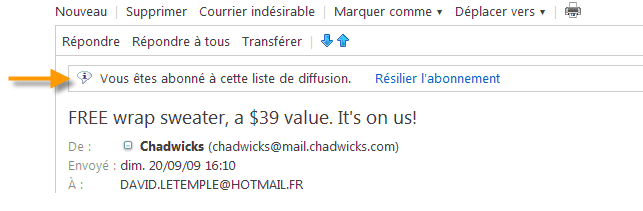
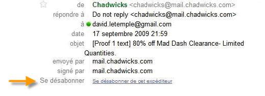
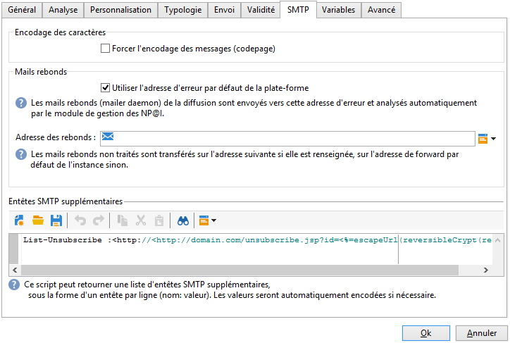

# Recommandations techniques{#technical-recommendations}

Vous trouverez ci-dessous la liste de plusieurs techniques, configurations et outils que vous pouvez utiliser pour améliorer le taux de délivrabilité.

## Configuration {#configuration}

### Reverse DNS {#reverse-dns}

Adobe Campaign vérifie qu’un reverse DNS est bien renseigné pour une adresse IP et que celui-ci reboucle bien sur l’IP.

Un point indispensable de la configuration réseau est d&#39;avoir établi un reverse DNS correct pour chacune des adresses IP d&#39;envoi. Cela signifie que pour une adresse IP donnée, il existe un enregistrement reverse DNS (enregistrement PTR) dont la correspondance DNS (enregistrement A) reboucle sur l&#39;adresse IP initiale.

Le choix du domaine pour un DNS inversé a un impact lorsque vous traitez avec certains FAI. AOL, en particulier, n’accepte que les boucles de rétroaction avec une adresse dans le même domaine que le DNS inversé (voir boucle [de](#feedback-loop)rétroaction).

A tool is available to verify the configuration of a domain: [https://mxtoolbox.com/SuperTool.aspx](https://mxtoolbox.com/SuperTool.aspx).

### Règles MX {#mx-rules}

Les règles MX (Mail eXchanger) correspondent aux règles de gestion de communication entre un serveur expéditeur et un serveur destinataire.

Plus précisément, ils sont utilisés pour contrôler la vitesse à laquelle l’agent de transfert de messages de la campagne envoie des courriers électroniques à chaque domaine de courriel ou FAI individuel (par exemple hotmail.com, comcast.net). Ces règles sont généralement basées sur les limites publiées par les FAI (par exemple, ne pas inclure plus de 20 messages par connexion SMTP).

For more on MX management, refer to the [dedicated section](../../installation/using/email-deliverability.md#mx-configuration).

### TLS {#tls}


(Transport Layer Security) est un protocole de cryptage qui peut être utilisé pour sécuriser la connexion entre deux serveurs de messagerie et empêcher la lecture du contenu d’un email par une autre personne que le destinataire prévu.

## Authentification {#authentication}

### SPF {#spf}

SPF (Sender Policy Framework) est une norme d’authentification d’email qui permet au propriétaire d’un domaine de spécifier les serveurs de messagerie autorisés à envoyer des emails pour le compte de ce domaine. Cette norme utilise le domaine indiqué dans l’en-tête « Return-Path » de l’email (également appelé adresse « Envelope From »).

A tool is available to verify an SPF record: [https://www.kitterman.com/spf/validate.html](https://www.kitterman.com/spf/validate.html)

Le SPF est une technique qui, dans une certaine mesure, vous permet de vous assurer que le nom de domaine utilisé dans un courrier électronique n’est pas falsifié. Lorsqu’un message est reçu d’un domaine, le serveur DNS du domaine est interrogé. La réponse est un enregistrement court (l&#39;enregistrement SPF) qui détaille les serveurs autorisés à envoyer des courriers électroniques à partir de ce domaine. Si nous supposons que seul le propriétaire du domaine a les moyens de modifier cet enregistrement, nous pouvons considérer que cette technique ne permet pas de falsifier l&#39;adresse de l&#39;expéditeur, du moins pas la partie à droite du &quot;@&quot;.

Dans la spécification [finale](https://www.rfc-editor.org/info/rfc4408)RFC 4408, deux éléments du message sont utilisés pour déterminer le domaine considéré comme l’expéditeur : Domaine spécifié par la commande SMTP &quot;HELO&quot; (ou &quot;EHLO&quot;) et domaine spécifié par l’adresse de l’en-tête &quot;Return-Path&quot; (ou &quot;MAIL FROM&quot;), qui est également l’adresse de rebond. Différentes considérations permettent de ne prendre en compte qu&#39;une de ces valeurs; nous vous recommandons de vous assurer que les deux sources spécifient le même domaine.

La vérification SPF produit une évaluation de la validité du domaine expéditeur :

* **Aucun**: Aucune évaluation n&#39;a pu être effectuée,
* **Neutre**: Le domaine interrogé n&#39;active pas l&#39;évaluation,
* **Pass**: Le domaine est considéré comme authentique,
* **Echec**: Le domaine est falsifié et le message doit être rejeté,
* **SoftFail**: Le domaine est probablement faux, mais le message ne doit pas être rejeté uniquement sur la base de ce résultat,
* **TempError**: Une erreur temporaire a interrompu l’évaluation. Le message peut être rejeté,
* **PermError**: Les enregistrements SPF du domaine ne sont pas valides.

Il faut bien noter que les modifications des enregistrements au niveau des serveurs DNS peuvent mettre jusqu&#39;à 48 heures pour être prises en compte. Ce délai est en fonction de la fréquence de rafraîchissement des caches DNS des serveurs de réception.

### DKIM {#dkim}

L’authentification DKIM (DomainKeys Identified Mail) est un successeur de SPF et utilise la cryptographie à clé publique qui permet au serveur de messagerie de réception de vérifier qu’un message a bien été envoyé par la personne ou l’entité qui prétend l’avoir envoyé, et si le contenu du message a été modifié entre le moment où il a été envoyé (et celui où le DKIM a &quot;signé&quot;) et celui où il a été reçu. Cette norme utilise généralement le domaine dans l’en-tête « From » ou « Sender ». Pour assurer le niveau de sécurité du DKIM, la valeur 1024b est la taille de chiffrement recommandée pour les bonnes pratiques. Les clés DKIM inférieures ne seront pas considérées comme valides par la majorité des fournisseurs d’accès.

DKIM est né de l&#39;union des principes d&#39;authentification DomainKeys, de Yahoo! et Identified Internet Mail, de Cisco et va permettre de vérifier l&#39;authenticité du domaine expéditeur et garantir l&#39;intégrité du message.

DKIM a remplacé l&#39;authentification **DomainKeys**.

>[!IMPORTANT]
>
>Pour les installations hébergées ou hybrides, si vous avez effectué la mise à niveau vers la MTA améliorée, la signature de l’authentification par courrier électronique DKIM est effectuée par la MTA améliorée. Dans le cadre de la mise à niveau améliorée de la MTA, la signature de la messagerie instantanée par la MTA de campagne native sera désactivée dans la table de gestion **[!UICONTROL des]** domaines.
>
>Pour plus d’informations sur la MTA améliorée d’Adobe Campaign, reportez-vous à ce [document](https://helpx.adobe.com/campaign/kb/campaign-enhanced-mta.html).

L&#39;utilisation de DKIM nécessite quelques prérequis :

* **Sécurité** : le cryptage est un élément clé de DKIM. La taille minimum de cryptage recommandée est 1024b. Des tailles inférieures ne seront pas considérées comme valides pour la plupart des fournisseurs d&#39;accès.
* **Réputation** : la réputation est basée sur l&#39;IP et/ou le domaine mais le sélecteur DKIM est aussi un élément à prendre en compte. Le choix d&#39;un sélecteur est important : évitez de garder celui par défaut car il peut être utilisé par n&#39;importe qui. Sa réputation est donc très faible. Vous devez implémenter un sélecteur différent pour les communications **retention vs acquisition** et pour l&#39;authentification.
* **Déclaration d&#39;option dans Adobe Campaign** : dans Adobe Campaign, la clé privée DKIM est basée sur un sélecteur DKIM et un domaine. Actuellement il n&#39;est pas possible de créer de multiples clés privées pour le même domaine ou sous-domaine, avec des sélecteurs différents. Dans l&#39;instance ou dans l&#39;email, il n&#39;est pas possible de définir quel sélecteur doit être utilisé pour l&#39;authentification. L&#39;instance choisit alternativement une des clés privées : le risque d&#39;échec lors de l&#39;authentification est élevé.

>[!NOTE]
>
>* Si vous avez déjà paramétré DomainKeys pour votre instance Adobe Campaign, vous avez simplement besoin de cocher **dkim** dans les règles de gestion des domaines. Dans le cas contraire, vous devrez suivre les même étapes de configuration (clé privée/publique) que pour DomainKeys.
>* Il est inutile d&#39;activer DomainKeys et DKIM pour un même domaine, DKIM étant une version améliorée de DomainKeys.
>* Les domaines validant actuellement DKIM sont les suivants : AOL, Gmail.


### DMARC {#dmarc}

DMARC (Domain-based Message Authentication, Reporting and Conformance) est la forme la plus récente d’authentification des emails. Le processus s’appuie simultanément sur l’authentification SPF et DKIM pour déterminer si un email sera diffusé avec succès ou non. DMARC est sans équivalent et puissant pour deux raisons très importantes :

* Conformité : il permet à l’expéditeur de donner aux FAI des instructions sur les actions à exécuter sur les messages qui ne parviennent pas à s’authentifier (par exemple, ne pas l’accepter).
* Reporting : il fournit à l’expéditeur un rapport détaillé indiquant tous les messages ayant échoué lors de l’authentification DMARC, ainsi que le domaine &quot;From&quot; et l’adresse IP utilisée pour chacun. Une entreprise peut ainsi identifier un email légitime qui ne réussit pas l’authentification et qui a besoin d’une correction (par exemple, ajouter des adresses IP à son enregistrement SPF), ainsi que les sources et la prévalence des tentatives de phishing sur ses domaines de messagerie.

DMARC can leverage the reports generated by [250ok](https://250ok.com/).

<!--#### Configuring the application {#configuring-the-application}

To define the domain used for the HELO command, edit the instance's configuration file (conf/config-instance.xml) and define a "localDomain" attribute as follows:

```
<serverConf>
  <shared>
    <dnsConfig localDomain="mydomain.net"/>
  </shared>
</serverConf>
```

The MAIL FROM domain is the domain used in technical bounce messages. This address is defined in the deployment wizard or via the NmsEmail_DefaultErrorAddr option.

#### DNS configuration {#dns-configuration}

An SPF record can currently be defined on a DNS server as a TXT type record (code 16) or an SPF type record (code 99). An SPF record takes the form of a character string. For example:

```
v=spf1 ip4:12.34.56.78/32 ip4:12.34.56.79/32 ~all
```

defines the 2 IP addresses 12.34.56.78 and 12.34.56.79 as authorized to send emails for the domain. **~all** means that any other address should be interpreted as a SoftFail.

Recommendations for defining an SPF record:

* Add **~all** (SoftFail) or **-all** (Fail) at the end to reject all servers other than those defined. Without this, servers will be able to forge this domain (with a Neutral evaluation).
* Do not add **ptr** (openspf.org recommends against this as costly and unreliable).-->

## Feedback loop {#feedback-loop}

Le principe d&#39;une feedback loop est de déclarer chez le FAI une adresse email particulière pour une plage d&#39;adresses IP utilisées pour l&#39;envoi de messages. Le FAI retournera sur cette boîte, de façon similaire à ce qui est fait pour les mails rebonds, les messages envoyés aux utilisateurs qui ont cliqué sur &quot;Ceci est un spam&quot;. La plate-forme devra être configurée pour bloquer tous les envois ultérieurs vers les utilisateurs qui se sont plaints. Il est important de ne définitivement plus contacter ces personnes même si elles n&#39;ont pas fait usage du lien de désinscription qui était prévu pour cela. C&#39;est sur la base de ces plaintes que le FAI va décider de blacklister ou non une adresse IP. Suivant le FAI, le taux de plainte qui déclenche le blacklistage d&#39;une adresse IP se situe aux environs de 1%.

A standard is currently being drawn up to define the format of feedback loop messages: the [Abuse Feedback Reporting Format (ARF)](https://tools.ietf.org/html/rfc6650).

La mise en place d&#39;une feedback loop pour une instance suppose d&#39;avoir :

* une boîte mail dédiée à l&#39;instance, qui peut éventuellement être la boîte de mails rebonds,
* des adresses IP d&#39;envoi dédiées à l&#39;instance.

La mise en oeuvre d’une boucle de commentaire simple dans Adobe Campaign utilise la fonctionnalité de message de rebond. La boîte aux lettres de boucle de commentaire est utilisée comme boîte aux lettres de rebond et une règle est définie pour détecter ces messages. Les adresses électroniques des destinataires qui ont signalé le message comme indésirable seront ajoutées à la liste de quarantaine.

* Créez ou adaptez une règle de mails rebonds **Feedback_loop** dans **[!UICONTROL Administration>Gestion de campagne>Gestion des NP@I>Jeux de règles mail]** avec la raison **Refusé** et le type **Hard**.
* Si une boîte a été définie spécialement pour la feedback loop, définissez les paramètres pour relever son contenu en créant un nouveau compte externe de type Mails rebonds dans **[!UICONTROL Administration>Plate-forme>Comptes externes]**.

Le mécanisme est immédiatement opérationnel pour traiter les notifications de plaintes. Pour vérifier le bon fonctionnement de la règle, vous pouvez temporairement désactiver les comptes afin qu&#39;ils ne relèvent pas ces messages, puis vérifier le contenu de la boîte de feedback loop manuellement. Sur le serveur, exécutez les commandes suivantes :

```
nlserver stop inMail@instance,
nlserver inMail -instance:instance -verbose.
```

Si vous êtes contraint d&#39;utiliser une seule adresse de feedback loop pour plusieurs instances, il faudra :

* répliquer les messages reçus sur autant de boîtes qu&#39;il existe d&#39;instances,
* faire relever chaque boîte par une seule instance,
* Configurez les instances afin qu’elles traitent uniquement les messages qui les concernent : les informations d’instance sont incluses dans l’en-tête Message-ID des messages envoyés par Adobe Campaign et se trouvent donc également dans les messages de boucle de commentaire. Il vous suffit de spécifier le paramètre **checkInstanceName** dans le fichier de configuration de l’instance (par défaut, l’instance n’est pas vérifiée, ce qui peut entraîner une mise en quarantaine incorrecte de certaines adresses) :

   ```
   <serverConf>
     <inMail checkInstanceName="true"/>
   </serverConf>
   ```

Le service Délivrabilité d&#39;Adobe Campaign gère votre inscription aux services de feedback loop pour les FAI suivants : AOL, BlueTie, Comcast, Cox, EarthLink, FastMail, Gmail, Hotmail, HostedEmail, Libero, Mail.ru, MailTrust, OpenSRS, QQ, RoadRunner, Synacor, Telenor, Terra, UnitedOnline, USA, XS4ALL, Yahoo, Yandex, Zoho.

## List-Unsubscribe {#list-unsubscribe}

### A propos de List-Unsubscribe {#about-list-unsubscribe}

L&#39;ajout d&#39;un en-tête SMTP appelé **List-Unsubscribe** est obligatoire pour une gestion optimale de la délivrabilité.

Cet en-tête pourra être utilisé comme une alternative à l&#39;icône &quot;Signaler comme SPAM&quot;. Il s&#39;affichera comme un lien de désinscription dans l&#39;interface mail.

L&#39;utilisation de cette fonctionnalité protège votre réputation et le feedback sera exécuté comme une désinscription.

>[!NOTE]
>
>Cette fonctionnalité est disponible à partir du build 6831.

Pour utiliser List-Unsubscribe, vous devez entrer une ligne de commande similaire à celle-ci :

```
List-Unsubscribe: mailto: client@newsletter.example.com?subject=unsubscribe?body=unsubscribe
```

>[!IMPORTANT]
>
>L&#39;exemple ci-dessus est basé sur la table des destinataires. Si l&#39;implémentation de la base de données est faite à partir d&#39;une autre table, pensez à reformuler la ligne de commande avec l&#39;information correcte.

La ligne de commande suivante peut-être utilisée pour créer un **List-Unsubscribe** dynamique :

```
List-Unsubscribe: mailto: %=errorAddress%?subject=unsubscribe%=message.mimeMessageId%
```

Gmail, Outlook.com et Microsoft Outlook supportent cette méthode. Ils afficheront un lien de désinscription directement dans leur interface. Cette technique favorise la diminution du taux de plaintes.





Vous pouvez implémenter le **List-Unsubscribe** en :

* ajoutant directement la ligne de commande dans le modèle de diffusion - voir [cette section](#adding-a-command-line-in-a-delivery-template), ou
* créant une règle de typologie - voir [cette section](#creating-a-typology-rule).

### Ajouter la ligne de commande dans le modèle de diffusion {#adding-a-command-line-in-a-delivery-template}

La ligne de commande doit être ajoutée dans la section additionnelle de l&#39;en-tête SMTP de l&#39;email.

Cet ajout peut se faire dans chaque email, ou dans les modèles de diffusion existants. Vous pouvez aussi créer un nouveau modèle de diffusion qui inclue cette fonctionnalité.

### Créer une règle de typologie {#creating-a-typology-rule}

La règle de typologie doit contenir le script qui génère la ligne de commande et être inclue dans l&#39;en-tête de l&#39;email.

>[!NOTE]
>
>La création d&#39;une règle de typologie est recommandée : la fonctionnalité List-Unsubscribe sera automatiquement ajoutée à chaque email.

1. List-Unsubscribe: &lt;mailto:unsubscribe@domain.com>

   Un clic sur le lien **unsubscribe** ouvre le client messagerie par défaut de l&#39;utilisateur. Cette règle de typologie doit être ajoutée dans une typologie utilisée pour la création d&#39;email.

1. List-Unsubscribe: `<https://domain.com/unsubscribe.jsp>`

   Un clic sur le lien **unsubscribe** redirige l&#39;utilisateur vers votre formulaire de désinscription.

   Exemple :

   

## Optimisation du courrier électronique {#email-optimization}

### SMTP {#smtp}

SMTP (Simple Mail Transfer Protocol) est une norme Internet pour la transmission de courriels.

The SMTP errors that aren&#39;t checked by a rule are listed in the **[!UICONTROL Administration]** > **[!UICONTROL Campaign Management]** > **[!UICONTROL Non deliverables Management]** > **[!UICONTROL Delivery log qualification]** folder. These error messages are by default interpreted as unreachable soft errors. The most common errors must be identified and a corresponding rule added in **[!UICONTROL Administration]** > **[!UICONTROL Campaign Management]** > **[!UICONTROL Non deliverables Management]** > **[!UICONTROL Mail rule sets]** if you wish to correctly qualify the feedback from the SMTP servers. Without this, the platform will perform unnecessary retries (case of unknown users) or wrongly place certain recipients in quarantine after a given number of tests.

### Adresses IP dédiées {#dedicated-ips}

Adobe fournit une stratégie IP dédiée pour chaque client avec une adresse IP en phase de montée (ramp-up) afin d&#39;établir une réputation et optimiser les performances de diffusion.

## Certification IP {#ip-certification}

La certification IP est un programme de pratiques d&#39;envoi et de liste blanche qui permet de s&#39;assurer que les courriels sont reçus sans être bloqués par des filtres anti-spam ou d&#39;autres systèmes de blocage des courriels.

Actuellement, deux fournisseurs offrent une certification IP : Chemin de retour et Alliance des expéditeurs certifiés.

Les expéditeurs certifiés sont ajoutés aux listes blanches de courrier électronique utilisées par les fournisseurs mondiaux de boîtes aux lettres et les sociétés de sécurité de courrier électronique. Ces listes blanches commerciales sont basées sur un système qui permet à l&#39;expéditeur de contourner complètement les filtres anti-spam ou de se voir attribuer des points incrémentiels lorsqu&#39;ils entrent dans le système.

Le programme de certification [des chemins de](https://www.validity.com/products/returnpath/certification/) retour offre un certain nombre d’avantages, notamment :

* Augmentation mesurable du positionnement des boîtes de réception dans les principaux fournisseurs de boîtes de réception tels que Microsoft, AOL, Yahoo, Gmail, Comcast, Orange, Mail.ru, etc.
* La réputation et le traitement des filtres critiques tels que Cloudmark, SpamAssassin et Cisco Ironport
* Une équipe de conformité dédiée à la surveillance 24h/24 et 7j/7, qui fournit des alertes de sécurité et travaille avec vous pour résoudre les éventuels compromis
* Données du fournisseur de boîtes aux lettres fournissant des informations détaillées sur les indicateurs clés de performance, l’emplacement et les performances de certification
* Amélioration simplifiée et rapide du réchauffement de l’IP, notamment une meilleure réputation et une meilleure reconnaissance lors de la migration ou de l’obtention d’une nouvelle adresse IP

La certification [Certified Senders Alliance](https://certified-senders.org/certification-process/) Certification offre entre autres avantages :

* Certification des expéditeurs de courriels commerciaux qui peuvent se conformer à des normes de qualité élevées
* Amélioration de la remise et de la délivrabilité des courriels commerciaux pour augmenter le taux de placement des boîtes de réception et réduire le filtrage des messages indésirables
* Protection contre les risques juridiques et financiers en respectant pleinement les normes juridiques
* Protection de la réputation par des avertissements précoces du Bureau des plaintes du CSA et des rapports quotidiens sur les pièges à pourriels

Les FAI sont libres d’utiliser ces services et le nombre de FAI est variable selon la liste blanche.

Cependant, étant donné que de plus en plus de fournisseurs de services Internet créent leurs filtres anti-spam en fonction du comportement de chaque propriétaire de boîte de réception plutôt que d’analyser le contenu du message lui-même, l’utilisation de la certification IP ne peut pas être une garantie de placement de boîte de réception ni même de remise.
