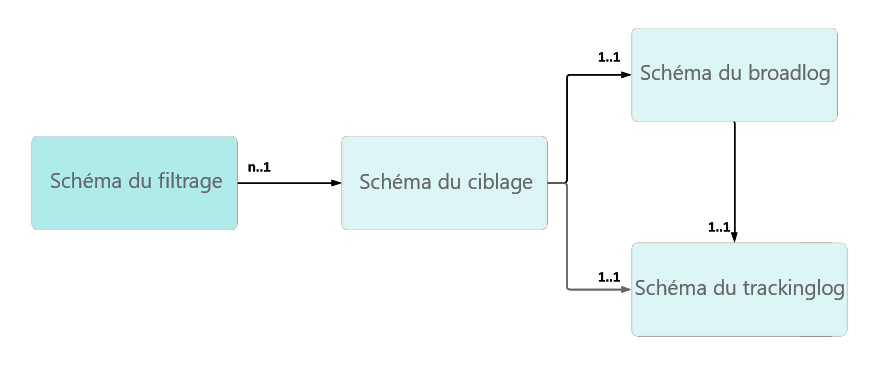

# Résolution des problèmes liés au tracking {#tracking-troubleshooting}

Dans cette section, vous trouverez des questions courantes relatives à la configuration et à l’implémentation du tracking dans Adobe Campaign Classic.

## Le workflow de tracking échoue {#tracking-workflow-failing}

Mon workflow de tracking échoue. Comment puis-je détecter les lignes endommagées dans le fichier de tracking ?

>[!NOTE]
>
>Disponible pour Windows uniquement

Le fichier de log de tracking corrompu.../nl6/var/&lt;nom_instance>/redir/log/0x0000 peut arrêter le worklow de tracking. Pour détecter facilement les lignes endommagées et les supprimer afin de reprendre le workflow de tracking, vous pouvez utiliser les commandes ci-dessous.

### Je sais dans quel fichier se trouve la ligne corrompue

Dans ce cas, des lignes corrompues se trouvent dans le fichier 0x00000000000A0000.log, mais le même processus peut être appliqué à un ensemble de fichiers, un par un.

```
$ cd {install directory}/var/{instance name}/redir/log
$ cat 0x00000000000A0000.log | sed -nE '/^[[:alnum:]]{2}x[[:alnum:]]*\t[0-9T:\.-]*\t[0-9a-fA-F]*\t[0-9a-fA-F]*\t[0-9a-fA-F]*\t[[:alnum:]]*\t[[:alnum:]-]*\t[[:print:]]*\t[[:print:]]*\t[[:print:]]*\t([0-9a-fA-F\.:]*|[0-9a-fA-F\.:]*\t[[:print:]]*|[0-9a-fA-F\.:]*,[[:print:]]*)$/!p'
```

Vous pouvez ensuite arrêter le workflow de tracking, supprimer la ou les lignes endommagées et le redémarrer.

### Je ne sais pas dans quel fichier se trouve la ligne corrompue

1. Utilisez la ligne de commande ci-après pour vérifier tous les fichiers de tracking.

   ```
   $ cd {install directory}/var/{instance name}/redir/log
   $ cat *.log | sed -nE '/^[[:alnum:]]{2}x[[:alnum:]]*\t[0-9T:\.-]*\t[0-9a-fA-F]*\t[0-9a-fA-F]*\t[0-9a-fA-F]*\t[[:alnum:]]*\t[[:alnum:]-]*\t[[:print:]]*\t[[:print:]]*\t[[:print:]]*\t([0-9a-fA-F\.:]*|[0-9a-fA-F\.:]*\t[[:print:]]*|[0-9a-fA-F\.:]*,[[:print:]]*)$/!p'
   ```

1. La commande répertorie toutes les lignes corrompues. Par exemple :

   ```
   50x000000000FD7EC86 2017-06-24T21:00:50.96 1f506d71 1aeab4b6 1af77020 0 e5155671-4ab7-4ce4-a763-3b82dda6d881 h
   Mozilla/5.0 (Macintosh; Intel Mac OS X 10_12_4) AppleWebKit/537.36 (KHTML, like Gecko) Chrome/55.0.2883.95 Safari/537.36 52.46.20.64
   ```

   >[!NOTE]
   >
   >Un retour à la ligne a été ajouté avant l&#39;agent utilisateur pour permettre une meilleure lecture et il ne reflète pas le rendu réel.

1. Exécutez une commande grep pour trouver le fichier correspondant.

```
$ grep -Rn <Log Id>
# for example:
$ grep -Rn 50x000000000FD7EC86
```

1. Recherchez le log défectueux avec le nom de fichier et le numéro de ligne. Par exemple :

   ```
   ./0x000000000FD7E000.log:3207:50x000000000FD7EC86 2017-06-24T21:00:50.96 1f506d71 1aeab4b6 1af77020 0 e5155671-4ab7-4ce4-a763-3b82dda6d881 h
   Mozilla/5.0 (Macintosh; Intel Mac OS X 10_12_4) AppleWebKit/537.36 (KHTML, like Gecko) Chrome/55.0.2883.95 Safari/537.36 52.46.20.64
   ```

   >[!NOTE]
   >
   >Un retour à la ligne a été ajouté avant l&#39;agent utilisateur pour permettre une meilleure lecture et il ne reflète pas le rendu réel.

Vous pouvez ensuite arrêter le workflow de tracking, supprimer la ou les lignes endommagées et le redémarrer.

## Échec intermittent des liens de tracking {#tracking-links-fail-intermittently}

Lors de la tentative d’accès aux liens de tracking, le message suivant s’affiche :

`Requested URL '/r/ id=h787bc0,281a4d8,281a4da&amp;p1=1' cannot be found`

1. Accédez à l&#39;URL &lt;serveur_redirection>/r/test et vérifiez si le numéro de build et le localhost ont été renvoyés par la requête.

1. Vérifiez la configuration spareServer dans le fichier serverConf.xml pour le serveur de tracking. Cette configuration doit être en mode de redirection.

   ```
   <redirection>
      <spareServer _operation="update" enabledIf="$(hostname)!='test-rt1'" id="1"
      url="http://test-rt1:8080"/>
      <spareServer _operation="insert" enabledIf="$(hostname)!='test-rt4'" id="4"
      url="http://test-rt4:8080"/>
      <spareServer _operation="insert" enabledIf="$(hostname)!='test-rt3'" id="3"
      url="http://test-rt3:8080"/>
      <spareServer _operation="insert" enabledIf="$(hostname)!=test-rt2'" id="2"
      url="http://test-rt2:8080"/>
   </redirection>
   ```

1. Vérifiez manuellement si le fichier &lt;deliveryID>.xml existe sur l&#39;ordinateur dans le répertoire .../nl6/var/&lt;nom_instance>/redir/url/&lt;AAAA> (AAAA représente l’année de la diffusion).

1. Vérifiez manuellement si &lt;trackingUrlId> se trouve dans le fichier &lt;deliveryID>.xml.

1. Vérifiez manuellement l’existence de broadlogID dans la diffusion deliveryID associée.

1. Vérifiez les autorisations des fichiers &lt;deliveryID>.xml dans le répertoire.../nl6/var/&lt;nom_instance>/redir/url/year.

   Elles doivent comporter au moins l’autorisation 644 pour qu&#39;Apache puisse lire les URL de tracking pour rediriger le lien demandé.

## Mise à jour de l&#39;option NmsTracking_Pointer ?  {#updating-option}

Procédez comme suit lors de la mise à jour de l&#39;option NmsTracking_Pointer :

1. Arrêtez le workflow de tracking.

1. Arrêtez le service trackinglogd.

1. Mettez à jour l&#39;option NmsTracking_Pointer vers la valeur souhaitée.

1. Redémarrez le service trackinglogd.

1. Redémarrez le workflow de tracking.

## Le tracking ne semble pas fonctionner avec certaines messageries web {#webmail}

Vous pouvez personnaliser la formule de suivi des clics et spécifier une formule de tracking Adobe Analytics personnalisée.

Ce type de personnalisation doit être effectué avec prudence afin d’éviter l’ajout de caractères de saut de page supplémentaires. Tous les caractères de saut de page présents en dehors de l’expression Javascript seront également présents dans la formule finale.

Ce type de caractère de saut de ligne supplémentaire dans l&#39;URL de tracking va entraîner un problème dans certaines messageries web (AOL, GMail, etc.).

**Premier exemple :**

* Syntaxe incorrecte

  ```
  <%@ include option='NmsTracking_ClickFormula' %><% // Parameters expected by Adobe Analytics
  var pattern = new RegExp("(nl611\.test15|google\.com)", 'i')
  if( $(urlstring).match(pattern) && delivery.FCP == false )
  {
  %>
  &cid=<%= message.delivery.internalName %>&bid=<%= message.id.toString().toLowerCase() %><% } %>
  ```

* Syntaxe correcte

  ```
  <%@ include option='NmsTracking_ClickFormula' %><% // Parameters expected by Adobe Analytics
  var pattern = new RegExp("(nl611\.test15|google\.com)", 'i')
  if( $(urlstring).match(pattern) && delivery.FCP == false )
  {
  %>&cid=<%= message.delivery.internalName %>&bid=<%= message.id.toString().toLowerCase() %><% } %>
  ```

Pour comprendre où se trouve le saut de ligne supplémentaire, vous pouvez remplacer l’expression Javascript par une chaîne STRING fixe.

```
// Incorrect
STRING1
&cid=STRING2&bid=STRING3

// Correct
STRING1&cid=STRING2&bid=STRING3
```

**Deuxième exemple**

* Syntaxe incorrecte

  ```
  <%@ include option='NmsTracking_ClickFormula' %>
  <% // Parameters expected by Adobe Analytics
  var pattern = new RegExp("(vistaprint|entryUrl)", 'i')
  if( $(urlstring).match(pattern) && delivery.FCP == false )
  {%>&cid=<%= message.delivery.internalName%>&bid=<%= message.id.toString().toLowerCase()%>&SHPID=<%= message.recipient.factShopper.shopper_id %><% }
  
  %>
  ```

* Syntaxe correcte

  ```
  <%@ include option='NmsTracking_ClickFormula' %><% // Parameters expected by Adobe Analytics
  var pattern = new RegExp("(vistaprint|entryUrl)", 'i')
  if( $(urlstring).match(pattern) && delivery.FCP == false )
  {%>&cid=<%= message.delivery.internalName%>&bid=<%= message.id.toString().toLowerCase()%>&SHPID=<%= message.recipient.factShopper.shopper_id %><% }
  
  %>
  ```

Pour comprendre où se trouve le saut de ligne supplémentaire, vous pouvez remplacer l’expression Javascript par une chaîne STRING fixe.

```
// Incorrect
STRING1&cid=STRING2&bid=STRING3&SHPID=STRING4

// Correct
STRING1&cid=STRING2&bid=STRING3&SHPID=STRING4
```

## La récupération des logs de tracking est trop lente {#slow-retrieval}

Lorsque l&#39;instance ne récupère pas directement les logs de tracking mais le fait à partir d&#39;un serveur Adobe Campaign Classic distant, les logs sont récupérés via l&#39;appel SOAP GetTrackingLogs défini dans le schéma remoteTracking.

Une option du fichier serverConf.xml permet de définir le nombre de logs récupérés à la fois par l’intermédiaire de cette méthode : logCountPerRequest.

La valeur par défaut de logCountPerRequest étant 1 000, elle peut s’avérer insuffisante dans certains cas. Les valeurs acceptées doivent être comprises entre 0 et 10 000.

## Impossible de lier les logs de tracking aux destinataires {#link-recipients}

Dans Adobe Campaign Classic, un mapping de ciblage est censé être unique en termes de schéma de destinataire par rapport aux schémas de broadlog / trackinglog.



Il n’est pas possible d’utiliser plusieurs schémas de ciblage avec le même schéma trackinglog, car le workflow de tracking ne pourra pas réconcilier les données avec l’identifiant de ciblage.

Si vous ne souhaitez pas utiliser le mapping de ciblage d’usine avec nms:destinataire, nous vous recommandons les approches suivantes :

* Si vous souhaitez utiliser une dimension de ciblage personnalisée, vous devez créer un schéma broadLog/trackingLog personnalisé en utilisant nms:broadlog comme modèle (par exemple nms:broadLogRcp, nms:broadLogSvc, etc.).

* Si vous souhaitez utiliser le trackingLogRcp/broadLogRcp d’usine, la dimension de ciblage doit être nms:destinataire et la dimension de filtrage peut être un schéma personnalisé.
