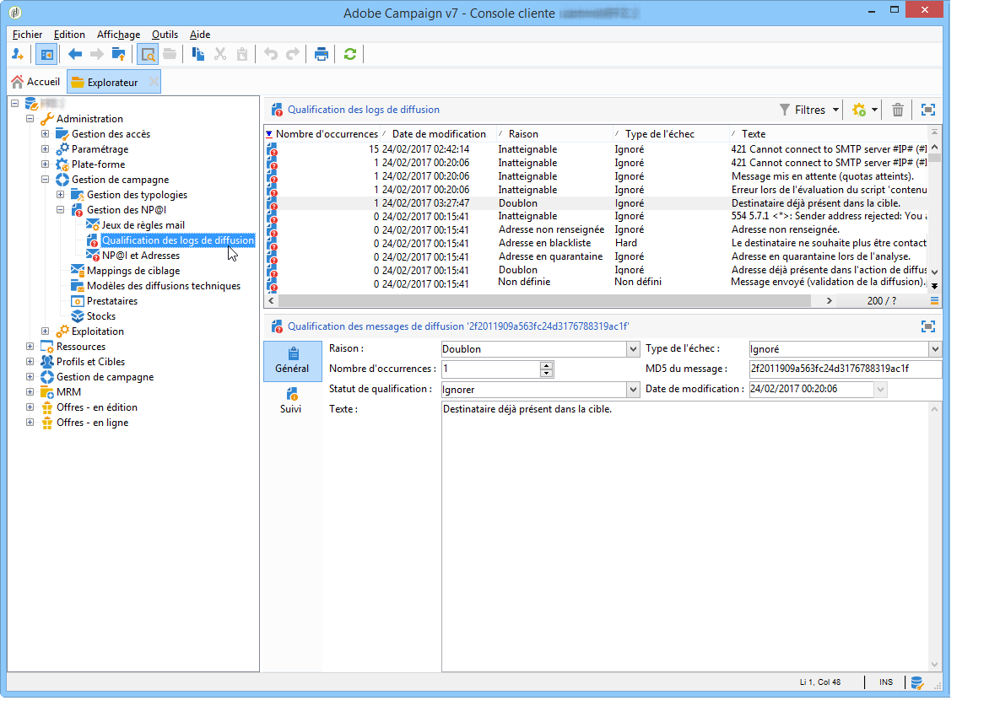
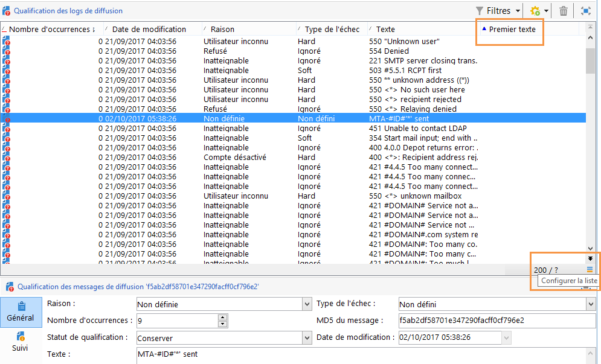
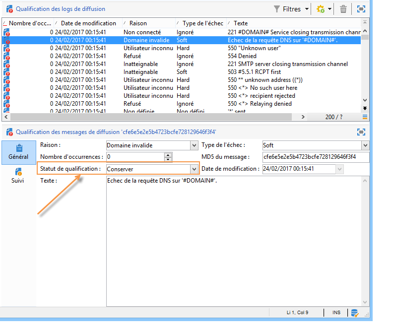
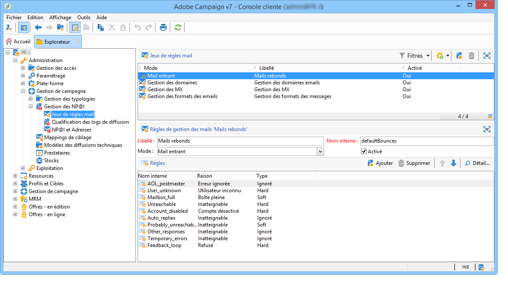
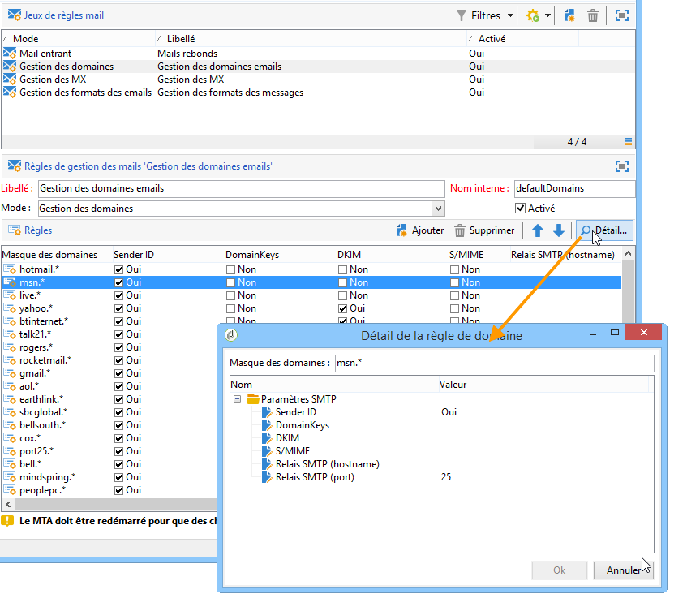

# Présentation des diffusions en échec{#understanding-delivery-failures}

## À propos des diffusions en échec {#about-delivery-failures}

Lorsqu&#39;un message (email, SMS, notification push) ne peut pas être envoyé à un profil, le serveur distant envoie automatiquement un message d&#39;erreur, qui est relevé par la plateforme Adobe Campaign et qualifié afin de déterminer si l&#39;adresse email ou le numéro de téléphone doit être mis ou non en quarantaine. Pour plus d’informations, consultez la section [Gestion des e-mails rejetés](#bounce-mail-management).

>[!NOTE]
>
>Les messages d’erreur **E-mail** (ou « rebonds ») sont qualifiés par le MTA amélioré (rebonds synchrones) ou par le traitement inMail (rebonds asynchrones).
>
>Les messages d&#39;erreur de type **SMS** (ou &quot;SR&quot; pour &quot;Status Report&quot;) sont qualifiés par le processus MTA.

Une fois un message envoyé, les logs de diffusion permettent de consulter le statut de la diffusion pour chaque profil ainsi que le type d&#39;échec et la raison associés.

Les messages peuvent être également exclus pendant la préparation de la diffusion si une adresse est mise en quarantaine ou si un profil est placé sur liste bloquée. Les messages exclus sont répertoriés dans le tableau de bord de la diffusion.

**Rubriques connexes :**

* [Logs et historique de la diffusion](delivery-dashboard.md#delivery-logs-and-history)
* [Statut En échec](delivery-performances.md#failed-status)
* [Types de diffusion en échec et raisons   &#x200B;](#delivery-failure-types-and-reasons)

## Types de diffusion en échec et raisons     {#delivery-failure-types-and-reasons}

Trois types d&#39;erreurs sont liés à un message en échec. Chaque type d&#39;erreur détermine si une adresse est mise en quarantaine. Pour plus d&#39;informations, consultez la section [Conditions de mise en quarantaine d&#39;une adresse](understanding-quarantine-management.md#conditions-for-sending-an-address-to-quarantine)

* **Hard** : une erreur de type &quot;hard&quot; indique une adresse invalide. Il s&#39;agit d&#39;un message d&#39;erreur indiquant explicitement que l&#39;adresse est invalide, par exemple : &quot;Utilisateur inconnu&quot;.
* **Soft** : il s&#39;agit d&#39;une erreur qui peut être temporaire, ou qui n&#39;a pas pu être qualifiée, par exemple : &quot;Domaine invalide&quot; ou &quot;Boîte pleine&quot;.
* **Ignoré** : il s&#39;agit d&#39;une erreur que l&#39;on sait temporaire, par exemple &quot;Out of office&quot;, ou d&#39;une erreur technique, par exemple si l&#39;expéditeur est de type &quot;postmaster&quot;.

Les motifs possibles d&#39;une diffusion en échec sont les suivants :

<table> 
 <tbody> 
  <tr> 
   <td> Libellé de l'erreur </td> 
   <td> Type d'erreur </td> 
   <td> Valeur technique </td> 
   <td> Description </td> 
  </tr> 
  <tr> 
   <td> Compte désactivé </td> 
   <td> Soft/Hard </td> 
   <td> 4 </td> 
   <td> Le compte associé à l’adresse n’est plus actif. Lorsque le fournisseur d’accès internet (FAI) détecte une inactivité prolongée, il peut fermer le compte de l’utilisateur ou de l’utilisatrice, ce qui rend les diffusions vers son adresse impossibles. Si le compte est temporairement désactivé en raison d’une inactivité de 6 mois et qu’il peut toujours être activé, le statut En erreur sera affecté. De nouvelles tentatives vers ce compte seront alors effectuées jusqu’à ce que le compteur d’erreurs atteigne 5. Si l’erreur indique que le compte est définitivement désactivé, il sera directement placé en quarantaine.  </td> 
  </tr> 
  <tr> 
   <td> Adresse en quarantaine </td> 
   <td> Hard </td> 
   <td> 9 </td> 
   <td> L'adresse a été mise en quarantaine.  </td> 
  </tr> 
  <tr> 
   <td> Adresse non renseignée </td> 
   <td> Hard </td> 
   <td> 7 </td> 
   <td> L'adresse du destinataire n'est pas renseignée.  </td> 
  </tr> 
  <tr> 
   <td> Adresse de mauvaise qualité </td> 
   <td> Ignoré </td> 
   <td> 14 </td> 
   <td> L'indice de qualité de l'adresse postale est trop faible.  </td> 
  </tr> 
  <tr> 
   <td> Adresse placée sur la liste bloquée </td> 
   <td> Hard </td> 
   <td> 8 </td> 
   <td> L'adresse a été ajoutée à la liste bloquée au moment de l'envoi. Cet état est utilisé pour importer des données à partir de listes externes et de systèmes externes dans la liste Quarantaine d'Adobe Campaign.  </td> 
  </tr> 
  <tr> 
   <td> Adresse témoin </td> 
   <td> Ignoré </td> 
   <td> 127 </td> 
   <td> L'adresse de l'expéditeur fait partie de la population témoin.  </td> 
  </tr> 
  <tr> 
   <td> Double </td> 
   <td> Ignoré </td> 
   <td> 10 </td> 
   <td> L'adresse du destinataire apparaissait déjà dans cette diffusion.  </td> 
  </tr> 
  <tr> 
   <td> Erreur ignorée </td> 
   <td> Ignoré </td> 
   <td> 25 </td> 
   <td> L'adresse est sur la liste autorisée. L'erreur est donc ignorée et un email sera envoyé.  </td> 
  </tr> 
  <tr> 
   <td> Exclu par un arbitrage </td> 
   <td> Ignoré </td> 
   <td> 12 </td> 
   <td> Le destinataire a été exclu par une règle de typologie de campagne de type 'arbitrage'.  </td> 
  </tr> 
  <tr> 
   <td> Exclu par une règle SQL </td> 
   <td> Ignoré </td> 
   <td> 11 </td> 
   <td> Le destinataire a été exclu par une règle de typologie de campagne de type 'SQL'.  </td> 
  </tr> 
  <tr> 
   <td> Domaine invalide </td> 
   <td> Soft </td> 
   <td> 2 </td> 
   <td> Le domaine de l’adresse e-mail est incorrect ou n’existe plus. Ce profil sera ciblé de nouveau jusqu’à ce que le compteur d’erreurs atteigne 5. Ensuite, l’enregistrement sera défini sur le statut Quarantaine et aucune autre reprise ne sera effectuée.  </td> 
  </tr> 
  <tr> 
   <td> Boîte pleine </td> 
   <td> Soft </td> 
   <td> 5 </td> 
   <td> La boîte de messagerie de l'utilisateur est pleine et ne peut plus accepter d'autres messages. Ce profil sera ciblé de nouveau jusqu'à ce que le nombre d'erreurs atteigne 5. Une fois ce chiffre atteint, l'enregistrement sera défini sur le statut Quarantaine et aucune autre reprise ne sera effectuée.  Ce type d'erreur est géré par un processus de nettoyage, l'adresse est défini sur un statut valide au bout de 30 jours.  Attention : pour que l'adresse soit automatiquement retirée de la liste des adresses en quarantaine, le workflow technique Nettoyage de la base (cleanup) doit être démarré.  </td> 
  </tr> 
  <tr> 
   <td> Non connecté </td> 
   <td> Ignoré </td> 
   <td> 6 </td> 
   <td> Le téléphone portable du destinataire est éteint ou n'est pas connecté au réseau au moment de l'envoi du message.  </td> 
  </tr> 
  <tr> 
   <td> Non définie </td> 
   <td> Non définie </td> 
   <td> 0 </td> 
   <td> L'adresse est en cours de qualification, car les erreurs n'ont pas encore été incrémentées. Ce type d'erreur apparaît lorsqu'un nouveau message d'erreur est envoyé par le serveur : il peut s'agir d'une erreur isolée, mais si elle se répète, le compteur d'erreurs augmente, ce qui permet d'alerter les équipes techniques. Elles peuvent ensuite analyser les messages et qualifier cette erreur, via le nœud Administration/Gestion de campagne/Gestion des NP@I dans l'arborescence.  </td> 
  </tr> 
  <tr> 
   <td> Non éligible aux offres </td> 
   <td> Ignoré </td> 
   <td> 16 </td> 
   <td> Le destinataire n'était pas éligible aux offres de la diffusion.  </td> 
  </tr> 
  <tr> 
   <td> Refusés </td> 
   <td> Soft/Hard </td> 
   <td> 20 </td> 
   <td> L’adresse a été mise en quarantaine en raison d’un retour de sécurité signalant du spam. En fonction de l’erreur, l’adresse fera l’objet de nouvelles tentatives jusqu’à ce que le compteur d’erreurs atteigne 5, ou elle sera directement placée en quarantaine.  </td> 
  </tr> 
  <tr> 
   <td> Cible limitée en taille </td> 
   <td> Ignoré </td> 
   <td> 17 </td> 
   <td> La taille de diffusion maximale a été atteinte pour le destinataire.  </td> 
  </tr> 
  <tr> 
   <td> Adresse non qualifiée </td> 
   <td> Ignoré </td> 
   <td> 15 </td> 
   <td> L'adresse postale n'a pas été qualifiée.  </td> 
  </tr> 
  <tr> 
   <td> Inatteignable </td> 
   <td> Soft/Hard </td> 
   <td> 3 </td> 
   <td> Une erreur s’est produite dans la chaîne de diffusion du message. Il peut s’agir d’un incident concernant le relais SMTP, d’un domaine temporairement inaccessible, etc. En fonction de l’erreur, l’adresse fera l’objet de nouvelles tentatives jusqu’à ce que le compteur d’erreurs atteigne 5, ou elle sera directement placée en quarantaine.  </td> 
  </tr> 
  <tr> 
   <td> Utilisateur inconnu </td> 
   <td> Hard </td> 
   <td> 1 </td> 
   <td> L’adresse n’existe pas. Aucune nouvelle tentative de diffusion ne sera effectuée pour ce profil.  </td> 
  </tr> 
 </tbody> 
</table>

## Reprises après une diffusion temporairement en échec {#retries-after-a-delivery-temporary-failure}

Si un message échoue en raison d&#39;une erreur Soft ou Ignoré qui est temporaire, les reprises seront effectuées pendant la durée de diffusion.**&#x200B;**&#x200B;**&#x200B;**

>[!NOTE]
>
>Les messages temporairement non diffusés peuvent uniquement être associés à une erreur **Soft** ou **Ignoré**, mais pas à une erreur **Hard** (voir la section [Types de diffusion en échec et raisons](#delivery-failure-types-and-reasons)).

>[!IMPORTANT]
>
>Pour les installations hébergées ou hybrides, si vous avez effectué une mise à niveau vers le [MTA amélioré](sending-with-enhanced-mta.md), les paramètres de reprise de la diffusion ne sont plus utilisés par Campaign. Les reprises des rebonds temporaires et l’intervalle qui les sépare sont déterminés par le MTA amélioré en fonction du type et de la gravité des réponses des rebonds provenant du domaine de messagerie du message.

Pour les installations on-premise et les installations hébergées/hybrides utilisant l&#39;ancien MTA de Campaign, accédez aux paramètres avancés de la diffusion ou du modèle de diffusion et spécifiez la durée souhaitée dans le champ correspondant pour modifier la durée d&#39;une diffusion. Voir cette [page](communication-channels.md) sous **Envoi de diffusion** > **Définir la période de validité**.

Le paramétrage par défaut prévoit cinq reprises séparées d&#39;une heure chacune, puis une reprise par jour pendant quatre jours. Le nombre de reprises peut être changé de manière globale (contactez l’administrateur technique Adobe) ou pour chaque diffusion ou modèle de diffusion. Voir cette [page](communication-channels.md) sous **Envoi de diffusion** > **Configurer les reprises**.

## Erreurs synchrones et asynchrones {#synchronous-and-asynchronous-errors}

Un message peut échouer immédiatement (erreur synchrone) ou plus tard, après son envoi (erreur asynchrone).

* Erreur synchrone : le serveur de mail distant contacté par le serveur de diffusion Adobe Campaign a retourné immédiatement un message d&#39;erreur ; la diffusion ne peut être envoyée au serveur du profil. Adobe Campaign qualifie chaque échec afin de déterminer si les adresses email concernées doivent être mises en quarantaine ou non. Voir [Qualification des e-mails rejetés](#bounce-mail-qualification).
* Erreur asynchrone : un mail rebond ou un SR a été renvoyé plus tard par le serveur de réception. Ce mail est récupéré dans une boîte email technique relevée par l&#39;application pour marquer les messages en erreur. Les erreurs asynchrones peuvent se produire jusqu&#39;à une semaine après l&#39;envoi d&#39;une diffusion.

  >[!NOTE]
  >
  >Le paramétrage de la boîte des mails rebonds est décrit dans [cette section](../../installation/using/deploying-an-instance.md#managing-bounced-emails).

  Le [système de feedback](https://experienceleague.adobe.com/docs/deliverability-learn/deliverability-best-practice-guide/transition-process/infrastructure.html?lang=fr#feedback-loops) fonctionne comme les e-mails rejetés. Lorsqu’un utilisateur ou une utilisatrice qualifie un e-mail de spam, vous pouvez configurer des règles d’e-mail dans Adobe Campaign pour bloquer toutes les diffusions vers cette personne. Les messages envoyés à des personnes qui ont qualifié un e-mail comme spam sont automatiquement redirigés vers une boîte de réception spécialement créée à cet effet. Les adresses de ces utilisateurs figurent sur la liste bloquée même s&#39;ils n&#39;ont pas cliqué sur le lien de désinscription. Les adresses figurent sur la liste bloquée de la table des quarantaines (**NmsAddress**) et non de la table des destinataires (**NmsRecipient**).

  >[!NOTE]
  >
  >La gestion des plaintes est décrite dans la section [Gestion de la délivrabilité](about-deliverability.md).

## Gestion des e-mails rejetés {#bounce-mail-management}

La plateforme d&#39;Adobe Campaign vous permet de gérer les échecs de diffusion email par le biais de la fonctionnalité de mail rebond.

Lorsqu&#39;un email ne peut pas être envoyé à un destinataire, le serveur de messagerie distant renvoie automatiquement un message d&#39;erreur (mail rebond) à une boîte de réception technique conçue à cet effet.

Pour les installations on-premise et les installations hébergées/hybrides utilisant l’ancien MTA de Campaign, les messages d&#39;erreur sont collectés par la plateforme d&#39;Adobe Campaign et qualifiés par le processus inMail pour enrichir la liste des règles de gestion des emails.

>[!IMPORTANT]
>
>Pour les installations hébergées ou hybrides, si vous avez effectué la mise à niveau vers le [MTA amélioré](sending-with-enhanced-mta.md), les règles de gestion des emails ne sont plus utilisées. Voir à ce propos [cette section](#email-management-rules).

### Qualification des e-mails rejetés {#bounce-mail-qualification}

>[!IMPORTANT]
>
>Pour les installations hébergées ou hybrides, si vous avez effectué la mise à niveau vers le [MTA amélioré](sending-with-enhanced-mta.md) :
>
>* Les qualifications de rebond dans la table **[!UICONTROL Qualification des logs de diffusion]** ne sont plus utilisées pour les messages d&#39;erreur relatifs aux échecs des diffusions synchrones. **&#x200B;**&#x200B;Le MTA amélioré détermine le type et la qualification de rebond, puis renvoie ces informations à Campaign.
>
>* Les rebonds **asynchrones** restent qualifiés par le processus inMail grâce aux règles de **[!UICONTROL mail entrant]**. Pour plus d&#39;informations, consultez la section [Règles de gestion des emails](#email-management-rules).
>
>* Pour les instances qui utilisent le MTA amélioré **sans WebHooks**, les règles d’**[!UICONTROL e-mail entrant]** sont également utilisées pour traiter les e-mails rebonds synchrones provenant du MTA amélioré, avec la même adresse e-mail que pour les e-mails rebonds asynchrones.

Pour les installations on-premise et les installations hébergées/hybrides utilisant l’ancien MTA de Campaign, lorsque la diffusion d&#39;un email échoue, le serveur de diffusion d&#39;Adobe Campaign reçoit un message d&#39;erreur du serveur de messagerie ou du serveur DNS distant. La liste des erreurs est composée de chaînes contenues dans le message renvoyé par le serveur distant. Les types et raisons des échec sont affectés à chaque message d&#39;erreur.

Cette liste est disponible depuis le nœud **[!UICONTROL Administration > Gestion de campagne > Gestion des NP@I > Qualification des logs de diffusion]**. Il contient toutes les règles utilisées par Adobe Campaign pour qualifier les erreurs de diffusion. Cette liste est non exhaustive et est régulièrement mise à jour par Adobe Campaign. Elle peut également être gérée par l&#39;utilisateur.

Le message renvoyé par le serveur distant à la première occurrence de ce type d&#39;erreur est affiché dans la colonne **[!UICONTROL Premier texte]** de la table **[!UICONTROL Qualification des logs de diffusion]**. Si cette colonne n&#39;est pas visible, cliquez sur le bouton **[!UICONTROL Configurer la liste]** en bas à droite de la liste pour la sélectionner.

Adobe Campaign filtre ce message pour supprimer le contenu de la variable (identifiants, dates, adresses email, numéros de téléphone, etc.) et affiche le résultat filtré dans la colonne **[!UICONTROL Texte]**. Les variables sont remplacées par **`#xxx#`**, à l&#39;exception des adresses remplacées par **`*`**.

Ce processus permet de regrouper tous les échecs d&#39;un même type et d&#39;éviter plusieurs entrées pour des erreurs similaires dans la table Qualification des logs de diffusion.

>[!NOTE]
>
>Le champ **[!UICONTROL Nombre d&#39;occurrences]** affiche le nombre d&#39;occurrences du message dans la liste. Ce nombre est limité à 100 000 occurrences. Vous pouvez modifier le champ si vous le souhaitez, par exemple pour le réinitialiser.

Les statuts de qualification des mails rebonds sont les suivants :

* **[!UICONTROL À qualifier]** : l’e-mail rejeté n’a pas pu être qualifié. La qualification doit être confiée à l’équipe chargée de la délivrabilité afin de garantir une délivrabilité efficace de la plateforme. Tant qu&#39;il n&#39;est pas qualifié, le mail rebond n&#39;est pas utilisé pour compléter la liste des règles de gestion des emails.
* **[!UICONTROL Conserver]** : l’e-mail rejeté a été qualifié et sera utilisé par le workflow **Mise à jour pour la délivrabilité** pour être comparé aux règles de gestion des e-mails existantes et en enrichir la liste.
* **[!UICONTROL Ignorer]** : le mail rebond est ignoré par le MTA de Campaign, ce qui signifie que ce rebond ne provoquera jamais la mise en quarantaine de l&#39;adresse du destinataire. Il ne sera pas utilisé par le workflow **Mise à jour pour la délivrabilité** et il ne sera pas envoyé aux instances clientes.

>[!NOTE]
>
>En cas de panne d&#39;un fournisseur de services Internet, les emails envoyés par le biais de Campaign seront incorrectement marqués comme des rebonds. Pour corriger ce problème, vous devez mettre à jour la qualification des rebonds. Pour plus d’informations à ce sujet, consultez [cette page](update-bounce-qualification.md).

### Règles de gestion des emails {#email-management-rules}

>[!IMPORTANT]
>
>Pour les installations hébergées ou hybrides, si vous avez effectué la mise à niveau vers le [MTA amélioré](sending-with-enhanced-mta.md), les règles de gestion des emails ne sont plus utilisées. Pour plus de détails, voir les sections ci-dessous.

Les règles mail sont accessibles depuis le nœud **[!UICONTROL Administration > Gestion de campagne > Gestion des NP@I > Jeux de règles mail]**. Vous pouvez consulter les règles de gestion des emails dans la section inférieure de la fenêtre.

>[!NOTE]
>
>Les paramètres par défaut de la plateforme sont configurés dans l&#39;assistant de déploiement. Pour plus d’informations, consultez [cette section](../../installation/using/deploying-an-instance.md).

Les règles par défaut sont les suivantes.

>[!IMPORTANT]
>
>* Le serveur de diffusion (MTA) doit être redémarré si les paramètres sont modifiés.
>* La modification ou la création de règles de gestion est réservée à des utilisateurs experts.

#### Mail entrant {#inbound-email}

<!--
STATEMENT ONLY TRUE with Momentum and EFS+:
For hosted or hybrid installations, if you have upgraded to the [Enhanced MTA](sending-with-enhanced-mta.md), and if your instance has **Webhooks** functionality, the **[!UICONTROL Inbound email]** rules are no longer used for synchronous delivery failure error messages. For more on this, see [this section](#bounce-mail-qualification).

For on-premise installations and hosted/hybrid installations using the legacy Campaign MTA, these rules contain the list of character strings which can be returned by remote servers and which let you qualify the error (**Hard**, **Soft** or **Ignored**).-->

Les règles **[!UICONTROL Mail entrant]** contiennent la liste des chaînes de caractères qui peuvent être renvoyées par les serveurs distants et qui permettent de qualifier l’erreur en **Hard**, **Soft** ou **Ignoré**.

Lors de l’échec de l’envoi d’un e-mail, le serveur de messagerie distant renvoie un message de rebond à l’adresse spécifiée dans les [paramètres de la plateforme](../../installation/using/deploying-an-instance.md). Adobe Campaign compare le contenu de chaque rebond aux chaînes disponibles dans la liste des règles, puis attribue l’un des trois [types d’erreurs](#delivery-failure-types-and-reasons).

>[!NOTE]
>
>L’utilisateur peut créer ses propres règles. Lors d&#39;un import de package et lors de la mise à jour des données par le workflow **Mise à jour pour la délivrabilité**, les règles mail créées par l&#39;utilisateur sont écrasées.

Pour plus d&#39;informations sur la qualification des mails rebonds, consultez [cette section](#bounce-mail-qualification).

#### Gestion des domaines {#domain-management}

>[!IMPORTANT]
>
>Pour les installations hébergées ou hybrides, si vous avez effectué la mise à niveau vers le [MTA amélioré](sending-with-enhanced-mta.md), les règles de **[!UICONTROL gestion des domaines]** ne sont plus utilisées. La signature d&#39;authentification des emails **DKIM (DomainKeys Identified Mail)** est effectuée par le MTA amélioré pour tous les messages et tous les domaines. La signature n&#39;utilise ni **Sender ID**, ni **DomainKeys** ou **S/MIME**, sauf indication contraire du MTA amélioré.

Pour les installations on-premise et les installations hébergées/hybrides utilisant l&#39;ancien MTA de Campaign, le serveur de messagerie d&#39;Adobe Campaign applique une règle de **Gestion des domaines** unique à tous les domaines.

<!---->

* Vous pouvez choisir d&#39;activer ou non certaines normes d&#39;identification et clés de chiffrement pour vérifier le nom de domaine, comme **Sender ID**, **DomainKeys**, **DKIM**, **S/MIME**.
* Les paramètres de **Relais SMTP** permettent de configurer l’adresse IP et le port d’un serveur relais pour un domaine particulier. Voir à ce propos [cette section](../../installation/using/configuring-campaign-server.md#smtp-relay).

Si vos messages sont affichés dans Outlook avec la mention **[!UICONTROL Au nom de]** dans l&#39;adresse de l&#39;expéditeur, veillez à ne pas signer vos emails avec le **Sender ID** qui est la norme d&#39;authentification de messagerie exclusive de Microsoft, devenue obsolète. Si l&#39;option **[!UICONTROL Sender ID]** est activée, décochez la case correspondante et contactez l&#39;[Assistance clientèle d&#39;Adobe Campaign](https://helpx.adobe.com/fr/enterprise/admin-guide.html/enterprise/using/support-for-experience-cloud.ug.html). Il n&#39;y aura aucune incidence sur la délivrabilité.

#### Gestion des MX {#mx-management}

>[!IMPORTANT]
>
>Pour les installations hébergées ou hybrides, si vous avez effectué la mise à niveau vers le [MTA amélioré](sending-with-enhanced-mta.md), les règles de débit de diffusion avec **[!UICONTROL Gestion des MX]** ne sont plus utilisées. Le MTA amélioré utilise ses propres règles MX. Il peut ainsi personnaliser le débit par domaine en fonction de vos historiques de réputation de diffusion d’e-mails et des retours en temps réel issus de domaines auxquels vous envoyez des e-mails.

Pour les installations on-premise et les installations hébergées/hybrides utilisant l&#39;ancien MTA de Campaign :

* Les règles de gestion MX permettent de réguler le flux des emails sortants pour un domaine spécifique. Elles consistent à faire un échantillonnage des messages de rebond et de bloquer les envois, le cas échéant.

* Le serveur de messagerie d&#39;Adobe Campaign applique les règles spécifiques aux domaines, puis celles du cas général, symbolisé par un astérisque dans la liste des règles.

* Pour configurer des règles de gestion MX, il suffit de fixer un seuil et de sélectionner certains paramètres SMTP. Le **seuil** est une limite calculée en pourcentage d&#39;erreur au-delà de laquelle tout message vers un domaine spécifique est bloqué. Par exemple, dans le cas général, pour un minimum de 300 messages, l&#39;envoi des emails est bloqué pendant 3 heures si le taux d&#39;erreur atteint 90 %.

Pour plus d&#39;informations sur la gestion des MX, consultez [cette section](../../installation/using/email-deliverability.md#mx-configuration).
