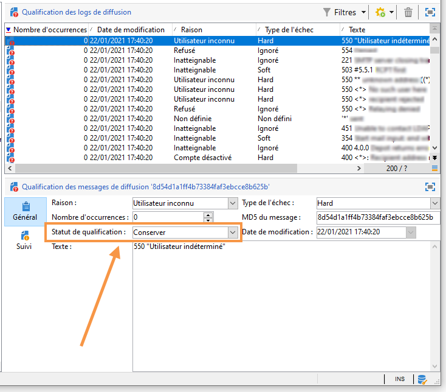

# Comprendre les diffusions en échec{#understanding-delivery-failures}

## A propos des diffusions en échec {#about-delivery-failures}

Lorsqu’un message (courrier électronique, SMS, notification Push) ne peut pas être envoyé à un, le serveur distant envoie automatiquement un message d’erreur, qui est sélectionné par la plateforme  et qualifié pour déterminer si l’adresse électronique ou le numéro de téléphone doit être mis en quarantaine ou non. See [Bounce mail management](#bounce-mail-management).

>[!NOTE]
>
>Les messages d&#39;erreur de type Email (ou &quot;bounces&quot;) sont qualifiés par le processus inMail. Les messages d&#39;erreur de type SMS (ou &quot;SR&quot; pour &quot;Status Report&quot;) sont qualifiés par le processus MTA.

Une fois un message envoyé, les logs de diffusion permettent de consulter le statut de la diffusion pour chaque profil ainsi que le type d&#39;échec et la raison associés.

Les messages peuvent être également exclus pendant la préparation de la diffusion si une adresse est mise en quarantaine ou un profil blacklisté. Les messages exclus sont listés dans le tableau de bord de la diffusion.

**Rubriques connexes :**

* [Logs et historique de la diffusion](../../delivery/using/monitoring-a-delivery.md#delivery-logs-and-history)
* [Statut En échec](../../delivery/using/monitoring-a-delivery.md#failed-status)
* [Types de diffusion en échec et raisons ](#delivery-failure-types-and-reasons)

## Types de diffusion en échec et raisons  {#delivery-failure-types-and-reasons}

Il existe trois types d’erreur lorsqu’un message échoue. Chaque type d’erreur détermine si une adresse est envoyée au  du. Pour plus d&#39;informations, reportez-vous aux [Conditions d&#39;envoi d&#39;une adresse au](../../delivery/using/understanding-quarantine-management.md#conditions-for-sending-an-address-to-quarantine)

* **Hard** : une erreur de type &quot;hard&quot; indique une adresse invalide. Il s&#39;agit d&#39;un message d&#39;erreur indiquant explicitement que l&#39;adresse est invalide, par exemple : &quot;Utilisateur inconnu&quot;.
* **Soft** : il s&#39;agit d&#39;une erreur qui peut être temporaire, ou qui n&#39;a pas pu être qualifiée, par exemple : &quot;Domaine invalide&quot; ou &quot;Boîte pleine&quot;.
* **Ignoré** : il s&#39;agit d&#39;une erreur que l&#39;on sait temporaire, par exemple &quot;Out of office&quot;, ou d&#39;une erreur technique, par exemple si l&#39;expéditeur est de type &quot;postmaster&quot;.

Les motifs possibles d&#39;une diffusion en échec sont les suivants :

<table> 
 <tbody> 
  <tr> 
   <td> Libellé de l'erreur </td> 
   <td> Type d'erreur </td> 
   <td> Valeur technique </td> 
   <td> Description </td> 
  </tr> 
  <tr> 
   <td> Compte désactivé </td> 
   <td> Soft/Hard </td> 
   <td> 4 </td> 
   <td> Le compte associé à l'adresse n'est plus actif. Lorsque le Fournisseur d'Accès Internet (FAI) détecte une inactivité prolongée, il peut fermer le compte de l'utilisateur, ce qui rend les diffusions vers son adresse impossibles. Si le compte est temporairement désactivé en raison d'une inactivité de 6 mois et qu’il peut toujours être activé, le statut En erreur sera affecté. Une tentative d'utilisation du compte est alors effectuée jusqu’à ce que le compteur d'erreurs atteigne 5. Si l'erreur signale que le compte est désactivé de manière permanente, il sera directement défini comme étant en quarantaine.  </td> 
  </tr> 
  <tr> 
   <td> Adresse en quarantaine </td> 
   <td> Hard </td> 
   <td> 9 </td> 
   <td> L'adresse a été mise en quarantaine.  </td> 
  </tr> 
  <tr> 
   <td> Adresse non renseignée </td> 
   <td> Hard </td> 
   <td> 7 </td> 
   <td> L'adresse du destinataire n'est pas renseignée.  </td> 
  </tr> 
  <tr> 
   <td> Adresse de mauvaise qualité </td> 
   <td> Ignoré </td> 
   <td> 14 </td> 
   <td> L'indice de qualité de l'adresse postale est trop faible.  </td> 
  </tr> 
  <tr> 
   <td> Adresse en blackliste </td> 
   <td> Hard </td> 
   <td> 8 </td> 
   <td> L'adresse était en blackliste au moment de l'envoi. Ce statut est utilisé pour importer des données depuis des listes externes et des systèmes externes lors de l'import de données dans la liste de quarantaine Adobe Campaign.  </td> 
  </tr> 
  <tr> 
   <td> Adresse témoin </td> 
   <td> Ignoré </td> 
   <td> 127 </td> 
   <td> L'adresse de l'expéditeur fait partie de la population témoin.  </td> 
  </tr> 
  <tr> 
   <td> Double </td> 
   <td> Ignoré </td> 
   <td> 10 </td> 
   <td> L'adresse du destinataire apparaissait déjà dans cette diffusion.  </td> 
  </tr> 
  <tr> 
   <td> Erreur ignorée </td> 
   <td> Aucune erreur </td> 
   <td> 25 </td> 
   <td> L'adresse est en whiteliste et un email lui sera envoyé dans tous les cas.  </td> 
  </tr> 
  <tr> 
   <td> Exclu par un arbitrage </td> 
   <td> Ignoré </td> 
   <td> 12 </td> 
   <td> Le destinataire a été exclu par une règle de typologie de campagne de type 'arbitrage'.  </td> 
  </tr> 
  <tr> 
   <td> Exclu par une règle SQL </td> 
   <td> Ignoré </td> 
   <td> 11 </td> 
   <td> Le destinataire a été exclu par une règle de typologie de campagne de type 'SQL'.  </td> 
  </tr> 
  <tr> 
   <td> Domaine invalide </td> 
   <td> Soft </td> 
   <td> 2 </td> 
   <td> Le domaine de l'adresse email est erroné ou n'existe plus. Ce profil sera ciblé de nouveau jusqu'à ce que le nombre d'erreurs atteigne 5. Une fois ce chiffre atteint, l'enregistrement sera défini sur le statut Quarantaine et aucune autre reprise ne sera effectuée.  </td> 
  </tr> 
  <tr> 
   <td> Boîte pleine </td> 
   <td> Soft </td> 
   <td> 5 </td> 
   <td> La boîte de messagerie de l'utilisateur est pleine et ne peut plus accepter d'autres messages. Ce profil sera ciblé de nouveau jusqu'à ce que le nombre d'erreurs atteigne 5. Une fois ce chiffre atteint, l'enregistrement sera défini sur le statut Quarantaine et aucune autre reprise ne sera effectuée.  Ce type d'erreur est géré par un processus de nettoyage, l'adresse est défini sur un statut valide au bout de 30 jours.  Attention : pour que l'adresse soit automatiquement retirée de la liste des adresses en quarantaine, le workflow technique Nettoyage de la base (cleanup) doit être démarré.  </td> 
  </tr> 
  <tr> 
   <td> Non connecté </td> 
   <td> Ignoré </td> 
   <td> 6 </td> 
   <td> Le téléphone portable du destinataire est éteint ou n'est pas connecté au réseau au moment de l'envoi du message.  </td> 
  </tr> 
  <tr> 
   <td> Non définie </td> 
   <td> Non définie </td> 
   <td> 0 </td> 
   <td> L'adresse est en cours de qualification, car les erreurs n'ont pas encore été incrémentées. Ce type d'erreur apparaît lorsqu'un nouveau message d'erreur est envoyé par le serveur : il peut s'agir d'une erreur isolée, mais si elle se répète, le compteur d'erreur augmente, ce qui permet d'alerter les équipes techniques. Celles-ci peuvent ensuite effectuer une analyse du message et qualifier cette erreur à partir du nœud Administration / Gestion de campagne / Gestion des NP@I dans l'arborescence.  </td> 
  </tr> 
  <tr> 
   <td> Non éligible aux offres </td> 
   <td> Ignoré </td> 
   <td> 16 </td> 
   <td> Le destinataire n'était pas éligible aux offres de la diffusion.  </td> 
  </tr> 
  <tr> 
   <td> Refusés </td> 
   <td> Soft/Hard </td> 
   <td> 20 </td> 
   <td> L'adresse a été mise en quarantaine en raison d'un retour de sécurité signalant du spam. Selon l'erreur, l'adresse sera utilisée de nouveau jusqu'à ce que le compteur d'erreur atteigne 5 ou elle sera directement mise en quarantaine.  </td> 
  </tr> 
  <tr> 
   <td> Cible limitée en taille </td> 
   <td> Ignoré </td> 
   <td> 17 </td> 
   <td> La taille de diffusion maximale a été atteinte pour le destinataire.  </td> 
  </tr> 
  <tr> 
   <td> Adresse non qualifiée </td> 
   <td> Ignoré </td> 
   <td> 15 </td> 
   <td> L'adresse postale n'a pas été qualifiée.  </td> 
  </tr> 
  <tr> 
   <td> Inatteignable </td> 
   <td> Soft/Hard </td> 
   <td> 3 </td> 
   <td> Une erreur s'est produite dans la chaîne de distribution du message. Il peut s'agir d'un incident sur le relais SMTP, d'un domaine temporairement inatteignable, etc. Selon l'erreur, l'adresse sera utilisée de nouveau jusqu'à ce que le compteur d'erreur atteigne 5 ou elle sera directement mise en quarantaine.  </td> 
  </tr> 
  <tr> 
   <td> Utilisateur inconnu </td> 
   <td> Hard </td> 
   <td> 1 </td> 
   <td> L'adresse n'existe pas. Aucune autre diffusion ne sera envoyée pour ce profil.  </td> 
  </tr> 
 </tbody> 
</table>

## Reprises après une diffusion temporairement en échec  {#retries-after-a-delivery-temporary-failure}

Si un message échoue en raison d&#39;une erreur Soft ou Ignoré qui est temporaire, les reprises seront effectuées pendant la durée de diffusion.********

>[!NOTE]
>
>Temporarily undelivered messages can only be related to a **Soft** or **Ignored** error, but not a **Hard** error (see [Delivery failure types and reasons](#delivery-failure-types-and-reasons)).

Pour modifier la durée d&#39;une diffusion, accédez aux paramètres avancés de la diffusion ou du modèle de diffusion et indiquez la durée souhaitée dans le champ correspondant. Les propriétés avancées des diffusions sont présentées dans [cette section](../../delivery/using/steps-sending-the-delivery.md#defining-validity-period).

La configuration par défaut permet cinq reprises à des intervalles d&#39;une heure chacune, puis une reprise par jour pendant quatre jours. Le nombre de reprises peut être changé de manière globale (contactez l&#39;administrateur technique Adobe) ou pour chaque diffusion ou modèle de diffusion (voir [cette section](../../delivery/using/steps-sending-the-delivery.md#configuring-retries)).

## Erreurs synchrones et asynchrones  {#synchronous-and-asynchronous-errors}

Un message peut échouer immédiatement (erreur synchrone) ou plus tard, après son envoi (erreur asynchrone).

* Erreur synchrone : le serveur de messagerie distant contacté par le serveur  Adobe Campaign a immédiatement renvoyé un message d&#39;erreur, leserveur de messagerie n&#39;est pas autorisé à être envoyé au serveur de l&#39;.  Adobe Campaign qualifie chaque erreur afin de déterminer si les adresses électroniques concernées doivent être mises en quarantaine ou non. Voir [Qualification des emails bounce](#bounce-mail-qualification).
* Erreur asynchrone : un mail rebond ou un SR a été renvoyé plus tard par le serveur de réception. Ce mail est récupéré dans une boîte email technique relevée par l&#39;application pour marquer les messages en erreur. Les erreurs asynchrones peuvent se produire jusqu&#39;à une semaine après l&#39;envoi d&#39;une diffusion.

   >[!NOTE]
   >
   >Le paramétrage de la boîte des mails rebonds est décrit dans [cette section](../../installation/using/deploying-an-instance.md#managing-bounced-emails).

   Le système de gestion des plaintes (feedback loop) fonctionne selon le même principe que les mails rebonds. Lorsqu&#39;un utilisateur déclare un email comme indésirable, il est possible de configurer des règles mails dans Adobe Campaign afin de bloquer tout nouvel envoi à ces utilisateurs. Les messages envoyés aux utilisateurs qui ont déclaré un indésirable sont redirigés automatiquement vers une boîte email créée spécialement pour cela. Les adresses de ces utilisateurs sont blacklistées, bien qu&#39;ils n&#39;aient pas cliqué sur le lien de désinscription. Les adresses sont donc blacklistées dans la table des quarantaines (**NmsAddress**) et non dans la table des destinataires (**NmsRecipient**).

   >[!NOTE]
   >
   >La gestion des plaintes est décrite dans la section [Gestion de la délivrabilité](../../delivery/using/about-deliverability.md).

## Gestion des emails bounce {#bounce-mail-management}

La plateforme Adobe Campaign permet de gérer les échecs d&#39;envoi d&#39;email via la fonctionnalité des mails rebonds. Lorsqu&#39;un email ne peut pas être délivré à son destinataire, le serveur de messagerie distant renvoie automatiquement un message d&#39;erreur (mail rebond) vers une boîte email technique réservée à cet usage. Les messages d&#39;erreur sont relevés par la plateforme Adobe Campaign et qualifiés par le processus inMail afin d&#39;enrichir la liste des règles de gestion des emails.

### Qualification des emails bounce  {#bounce-mail-qualification}

Lorsque l&#39;envoi d&#39;un email échoue, le serveur de diffusion Adobe Campaign reçoit un message d&#39;erreur de la part du serveur de messagerie ou du serveur DNS distant. La liste des erreurs est constituée à partir des chaînes contenues dans le message renvoyé par le serveur distant. A chaque message d&#39;erreur sont attribués un type et une raison d&#39;échec.

Ce  est disponible via le **[!UICONTROL Administration > Campaign Management > Non deliverables Management > Delivery log qualification]** noeud. Il contient toutes les règles utilisées par  Adobe Campaign pour qualifier les échecs de l&#39;. Il n&#39;est pas exhaustif et est régulièrement mis à jour par  Adobe Campaign et peut également être géré par l&#39;utilisateur.

* Le message renvoyé par le serveur distant lors de la première occurrence de ce type d’erreur s’affiche dans la **[!UICONTROL First text]** colonne du **[!UICONTROL Delivery log qualification]** tableau. Si cette colonne n’est pas affichée, cliquez sur le **[!UICONTROL Configure list]** bouton situé dans la partie inférieure droite du pour la sélectionner.

 Adobe Campaign ce message pour supprimer le contenu de la variable (ID, dates, adresses électroniques, numéros de téléphone, etc.) et affiche le résultat filtré dans la **[!UICONTROL Text]** colonne. Les variables sont remplacées par **`#xxx#`**, à l’exception des adresses remplacées par **`*`**.

Ce processus permet de regrouper tous les échecs d&#39;un même type et d&#39;éviter plusieurs entrées pour des erreurs similaires dans la table Qualification des logs de diffusion.

>[!NOTE]
>
>Le **[!UICONTROL Number of occurrences]** champ affiche le nombre d’occurrences du message dans le  du. Elle est limitée à 100 000 occurrences. Vous pouvez modifier le champ, si vous souhaitez, par exemple, le réinitialiser.

Les statuts de qualification des mails rebonds sont les suivants :

* **[!UICONTROL To qualify]** : le courrier rebond n&#39;a pas pu être qualifié. La qualification doit être attribuée à l&#39;équipe de délivrabilité pour garantir une livraison efficace de la plateforme. Tant qu&#39;il n&#39;est pas qualifié, le courrier de rebonds n&#39;est pas utilisé pour enrichir le des règles de gestion du courrier électronique.
* **[!UICONTROL Keep]** : le courrier de rebonds a été qualifié et sera utilisé par le processus **Actualiser pour la délivrabilité** afin d’être comparé aux règles de gestion des courriers électroniques existantes et d’enrichir le.
* **[!UICONTROL Ignore]** : le courrier de rebonds a été qualifié, mais ne sera pas utilisé par le processus **Actualiser pour la délivrabilité** . Elle ne sera pas envoyée aux instances client.

Pour les installations hébergées ou hybrides, si vous avez effectué la mise à niveau vers la MTA améliorée :

* Les qualifications de rebond dans le **[!UICONTROL Delivery log qualification]** tableau ne sont plus utilisées pour les messages d’erreur de  synchrones. La MTA améliorée détermine le type de rebond et la qualification et renvoie ces informations à Campaign.

* Les rebonds asynchrones sont toujours qualifiés par le processus inMail via les **[!UICONTROL Inbound email]** règles. For more on this, see [Email management rules](#email-management-rules).

* Pour les instances qui utilisent la MTA améliorée sans **WebHooks/EFS**, les **[!UICONTROL Inbound email]** règles sont également utilisées pour traiter les courriers électroniques de rebonds synchrones provenant de la MTA améliorée, en utilisant la même adresse électronique que pour les courriers électroniques de rebonds asynchrones.

Pour plus d’informations sur le MTA amélioré d&#39;Adobe Campaign, reportez-vous à ce [document](https://helpx.adobe.com/campaign/kb/campaign-enhanced-mta.html).

### Règles de gestion des emails {#email-management-rules}

Les règles de courrier sont accessibles via le **[!UICONTROL Administration > Campaign Management > Non deliverables Management > Mail rule sets]** noeud. Les règles de gestion des courriers électroniques sont affichées dans la partie inférieure de la fenêtre.

Ces règles contiennent la liste des chaînes de caractères qui peuvent être renvoyées par les serveurs distants et qui permettent de qualifier l&#39;erreur en **Hard**, **Soft** ou **Ignoré**.

>[!NOTE]
>
>Les paramètres par défaut de la plateforme sont configurés dans l&#39;assistant de déploiement. Pour plus d&#39;information, reportez-vous à [cette section](../../installation/using/deploying-an-instance.md).

Les règles par défaut sont les suivantes :

* **Mail entrant**

   En cas d’échec d’un courrier électronique, le serveur distant renvoie un message de retour à l’adresse spécifiée dans les paramètres de la plate-forme.

   Adobe Campaign compare le contenu de chaque mail rebond aux chaînes disponibles dans la liste des règles puis attribue l&#39;un des trois types d&#39;erreur.

   L&#39;utilisateur peut créer ses propres règles.

   >[!IMPORTANT]
   >
   >Lors d&#39;un import de package et lors de la mise à jour des données par le workflow **Mise à jour pour la délivrabilité**, les règles mail créées par l&#39;utilisateur sont écrasées.

   Pour plus d&#39;informations sur la qualification du courrier de rebonds, consultez [cette section](#bounce-mail-qualification).

   >[!NOTE]
   >
   >Pour les installations hébergées ou hybrides, si vous avez effectué la mise à niveau vers la MTA améliorée, les **[!UICONTROL Inbound email]** règles ne sont plus utilisées pour les messages d’erreur d’échec  synchrones. Voir à ce propos [cette section](#bounce-mail-qualification).
   >
   >Pour plus d’informations sur le MTA amélioré d&#39;Adobe Campaign, reportez-vous à ce [document](https://helpx.adobe.com/campaign/kb/campaign-enhanced-mta.html).

* **Gestion des domaines**

   Le serveur de messagerie d’Adobe Campaign applique les règles spécifiques aux domaines, puis celles du cas général symbolisé par un astérisque dans la liste des règles.

   Des règles pour les domaines hotmail et msn sont disponibles par défaut dans Adobe Campaign.

   Click the **[!UICONTROL Detail]** icon to access rule configuration.

   

   Les **paramètres SMTP** agissent comme des filtres appliqués pour une règle de blocage.

   * Vous pouvez choisir d&#39;activer ou non certaines normes d&#39;identification et clés de cryptage pour vérifier le nom de domaine, comme **Sender ID**, **DomainKeys**, **DKIM**, **S/MIME**.
   * **Relais SMTP** : permet de configurer l&#39;adresse IP et le port d&#39;un serveur relais pour un domaine particulier. Voir à ce propos [cette section](../../installation/using/configuring-campaign-server.md#smtp-relay).
   Si vos messages sont affichés dans Outlook **[!UICONTROL on behalf of]** avec un nom de domaine différent, assurez-vous de ne pas signer vos courriels avec l&#39;ID **d&#39;** expéditeur, qui est la norme d&#39;authentification de messagerie propriétaire obsolète de Microsoft. Si l’ **[!UICONTROL Sender ID]** option est activée, décochez la case correspondante et contactez l’assistance Adobe Campaign . Votre délivrabilité ne sera pas affectée.

   >[!NOTE]
   >
   >Pour les installations hébergées ou hybrides, si vous avez effectué la mise à niveau vers la MTA améliorée, les **[!UICONTROL Domain management]** règles ne sont plus utilisées. **La signature de l’authentification par messagerie électronique DKIM (DomainKeys Identified Mail)** est effectuée par la MTA améliorée pour tous les messages contenant tous les domaines. Il ne se signe pas avec l’ID **** d’expéditeur, **DomainKeys** ou **S/MIME** , sauf indication contraire au niveau MTA amélioré.
   >
   >Pour plus d’informations sur le MTA amélioré d&#39;Adobe Campaign, reportez-vous à ce [document](https://helpx.adobe.com/campaign/kb/campaign-enhanced-mta.html).

* **Gestion des MX**

   * Les règles de gestion MX permettent de réguler le flux des courriers électroniques sortants pour un domaine spécifique. Elles consistent à faire un échantillonnage des messages qui reviennent en erreur et de bloquer les envois le cas échéant.

   * Le serveur de messagerie d’Adobe Campaign applique les règles spécifiques aux domaines, puis celles du cas général symbolisé par un astérisque dans la liste des règles.

   * Pour configurer les règles de gestion MX, il vous suffit de définir un seuil et de sélectionner certains paramètres SMTP. Le **seuil** est une limite calculée en pourcentage d&#39;erreur au-delà de laquelle tout message vers un domaine spécifique est bloqué. Par exemple, dans le cas général, pour un minimum de 300 messages, l&#39;envoi d&#39;email est bloqué pendant 3 heures si le taux d&#39;erreur atteint 90 %.
   Pour plus d&#39;informations sur la gestion des MX, consultez [cette section](../../installation/using/email-deliverability.md#mx-configuration).

   >[!NOTE]
   >
   >Pour les installations hébergées ou hybrides, si vous avez effectué la mise à niveau vers la MTA améliorée, les règles de débit de  du **[!UICONTROL MX management]** ne sont plus utilisées. Le MTA amélioré utilise ses propres règles MX. Il peut ainsi personnaliser le débit par domaine en fonction de vos historiques de réputation de diffusion d’emails et des retours en temps réel issus de domaines auxquels vous envoyez des emails.
   >
   >Pour plus d’informations sur le MTA amélioré d&#39;Adobe Campaign, reportez-vous à ce [document](https://helpx.adobe.com/campaign/kb/campaign-enhanced-mta.html).

>[!IMPORTANT]
>
>* Le serveur de diffusion (MTA) doit être relancé si les paramètres sont modifiés.
>* La modification ou la création de règles de gestion est réservée à des utilisateurs experts.

