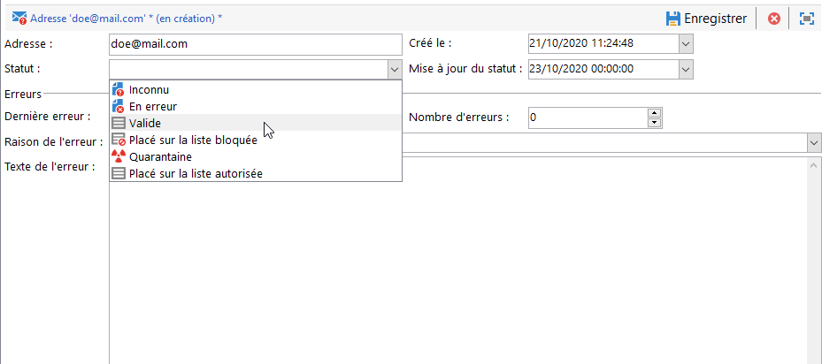
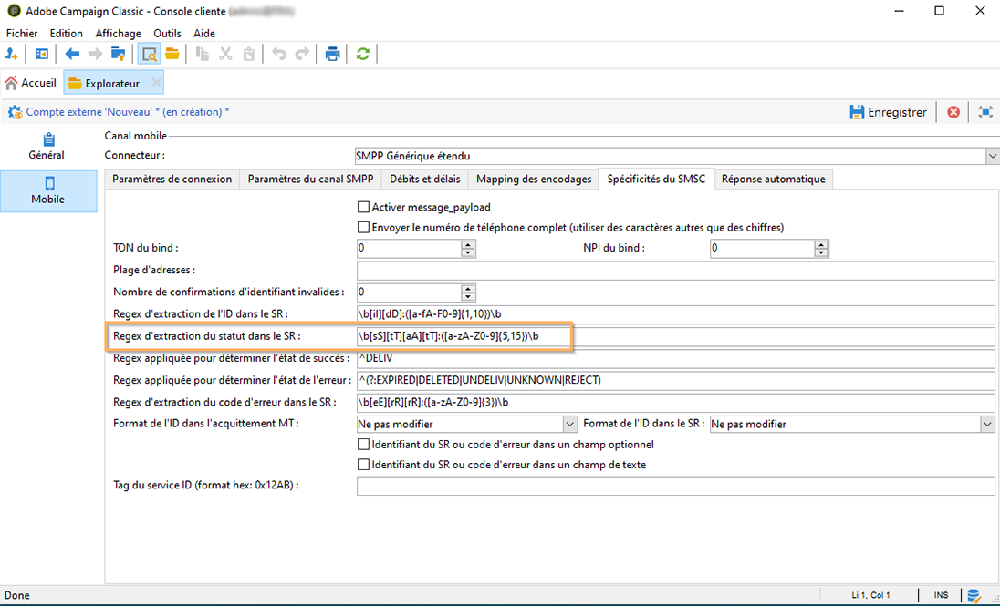

# Présentation de la gestion des quarantaines{#understanding-quarantine-management}

Adobe Campaign gère une liste d&#39;adresses en quarantaine. Les destinataires dont l&#39;adresse est en quarantaine sont par défaut exclus lors de l&#39;analyse d&#39;une diffusion : ils ne seront pas ciblés. Une adresse email peut être mise en quarantaine par exemple lorsque la boîte de messagerie est pleine ou si l&#39;adresse n&#39;existe pas. Dans tous les cas, la mise en quarantaine répond à des règles précises qui sont décrites ci-après.

>[!NOTE]
>
>Cette section s&#39;applique aux canaux on-line : email, SMS et notification push.

## Optimisation de votre diffusion par le biais de la gestion des quarantaines {#optimizing-your-delivery-through-quarantines}

Les profils dont lʼadresse e-mail ou le numéro de téléphone est en quarantaine sont exclus automatiquement lors de la préparation des messages (consultez la section [Identification des adresses en quarantaine pour une diffusion](#identifying-quarantined-addresses-for-a-delivery)). Le taux d&#39;erreur ayant une incidence importante sur la vitesse de diffusion, les envois sont ainsi accélérés.

Certains fournisseurs d&#39;accès Internet considèrent automatiquement les emails comme du spam si le taux d&#39;adresses invalides est trop élevé. La quarantaine permet donc d’éviter d’être ajouté à une liste bloquée par ces fournisseurs.

De plus, elles réduisent les coûts d’envoi des SMS en excluant les numéros de téléphone erronés des diffusions.

Pour plus d’informations sur les bonnes pratiques en matière de sécurisation et d’optimisation de vos diffusions, consultez [cette page](delivery-best-practices.md).

### Quarantaine et liste bloquée {#quarantine-vs-denylist}

La quarantaine et la liste bloquée ne s’appliquent pas au même objet :

* La **quarantaine** s’applique uniquement à une **adresse** (ou un numéro de téléphone, etc.), et non au profil lui-même. Par exemple, un profil dont l’adresse e-mail est en quarantaine peut mettre à jour son profil et saisir une nouvelle adresse, puis être ciblé de nouveau par des actions de diffusion. De même, si deux profils ont le même numéro de téléphone, ils seront tous deux affectés si le numéro est mis en quarantaine.

  Les adresses ou numéros de téléphone mis en quarantaine s’affichent dans les [logs d&#39;exclusion](#identifying-quarantined-addresses-for-a-delivery) (pour une diffusion) ou dans la [liste de quarantaine](#identifying-quarantined-addresses-for-the-entire-platform) (pour l&#39;ensemble de la plateforme).

* En revanche, en cas d&#39;insertion en **liste bloquée**, le **profil** ne sera plus ciblé par aucune diffusion, par exemple après une désinscription (opt-out), pour un canal donné. Par exemple, si un profil de la liste bloquée pour le canal e-mail comporte deux adresses e-mail, les deux adresses seront exclues de la diffusion.

  Vous pouvez vérifier si un profil est sur liste bloquée pour un ou plusieurs canaux dans la section **[!UICONTROL Ne plus contacter]** de l’onglet **[!UICONTROL Général]** du profil. Consultez [cette section](../../platform/using/editing-a-profile.md#general-tab).

>[!NOTE]
>
>La mise en quarantaine inclut un statut **[!UICONTROL Sur liste bloquée]**, qui s’applique lorsque les destinataires signalent votre message comme étant un spam ou répondent à un message SMS avec un mot-clé tel que « STOP ». Dans ce cas, l’adresse ou le numéro de téléphone du profil impliqué est mis en quarantaine avec le statut **[!UICONTROL Sur liste bloquée]**. Pour plus d&#39;informations sur la gestion des messages SMS STOP, consultez [cette section](../../delivery/using/sms-send.md#processing-inbound-messages).

## Identification des adresses en quarantaine {#identifying-quarantined-addresses}

Les adresses en quarantaine peuvent être répertoriées pour une diffusion spécifique ou lʼensemble de la plateforme.

### Identification des adresses en quarantaine pour une diffusion {#identifying-quarantined-addresses-for-a-delivery}

Les adresses en quarantaine pour une diffusion spécifique sont répertoriées pendant la phase de préparation de la diffusion, dans les logs de diffusion du tableau de bord des diffusions (consultez la section [Logs et historique de la diffusion](delivery-dashboard.md#delivery-logs-and-history)).

### Identification des adresses en quarantaine pour lʼensemble de la plateforme {#identifying-quarantined-addresses-for-the-entire-platform}

Les administrateurs peuvent répertorier les adresses en quarantaine pour l&#39;ensemble de la plateforme depuis le nœud **[!UICONTROL Administration > Gestion de campagne > Gestion des NP@I > NP@I et adresses]**.

>[!NOTE]
>
>Ce menu répertorie les éléments en quarantaine pour les canaux **email**, **SMS** et **notification push**.

Les informations disponibles pour chacune des adresses sont les suivantes :


>[!NOTE]
>
>L&#39;augmentation du nombre de quarantaines est un phénomène normal, lié à &quot;l&#39;usure&quot; de la base. Par exemple, si l&#39;on considère que la durée de vie d&#39;une adresse e-mail est de trois ans et que la table des destinataires augmente de 50 % tous les ans, l&#39;augmentation des quarantaines peut être calculée comme suit :
>
>Fin de l&#39;année 1 : (1 &#42; 0,33) / (1 + 0,5) = 22 %.
>
Fin de l&#39;année 2 : ((1,22 &#42; 0,33) + 0,33) / (1,5 + 0,75) = 32,5 %.

### Identification des adresses en quarantaine dans les rapports de diffusion {#identifying-quarantined-addresses-in-delivery-reports}

Les rapports suivants fournissent des informations relatives aux adresses en quarantaine :

* Pour chaque diffusion, le rapport **[!UICONTROL Synthèse de la diffusion]** permet de consulter le nombre d&#39;adresses en quarantaine dans la cible de la diffusion. Il affiche :

   * le nombre d&#39;adresses mises en quarantaine lors de l&#39;analyse de la diffusion,

   * le nombre d&#39;adresses passées en quarantaine suite à l&#39;action de diffusion.

* Le rapport **[!UICONTROL Non-délivrables et rebonds]** affiche des informations relatives aux adresses en quarantaine, aux types d’erreurs rencontrées, etc., et une répartition des échecs par domaines.

Vous pouvez consulter ces informations pour l&#39;ensemble des diffusions de la plateforme (**[!UICONTROL Page d&#39;accueil > Rapports]**) ou pour une diffusion particulière. Vous pouvez également créer des rapports personnalisés et sélectionner les informations à afficher.

### Identification des adresses en quarantaine pour un destinataire {#identifying-quarantined-addresses-for-a-recipient}

Vous pouvez consulter le statut de l&#39;adresse email de n&#39;importe quel destinataire. Pour cela, sélectionnez le profil du destinataire et cliquez sur l&#39;onglet **[!UICONTROL Diffusions]**. Pour toutes les diffusions vers ce destinataire, vous pouvez déterminer si l&#39;adresse a échoué, a été mise en quarantaine lors de l&#39;analyse, etc. Pour chaque dossier, vous ne pouvez afficher que les destinataires dont l&#39;adresse email est en quarantaine. Pour ce faire, utilisez la méthode **[!UICONTROL Email en quarantaine]** filtre applicatif.


## Conditions de mise en quarantaine d’une adresse  {#conditions-for-sending-an-address-to-quarantine}

Adobe Campaign gère la mise en quarantaine en fonction du type d’échec de la diffusion et de la raison attribuée lors de la qualification des messages d’erreur (voir les sections [Qualification des e-mails rejetés](understanding-delivery-failures.md#bounce-mail-qualification) et [Types de diffusion en échec et raisons](understanding-delivery-failures.md#delivery-failure-types-and-reasons)).

* **Erreur de type Ignoré** : les erreurs de type Ignoré ne mettent pas une adresse en quarantaine.
* **Erreur de type Hard** : l&#39;adresse email correspondante est mise immédiatement en quarantaine.
* **Erreur de type Soft** : les erreurs de type Soft ne provoquent pas de mise en quarantaine immédiate mais incrémentent un compteur d&#39;erreurs. Pour plus d&#39;informations, voir la section [Comprendre la gestion des erreurs de type Soft](#soft-error-management).

Si un utilisateur qualifie un email comme du spam ([système de gestion des plaintes (feedback loop)](https://experienceleague.adobe.com/docs/deliverability-learn/deliverability-best-practice-guide/transition-process/infrastructure.html?lang=fr#feedback-loops)), le message est automatiquement redirigé vers une boîte email technique gérée par Adobe. L’adresse e-mail de l’utilisateur est alors automatiquement mise en quarantaine avec le statut **[!UICONTROL Sur liste bloquée]**. Ce statut ne concerne que l’adresse. Le profil n’est pas placé sur liste bloquée afin que l’utilisateur puisse continuer à recevoir des SMS et des notifications push.

>[!NOTE]
>
La quarantaine dans Adobe Campaign respecte la casse. Veillez à importer les adresses e-mail en minuscules, de telle sorte qu&#39;elles ne soient pas reciblées ultérieurement.

Dans la liste des adresses en quarantaine (voir [Identifier les adresses en quarantaine pour l’ensemble de la plateforme](#identifying-quarantined-addresses-for-the-entire-platform)), le champ **[!UICONTROL Raison de l’erreur]** indique pourquoi l’adresse sélectionnée a été mise en quarantaine.


### Gestion des erreurs de type Soft {#soft-error-management}

Contrairement aux erreurs de type Hard, les erreurs de type Soft ne provoquent pas de mise en quarantaine immédiate mais incrémentent un compteur d&#39;erreurs.

Les reprises seront effectuées pendant la [durée de diffusion](../../delivery/using/steps-sending-the-delivery.md#defining-validity-period). Quand le compteur d&#39;erreurs atteint le seuil limite, l&#39;adresse passe en quarantaine. Pour en savoir plus, voir la section [Reprises après une diffusion temporairement en échec](understanding-delivery-failures.md#retries-after-a-delivery-temporary-failure).

Le compteur d&#39;erreurs est réinitialisé si la dernière erreur significative s&#39;est produite plus de 10 jours avant. Le statut de l&#39;adresse passe à **Valide** et est supprimé de la liste des quarantaines grâce au workflow [Nettoyage de la base](../../production/using/database-cleanup-workflow.md).


Pour les installations hébergées ou hybrides, si vous avez effectué une mise à niveau vers la méthode [MTA amélioré](sending-with-enhanced-mta.md), le nombre maximum de reprises à effectuer en cas de statut **[!UICONTROL En erreur]** et le délai minimum entre deux tentatives reposent désormais sur les performances historiques et actuelles d’une IP sur un domaine donné.

Pour les installations on-premise et les installations hébergées/hybrides utilisant l’ancien MTA de Campaign, vous pouvez modifier le nombre d’erreurs et la période entre deux erreurs. Pour ce faire, modifiez les paramètres correspondants dans l’[assistant de déploiement](../../installation/using/deploying-an-instance.md) (**[!UICONTROL Canal e-mail]** > **[!UICONTROL Paramètres avancés]**) ou [au niveau de la diffusion](../../delivery/using/steps-sending-the-delivery.md#configuring-retries).


## Supprimer une adresse de la quarantaine {#removing-a-quarantined-address}

### Mises à jour automatiques {#unquarantine-auto}

Les adresses qui correspondent à des conditions spécifiques sont automatiquement supprimées de la liste de quarantaine par le workflow [Nettoyage de la base de données](../../production/using/database-cleanup-workflow.md).

Les adresses sont automatiquement supprimées de la liste de quarantaine dans les cas suivants :

* Les adresses dont l&#39;état est **[!UICONTROL En erreur]** seront supprimées de la liste de quarantaine après une diffusion réussie.
* Les adresses dont l’état est **[!UICONTROL En erreur]** seront supprimées de la liste de quarantaine si le dernier rebond temporaire a eu lieu il y a plus de 10 jours. Pour plus d&#39;informations sur la gestion des erreurs de type Soft, consultez [cette section](#soft-error-management).
* Les adresses dont l&#39;état est **[!UICONTROL En erreur]** et qui ont rebondi avec l&#39;erreur **[!UICONTROL Boîte pleine]** sont supprimées de la liste de quarantaine après 30 jours.

Leur état devient ensuite **[!UICONTROL Valide]**.

>[!IMPORTANT]
>
Les destinataires avec une adresse dont le statut est **[!UICONTROL En quarantaine]** ou **[!UICONTROL Sur liste bloquée]** ne font jamais l’objet d’une suppression, même s’ils/elles reçoivent un e-mail.

### Mises à jour manuelles {#unquarantine-manual}

Vous pouvez également retirer une adresse en quarantaine manuellement. Pour supprimer manuellement une adresse de la liste de quarantaine, modifiez son statut en **[!UICONTROL Valide]** depuis le nœud **[!UICONTROL Administration > Gestion de campagne > Gestion des échecs > Échecs de diffusion et adresses]**.



### Mises à jour en bloc {#unquarantine-bulk}

Vous devrez peut-être effectuer des mises à jour en bloc sur la liste de quarantaine, par exemple en cas de panne du FAI. Dans ce cas, les e-mails sont incorrectement marqués comme rebonds, car ils ne peuvent pas être correctement remis à leur destinataire. Ces adresses doivent être supprimées de la liste de quarantaine.

Pour ce faire, créez un workflow et ajoutez une activité **[!UICONTROL Requête]** sur votre table de quarantaine pour filtrer tous les destinataires concernés. Une fois identifiés, ils peuvent être supprimés de la liste de quarantaine et inclus dans les prochaines diffusions e-mail de Campaign.

Vous trouverez ci-dessous les instructions recommandées pour cette requête :

* Pour les environnements Campaign Classic v7 contenant des informations de règles d’email entrant dans le champ **[!UICONTROL Texte d’erreur]** de la liste de quarantaine :

   * **Texte d&#39;erreur (texte de la quarantaine)** contenant « Momen_Code10_InvalidRecipient »
   * **Domaine d’e-mail (@domain)** égal à domain1.com OU **domaine d’e-mail (@domain)** égal à domain2.com OU **domaine d’e-mail (@domain)** égal à domain3.com
   * **Statut de la mise à jour (@lastModified)** à partir du `MM/DD/YYYY HH:MM:SS AM`
   * **Statut de la mise à jour (@lastModified)** le ou avant le `MM/DD/YYYY HH:MM:SS PM`

* Pour les instances Campaign Classic v7 contenant des informations de réponse de rebond SMTP dans le champ **[!UICONTROL Texte d’erreur]** de la liste de quarantaine :

   * **Le texte d’erreur (texte de quarantaine)** contient « 550-5.1.1 » ET **Le texte d’erreur (texte de quarantaine)** contient « support.ISP.com »,

  où « support.ISP.com » peut être « support.apple.com » ou « support.google.com », par exemple.

   * **Statut de la mise à jour (@lastModified)** à partir du `MM/DD/YYYY HH:MM:SS AM`
   * **Statut de la mise à jour (@lastModified)** le ou avant le `MM/DD/YYYY HH:MM:SS PM`

Une fois que vous disposez de la liste des destinataires concernés, ajoutez une activité **[!UICONTROL Mise à jour de données]** pour définir le statut de leur adresse e-mail sur **[!UICONTROL Valide]** afin qu’ils soient supprimés de la liste de quarantaine par le workflow **[!UICONTROL Nettoyage de la base de données]**. Vous pouvez également les supprimer uniquement de la table de quarantaine.

## Quarantaines des notifications push {#push-notification-quarantines}

Le mécanisme de quarantaine des notifications push est globalement identique au processus général. Toutefois, certaines erreurs sont gérées différemment pour les notifications Push. Par exemple, pour certaines erreurs logicielles, aucune nouvelle tentative n&#39;est effectuée pour une même diffusion. Les spécificités des notifications Push sont énumérées ci-dessous. Le mécanisme d&#39;une nouvelle tentative (nombre de tentatives, fréquence) est le même que pour les emails.

Les éléments mis en quarantaine sont les jetons d&#39;appareil.

### Quarantaine iOS {#ios-quarantine}

Le protocole HTTP/V2 permet des retours et un état directs pour chaque diffusion push. Si le connecteur de protocole HTTP/V2 est utilisé, le service des retours n&#39;est plus appelé par le workflow **[!UICONTROL mobileAppOptOutMgt]**. Un jeton est considéré comme non enregistré lorsqu&#39;une application mobile est désinstallée ou réinstallée.

Si l&#39;APNS renvoie de manière synchrone un statut &quot;désinscrit&quot; pour un message, le jeton cible est immédiatement mis en quarantaine.

<table> 
 <tbody> 
  <tr> 
   <td> <strong>Scénario</strong><br /> </td> 
   <td> <strong>Status</strong><br /> </td> 
   <td> <strong>Message de l'erreur</strong><br /> </td> 
   <td> <strong>Type de l'échec</strong><br /> </td> 
   <td> <strong>Raison de l'échec</strong><br /> </td> 
   <td> <strong>Réessayer</strong><br /> </td> 
  </tr> 
  <tr> 
   <td> Appareil ciblé sous tension<br /> </td> 
   <td> Ok<br /> </td> 
   <td> </td> 
   <td> </td> 
   <td> </td> 
   <td> </td> 
  </tr> 
  <tr> 
   <td> Appareil ciblé hors tension<br /> </td> 
   <td> Ok<br /> </td> 
   <td> </td> 
   <td> </td> 
   <td> </td> 
   <td> </td> 
  </tr> 
  <tr> 
   <td> L'utilisateur désactive les notifications de l'application<br /> </td> 
   <td> Ok<br /> </td> 
   <td> </td> 
   <td> </td> 
   <td> </td> 
   <td> </td> 
  </tr> 
  <tr> 
   <td> Création du message/phase d'analyse - payload trop volumineuse<br /> </td> 
   <td> Echec<br /> </td> 
   <td> Payload trop longue<br /> </td> 
   <td> Soft<br /> </td> 
   <td> Refusés<br /> </td> 
   <td> Non<br /> </td> 
  </tr> 
  <tr> 
   <td> Création du message/phase d'analyse - problème lié à un format de contenu inattendu<br /> </td> 
   <td> Echec<br /> </td> 
   <td> Messages d'erreur différents selon l'erreur<br /> </td> 
   <td> Soft<br /> </td> 
   <td> Indéfinie<br /> </td> 
   <td> Non<br /> </td> 
  </tr> 
  <tr> 
   <td> Problème de certificat (mot de passe, endommagement, etc.) et test de la connexion au problème des APNS<br /> </td> 
   <td> Echec<br /> </td> 
   <td> Messages d'erreur différents selon l'erreur<br /> </td> 
   <td> Soft<br /> </td> 
   <td> Refusés<br /> </td> 
   <td> Non<br /> </td> 
  </tr> 
  <tr> 
   <td> Perte de la connexion réseau pendant l'envoi<br /> </td> 
   <td> Echec<br /> </td> 
   <td> Erreur de connexion<br /> </td> 
   <td> Indéfinie<br /> </td> 
   <td> Inatteignable<br /> </td> 
   <td> Oui<br /> </td> 
  </tr> 
  <tr> 
   <td> Rejet du message par l'APNS : désinscription<br /> l'utilisateur a supprimé l'application ou le jeton a expiré<br /> </td> 
   <td> Echec<br /> </td> 
   <td> Désinscrit<br /> </td> 
   <td> Hard<br /> </td> 
   <td> Utilisateur inconnu<br /> </td> 
   <td> Non<br /> </td> 
  </tr> 
  <tr> 
   <td> Rejet du message par l'APNS : toutes les autres erreurs<br /> </td> 
   <td> Echec<br /> </td> 
   <td> La raison de l'erreur de rejet est indiquée dans le message d'erreur<br /> </td> 
   <td> Soft<br /> </td> 
   <td> Refusés<br /> </td> 
   <td> Non<br /> </td> 
  </tr> 
 </tbody> 
</table>

### Quarantaine Android {#android-quarantine}

**Pour Android V1**

Pour chaque notification, Adobe Campaign reçoit les erreurs synchrones directement du serveur FCM. Adobe Campaign les gère à la volée et génère des erreurs hard ou soft selon la gravité des erreurs. Des reprises peuvent être effectuées :

* Dépassement de la longueur de la payload, problème de connexion, problème lié à la disponibilité du service : reprise effectuée, erreur soft, raison de l&#39;échec : **[!UICONTROL Refusés]**.
* Dépassement du quota d&#39;appareils : aucune reprise, erreur soft, raison de l&#39;échec : **[!UICONTROL Refusés]**.
* Jeton non valide ou désinscrit, erreur inattendue, problème lié au compte de l&#39;expéditeur : aucune reprise, erreur hard, raison de l&#39;erreur : **[!UICONTROL Refusés]**.

La variable **[!UICONTROL mobileAppOptOutMgt]** le workflow s’exécute toutes les 6 heures pour mettre à jour la variable **AppSubscriptionRcp** table. Pour les jetons déclarés comme non enregistrés ou non valides, le champ **Désactivé** est défini sur **True** et l&#39;abonnement associé à ce jeton d&#39;appareil sera automatiquement exclu des prochaines diffusions.

Pendant l&#39;analyse de la diffusion, tous les appareils qui sont exclus de la cible sont automatiquement ajoutés à la table **excludeLogAppSubRcp**.

>[!NOTE]
>
Pour les utilisateurs qui ont recours au connecteur Baidu, voici les différents types d&#39;erreur :
>
* Problème de connexion au début de la diffusion : type d&#39;échec **[!UICONTROL Indéfini]**, raison d&#39;échec **[!UICONTROL Inatteignable]**, reprise effectuée.
* Perte de connexion pendant une diffusion : erreur soft, raison d&#39;échec **[!UICONTROL Refusés]**, reprise effectuée.
* Erreur synchrone renvoyée par Baidu pendant l&#39;envoi : erreur hard, raison d&#39;échec **[!UICONTROL Refusés]**, aucune reprise.
>
Adobe Campaign contacte le serveur Baidu toutes les 10 minutes pour récupérer l&#39;état du message envoyé et met à jour les broadlogs. Si un message est déclaré comme envoyé, le statut du message dans les broadlogs est défini sur **[!UICONTROL Reçu]**. Si Baidu déclare une erreur, l’état est défini sur **[!UICONTROL En échec]**.

**Pour Android V2**

Le mécanisme de mise en quarantaine d&#39;Android V2 utilise le même processus qu&#39;Android V1. Il en va de même pour la mise à jour des abonnements et des exclusions. Pour en savoir plus, consultez la section [Android V1](#android-quarantine).

<table> 
 <tbody> 
  <tr> 
   <td> <strong>Scénario</strong><br /> </td> 
   <td> <strong>Status</strong><br /> </td> 
   <td> <strong>Message de l'erreur</strong><br /> </td> 
   <td> <strong>Type de l'échec</strong><br /> </td> 
   <td> <strong>Raison de l'échec</strong><br /> </td> 
   <td> <strong>Réessayer</strong><br /> </td> 
  </tr> 
  <tr> 
   <td> Création du message/phase d'analyse : mots-clés illégaux utilisés dans les champs personnalisés<br /> </td> 
   <td> Echec<br /> </td> 
   <td> Les mots-clés suivants ne peuvent être utilisés : {1}<br /> </td> 
   <td> Soft<br /> </td> 
   <td> </td> 
   <td> Non<br /> </td> 
  </tr> 
  <tr> 
   <td> Création du message/phase d'analyse : payload trop volumineuse<br /> </td> 
   <td> Echec<br /> </td> 
   <td> La notification est trop lourde : {1} bits contre {2} autorisés<br /> </td> 
   <td> Soft<br /> </td> 
   <td> Refusés<br /> </td> 
   <td> Non<br /> </td> 
  </tr> 
  <tr> 
   <td> Perte de la connexion réseau pendant l'envoi<br /> </td> 
   <td> Echec<br /> </td> 
   <td> Aucune réponse du service Firebase Cloud Messaging pour cette adresse : {1}<br /> </td> 
   <td> Soft<br /> </td> 
   <td> Inatteignable<br /> </td> 
   <td> Oui<br /> </td> 
  </tr> 
  <tr> 
   <td> Rejet du message par le FCM : le serveur FCM est temporairement hors service (par exemple avec des délais). <br /> </td> 
   <td> Echec<br /> </td> 
   <td> Le service Firebase Cloud Messaging est temporairement hors service<br /> </td> 
   <td> Soft<br /> </td> 
   <td> Inatteignable<br /> </td> 
   <td> Oui<br /> </td> 
  </tr> 
  <tr> 
   <td> Rejet du message par le FCM : erreur lors de l'authentification du compte de l'expéditeur<br /> </td> 
   <td> Echec<br /> </td> 
   <td> Echec de l'identification du compte développeur, vérifiez votre identifiant et mot de passe<br /> </td> 
   <td> Soft<br /> </td> 
   <td> Refusés<br /> </td> 
   <td> Non<br /> </td> 
  </tr> 
  <tr> 
   <td> Rejet du message par le FCM : dépassement du quota d'appareils<br /> </td> 
   <td> Echec<br /> </td> 
   <td> </td> 
   <td> Soft<br /> </td> 
   <td> Refusés<br /> </td> 
   <td> Oui<br /> </td> 
  </tr> 
  <tr> 
   <td> Rejet du message par le FCM : inscription invalide / non inscrit<br /> </td> 
   <td> Echec<br /> </td> 
   <td> </td> 
   <td> Hard<br /> </td> 
   <td> Utilisateur inconnu<br /> </td> 
   <td> Non<br /> </td> 
  </tr> 
  <tr> 
   <td> Rejet du message par le FCM : toutes les autres erreurs<br /> </td> 
   <td> Echec<br /> </td> 
   <td> Le serveur Firebase Cloud Messaging a retourné un code d'erreur non attendu : {1} </td> 
   <td> </td> 
   <td> Refusés<br /> </td> 
   <td> Non<br /> </td> 
  </tr> 
    <tr> 
   <td> Rejet du message par le FCM : argument non valide<br /> </td> 
   <td> Echec<br /> </td> 
   <td> INVALID_ARGUMENT </td> 
   <td> Ignoré</td> 
   <td> Indéfinie<br /> </td> 
   <td> Non<br /> </td> 
  </tr>
    <tr> 
   <td> Rejet du message par le FCM : erreur d'authentification tierce<br /> </td> 
   <td> Echec<br /> </td> 
   <td> THIRD_PARTY_AUTH_ERROR </td> 
   <td> Ignoré</td>
   <td> Refusés<br /> </td> 
   <td> Oui<br /> </td> 
  </tr>
    <tr> 
   <td> Rejet du message par le FCM : le Sender ID ne correspond pas<br /> </td> 
   <td> Echec<br /> </td> 
   <td> SENDER_ID_MISMATCH </td> 
   <td> Soft</td>
   <td> Utilisateur inconnu<br /> </td> 
   <td> Non<br /> </td> 
  </tr>
    <tr> 
   <td> Rejet du message par le FCM : non enregistré<br /> </td> 
   <td> Echec<br /> </td>
   <td> UNREGISTERED </td> 
   <td> Hard</td> 
   <td> Utilisateur inconnu<br /> </td> 
   <td> Non<br /> </td> 
  </tr>
    <tr> 
   <td> Rejet du message par le FCM : interne<br /> </td> 
   <td> Echec<br /> </td> 
   <td> INTERNAL </td> 
   <td> Ignoré</td> 
   <td> Refusés<br /> </td> 
   <td> Oui<br /> </td> 
  </tr>
    <tr> 
   <td> Rejet du message par le FCM : non disponible<br /> </td> 
   <td> Echec<br /> </td> 
   <td> UNAVAILABLE</td> 
   <td> Ignoré</td> 
   <td> Refusés<br /> </td> 
   <td> Oui<br /> </td> 
  </tr>
    <tr> 
   <td> Rejet du message par le FCM : code d'erreur inattendu<br /> </td> 
   <td> Echec<br /> </td> 
   <td> code d'erreur inattendu</td> 
   <td> Ignoré</td> 
   <td> Refusés<br /> </td> 
   <td> Non<br /> </td> 
  </tr>
  <tr> 
   <td> Authentification : problème de connexion<br /> </td> 
   <td> Echec<br /> </td> 
   <td> Impossible de se connecter au serveur d'authentification </td> 
   <td> Ignoré</td>
   <td> Refusés<br /> </td> 
   <td> Oui<br /> </td> 
  </tr>
    <tr> 
   <td> Authentification : client non autorisé ou périmètre demandé.<br /> </td> 
   <td> Echec<br /> </td> 
   <td> unauthorized_client </td> 
   <td> Ignoré</td>
   <td> Refusés<br /> </td> 
   <td> Non<br /> </td> 
  </tr>
    <tr> 
   <td> Authentification : le client n'est pas autorisé à récupérer des jetons d'accès à l'aide de cette méthode, ou le client n'est pas autorisé pour l'un des paramètres demandés.<br /> </td> 
   <td> Echec<br /> </td> 
   <td> unauthorized_client </td> 
   <td> Ignoré</td>
   <td> Refusés<br /> </td> 
   <td> Non<br /> </td> 
  </tr>
    <tr> 
   <td> Authentification : accès refusé<br /> </td> 
   <td> Echec<br /> </td>
   <td> access_denied</td> 
   <td> Ignoré</td>
   <td> Refusés<br /> </td> 
   <td> Non<br /> </td> 
  </tr>
    <tr> 
   <td> Authentification : adresse électronique non valide<br /> </td> 
   <td> Echec<br /> </td> 
   <td> invalid_grant </td> 
   <td> Ignoré</td> 
   <td> Refusés<br /> </td> 
   <td> Non<br /> </td> 
  </tr>
    <tr> 
   <td> Authentification : JWT non valide<br /> </td> 
   <td> Echec<br /> </td> 
   <td> invalid_grant </td> 
   <td> Ignoré</td> 
   <td> Refusés<br /> </td> 
   <td> Non<br /> </td> 
  </tr>
    <tr> 
   <td> Authentification : signature JWT non valide<br /> </td> 
   <td> Echec<br /> </td> 
   <td> invalid_grant </td> 
   <td> Ignoré</td> 
   <td> Refusés<br /> </td> 
   <td> Non<br /> </td> 
  </tr>
    <tr> 
   <td> Authentification : périmètre OAuth non valide ou audience de jeton d'ID non valide fourni<br /> </td> 
   <td> Echec<br /> </td> 
   <td> unauthorized_client</td> 
   <td> Ignoré</td> 
   <td> Refusés<br /> </td> 
   <td> Non<br /> </td> 
  </tr>
    <tr> 
   <td> Authentification : client OAuth désactivé<br /> </td> 
   <td> Echec<br /> </td> 
   <td> disabled_client</td> 
   <td> Ignoré</td> 
   <td> Refusés<br /> </td> 
   <td> Non<br /> </td> 
  </tr>
 </tbody> 
</table>

## Quarantaines des SMS {#sms-quarantines}

**Pour les connecteurs standards**

Le mécanisme de quarantaine des messages SMS est globalement identique au processus général. Voir [À propos des quarantaines](#about-quarantines). Les spécificités des SMS sont énumérées ci-dessous.

>[!NOTE]
>
Le tableau **[!UICONTROL Qualification des logs de diffusion]** ne s&#39;applique pas au connecteur **SMPP Générique étendu**.

<table> 
 <tbody> 
  <tr> 
   <td> <strong>Scénario</strong><br /> </td> 
   <td> <strong>Status</strong><br /> </td> 
   <td> <strong>Message de l'erreur</strong><br /> </td> 
   <td> <strong>Type de l'échec</strong><br /> </td> 
   <td> <strong>Raison de l'échec</strong><br /> </td> 
  </tr> 
  <tr> 
   <td> Transmis au prestataire<br /> </td> 
   <td> Envoyés<br /> </td> 
   <td> </td> 
   <td> </td> 
   <td> </td> 
  </tr> 
  <tr> 
   <td> Reçu sur le mobile<br /> </td> 
   <td> Reçu<br /> </td> 
   <td> </td> 
   <td> </td> 
   <td> </td> 
  </tr> 
  <tr> 
   <td> Erreur retournée par le prestataire<br /> </td> 
   <td> Echec<br /> </td> 
   <td> Erreur lors de la récupération de données (SR ou MO).<br /> </td> 
   <td> Soft<br /> </td> 
   <td> Inatteignable<br /> </td> 
  </tr> 
  <tr> 
   <td> Accusé de réception du MT non valide<br /> </td> 
   <td> Echec<br /> </td> 
   <td> Erreur '{1}' lors du traitement de la trame d'accusé réception d'une requête d'envoi.<br /> </td> 
   <td> Soft<br /> </td> 
   <td> Inatteignable<br /> </td> 
  </tr> 
  <tr> 
   <td> Erreur lors de l'envoi du MT<br /> </td> 
   <td> Echec<br /> </td> 
   <td> Erreur lors de l'envoi des messages.<br /> </td> 
   <td> Soft<br /> </td> 
   <td> Inatteignable<br /> </td> 
  </tr> 
 </tbody> 
</table>

**Pour le connecteur SMPP générique étendu**

Lors de l&#39;utilisation du protocole SMPP pour envoyer des SMS, la gestion des erreurs est traitée différemment. Pour plus d&#39;informations sur le connecteur SMPP générique étendu, voir [cette page](sms-set-up.md#creating-an-smpp-external-account).

Le connecteur SMPP récupère les données du message SR (Status Report) renvoyé à l&#39;aide d&#39;expressions régulières (regex) pour filtrer son contenu. Ces données sont ensuite comparées aux informations trouvées dans la variable **[!UICONTROL Qualification des logs de diffusion]** table (disponible à partir du **[!UICONTROL Administration]** > **[!UICONTROL Campaign Management]** > **[!UICONTROL Gestion des échecs]** ).

Avant qu&#39;un nouveau type d&#39;erreur ne soit qualifié, la raison de l&#39;échec est toujours défini sur **Refusé** par défaut.

>[!NOTE]
>
Les raisons et les types des échecs sont les mêmes que pour les emails. Pour plus d&#39;informations, consultez la section [Types de diffusion en échec et raisons](understanding-delivery-failures.md#delivery-failure-types-and-reasons).
>
Demandez à votre prestataire la liste des codes d&#39;erreur et des états pour définir les types et les raisons corrects des erreurs dans la table Qualification des logs de diffusion.

Exemple de message généré :

```
SR Generic DELIVRD 000|#MESSAGE#
```

* Tous les messages d&#39;erreur commencent par **SR** pour faire la distinction entre les codes d&#39;erreur SMS et les codes d&#39;erreur email.
* La deuxième partie (**Générique** dans cet exemple) du message d&#39;erreur fait référence au nom de l&#39;implémentation du SMSC comme défini dans la variable **[!UICONTROL Nom de l&#39;implémentation SMSC]** du compte externe SMS. Voir [cette page](sms-set-up.md#creating-an-smpp-external-account).

  Comme un même code d&#39;erreur peut avoir une signification différente pour chaque prestataire, ce champ vous permet de déterminer quel prestataire a généré le code d&#39;erreur. Vous pouvez alors rechercher l&#39;erreur dans la documentation du prestataire adéquat.

* La troisième partie (**DELIVRD**, dans cet exemple) du message d&#39;erreur correspond au code d&#39;état récupéré du SR à l&#39;aide de la regex d&#39;extraction de code d&#39;état définie dans le compte externe SMS.

  Cette expression régulière est spécifiée dans la variable **[!UICONTROL Spécificités des SMSC]** de l’onglet du compte externe. Voir [cette page](sms-set-up.md#creating-an-smpp-external-account).

  

  Par défaut, la regex extrait le champ **stat:** comme défini dans la section **Appendix B** de la **spécification SMPP 3.4**.

* La quatrième partie (**000**, dans cet exemple) du message d&#39;erreur correspond au code d&#39;erreur extrait du SR à l&#39;aide de la regex d&#39;extraction de code d&#39;erreur définie dans le compte externe SMS.

  Cette expression régulière est spécifiée dans la variable **[!UICONTROL Spécificités des SMSC]** de l’onglet du compte externe. Voir [cette page](sms-set-up.md#creating-an-smpp-external-account).

  Par défaut, la regex extrait le champ **err:** comme défini dans la section **Appendix B** de la **spécification SMPP 3.4**.

* Tout ce qui se trouve après la barre verticale (|) s’affiche uniquement dans la balise **[!UICONTROL Premier texte]** de la colonne **[!UICONTROL Qualification des logs de diffusion]** table. Ce contenu est toujours remplacé par **#MESSAGE#** une fois le message normalisé. Ce processus évite d’avoir plusieurs entrées pour des erreurs similaires et est identique à celui des emails. Pour plus d’informations, consultez la section [Qualification des e-mails rejetés](understanding-delivery-failures.md#bounce-mail-qualification).

Le connecteur SMPP générique étendu applique une méthode heuristique pour rechercher des valeurs par défaut sensibles : si l&#39;état commence par **DELIV**, il est considéré comme une réussite, car il correspond aux états **DELIVRD** ou **DELIVERED** courants, utilisés par la plupart des prestataires. Tout autre état correspond à un échec hard.
