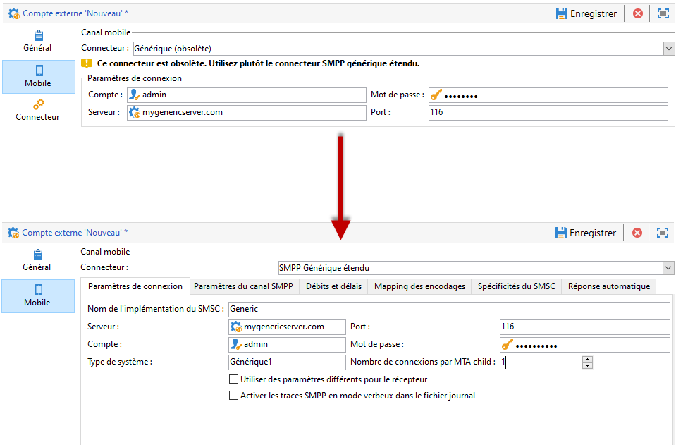
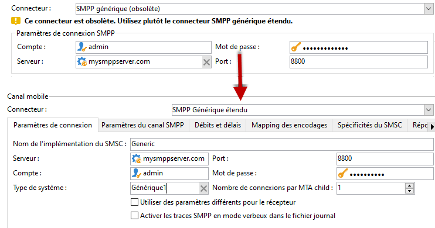
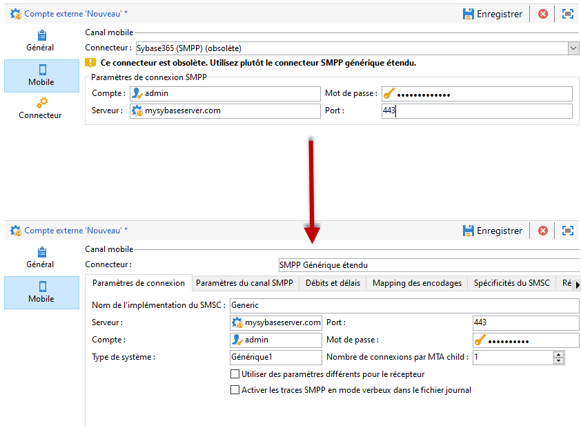
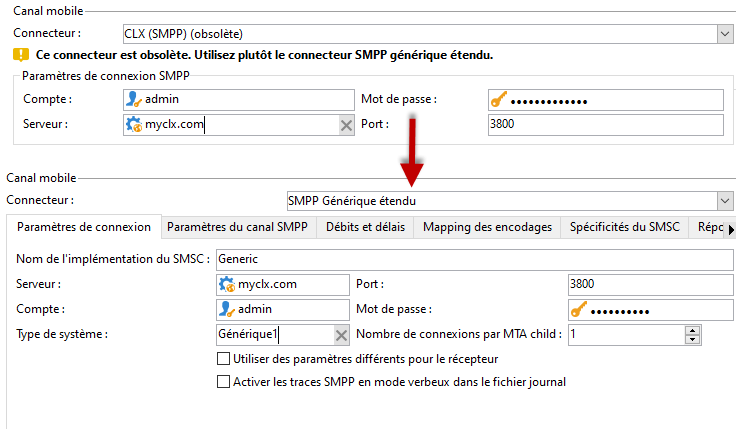
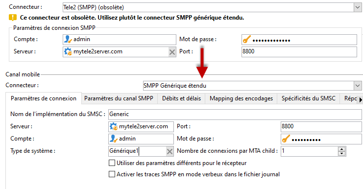
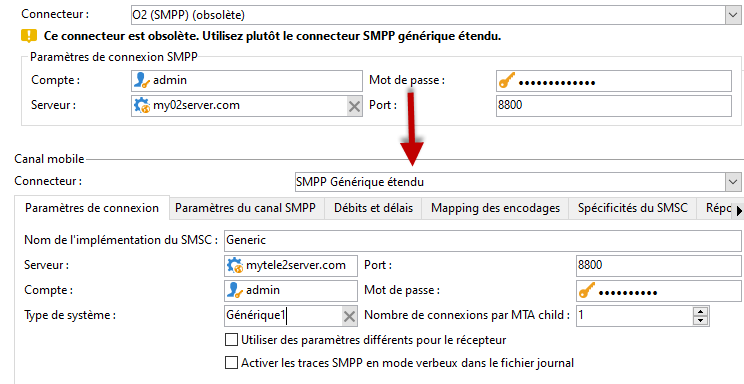

# Migration du connecteur SMS non pris en charge vers le connecteur SMPP générique étendu{#unsupported-connector-migration}

À compter de la version 20.2, les connecteurs hérités sont obsolètes. Ce document vous guide dans la migration vers le connecteur SMPP recommandé des connecteurs qui s’exécutent toujours sur l’ancien système.

>[!CAUTION]
>
>Cette migration n’est pas obligatoire, mais elle est recommandée par Adobe. Elle vous permettra de vous assurer que vous utilisez la version prise en charge la plus récente du logiciel.

## À propos des connecteurs SMS {#about-sms-connectors}

Les connecteurs suivants sont obsolètes à compter de la version 20.2 :

* **[!UICONTROL SMPP générique]** (SMPP version 3.4 avec prise en charge du mode binaire)
* **[!UICONTROL Sybase365]** (SAP SMS 365)
* **[!UICONTROL CLX Communications]**
* **[!UICONTROL Tele2]**
* **[!UICONTROL O2]**
* **[!UICONTROL iOS]**

Les fonctionnalités obsolètes sont toujours disponibles et prises en charge, mais elles ne bénéficieront d’aucune amélioration supplémentaire. Nous vous recommandons d’utiliser le connecteur **[!UICONTROL SMPP générique étendu]**.

Pour plus d’informations sur les fonctionnalités obsolètes et supprimées, consultez cette [page](../../rn/using/deprecated-features.md).

Les anciens connecteurs SMS utilisent le connecteur SMS Java, qui surcharge le processus web. La migration vers le nouveau connecteur **[!UICONTROL SMPP générique étendu]** déplacera cette charge vers le MTA qui peut la prendre en charge.

## Migration vers le connecteur SMPP générique étendu {#migrating-extended-generic-smpp}

>[!CAUTION]
>
>Même si vous pouvez effectuer une transposition des paramètres, la configuration du connecteur **[!UICONTROL SMPP générique étendu]** nécessite que vous discutiez avec votre fournisseur, lequel vous fournira les informations requises pour remplir le reste des paramètres. Pour plus d’informations à ce sujet, consultez cette [page](sms-protocol.md).

Tout d’abord, vous devrez créer un compte externe **[!UICONTROL SMPP générique étendu]**, puis vous pourrez peut-être transposer certains des paramètres. Retrouvez les étapes détaillées sur cette [page](sms-set-up.md#creating-an-smpp-external-account).

Vous devez maintenant remplir les paramètres de l’onglet **[!UICONTROL Mobile]** de votre nouveau compte externe **[!UICONTROL SMPP générique étendu]** en fonction de votre connecteur précédent.

### À partir du connecteur générique {#from-generic-connector}

Lorsque vous sélectionnez le connecteur **[!UICONTROL générique]**, vous disposez en principe d’un connecteur JavaScript personnalisé qui s’adaptera à chaque situation.

Si vous savez que ce connecteur utilise déjà le protocole SMPP, vous pouvez migrer vers le connecteur **[!UICONTROL SMPP générique étendu]**. Dans le cas contraire, vérifiez auprès de votre fournisseur s’il prend en charge le protocole SMPP et configurez un nouveau connecteur avec l’aide d’un consultant.

À partir de votre connecteur **[!UICONTROL générique]**, vous pouvez effectuer une transposition vers votre compte **[!UICONTROL SMPP étendu]** nouvellement créé :

Dans l’onglet **[!UICONTROL Paramètres de connexion]** :

* **[!UICONTROL Compte]**
* **[!UICONTROL Mot de passe]**
* **[!UICONTROL Serveur]**
* **[!UICONTROL Port]**

### À partir du connecteur SMPP générique {#from-generic-smpp-connector}

À partir de votre connecteur **[!UICONTROL SMPP générique]**, vous pouvez effectuer une transposition vers votre compte **[!UICONTROL SMPP étendu]** nouvellement créé :

Dans l’onglet **[!UICONTROL Paramètres de connexion]** :

* **[!UICONTROL Compte]**
* **[!UICONTROL Mot de passe]**
* **[!UICONTROL Serveur]**
* **[!UICONTROL Port]**
* **[!UICONTROL Type de système]**

Dans l’onglet **[!UICONTROL Paramètres du canal SMPP]** :

* **[!UICONTROL Numéro source]**
* **[!UICONTROL NPI source]**
* **[!UICONTROL NPI destination]**
* **[!UICONTROL TON source]**
* **[!UICONTROL TON destination]**

Dans l’onglet **[!UICONTROL Mapping de l’encodage]** :

* **[!UICONTROL Codage des SMS sortant]**

Dans l’onglet **[!UICONTROL Spécificités du SMSC]** :

* **[!UICONTROL Codage à l’envoi]** correspond au **[!UICONTROL Format de l’ID dans l’accusé de réception MT]**.
* **[!UICONTROL Codage à la réception]** correspond au **[!UICONTROL Format de l’ID dans le SR]**.

### À partir du connecteur Sybase365 {#from-sybase}

À partir de votre connecteur **[!UICONTROL Sybase365]**, vous pouvez effectuer une transposition vers votre compte **[!UICONTROL SMPP étendu]** nouvellement créé :

Dans l’onglet **[!UICONTROL Paramètres de connexion]** :

* **[!UICONTROL Compte]**
* **[!UICONTROL Mot de passe]**
* **[!UICONTROL Serveur]**
* **[!UICONTROL Port]**
* **[!UICONTROL Type de système]**

### À partir du connecteur CLX {#from-clx}

À partir de votre connecteur **[!UICONTROL CLX]**, vous pouvez effectuer une transposition vers votre compte **[!UICONTROL SMPP étendu]** nouvellement créé :

Dans l’onglet **[!UICONTROL Paramètres de connexion]** :

* **[!UICONTROL Compte]**
* **[!UICONTROL Mot de passe]**
* **[!UICONTROL Serveur]**
* **[!UICONTROL Port]**
* **[!UICONTROL Type de système]**

Dans l’onglet **[!UICONTROL Paramètres du canal SMPP]** :

* **[!UICONTROL Numéro source]**

Dans l’onglet **[!UICONTROL Spécificités du SMSC]** :

* **[!UICONTROL Codage à l’envoi]** correspond au **[!UICONTROL Format de l’ID dans l’accusé de réception MT]**.
* **[!UICONTROL Codage à la réception]** correspond au **[!UICONTROL Format de l’ID dans le SR]**.

### À partir du connecteur Tele2 {#from-tele2}

À partir de votre connecteur **[!UICONTROL Télé2]**, vous pouvez effectuer une transposition vers votre compte **[!UICONTROL SMPP étendu]** nouvellement créé :

Dans l’onglet **[!UICONTROL Paramètres de connexion]** :

* **[!UICONTROL Compte]**
* **[!UICONTROL Mot de passe]**
* **[!UICONTROL Serveur]**
* **[!UICONTROL Port]**
* **[!UICONTROL Type de système]**

Dans l’onglet **[!UICONTROL Paramètres du canal SMPP]** :

* **[!UICONTROL Numéro source]**
* **[!UICONTROL NPI source]**
* **[!UICONTROL NPI destination]**
* **[!UICONTROL TON source]**

Dans l’onglet **[!UICONTROL Mapping de l’encodage]** :

* **[!UICONTROL Codage des SMS sortant]**

### À partir du connecteur O2 {#from-O2}

À partir de votre connecteur **[!UICONTROL O2]**, vous pouvez effectuer une transposition vers votre compte **[!UICONTROL SMPP étendu]** nouvellement créé :

Dans l’onglet **[!UICONTROL Paramètres de connexion]** :

* **[!UICONTROL Compte]**
* **[!UICONTROL Mot de passe]**
* **[!UICONTROL Serveur]**
* **[!UICONTROL Port]**
* **[!UICONTROL Type de système]**

Dans l’onglet **[!UICONTROL Paramètres du canal SMPP]** :

* **[!UICONTROL Numéro source]**
* **[!UICONTROL NPI source]**
* **[!UICONTROL NPI destination]**
* **[!UICONTROL TON source]**
* **[!UICONTROL TON destination]**
