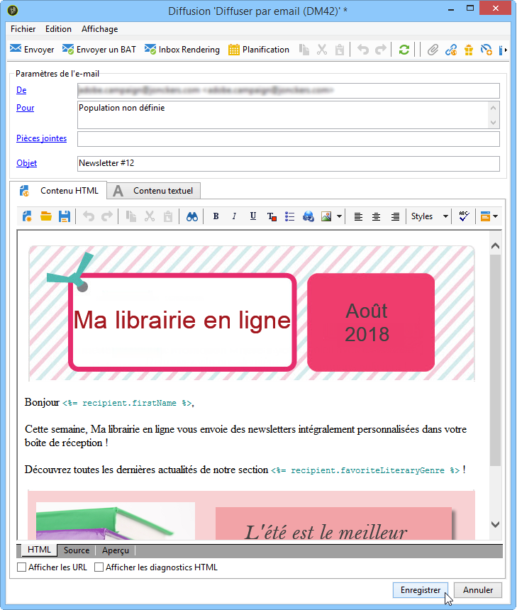
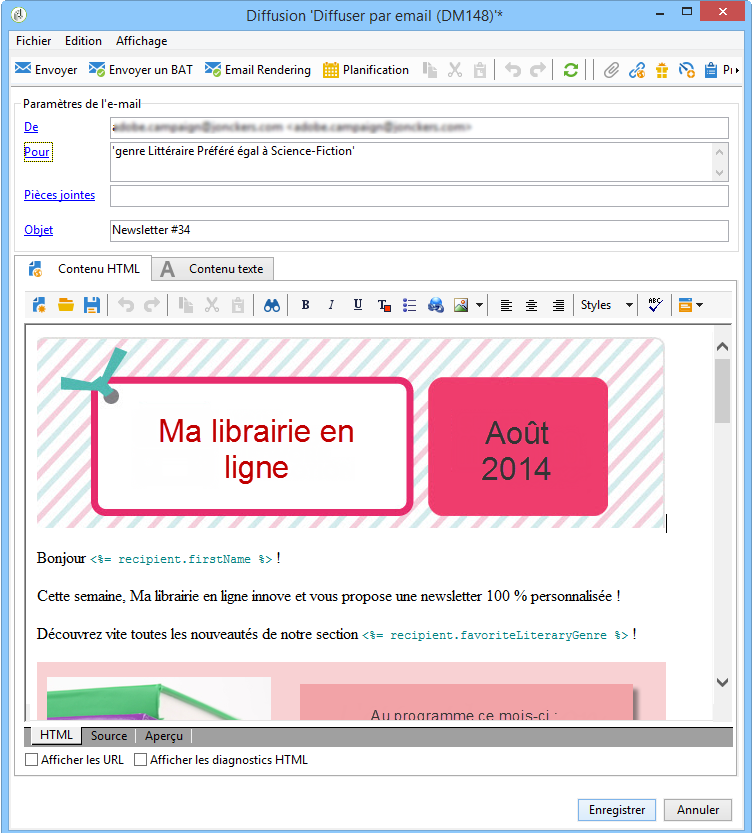
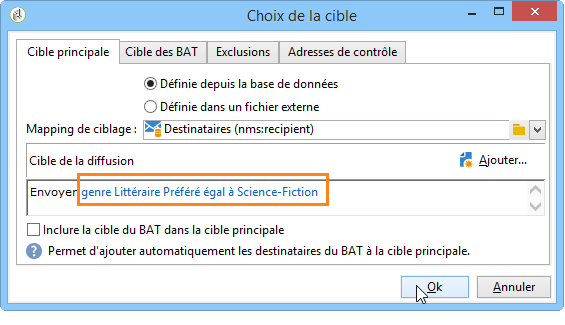
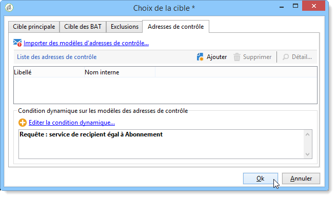

# Cas pratique : configuration de la substitution des champs{#use-case-configuring-the-field-substitution}

La substitution aléatoire des champs permet d&#39;attribuer une valeur issue de la liste des destinataires à des adresses de contrôle qui en sont dépourvues lorsque l&#39;utilisateur utilise cette valeur dans une diffusion (exemple : le nom, la ville, etc.).

Cette substitution permet de gagner du temps lors de la création de la diffusion : au lieu d&#39;ajouter manuellement la valeur souhaitée aux adresses de contrôle, la substitution récupère aléatoirement cette valeur dans la liste des destinataires visés par la diffusion et l&#39;applique aux adresses de contrôle.

## Contexte {#context}

Dans ce cas pratique, le site **Ma librairie en ligne** souhaite envoyer une offre de réduction à ses clients, en fonction de leur préférence littéraire.

Le chargé de diffusion a intégré dans son email un champ de personnalisation en rapport avec cette préférence. Il souhaite par ailleurs utiliser des adresses de contrôle. Ces adresses de contrôle possèdent le champ de personnalisation dans leur table mais aucune valeur n&#39;y est enregistrée.

Pour utiliser la substitution aléatoire des champs vous devez disposer :

* d&#39;une diffusion utilisant un ou plusieurs champs de personnalisation,
* d&#39;adresses de contrôle dont le **schéma de données** est modifié en fonction des champs de personnalisation utilisés dans la diffusion.

## Création d&#39;une diffusion {#step-1---creating-a-delivery}

Les étapes de création d’une remise sont détaillées dans la section [Création d’une remise](../../delivery/using/creating-an-email-delivery.md) par courrier électronique.

Dans cet exemple, l&#39;utilisateur en charge des diffusions a créé sa newsletter :



## Modifier le schéma de données des adresses de contrôle {#editing-the-seed-addresses-data-schema}

Les étapes de modification d&#39;un schéma de données sont présentées dans la section .

Dans cet exemple, le schéma de données des adresses de contrôle reprend une valeur créée dans le schéma de données des destinataires :

```
 <attribute label="Favorite literary genre" length="80" name="favoriteLiteraryGenre"
               type="string" userEnum="favoriteLiteraryGenre"/>
```

Cette énumération permet à l&#39;utilisateur de spécifier le genre littéraire préféré de ses clients.

For this data schema modification to be viewable in the seed addresses **Input form**, you must update it. Reportez-vous à la section [Mise à jour du formulaire](../../delivery/using/use-case--selecting-seed-addresses-on-criteria.md#updating-the-input-form) d’entrée.

## Configurer la personnalisation {#configuring-personalization}

1. Ouvrez votre diffusion.

   Dans cet exemple, la diffusion possède deux champs de personnalisation : le **prénom** et le **genre littéraire favori** du destinataire.

   

1. Configurez votre liste de distribution et vos adresses de départ. Reportez-vous à [Identification des populations](../../delivery/using/steps-defining-the-target-population.md)cibles.

   Dans cet exemple, l&#39;utilisateur choisit comme cible principale les clients dont le **genre littéraire préféré** est la Science-Fiction.

   

   Il ajoute des adresses de contrôle à la diffusion.

   

   >[!NOTE]
   >
   >**[!UICONTROL Pour plus d&#39;informations sur la]** modification de la condition dynamique... , reportez-vous à la [page Cas d’utilisation : sélection des adresses de départ sur des critères](../../delivery/using/use-case--selecting-seed-addresses-on-criteria.md).

1. Cliquez sur l&#39;onglet **[!UICONTROL Aperçu]** puis sélectionnez une adresse de contrôle pour tester la personnalisation.

   

   Vous pouvez constater qu&#39;un des champs de personnalisation est vide. Comme l&#39;adresse de contrôle ne possède pas de données pour ce champ, l&#39;aperçu du contenu HTML ne peut pas afficher de valeur.

   La subsitution aléatoire des champs s&#39;effectue **au moment de l&#39;envoi de la diffusion**.

1. Cliquez sur le bouton **[!UICONTROL Envoyer]**.
1. Analysez votre diffusion puis **confirmez l&#39;envoi**.

   Les adresses de contrôle reçoivent la diffusion dans leur boîte email.

   La personnalisation des champs est effective.

   
