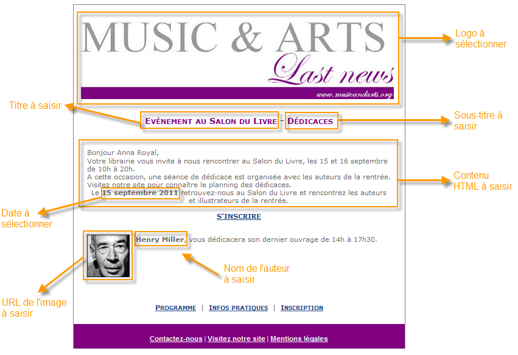
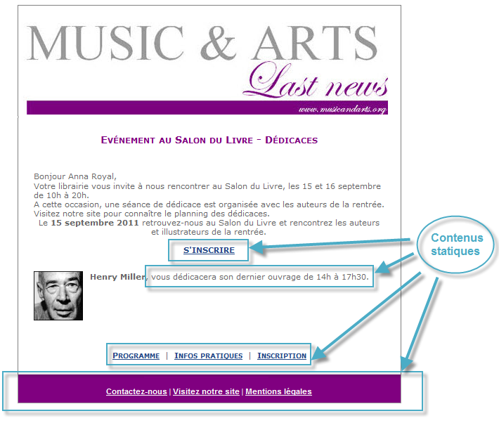
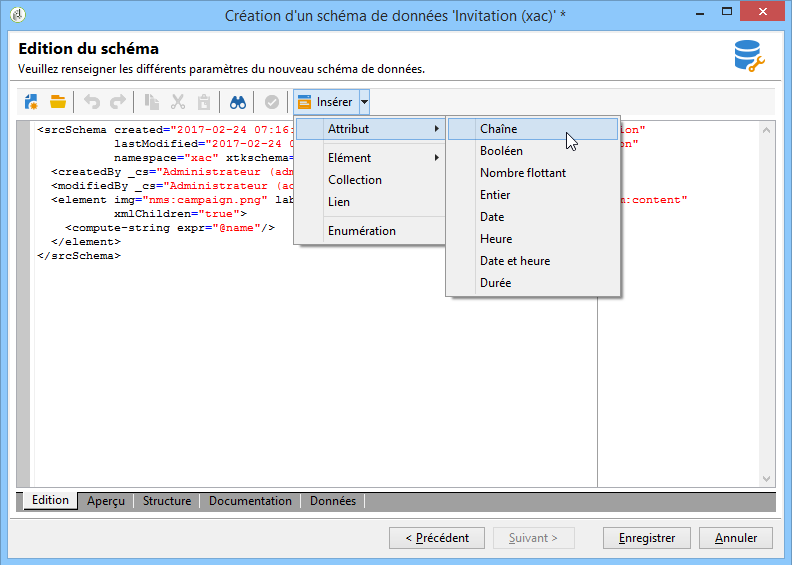
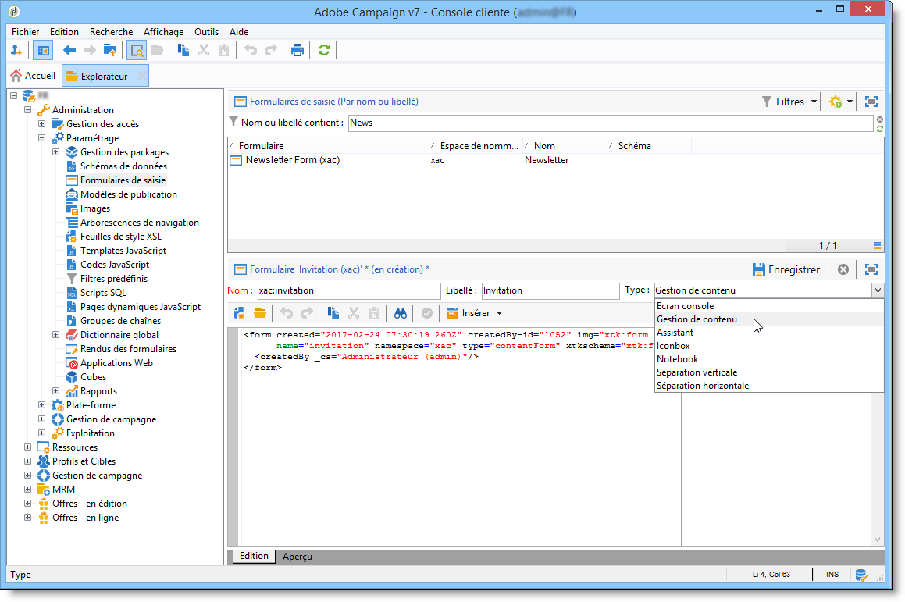
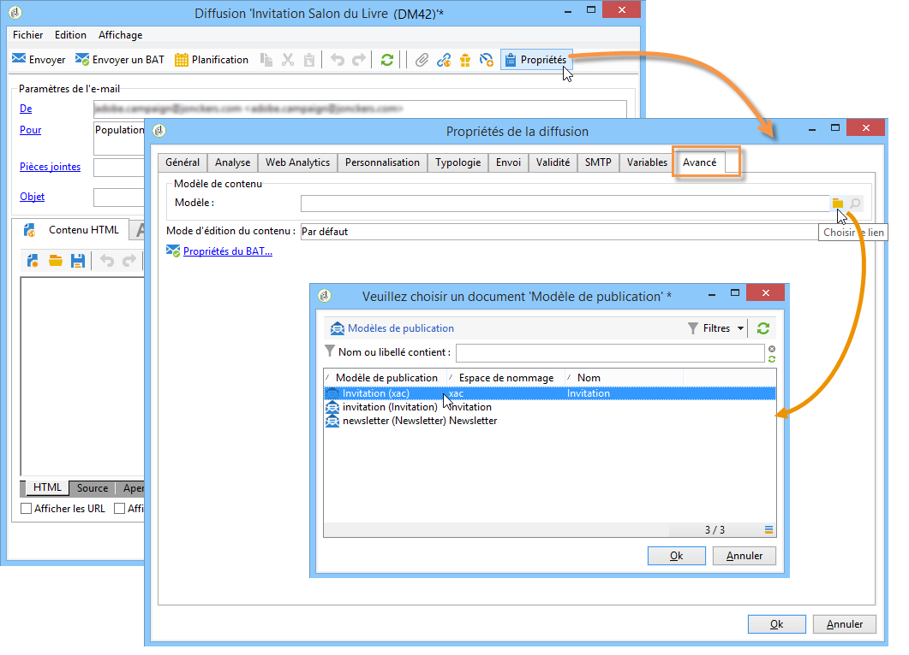
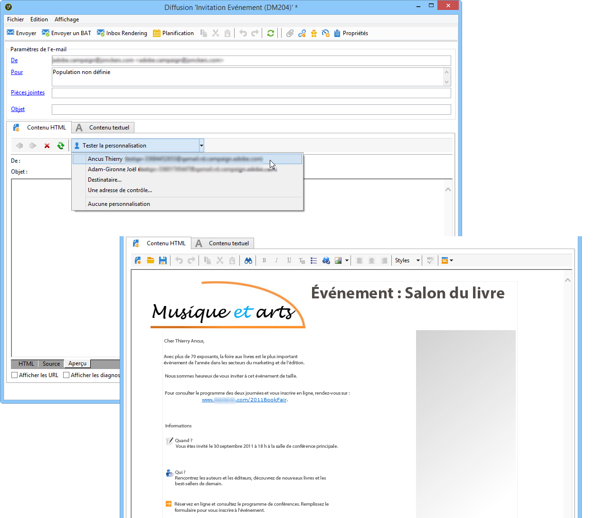

# Cas pratique : utiliser la gestion de contenu{#use-case-creating-content-management}

Pour créer une gestion de contenu dans Adobe Campaign, les étapes de réalisation sont les suivantes :

* [Etape 1 - Analyser le contenu à produire](#step-1---analyzing-the-content-to-be-produced),
* [Etape 2 - Créer le schéma de données](#step-2---creating-the-data-schema),
* [Etape 3 - Créer le formulaire de saisie](#step-3---creating-the-input-form),
* [Etape 4 - Créer le modèle de construction](#step-4---creating-the-construction-template),
* [Etape 5 - Créer le modèle de publication](#step-5---creating-the-publication-template),
* [Etape 6 - Créer les contenus](#step-6---creating-contents).

## Etape 1 - Analyser le contenu à produire {#step-1---analyzing-the-content-to-be-produced}

Avant de démarrer, vous devez procéder à une analyse précise du contenu à produire : identifier les éléments à afficher, étudier les contraintes qui y sont liées, définir les types de chaque élément, etc. Vous devez différencier les éléments statiques et les éléments variables du contenu.

Par exemple, nous allons créer une newsletter en HTML dont le contenu est du type :


Cette newsletter contient trois types d&#39;éléments :

1. Des éléments variables, dont le contenu est saisi ou sélectionné par l&#39;utilisateur lors de la création de la diffusion, au travers d&#39;un formulaire de saisie.

   

1. Des champs de personnalisation qui sont renseignés dynamiquement à partir des informations stockées dans la base de données (ici, le prénom et le nom du destinataire).

   

1. Les éléments statiques, qui ne changent pas d&#39;une newsletter à l&#39;autre.

   

Les différents éléments de cette newsletter sont assemblés selon les règles définies dans un template Javascript qui référence tous les éléments à insérer et modélise leur mise en forme.

Ces éléments sont créés via un schéma dédié qui précise pour chaque contenu : son nom, son libellé, son type, sa taille et toute autre information utile à son exploitation dans Adobe Campaign.

## Etape 2 - Créer le schéma de données {#step-2---creating-the-data-schema}

Un schéma de données est un document XML associé à un contenu, il décrit la structure XML des données de ce contenu.

>[!NOTE]
>
>La création et le paramétrage des schémas de données dans Adobe Campaign sont présentés dans [cette section](../../configuration/using/about-schema-edition.md).
>
>Configuration elements specific to content management are detailed in [Data schemas](../../delivery/using/data-schemas.md).

Pour créer un schéma de données, les étapes sont les suivantes :

1. Ouvrez Adobe Campaign Explorer et sélectionnez le **[!UICONTROL Administration > Configuration > Data schemas]** noeud.

   Click the **[!UICONTROL New]** icon located above the list of data schemas.

1. Sélectionnez l’ **[!UICONTROL Create a schema]** option de gestion du contenu, puis cliquez sur **[!UICONTROL Next]**.

   

1. Saisissez le nom et le libellé du schéma dans les champs correspondants. Vous pouvez ajouter une description et associer une image spécifique, au besoin.

   

   Click **[!UICONTROL Next]** to validate.

1. Enter the content of the schema in the **[!UICONTROL Edit schema]** window.

   Use the **[!UICONTROL Insert]** button to create the schema content.

   

   For more on this, refer to [Editing schemas](../../delivery/using/data-schemas.md#editing-schemas).

   Pour chaque élément référencé dans le contenu, vous devez sélectionner le type correspondant.

   Dans notre exemple, les contenus identifiés, leur format et leur type sont les suivants :

<table> 
 <thead> 
  <tr> 
   <th> <strong>Contenu</strong><br /> </th> 
   <th> <strong>Format</strong><br /> </th> 
   <th> <strong>Type</strong><br /> </th> 
   <th> <strong>Libellé</strong> <br /> </th> 
  </tr> 
 </thead> 
 <tbody> 
  <tr> 
   <td> Title<br /> </td> 
   <td> Attribut<br /> </td> 
   <td> Chaîne <br /> </td> 
   <td> Title<br /> </td> 
  </tr> 
  <tr> 
   <td> Sous-titre<br /> </td> 
   <td> Attribut<br /> </td> 
   <td> Chaîne <br /> </td> 
   <td> Nom<br /> </td> 
  </tr> 
  <tr> 
   <td> Date de l'événement<br /> </td> 
   <td> Attribut<br /> </td> 
   <td> Date<br /> </td> 
   <td> Date<br /> </td> 
  </tr> 
  <tr> 
   <td> Paragraphe d'introduction<br /> </td> 
   <td> Elément<br /> </td> 
   <td> HTML<br /> </td> 
   <td> Présentation<br /> </td> 
  </tr> 
  <tr> 
   <td> Photo de l'auteur<br /> </td> 
   <td> Attribut<br /> </td> 
   <td> Chaîne <br /> </td> 
   <td> URL<br /> </td> 
  </tr> 
  <tr> 
   <td> Auteur<br /> </td> 
   <td> Elément<br /> </td> 
   <td> Memo<br /> </td> 
   <td> Auteur<br /> </td> 
  </tr> 
  <tr> 
   <td> Logo d'en-tête (stocké dans les ressources publiques Adobe Campaign)<br /> </td> 
   <td> Attribut<br /> </td> 
   <td> Lien (link)<br /> </td> 
   <td> Image<br /> </td> 
  </tr> 
 </tbody> 
</table>

Le schéma contiendra donc les informations suivantes :

```
<element label="Invitation" name="invitation" template="ncm:content" xmlChildren="true">
    <compute-string expr="@name"/>
    <attribute label="Title" length="40" name="title" type="string"/>
    <element label="Presentation" name="presentation" type="html"/>
    <attribute label="Date" name="date" type="date"/>
    <attribute label="Name" length="10" name="name" type="string"/>
    <attribute label="URL" name="url" type="string"/>
    <element label="Author" name="author" type="memo"/>
    <element label="Image" name="image" target="xtk:fileRes" type="link"/>
  </element>
```

1. Click **[!UICONTROL Save]** to create the data schema.

## Etape 3 - Créer le formulaire de saisie {#step-3---creating-the-input-form}

Le formulaire de saisie permet d&#39;éditer une instance de contenu via une interface de saisie à partir de la console cliente Adobe Campaign.

La description d&#39;un formulaire est un document XML structuré respectant la grammaire du schéma des formes &quot;xtk:form&quot;.

>[!NOTE]
>
>La création et le paramétrage des formulaires dans Adobe Campaign sont présentés dans [cette section](../../configuration/using/identifying-a-form.md).
>
>Configuration elements specific to content management are detailed in [Input forms](../../delivery/using/input-forms.md).

Pour créer un formulaire de saisie pour la gestion de contenu, les étapes sont les suivantes :

1. Ouvrez Adobe Campaign Explorer et sélectionnez le **[!UICONTROL Administration > Configuration > Input forms]** noeud.

   Click the **[!UICONTROL New]** icon above the list of forms.

1. Enter the name of the form and the label linked to the form, then select the **[!UICONTROL Content management]** type.

   

   >[!NOTE]
   >
   >Pour permettre une correspondance automatique entre les deux éléments, nous vous recommandons d’utiliser le même nom que pour le schéma de données liées. Utilisez le **[!UICONTROL Insert]** bouton au-dessus de la zone d’entrée pour ajouter des champs du schéma lié au formulaire.

   

1. Dans la section centrale de l&#39;éditeur, indiquez les champs que vous souhaitez afficher dans le formulaire de saisie.

   Dans notre exemple, les informations seront du type :

   ```
    <input xpath="@title"/>
     <input xpath="@date"/>
     <input xpath="presentation"/>
     <input xpath="@name"/>
     <input xpath="@url"/>
     <input xpath="author"/>
     <input img="nl:sryimage.png" newEntityFormChoice="true" xpath="image">
       <sysFilter>
         <condition expr="@isImage = true"/>
       </sysFilter>
     </input>
   ```

   The **[!UICONTROL Preview]** tab lets you check the rendering of the form while you are editing it:

   

1. Click **[!UICONTROL Save]** to create the input form.

## Etape 4 - Créer le modèle de construction {#step-4---creating-the-construction-template}

Le langage XSLT permet de transformer un document XML en un autre document de sortie. Cette transformation est elle-même décrite en XML dans un document appelé feuille de style.

Dans notre exemple, nous allons utiliser un template Javascript pour définir le mode de construction et de mise en forme des données dans le document généré.

>[!NOTE]
>
>Constraints linked to document building (JavaScript or XSL template) are detailed in [Formatting](../../delivery/using/formatting.md).

Pour utiliser un template Javascript dans Adobe Campaign, les étapes sont les suivantes :

1. Ouvrez Adobe Campaign Explorer et sélectionnez le **[!UICONTROL Administration > Configuration > JavaScript Templates]** noeud.

   Click the **[!UICONTROL New]** icon above the list of templates.

1. Indiquez le nom du template et sélectionnez le schéma que vous avez créé pour la gestion de contenu.
1. Importez le contenu fixe que vous souhaitez afficher dans le message.

   Add the variable elements while respecting the syntax detailed in [JavaScript templates](../../delivery/using/formatting.md#javascript-templates).

   Pour afficher le contenu proposé dans notre exemple, le template JavaScript contient les éléments suivants :

   ```
   <html>
   <% eval(xtk.javascript.load("xac:perso").data); %>
   <head>
     <title>Invitation to an exceptional dedication session</title>
   </head>
   <body link="#0E59AE" vlink="#0E59AE" alink="#0E59AE" style="background-color:white;">
       <table width="546" border="0" align="center" cellpadding="0" cellspacing="0" style="border-left: solid 1px gray;border-top: solid 1px gray;border-right: solid 1px gray;">
         <tr>
           <td colspan="3">
             <%= generateImgTag(content.@["image-id"]) %>
           </td>
         </tr>
       </table>
       <table width="546" border="0" align="center" cellpadding="0" cellspacing="0" style="border-left: solid 1px gray;border-right: solid 1px gray;">
         <tr>
           <td>
             <table border="0" cellspacing="0" cellpadding="5">
               <tr>
                 <td width="10"> </td>
                 <td style="padding-top:2em; padding-bottom:2em;" width="730" align="middle">
                   <b>
                     <font style="font-family:Verdana, Arial, Helvetica, sans-serif; font-size:14px; color:#800080;">
                       <span style="FONT-VARIANT: small-caps"><%= content.@title %> - <%= content.@name %></span>
                     </font>
                   </b>
                 </td>
                 <td width="10"> </td>
               </tr>
               <tr>
                 <td width="10"> </td>
                 <td style="padding-top:1em; padding-bottom:1em;" width="730">
                   <font style="font-family:Verdana, Arial, Helvetica, sans-serif; font-size:11px; color:#666666;">
                     Hello <%= perso('recipient.firstName') %> <%= perso('recipient.lastName') %>,
                     <p>
                       <%= content.presentation %>
                     </p>               
                     <center>
                       <b><%= formatDate(content.@date, "%2D %Bl %4Y") %></b> come to our Book Fair and meet our favorite authors and illustrators.<br>
                       <br>
                       <a href="https://www.site.web.com/registration" target="_blank"><b>REGISTER</b></a>
                     </center>
                   </font>
                 </td>
                 <td width="10"> </td>
               </tr>
               <tr>
                 <td width="10"> </td>
                 <td style="padding-top:1em; padding-bottom:1em;" width="730">
                   <font style="font-family:Verdana, Arial, Helvetica, sans-serif; font-size:11px; color:#666666;">
                    " width="70" height="70">
                     <b><%= content.author %></b>, will be signing their book between 2
   and 5:30PM.
                   </font>
                 </td>
                 <td width="10"> </td>
               </tr>            
                   <tr>
                 <td width="10"> </td>
                 <td width="730">
                   <font style="font-family:Verdana, Arial, Helvetica, sans-serif; font-size:11px; color:#666666;">                  
                 </td>
                 <td width="10"> </td>
               </tr>           
               <tr>
                 <td width="10"> </td>
                 <td>
                   <font style="font-family:Verdana, Arial, Helvetica, sans-serif; font-size:11px; color:#666666;">
                     <center>
                       <p>
                         <a href="https://www.site.web.com/program" target="_blank"><span style="FONT-VARIANT: small-caps"><b>Program</b></span></a>
                          | 
                         <a href="https://www.site.web.com/information" target="_blank"><span style="FONT-VARIANT: small-caps"><b>Useful information</b></span></a>
                          | 
                       <a href="https://www.site.web.com/registration" target="_blank"><span style="FONT-VARIANT: small-caps"><b>Register</b></span></a></p>
                       </center>
                     </font>
                   </td>
                   <td width="10"> </td>
                 </tr>
               </table>
               <br>
             </td>
           </tr>
         </table>
   </body>
   </html>
   ```

   L’appel d’une fonction au début d’un modèle permet de configurer un appel à des données de personnalisation provenant de la base de données Adobe Campaign (dans ce cas : Destinataire.firstName et Destinataire.lastName), de sorte qu’il puisse être interprété lorsqu’il est utilisé dans une remise. Pour plus d’informations, reportez-vous à la section [Inclusion d’un modèle](../../delivery/using/formatting.md#including-a-javascript-template)JavaScript.

   Dans notre exemple, la fonction contiendra le code suivant :

   ```
   function perso(strPerso)
   {
     var strStart = '<' + '%' + '=';
     var strEnd = '%' + '>';
     return strStart + strPerso + strEnd;
   }
     function bloc(strPerso)
   {
     var strStart = '<' + '%' + '@ include view="';
     var strEnd = '" %' + '>';
     return strStart + strPerso + strEnd;
   }
   ```

   In order for the JavaScript template to be valid, this function must be created beforehand from the **[!UICONTROL JavaScript codes]** node in the tree structure, as below:

   

## Etape 5 - Créer le modèle de publication {#step-5---creating-the-publication-template}

Vous devez ensuite créer un modèle de publication de contenu qui permettra de faire le lien entre le schéma, le formulaire et le modèle de construction du contenu. Ce modèle de publication peut proposer plusieurs formats de sortie.

>[!NOTE]
>
>For more on content publication templates, refer to [Publication templates](../../delivery/using/publication-templates.md).

Pour notre exemple, les étapes sont les suivantes :

1. Créez un modèle de publication via le **[!UICONTROL Administration > Configuration > Publication templates]** noeud.
1. Indiquez son nom, le libellé associé et sélectionnez le schéma et le formulaire à utiliser.
1. Entrez ensuite le nom du modèle et choisissez le mode de rendu à appliquer. Ici, nous avons un rendu de **[!UICONTROL JavaScript]** type basé sur le modèle créé ci-dessus.

   

   >[!NOTE]
   >
   >L’ **[!UICONTROL DOM interface]** option est cochée par défaut, ce qui signifie que ce document ne sera pas accessible si vous utilisez la syntaxe E4X. L’interface DOM doit être utilisée lorsque cette option est cochée. Il s’agit de la syntaxe recommandée.
   >
   >Vous pouvez continuer à utiliser la syntaxe E4X. Le cas échéant, vérifiez que l&#39;option est décochée.

   Use the **[!UICONTROL Add]** button to create other transformation templates.

1. Click **[!UICONTROL Save]** to create the publication template.

## Etape 6 - Créer les contenus {#step-6---creating-contents}

Vous pouvez enfin créer des contenus à partir de ce modèle de publication.

>[!NOTE]
>
>Pour plus d’informations sur la création de contenu, voir [Utilisation d’un modèle](../../delivery/using/using-a-content-template.md)de contenu.

### Créer un contenu dans l&#39;assistant de diffusion {#creating-content-in-the-delivery-wizard}

Pour créer un contenu directement dans les diffusions, la procédure est la suivante :

1. Start by referencing the publication template via the **[!UICONTROL Advanced]** tab of the delivery properties.

   

   Un onglet supplémentaire est ajouté dans l&#39;assistant de diffusion afin de définir le contenu, via le formulaire de la gestion de contenu.

1. Renseignez les informations variables de votre newsletter.

   

1. Cliquez sur l’ **[!UICONTROL HTML preview]** onglet pour afficher le rendu. Vous devez sélectionner un destinataire pour tester la personnalisation.

   
