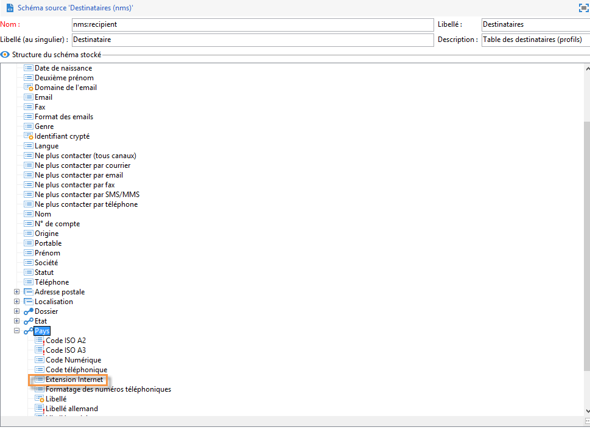

# Cas pratique : sélection des adresses de contrôle selon des critères{#use-case-selecting-seed-addresses-on-criteria}


Le lien **[!UICONTROL Editer la condition dynamique...]** permet, dans le cadre d&#39;une diffusion ou d&#39;une opération, de choisir des adresses de contrôle en fonction de critères de sélection spécifiques.

Dans ce cas pratique, le site **Ma librairie en ligne** souhaite personnaliser ses newsletters en fonction des goûts littéraires de ses clients.

En concertation avec le service des achats, l&#39;utilisateur en charge des diffusions a créé une newsletter pour les abonnés ayant acheté des romans policiers.

Pour partager avec eux le résultat final de leur collaboration, le chargé de diffusion décide d’ajouter ses collègues du service des achats à la diffusion en tant qu’adresses de contrôle. L’utilisation d’une condition dynamique permet d’optimiser le temps de paramétrage et la mise à jour des adresses.

Pour utiliser la condition dynamique vous devez disposer :

* d&#39;une diffusion prête à être envoyée,
* d&#39;adresses de contrôle ayant une valeur commune. Cette valeur peut tout à fait être un champ existant dans Adobe Campaign. Dans cet exemple, les adresses de contrôle partagent la valeur &quot;Achats&quot; du champ &quot;Service&quot;, qui n&#39;est pas présent par défaut dans l&#39;application.

## Étape 1 : création dʼune diffusion {#step-1---creating-a-delivery}

Les étapes de création dʼune diffusion sont détaillées dans la section [Création dʼune diffusion e-mail](creating-an-email-delivery.md).

Dans cet exemple, le chargé de diffusion a créé sa newsletter et sélectionné les destinataires.


## Étape 2 : création dʼune valeur commune {#step-2---creating-a-common-value}

Pour créer une valeur commune comme celle utilisée dans notre exemple (Service Achat), vous devez étendre le **schéma de données** des adresses de contrôle et modifier le formulaire de saisie associé.

### Extension du schéma de données {#extending-the-data-schema}

Pour plus d’informations sur les extensions de schéma, consultez [cette section](../../configuration/using/data-schemas.md).

1. Dans le noeud **[!UICONTROL Administration > Paramétrage > Schémas de données]**, cliquez sur l&#39;icône **[!UICONTROL Nouveau]**.
1. Dans la fenêtre **[!UICONTROL Création d&#39;un schéma de données]** sélectionnez l&#39;option **[!UICONTROL Extension d&#39;un schéma]** et cliquez sur **[!UICONTROL Suivant]**.

   

1. Choisissez le schéma source **[!UICONTROL Adresses de contrôle]**, choisissez **doc** comme **[!UICONTROL espace de noms]** et cliquez sur **[!UICONTROL Ok]**.

   

1. Cliquez sur **[!UICONTROL Enregistrer]**.
1. Dans la fenêtre d&#39;édition du schéma, copiez les lignes ci-dessous à l&#39;emplacement indiqué dans la capture d&#39;écran :

   ```
     <element name="common">
       <element label="Recipient" name="custom_nms_recipient">
         <attribute label="Department" length="80" name="workField" template="nms:recipient:recipient/@company"
                    type="string" userEnum="workField"/>
       </element>
     </element>
   ```

   

   Copiez ensuite les lignes suivantes sous l&#39;élément **[!UICONTROL Adresse de contrôle à insérer dans les fichiers d&#39;export]** :

   ```
       <element aggregate="doc:seedMember:common">
     </element>
   ```

   

   De ce fait, vous spécifiez la création d&#39;une nouvelle énumération dans la table des adresses de contrôle nommée **[!UICONTROL Service]** et basée sur le modèle de l&#39;énumération standard **[!UICONTROL @company]** (labellisée sous le nom **Société** dans le formulaire des adresses de contrôle).

1. Cliquez sur **[!UICONTROL Enregistrer]**.
1. Dans le menu **[!UICONTROL Outils > Avancé]**, sélectionnez l&#39;option **[!UICONTROL Mise à jour de la structure de la base]**.

   

1. Lorsque l&#39;assistant de mise à jour s&#39;affiche, cliquez sur le bouton **[!UICONTROL Suivant]** pour accéder à l&#39;édition des tables : les changements effectués dans le schéma de données des adresses de contrôle nécessitent une mise à jour de la structure.

   

1. Suivez l&#39;assistant pour afficher la page de lancement de la mise à jour. Cliquez sur le bouton **[!UICONTROL Démarrer]**.

   

   Lorsque la mise à jour est terminée, vous pouvez fermer l&#39;assitant.

1. Déconnectez-vous d&#39;Adobe Campaign puis reconnectez-vous. Les modifications apportées dans le schéma de données des adresses de contrôle sont effectives. Pour qu&#39;elles soient visibles depuis l&#39;écran des adresses de contrôle, vous devez mettre à jour le **[!UICONTROL Formulaire de saisie]** associée. Pour plus dʼinformations, consultez la section [Mise à jour du formulaire de saisie](#updating-the-input-form).

#### Extension du schéma de données à partir dʼune table liée {#extending-the-data-schema-from-a-linked-table}

Le schéma de données des adresses de contrôle peut reprendre des valeurs provenant d&#39;une table liée au schéma de données des destinataires.

Par exemple, l&#39;utilisateur souhaite intégrer l&#39;**[!UICONTROL Extension Internet]** disponible dans la table **[!UICONTROL Pays]** qui est liée au schéma des destinataires.



Il doit donc étendre le schéma de données des adresses de contrôle comme présenté dans la section mais les lignes de code à intégrer lors de **l&#39;étape 4** sont les suivantes :

```
<element name="country">
      <attribute label="Internet Extension" length="2" name="iana" type="string"/>
      <attribute label="Country ISO" length="2" name="countryIsoA2" type="string"/>
    </element>
```


Elles indiquent :

* que l&#39;utilisateur souhaite créer un nouvel élément nommé **[!UICONTROL Extension Internet]**,
* que cet élément provient de la table **[!UICONTROL Country]**.

>[!CAUTION]
>
>Il est impératif de préciser dans le nom de la table liée son **xpath-dst**.
>
>Celui-ci est disponible dans la table des destinataires dans l&#39;élément **[!UICONTROL Country]**:


L&#39;utilisateur peut ensuite reprendre la section à partir de l&#39;**étape 5** et mettre à jour le **[!UICONTROL Formulaire de saisie]** des adresses de contrôle.

Pour plus dʼinformations, consultez la section [Mise à jour du formulaire de saisie](#updating-the-input-form).

#### Mise à jour du formulaire de saisie {#updating-the-input-form}

1. Dans le noeud **[!UICONTROL Administration > Paramétrage > Formulaire de saisie]**, recherchez le formulaire des adresses de contrôle.

   

1. Éditez le formulaire et insérez la ligne suivante dans le conteneur **[!UICONTROL Destinataire]**.

   ```
   <input xpath="@workField"/>
   ```

   

1. Enregistrez vos modifications.
1. Ouvrez une adresse de contrôle. Le champ **[!UICONTROL Service]** apparaît dans la table **[!UICONTROL Destinataire]**.

   

1. Editez les adresses de contrôle que vous souhaitez utiliser pour la diffusion et saisissez la valeur **Achat** dans le champ **[!UICONTROL Service]**.

## Étape 3 : définition de la condition {#step-3---defining-the-condition}

Vous pouvez maintenant définir la condition dynamique de sélection des adresses de contrôle pour la diffusion. Pour cela :

1. Ouvrez votre diffusion.

   

1. Cliquez sur le lien **[!UICONTROL Pour]** puis sur l&#39;onglet **[!UICONTROL Adresses de contrôle]** afin d&#39;accéder au lien **[!UICONTROL Editer la condition dynamique]**.

   

1. Choisissez l&#39;expression qui vous permet de sélectionner les adresses de contrôle désirées. Ici l&#39;utilisateur sélectionne l&#39;expression **[!UICONTROL Service (@workField)]**.

   

1. Choisissez la valeur souhaitée. Dans cet exemple, l&#39;utilisateur choisit le service **Achats** dans la liste déroulante des valeurs.

   

   >[!NOTE]
   >
   >L&#39;extension de schéma créée plus tôt provient du schéma **recipient**. Les valeurs affichées dans l&#39;écran ci-dessus viennent d&#39;une énumération du schéma **recipient**.

1. Cliquez sur **[!UICONTROL Ok]**.

   La requête s&#39;affiche dans la fenêtre **[!UICONTROL Choix de la cible]**.

   

1. Cliquez sur **[!UICONTROL Ok]** pour valider la requête.
1. Analysez votre diffusion puis cliquez sur l&#39;onglet **[!UICONTROL Diffusion]** pour accéder aux logs de diffusion.

   Les adresses de contrôle du service des achats sont affichées comme étant en attente de l&#39;envoi de la difusion, comme celles des destinataires ou des autres adresses de contrôle.

   

1. Cliquez sur le bouton **[!UICONTROL Envoyer]** pour démarrer votre diffusion.

   Les membres du service des achats qui font partie de vos adresses de contrôle recevront la diffusion dans leur boîte email.

   
