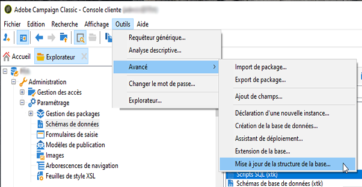
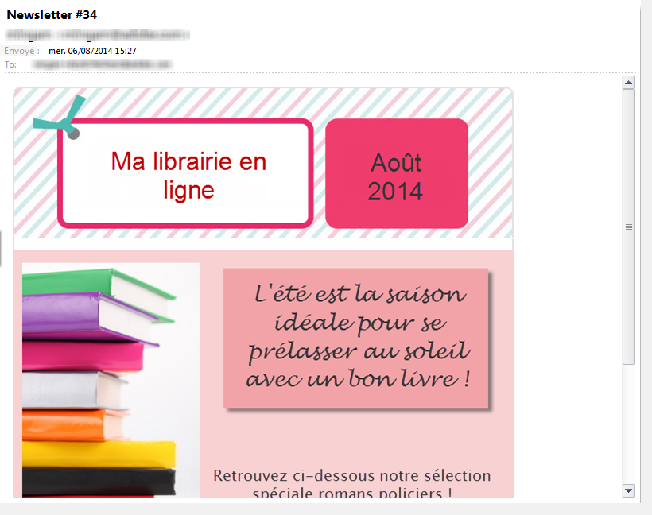

# Cas pratique : sélection des adresses de contrôle selon des critères{#use-case-selecting-seed-addresses-on-criteria}

In the framework of a delivery or a campaign, the **[!UICONTROL Edit the dynamic condition...]** link lets you choose seed addresses based on specific selection criteria.

Dans ce cas pratique, le site **Ma librairie en ligne** souhaite personnaliser ses newsletters en fonction des goûts littéraires de ses clients.

En concertation avec le service des achats, l&#39;utilisateur en charge des diffusions a créé une newsletter pour les abonnés ayant acheté des romans policiers.

Afin de partager avec eux le résultat final de leur collaboration, le chargé de diffusion décide d&#39;ajouter ses collègues du service des achats à la diffusion, comme adresses de contrôle. L&#39;utilisation d&#39;une condition dynamique permet d&#39;optimiser le temps de paramétrage et la mise à jour des adresses.

Pour utiliser la condition dynamique vous devez disposer :

* d&#39;une diffusion prête à être envoyée,
* d&#39;adresses de contrôle ayant une valeur commune. Cette valeur peut tout à fait être un champ existant dans Adobe Campaign. Dans cet exemple, les adresses de contrôle partagent la valeur &quot;Achats&quot; du champ &quot;Service&quot;, qui n&#39;est pas présent par défaut dans l&#39;application.

## Etape 1 - Créer une diffusion {#step-1---creating-a-delivery}

Les étapes de création d’une remise sont détaillées dans la section [Création d’une remise](../../delivery/using/creating-an-email-delivery.md) par courrier électronique.

Dans cet exemple, le chargé de diffusion a créé sa newsletter et sélectionné les destinataires.


## Etape 2 - Créer une valeur commune {#step-2---creating-a-common-value}

Pour créer une valeur commune comme celle utilisée dans notre exemple (Service Achat), vous devez étendre le **schéma de données** des adresses de contrôle et modifier le formulaire de saisie associé.

### Etendre le schéma de données {#extending-the-data-schema}

Pour plus de détails sur les extensions de schéma, voir [le guide Configuration ](../../configuration/using/data-schemas.md).

1. Dans le **[!UICONTROL Administration > Configuration > Data schemas]** noeud, cliquez sur l’ **[!UICONTROL New]** icône.
1. Dans la **[!UICONTROL Creation of a data schema]** fenêtre, sélectionnez l’ **[!UICONTROL Extension of a schema]** option et cliquez sur **[!UICONTROL Next]**.

   

1. Sélectionnez le schéma **[!UICONTROL Seed addresses]** source, saisissez **doc** comme **[!UICONTROL Namespace]** document et cliquez sur **[!UICONTROL Ok]**.

   

1. Clics **[!UICONTROL Save]**.
1. Dans la fenêtre d&#39;édition du schéma, copiez les lignes ci-dessous à l&#39;emplacement indiqué dans la capture d&#39;écran :

   ```
     <element name="common">
       <element label="Recipient" name="custom_nms_recipient">
         <attribute label="Department" length="80" name="workField" template="nms:recipient:recipient/@company"
                    type="string" userEnum="workField"/>
       </element>
     </element>
   ```

   

   Copiez ensuite les lignes suivantes et collez-les sous l’ **[!UICONTROL Seed to insert in the export files]** élément.

   ```
       <element aggregate="doc:seedMember:common">
     </element>
   ```

   

   In this case, you are specifying that a new enumeration named **[!UICONTROL Department]** has been created in the seed address table, and it is based on the standard **[!UICONTROL @company]** enumeration template (labeled under the name **Company** in the seed address form).

1. Clics **[!UICONTROL Save]**.
1. Dans le **[!UICONTROL Tools > Advanced]** menu, sélectionnez l’ **[!UICONTROL Update database structure]** option.

   

1. When the update wizard is displayed, click the **[!UICONTROL Next]** button to access the Edit tables window: changes carried out in the seed address data schema require a structure update.

   

1. Suivez l’assistant jusqu’à ce que vous arriviez à la page pour exécuter la mise à jour. Cliquez sur le **[!UICONTROL Start]** bouton.

   

   Lorsque la mise à jour est terminée, vous pouvez fermer l&#39;assitant.

1. Disconnect then reconnect to Adobe Campaign. The changes made in the seed address data schema are now effective. In order for them to be visible from the seed address screen, you must update the associated **[!UICONTROL Input form]**. Reportez-vous à la section [Mise à jour du formulaire](#updating-the-input-form) d’entrée.

#### Etendre le schéma de données à partir d&#39;une table liée {#extending-the-data-schema-from-a-linked-table}

Le schéma de données des adresses de contrôle peut reprendre des valeurs provenant d&#39;une table liée au schéma de données des destinataires.

For example, the user would like to integrate the **[!UICONTROL Internet Extension]** found in the **[!UICONTROL Country]** table that is linked to the recipients schema.


Il doit donc étendre le schéma de données des adresses de contrôle comme présenté dans la section  mais les lignes de code à intégrer lors de **l&#39;étape 4** sont les suivantes :

```
<element name="country">
      <attribute label="Internet Extension" length="2" name="iana" type="string"/>
      <attribute label="Country ISO" length="2" name="countryIsoA2" type="string"/>
    </element>
```


Elles indiquent :

* that the user wants to create a new element named **[!UICONTROL Internet Extension]**,
* que cet élément provient de la table **[!UICONTROL Country]**.

>[!CAUTION]
>
>Il est impératif de préciser dans le nom de la table liée son **xpath-dst**.
>
>Celui-ci est disponible dans la table des destinataires dans l&#39;élément **[!UICONTROL Country]**:


The user can then follow from **step 5** of the section, and update the **[!UICONTROL Input form]** of the seed addresses.

Reportez-vous à la section [Mise à jour du formulaire](#updating-the-input-form) d’entrée.

#### Mettre à jour le formulaire de saisie {#updating-the-input-form}

1. Dans le **[!UICONTROL Administration > Configuration > Input forms]** noeud, recherchez le formulaire d’entrée des adresses de départ.

   

1. Edit the form and insert the following line in the **[!UICONTROL Recipient]** container.

   ```
   <input xpath="@workField"/>
   ```

   

1. Enregistrez vos modifications.
1. Ouvrez une adresse de départ. Le **[!UICONTROL Department]** champ apparaît dans le **[!UICONTROL Recipient]** tableau.

   

1. Edit the seed addresses that you want to use for the delivery and enter **Purchasing** as the value in the **[!UICONTROL Department]** field.

## Etape 3 - Définir la condition {#step-3---defining-the-condition}

Vous pouvez maintenant définir la condition dynamique de sélection des adresses de contrôle pour la diffusion. Pour cela :

1. Ouvrez votre diffusion.

   

1. Cliquez sur le **[!UICONTROL To]** lien, puis sur l’ **[!UICONTROL Seed addresses]** onglet pour accéder au **[!UICONTROL Edit the dynamic condition...]** lien.

   

1. Sélectionnez l’expression qui vous permet de choisir les adresses de départ souhaitées. L’utilisateur sélectionne ici l’ **[!UICONTROL Department (@workField)]** expression.

   

1. Choisissez la valeur souhaitée. Dans cet exemple, l&#39;utilisateur choisit le service **Achats** dans la liste déroulante des valeurs.

   

   >[!NOTE]
   >
   >L&#39;extension de schéma créée plus tôt provient du schéma **recipient**. Les valeurs affichées dans l&#39;écran ci-dessus viennent d&#39;une énumération du schéma **recipient**.

1. Clics **[!UICONTROL Ok]**.

   The query is displayed in the **[!UICONTROL Select target]** window.

   

1. Cliquez sur **[!UICONTROL Ok]** pour valider la requête.
1. Analyze your delivery then click on the **[!UICONTROL Delivery]** tab to access the delivery logs.

   Les adresses de contrôle du service des achats sont affichées comme étant en attente de l&#39;envoi de la difusion, comme celles des destinataires ou des autres adresses de contrôle.

   

1. Click the **[!UICONTROL Send]** button to start the delivery.

   Les membres du service des achats qui font partie de vos adresses de contrôle recevront la diffusion dans leur boîte email.

   
