# Cas dʼutilisation : création dʼune gestion de contenu{#use-case-creating-content-management}


Pour créer une gestion de contenu dans Adobe Campaign, suivez la procédure ci-dessous :

* [Étape 1 : analyse du contenu à produire](#step-1---analyzing-the-content-to-be-produced),
* [Étape 2 : création du schéma de données](#step-2---creating-the-data-schema),
* [Étape 3 : création du formulaire de saisie](#step-3---creating-the-input-form),
* [Étape 4 : création du modèle de construction](#step-4---creating-the-construction-template),
* [Étape 5 : création du modèle de publication](#step-5---creating-the-publication-template),
* [Étape 6 : création du contenu](#step-6---creating-contents).

## Étape 1 : analyse du contenu à produire {#step-1---analyzing-the-content-to-be-produced}

Avant de démarrer, vous devez procéder à une analyse précise du contenu à produire : identifier les éléments à afficher, étudier les contraintes qui y sont liées, définir les types de chaque élément, etc. Vous devez différencier les éléments statiques et les éléments variables du contenu.

Par exemple, nous allons créer une newsletter en HTML dont le contenu est du type :

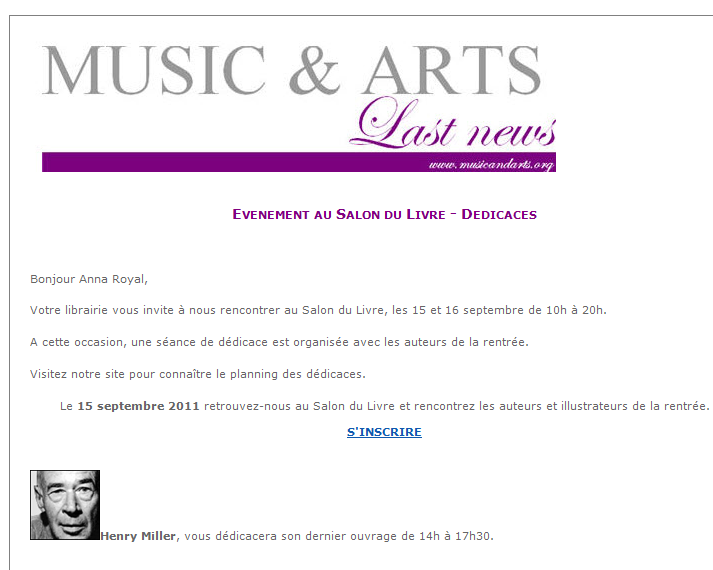

Cette newsletter contient trois types d&#39;éléments :

1. Des éléments variables, dont le contenu est saisi ou sélectionné par l&#39;utilisateur lors de la création de la diffusion, au travers d&#39;un formulaire de saisie.

   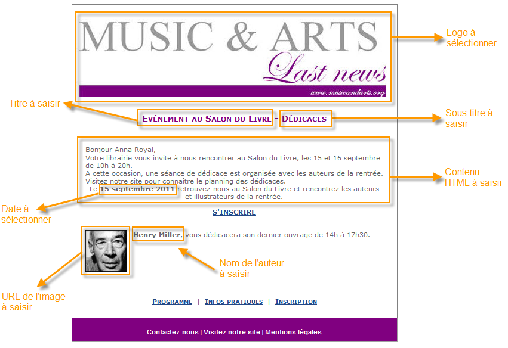

1. Des champs de personnalisation qui sont renseignés dynamiquement à partir des informations stockées dans la base de données (ici, le prénom et le nom du destinataire).

   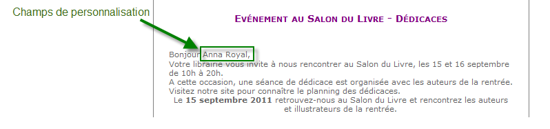

1. Les éléments statiques, qui ne changent pas d&#39;une newsletter à l&#39;autre.

   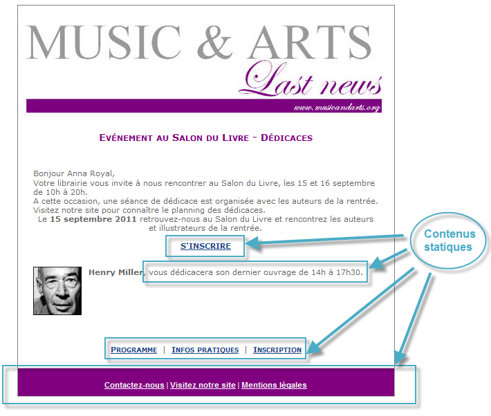

Les différents éléments de cette newsletter sont assemblés selon les règles définies dans un template Javascript qui référence tous les éléments à insérer et modélise leur disposition.

Ces éléments sont créés via un schéma dédié qui précise pour chaque contenu : son nom, son libellé, son type, sa taille et toute autre information utile à son exploitation dans Adobe Campaign.

## Étape 2 : création du schéma de données {#step-2---creating-the-data-schema}

Un schéma de données est un document XML associé à un contenu, il décrit la structure XML des données de ce contenu.

>[!NOTE]
>
>La création et le paramétrage des schémas de données dans Adobe Campaign sont présentés dans [cette section](../../configuration/using/about-schema-edition.md).
>
>Les éléments de paramétrage spécifiques à la gestion de contenu sont décrits dans [Schémas de données](data-schemas.md).

Pour créer un schéma de données, les étapes sont les suivantes :

1. Ouvrez l&#39;Explorateur Adobe Campaign et sélectionnez le noeud **[!UICONTROL Administration > Paramétrages > Schémas de données]**.

   Cliquez sur l&#39;icône **[!UICONTROL Nouveau]** située au-dessus de la liste des schémas de données.

1. Sélectionnez l&#39;option **[!UICONTROL Créer un schéma]** pour la gestion de contenu puis cliquez sur **[!UICONTROL Suivant]**.

   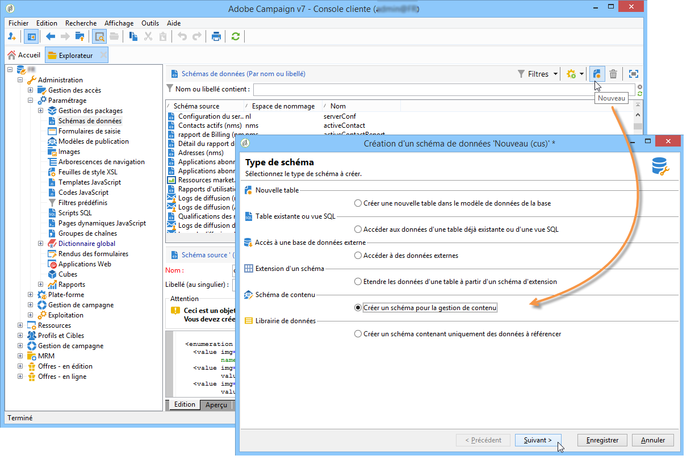

1. Saisissez le nom et le libellé du schéma dans les champs correspondants. Vous pouvez ajouter une description et associer une image spécifique, au besoin.

   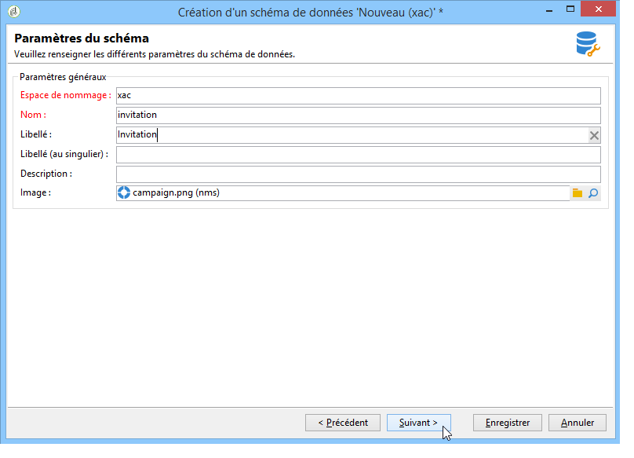

   Cliquez sur **[!UICONTROL Suivant]** pour valider.

1. Saisissez le contenu du schéma dans la fenêtre **[!UICONTROL Edition du schéma]**.

   Utilisez le bouton **[!UICONTROL Insérer]** pour créer le contenu du schéma.

   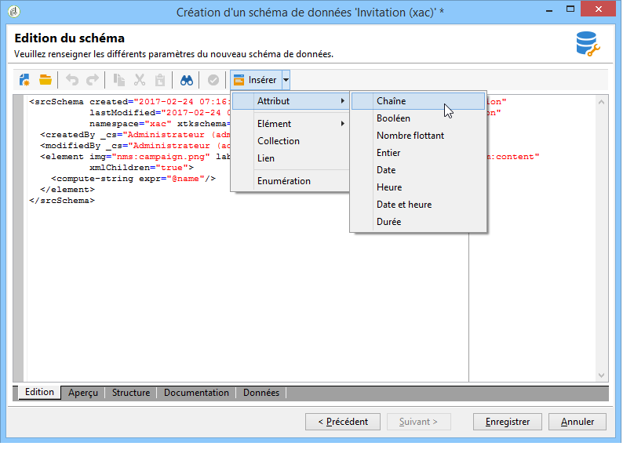

   Voir à ce sujet la section [Edition des schémas](data-schemas.md#editing-schemas).

   Pour chaque élément référencé dans le contenu, vous devez sélectionner le type correspondant.

   Dans notre exemple, les contenus identifiés, leur format et leur type sont les suivants :

<table> 
 <thead> 
  <tr> 
   <th> <strong>Contenu</strong> <br /> </th> 
   <th> <strong>Format</strong> <br /> </th> 
   <th> <strong>Type</strong> <br /> </th> 
   <th> <strong>Libellé</strong> <br /> </th> 
  </tr> 
 </thead> 
 <tbody> 
  <tr> 
   <td> Title<br /> </td> 
   <td> Attribut<br /> </td> 
   <td> Chaîne <br /> </td> 
   <td> Title<br /> </td> 
  </tr> 
  <tr> 
   <td> Sous-titre<br /> </td> 
   <td> Attribut<br /> </td> 
   <td> Chaîne <br /> </td> 
   <td> Nom<br /> </td> 
  </tr> 
  <tr> 
   <td> Date de l'événement<br /> </td> 
   <td> Attribut<br /> </td> 
   <td> Date<br /> </td> 
   <td> Date<br /> </td> 
  </tr> 
  <tr> 
   <td> Paragraphe d'introduction<br /> </td> 
   <td> Elément<br /> </td> 
   <td> HTML<br /> </td> 
   <td> Présentation<br /> </td> 
  </tr> 
  <tr> 
   <td> Photo de l'auteur<br /> </td> 
   <td> Attribut<br /> </td> 
   <td> Chaîne <br /> </td> 
   <td> URL<br /> </td> 
  </tr> 
  <tr> 
   <td> Auteur<br /> </td> 
   <td> Elément<br /> </td> 
   <td> Memo<br /> </td> 
   <td> Auteur<br /> </td> 
  </tr> 
  <tr> 
   <td> Logo d'en-tête (stocké dans les ressources publiques Adobe Campaign)<br /> </td> 
   <td> Attribut<br /> </td> 
   <td> Lien (link)<br /> </td> 
   <td> Image<br /> </td> 
  </tr> 
 </tbody> 
</table>

Le schéma contiendra donc les informations suivantes :

```
<element label="Invitation" name="invitation" template="ncm:content" xmlChildren="true">
    <compute-string expr="@name"/>
    <attribute label="Title" length="40" name="title" type="string"/>
    <element label="Presentation" name="presentation" type="html"/>
    <attribute label="Date" name="date" type="date"/>
    <attribute label="Name" length="10" name="name" type="string"/>
    <attribute label="URL" name="url" type="string"/>
    <element label="Author" name="author" type="memo"/>
    <element label="Image" name="image" target="xtk:fileRes" type="link"/>
  </element>
```

1. Cliquez sur **[!UICONTROL Enregistrer]** pour créer le schéma de données.

## Étape 3 : création du formulaire de saisie {#step-3---creating-the-input-form}

Le formulaire de saisie permet d&#39;éditer une instance de contenu via une interface de saisie à partir de la console cliente Adobe Campaign.

La description d&#39;un formulaire est un document XML structuré respectant la grammaire du schéma des formes &quot;xtk:form&quot;.

>[!NOTE]
>
>La création et le paramétrage des formulaires dans Adobe Campaign sont présentés dans [cette section](../../configuration/using/identifying-a-form.md).
>
>Les éléments de paramétrage spécifiques à la gestion de contenu sont décrits dans [Formlaires de saisie](input-forms.md).

Pour créer un formulaire de saisie pour la gestion de contenu, les étapes sont les suivantes :

1. Ouvrez l&#39;Explorateur Adobe Campaign et sélectionnez le noeud **[!UICONTROL Administration > Paramétrages > Formulaires de saisie]**.

   Cliquez sur l&#39;icône **[!UICONTROL Nouveau]** située au-dessus de la liste des formulaires.

1. Saisissez le nom du formulaire et le libellé associé au formulaire, puis sélectionnez le type **[!UICONTROL Gestion de contenu]**.

   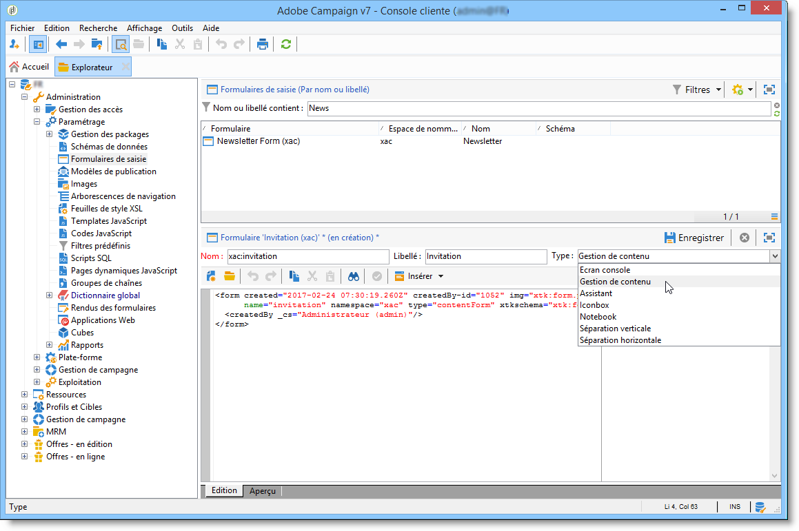

   >[!NOTE]
   >
   >Pour permettre une correspondance automatique entre les deux éléments, il est recommandé d&#39;utiliser le même nom que pour le schéma de données associé. Utilisez la variable **[!UICONTROL Insérer]** au-dessus de la zone de saisie pour ajouter les champs du schéma associé au formulaire.

   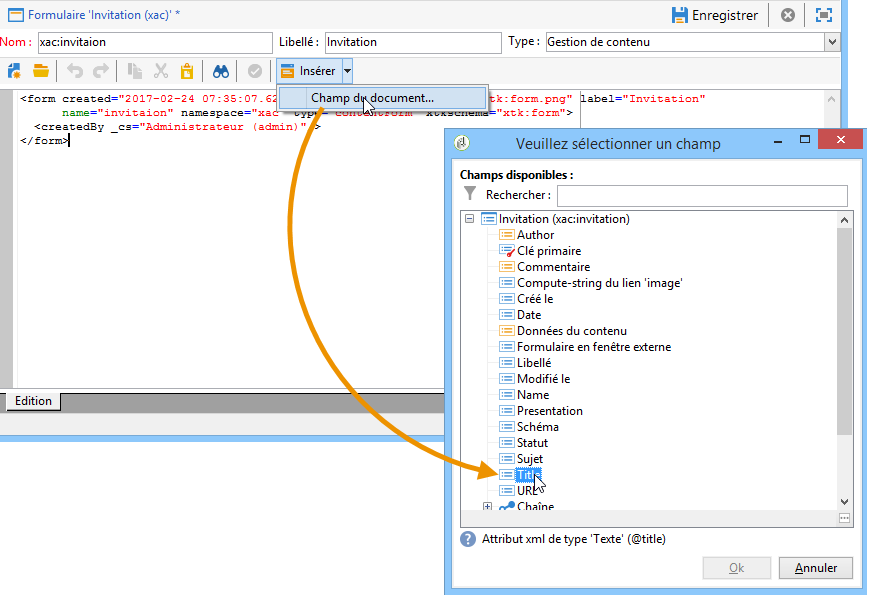

1. Dans la section centrale de l&#39;éditeur, indiquez les champs que vous souhaitez afficher dans le formulaire de saisie.

   Dans notre exemple, les informations seront du type :

   ```
    <input xpath="@title"/>
     <input xpath="@date"/>
     <input xpath="presentation"/>
     <input xpath="@name"/>
     <input xpath="@url"/>
     <input xpath="author"/>
     <input img="nl:sryimage.png" newEntityFormChoice="true" xpath="image">
       <sysFilter>
         <condition expr="@isImage = true"/>
       </sysFilter>
     </input>
   ```

   L&#39;onglet **[!UICONTROL Aperçu]** permet de contrôler le rendu du formulaire en cours de réalisation :

   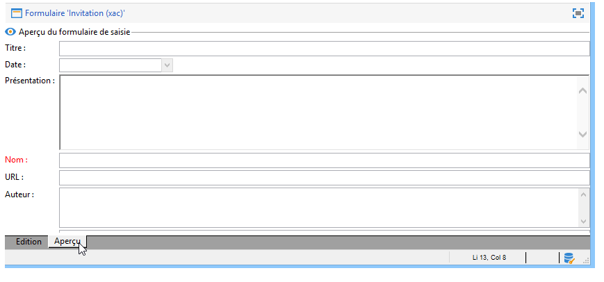

1. Cliquez sur **[!UICONTROL Enregistrer]** pour créer le formulaire de saisie.

## Étape 4 : création du modèle de construction {#step-4---creating-the-construction-template}

Le langage XSLT permet de transformer un document XML en un autre document de sortie. Cette transformation est elle-même décrite en XML dans un document appelé feuille de style.

Dans notre exemple, nous allons utiliser un template Javascript pour définir le mode de construction et de disposition des données dans le document généré.

>[!NOTE]
>
>Les contraintes liées à la construction des documents (template JavaScript ou XSL) sont présentées dans la section [Formatage](formatting.md).

Pour utiliser un template Javascript dans Adobe Campaign, les étapes sont les suivantes :

1. Ouvrez l&#39;Explorateur Adobe Campaign et sélectionnez le noeud **[!UICONTROL Administration > Paramétrages > Templates JavaScript]**.

   Cliquez sur l&#39;icône **[!UICONTROL Nouveau]** située au-dessus de la liste des templates.

1. Indiquez le nom du template et sélectionnez le schéma que vous avez créé pour la gestion de contenu.
1. Importez le contenu fixe que vous souhaitez afficher dans le message.

   Ajoutez les éléments variables en respectant la syntaxe présentée dans la section [Templates JavaScript](formatting.md#javascript-templates).

   Pour afficher le contenu proposé dans notre exemple, le template JavaScript contient les éléments suivants :

   ```
   <html>
   <% eval(xtk.javascript.load("xac:perso").data); %>
   <head>
     <title>Invitation to an exceptional dedication session</title>
   </head>
   <body link="#0E59AE" vlink="#0E59AE" alink="#0E59AE" style="background-color:white;">
       <table width="546" border="0" align="center" cellpadding="0" cellspacing="0" style="border-left: solid 1px gray;border-top: solid 1px gray;border-right: solid 1px gray;">
         <tr>
           <td colspan="3">
             <%= generateImgTag(content.@["image-id"]) %>
           </td>
         </tr>
       </table>
       <table width="546" border="0" align="center" cellpadding="0" cellspacing="0" style="border-left: solid 1px gray;border-right: solid 1px gray;">
         <tr>
           <td>
             <table border="0" cellspacing="0" cellpadding="5">
               <tr>
                 <td width="10"> </td>
                 <td style="padding-top:2em; padding-bottom:2em;" width="730" align="middle">
                   <b>
                     <font style="font-family:Verdana, Arial, Helvetica, sans-serif; font-size:14px; color:#800080;">
                       <span style="FONT-VARIANT: small-caps"><%= content.@title %> - <%= content.@name %></span>
                     </font>
                   </b>
                 </td>
                 <td width="10"> </td>
               </tr>
               <tr>
                 <td width="10"> </td>
                 <td style="padding-top:1em; padding-bottom:1em;" width="730">
                   <font style="font-family:Verdana, Arial, Helvetica, sans-serif; font-size:11px; color:#666666;">
                     Hello <%= perso('recipient.firstName') %> <%= perso('recipient.lastName') %>,
                     <p>
                       <%= content.presentation %>
                     </p>               
                     <center>
                       <b><%= formatDate(content.@date, "%2D %Bl %4Y") %></b> come to our Book Fair and meet our favorite authors and illustrators.<br>
                       <br>
                       <a href="https://www.site.web.com/registration" target="_blank"><b>REGISTER</b></a>
                     </center>
                   </font>
                 </td>
                 <td width="10"> </td>
               </tr>
               <tr>
                 <td width="10"> </td>
                 <td style="padding-top:1em; padding-bottom:1em;" width="730">
                   <font style="font-family:Verdana, Arial, Helvetica, sans-serif; font-size:11px; color:#666666;">
                    " width="70" height="70">
                     <b><%= content.author %></b>, will be signing their book between 2
   and 5:30PM.
                   </font>
                 </td>
                 <td width="10"> </td>
               </tr>            
                   <tr>
                 <td width="10"> </td>
                 <td width="730">
                   <font style="font-family:Verdana, Arial, Helvetica, sans-serif; font-size:11px; color:#666666;">                  
                 </td>
                 <td width="10"> </td>
               </tr>           
               <tr>
                 <td width="10"> </td>
                 <td>
                   <font style="font-family:Verdana, Arial, Helvetica, sans-serif; font-size:11px; color:#666666;">
                     <center>
                       <p>
                         <a href="https://www.site.web.com/program" target="_blank"><span style="FONT-VARIANT: small-caps"><b>Program</b></span></a>
                          | 
                         <a href="https://www.site.web.com/information" target="_blank"><span style="FONT-VARIANT: small-caps"><b>Useful information</b></span></a>
                          | 
                       <a href="https://www.site.web.com/registration" target="_blank"><span style="FONT-VARIANT: small-caps"><b>Register</b></span></a></p>
                       </center>
                     </font>
                   </td>
                   <td width="10"> </td>
                 </tr>
               </table>
               <br>
             </td>
           </tr>
         </table>
   </body>
   </html>
   ```

   L&#39;appel à une fonction en début de template permet de mettre en forme l&#39;appel à des données de personnalisation issues de la base de données Adobe Campaign (ici : recipient.firstName et recipient.lastName), afin qu&#39;elles soient interprétées lors de leur utilisation dans une diffusion. Pour plus dʼinformations, consultez la section [Inclusion d’un template JavaScript](formatting.md#including-a-javascript-template).

   Dans notre exemple, la fonction contiendra le code suivant :

   ```
   function perso(strPerso)
   {
     var strStart = '<' + '%' + '=';
     var strEnd = '%' + '>';
     return strStart + strPerso + strEnd;
   }
     function bloc(strPerso)
   {
     var strStart = '<' + '%' + '@ include view="';
     var strEnd = '" %' + '>';
     return strStart + strPerso + strEnd;
   }
   ```

   Afin que le template javascript soit valide, cette fonction doit être préalablement créée depuis le noeud **[!UICONTROL Code Javascript]** de l&#39;arborescence, comme ci-dessous :

   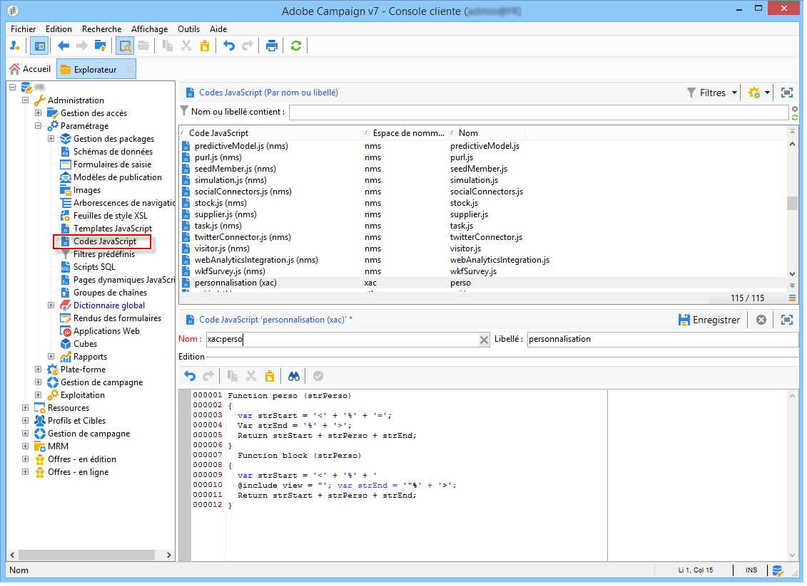

## Étape 5 : création du modèle de publication {#step-5---creating-the-publication-template}

Vous devez ensuite créer un modèle de publication de contenu qui permettra de faire le lien entre le schéma, le formulaire et le modèle de construction du contenu. Ce modèle de publication peut proposer plusieurs formats de sortie.

>[!NOTE]
>
>Pour plus d&#39;informations sur les modèles de publication de contenu, consultez la section [Modèles de publication](publication-templates.md).

Pour notre exemple, les étapes sont les suivantes :

1. Créez un nouveau modèle de publication à partir du noeud **[!UICONTROL Administration > Paramétrages > Modèles de publication]**.
1. Indiquez son nom, le libellé associé et sélectionnez le schéma et le formulaire à utiliser.
1. Saisissez ensuite le nom du modèle et choisissez le mode de rendu à appliquer. Ici, nous avons une **[!UICONTROL JavaScript]** saisissez le rendu en fonction du modèle créé ci-dessus.

   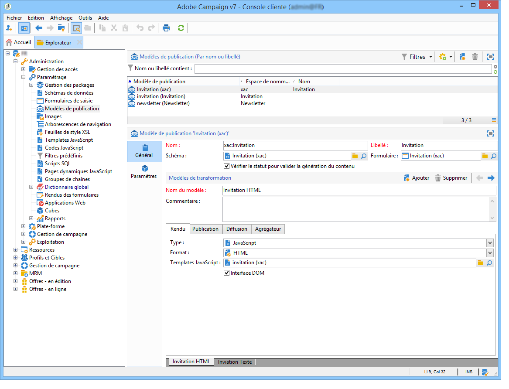

   >[!NOTE]
   >
   >L&#39;option **[!UICONTROL interface DOM]** est cochée par défaut, ce qui signifie qu&#39;il ne sera pas possible d&#39;accéder à ce document au moyen de la syntaxe E4X. L&#39;interface DOM doit être utilisée lorsque cette option est cochée et lorsqu&#39;elle est la syntaxe recommandée.
   >
   >Vous pouvez continuer à utiliser la syntaxe E4X. Le cas échéant, vérifiez que l&#39;option est décochée.

   Utilisez le bouton **[!UICONTROL Ajouter]** si vous souhaitez créer d&#39;autres modèles de transformation.

1. Cliquez sur **[!UICONTROL Enregistrer]** pour créer le modèle de publication.

## Étape 6 : création du contenu {#step-6---creating-contents}

Vous êtes fin prêt pour créer du contenu à partir de ce modèle de publication.

>[!NOTE]
>
>Pour plus d’informations sur la création de contenu, consultez la section [Utilisation dʼun modèle de contenu](using-a-content-template.md).

### Création de contenu dans lʼassistant de diffusion {#creating-content-in-the-delivery-wizard}

Pour créer un contenu directement dans les diffusions, la procédure est la suivante :

1. Vous devez d&#39;abord référencer le modèle de publication à partir de l&#39;onglet **[!UICONTROL Avancé]** des propriétés de la diffusion.

   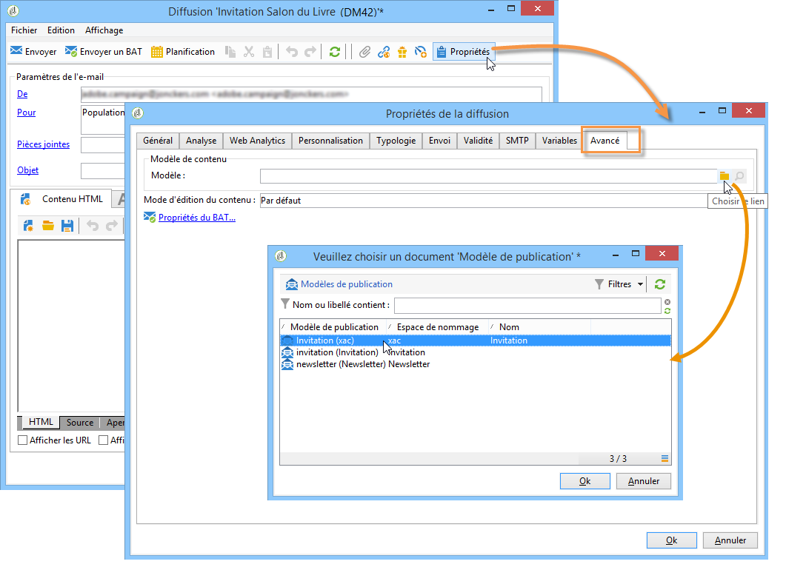

   Un onglet supplémentaire est ajouté dans l&#39;assistant de diffusion afin de définir le contenu, via le formulaire de la gestion de contenu.

1. Renseignez les informations variables de votre newsletter.

   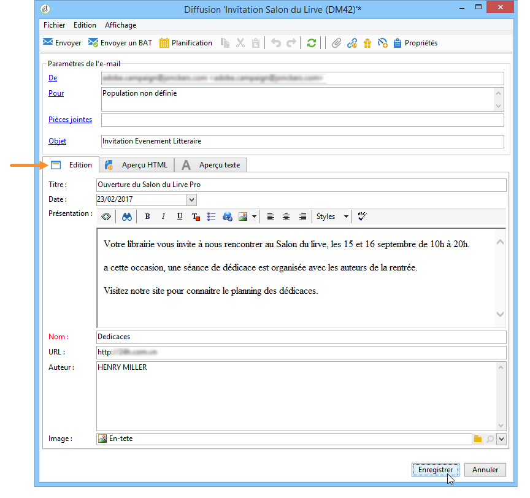

1. Cliquez sur l&#39;onglet **[!UICONTROL Aperçu HTML]** pour visualiser le rendu. Vous devez sélectionner un destinataire pour tester la personnalisation.

   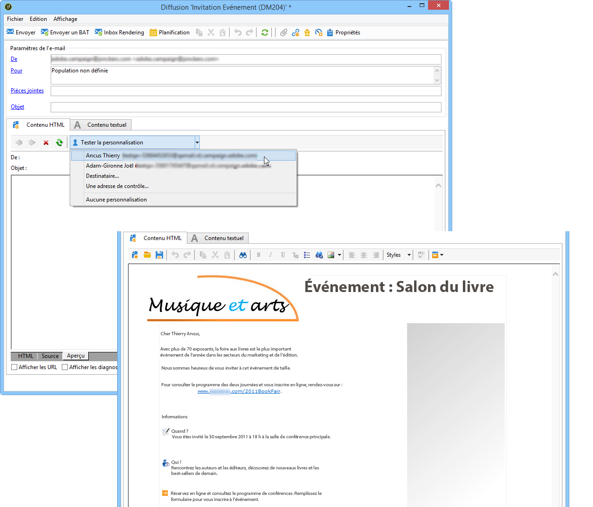
