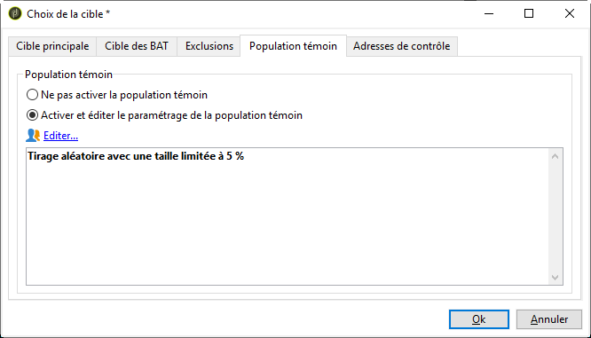

# Utilisation de modèles {#use-templates}

Les modèles de diffusion accroissent l&#39;efficacité en offrant des configurations prêtes à l&#39;emploi pour les types d&#39;activité les plus courants. Grâce aux modèles, les marketeurs peuvent déployer plus rapidement de nouvelles campagnes avec une personnalisation minimale.

En savoir plus sur les modèles de diffusion dans [cette section](creating-a-delivery-template.md).

## Prise en main des modèles de diffusion {#gs-templates}

Un [modèle de diffusion](creating-a-delivery-template.md) vous permet de définir une fois un ensemble de propriétés techniques et fonctionnelles qui répond à vos besoins et qui peut être réutilisé pour de prochaines diffusions. Vous pouvez ensuite gagner du temps et normaliser les diffusions si nécessaire.

Si vous gérez plusieurs marques dans Adobe Campaign, Adobe recommande de disposer d’un sous-domaine par marque. Une banque peut, par exemple, avoir plusieurs sous-domaines qui correspondent à chacune de ses agences régionales. Si une banque détient le domaine bluebank.com, ses sous-domaines peuvent être @ny.bluebank.com, @ma.bluebank.com, @ca.bluebank.com, etc. Disposer d’un modèle de diffusion par sous-domaine vous permet de toujours utiliser les paramètres préconfigurés adéquats pour chaque marque et d’éviter ainsi des erreurs tout en gagnant du temps.

**Conseil :** afin d’éviter toute erreur de paramétrage, il est recommandé de dupliquer un modèle natif et d’en modifier les propriétés plutôt que d’en créer un nouveau.

## Configurer les adresses

* L&#39;adresse de l&#39;expéditeur est obligatoire pour permettre l&#39;envoi d&#39;un email.

* Certains FAI vérifient la validité de l’adresse de l’expéditeur avant d’accepter les messages.

* Une adresse erronée peut causer un refus de la part du serveur receveur. Vous devez vous assurer qu’une adresse correcte est bien renseignée.

* L&#39;adresse doit identifier explicitement l&#39;expéditeur. Le domaine doit appartenir à l&#39;expéditeur et être enregistré auprès de lui.

* Adobe recommande de créer des comptes email qui correspondent aux adresses indiquées pour les envois et les réponses. Parlez-en avec votre administrateur du système de messagerie.

Pour configurer les adresses dans l’interface de Campaign, procédez comme suit :

1. Dans le [modèle de diffusion](creating-a-delivery-template.md), cliquez sur le lien **[!UICONTROL De]**. Dans la fenêtre **[!UICONTROL Paramètres d&#39;en-tête des e-mails]**, renseignez les champs suivants :

   

1. Dans le champ **[!UICONTROL Adresse de l’expéditeur]**, assurez-vous que le domaine d’adresse est identique au sous-domaine que vous avez délégué à Adobe. Vous pouvez modifier la partie qui précède le signe « @ », mais pas l’adresse du domaine.

1. Dans le champ **[!UICONTROL De]**, utilisez un nom facilement identifiable par les destinataires, tel que le nom de votre marque, pour augmenter le taux d’ouverture de vos diffusions. Pour améliorer davantage l’expérience des destinataires, vous pouvez ajouter le nom d’une personne, par exemple « Emma de Megastore ».

1. Dans le champ **[!UICONTROL Texte de l’adresse de réponse]**, l’adresse de l’expéditeur est utilisée par défaut pour les réponses. Adobe recommande toutefois d’utiliser une adresse réelle existante, comme l’assistance clientèle de votre marque. Ainsi, si un destinataire envoie une réponse, l’assistance clientèle sera en mesure de la traiter.

### Configurer une population témoin

Une fois que la diffusion est envoyée, vous pouvez comparer le comportement des destinataires exclus à celui des destinataires qui ont reçu la diffusion. Vous pouvez ensuite mesurer l’efficacité de vos campagnes. En savoir plus sur les populations témoins dans [cette section](../../campaign/using/marketing-campaign-deliveries.md#defining-a-control-group).

Pour configurer une population témoin, cliquez sur le lien **[!UICONTROL Pour]**. Dans la fenêtre **[!UICONTROL Choix de la cible]**, sélectionnez l’onglet **[!UICONTROL Population témoin]**. Vous pouvez extraire une partie de la cible, par exemple un échantillon aléatoire de 5 %.

## Utiliser des typologies pour appliquer des filtres ou des règles de contrôle

Une typologie contient les règles de vérification qui sont appliquées lors de la phase d&#39;analyse, avant tout envoi.

Dans l’onglet **[!UICONTROL Typologie]** des propriétés du modèle, changez la typologie par défaut en fonction de vos besoins.

Pour mieux contrôler le trafic sortant, par exemple, vous pouvez définir quelles adresses IP peuvent être utilisées en spécifiant une affinité par sous-domaine et en créant une typologie par affinité. Les affinités sont définies directement dans le fichier de configuration de l&#39;instance. Contactez votre administrateur Adobe Campaign.

Pour plus d’informations sur les typologies, consultez [cette section](../../campaign-opt/using/about-campaign-typologies.md).
