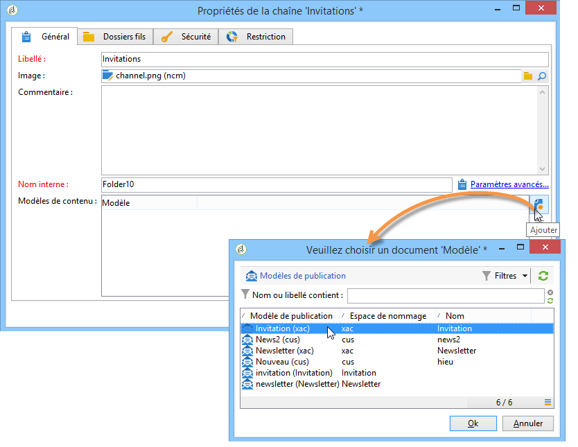
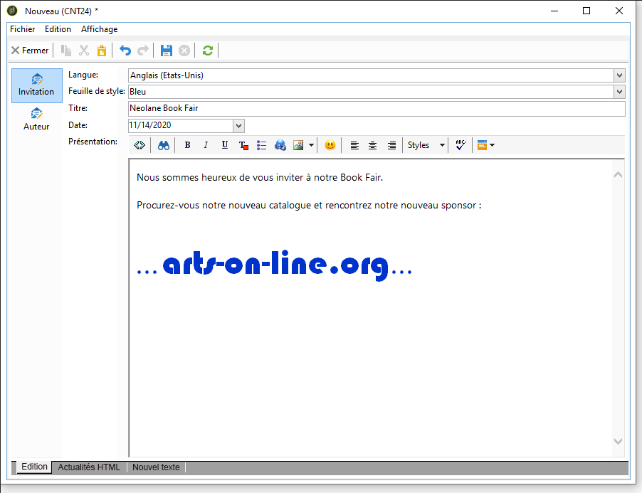

# Utiliser un modèle de contenu{#using-a-content-template}

## À propos des modèles de contenu {#about-content-templates}

Les modèles de contenu peuvent être référencés et utilisés directement dans les diffusions. Voir [Créer une diffusion via la gestion du contenu.](#creating-a-delivery-via-content-management)

Ils peuvent également être utilisés pour créer des instances de contenu. Une fois qu’elles ont été créées, ces instances sont prêtes à être diffusées (voir [Diffuser une instance de contenu](#delivering-a-content-instance)) ou exportées (voir [Créer une instance de contenu](#creating-a-content-instance)).

## Créer une diffusion via la gestion de contenu {#creating-a-delivery-via-content-management}

Vous pouvez référencer un modèle de contenu dans une diffusion afin d&#39;utiliser les champs de saisie pour renseigner son contenu. Un onglet supplémentaire est alors ajouté à l&#39;assistant de diffusion afin de définir le contenu de la diffusion.

La mise en forme sera appliquée automatiquement, selon les paramètres sélectionnés. Pour la visualiser, cliquez sur l&#39;onglet **[!UICONTROL Aperçu HTML]** (ou **[!UICONTROL Aperçu texte]**) et sélectionnez un destinataire afin de tester les éléments de personnalisation.

Voir à ce sujet l’exemple d’implémentation complet : [Créer un contenu dans l’assistant de diffusion](use-case--creating-content-management.md#creating-content-in-the-delivery-wizard).

## Créer une instance de contenu {#creating-a-content-instance}

Vous pouvez créer des contenus directement dans l&#39;arborescence Adobe Campaign. Ils pourront ensuite être utilisés dans les workflows, exportés ou directement injectés dans de nouvelles diffusions.

Les étapes sont les suivantes :

1. Sélectionnez le noeud **[!UICONTROL Ressources > Contenus]** de l&#39;arborescence et cliquez avec le bouton droit de la souris. Choisissez **[!UICONTROL Propriétés]**.

   

1. Sélectionnez les modèles de publication qui seront actifs pour ce dossier.

   

1. Vous pouvez ainsi créer de nouveaux contenus à partir du bouton **[!UICONTROL Nouveau]** situé au-dessus de la liste des contenus.

   

1. Renseignez les champs du formulaire.

   

1. Puis cliquez sur l&#39;onglet **[!UICONTROL Aperçu HTML]** pour contrôler le rendu. Ici, les champs de personnalisation issus de la base de données ne sont pas renseignés.

   

1. Une fois créé, le contenu est ajouté dans la liste des contenus disponibles. Cliquez sur le lien **[!UICONTROL Propriétés]** pour en modifier le libellé, le statut ou consulter son historique.

   

1. Au besoin, lorsque le contenu est validé, il peut être généré à partir du bouton correspondant de la barre d&#39;outils.

   

   >[!NOTE]
   >
   >Vous pouvez autoriser la génération de contenus non validés. Pour cela, modifiez l&#39;option correspondante dans le modèle de publication. Voir à ce sujet la section [Création et paramétrage du modèle](publication-templates.md#creating-and-configuring-the-template).

   Les contenus HTML et Texte sont générés par défaut dans le dossier **publishing** de l&#39;instance Adobe Campaign. Vous pouvez modifier le dossier de publication depuis l&#39;option **NcmPublishingDir**.

## Diffuser une instance de contenu {#delivering-a-content-instance}

Pour créer une instance de contenu et la diffuser, un modèle de diffusion doit être associé au modèle de publication utilisé pour générer ce contenu. Voir à ce sujet la section [Diffusion](publication-templates.md#delivery).

De plus, le dossier de stockage du contenu doit être dédié aux contenus issus de ce modèle de publication (lorsqu&#39;un dossier de contenu permet la génération de plusieurs types de contenus différents, il n&#39;est pas possible de créer automatiquement la diffusion).

Pour créer automatiquement la diffusion à partir du contenu sélectionné, cliquez sur l&#39;icône **[!UICONTROL Diffusion]** et choisissez le modèle.

Les contenus texte et HTML sont automatiquement renseignés.
