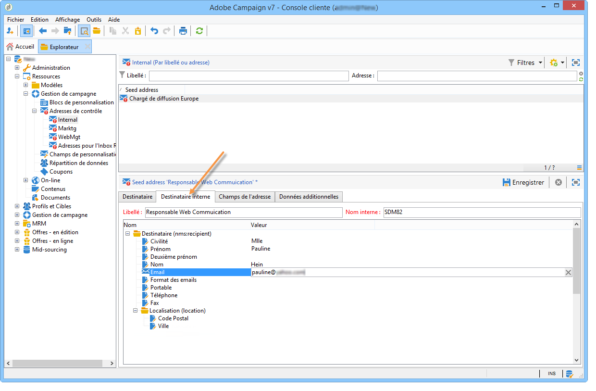
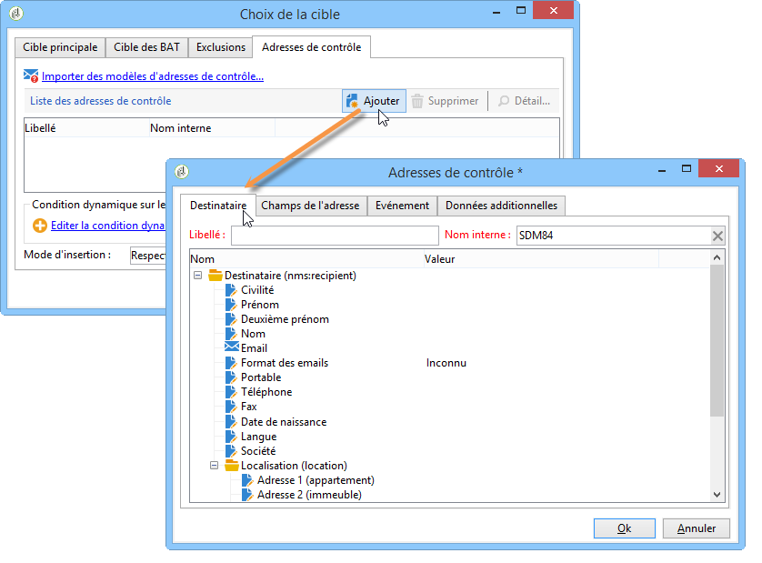

# Utiliser une table de destinataires externe{#using-an-external-recipient-table}

Si la table des diffusions est une table externe, vous devez effectuer des paramétrages complémentaires. Le schéma **[!UICONTROL nms:seedmember]** doit alors être étendu. Un onglet supplémentaire est alors ajouté au niveau des adresses de contrôle afin de définir les champs adéquats, comme dans l&#39;exemple ci-dessous :

Dans ce cas, pour ajouter les adresses de contrôle dans la diffusion, renseignez directement les champs adéquats dans l&#39;onglet correspondant ou importez des modèles d&#39;adresses :

L&#39;extension du schéma **nms:seedMember** est présentée dans [cette section](../../configuration/using/seed-addresses.md).
