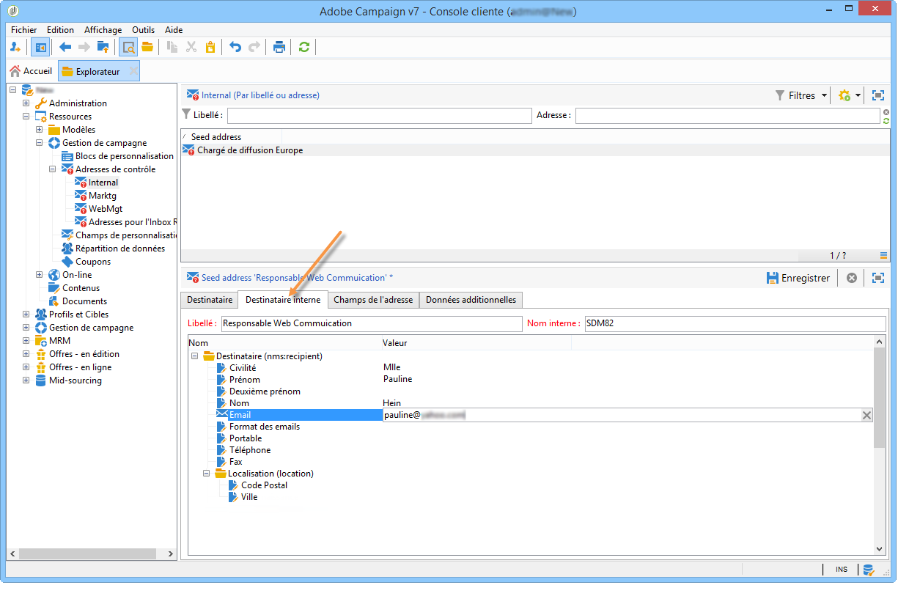

# Utiliser une table de personnes destinataires externe{#using-an-external-recipient-table}

Si le tableau des diffusions est un tableau externe, vous devrez effectuer des configurations supplémentaires. Le schéma **[!UICONTROL nms:seedmember]** doit être étendu. Un onglet est ajouté aux adresses de contrôle afin de définir les champs adéquats, comme indiqué ci-dessous :

Dans ce cas, pour ajouter les adresses de contrôle dans la diffusion, renseignez directement les champs adéquats dans l&#39;onglet correspondant ou importez des modèles d&#39;adresses :

L’extension de schéma **nms:seedMember** est présentée dans [cette section](../../configuration/using/seed-addresses.md).
