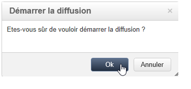

# Validation{#validating}

Les concepts généraux de validation d&#39;une diffusion sont présentés dans [cette section](steps-validating-the-delivery.md).

Le fichier de sortie d&#39;une diffusion par courrier est généré pendant l&#39;analyse de la diffusion. Le contenu du fichier dépend des colonnes de sortie sélectionnées (voir la section [Fichier d&#39;extraction](defining-the-direct-mail-content.md#extraction-file)).

>[!NOTE]
>
>La phase d&#39;analyse est détaillée dans la section [Analyser la diffusion](steps-validating-the-delivery.md#analyzing-the-delivery).

Pendant la phase d&#39;analyse, le fichier est généré mais aucune information concernant les destinataires (à savoir les logs de diffusion) n&#39;est mise à jour. Vous pouvez donc annuler cette opération sans aucun risque.

Vérifiez le résultat de l&#39;analyse et le contenu du fichier de sortie avant de cliquer sur le bouton **[!UICONTROL Confirmer l&#39;envoi]**. Un message d&#39;avertissement vous permet de confirmer la diffusion.

La confirmation de l&#39;envoi lance l&#39;extraction des données dans le fichier spécifié.

Vous pouvez ensuite fermer l&#39;assistant et consulter les logs de diffusion depuis l&#39;onglet **[!UICONTROL Diffusion]** accessible à partir du détail de cette diffusion.

Vous pouvez paramétrer le mode de récupération des logs de diffusion à partir de l&#39;onglet **[!UICONTROL Analyse]** des Propriétés de la diffusion.

Deux modes sont proposés :

* **[!UICONTROL Les messages sont considérés envoyés suite à la validation]** (mode par défaut) : dans ce mode de fonctionnement, tous les broadlogs sont mis à jour lorsque l&#39;opérateur confirme l&#39;envoi (leur statut passe de &#39;En attente de diffusion&#39; à &#39;Envoyé&#39;) et le statut de la diffusion devient automatiquement **[!UICONTROL Terminé]**.
* **[!UICONTROL Un fichier de résultats détermine les messages envoyés et en échec]** : ce mode permet de mettre à jour les broadlogs via un fichier externe transmis par le prestataire. Dans ce cas, il est nécessaire de mettre en place un workflow de traitement de ces informations afin de mettre à jour le statut des broadlogs.

  >[!NOTE]
  >
  >Dans ce cas, l&#39;utilisateur doit aussi modifier l&#39;état de la diffusion en **[!UICONTROL Terminé]** dès que les broadlogs sont mis à jour.
