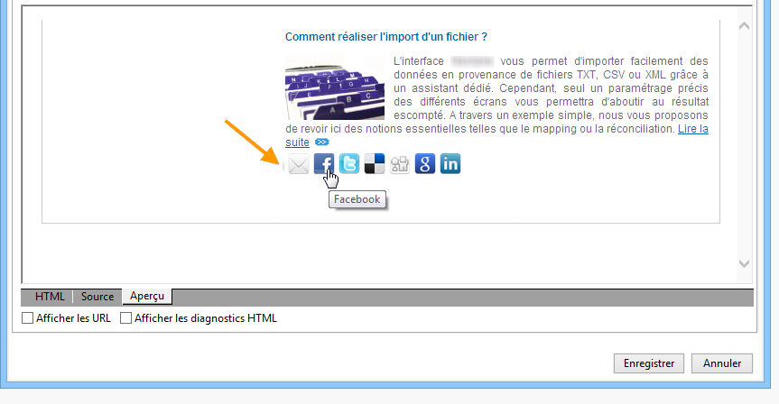
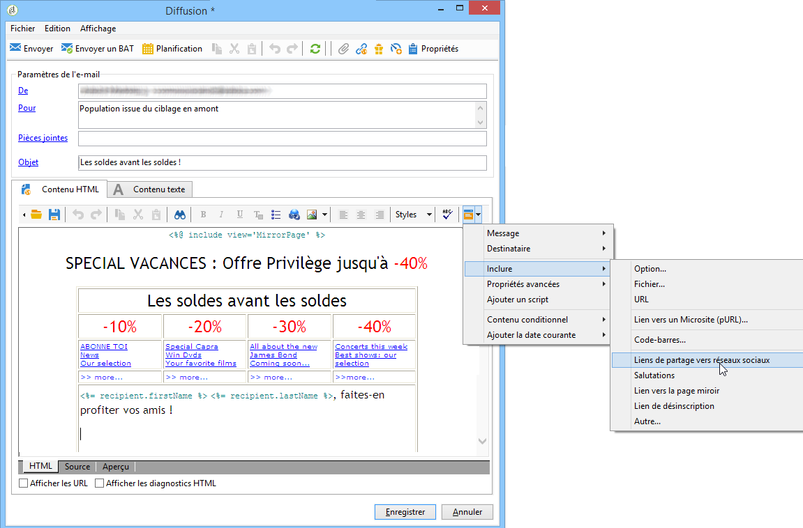
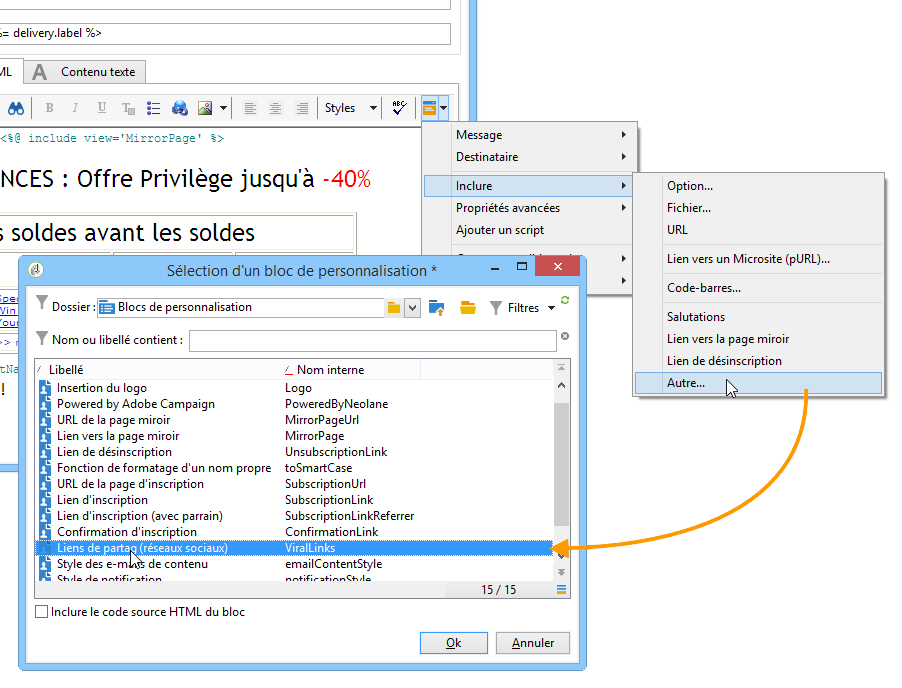
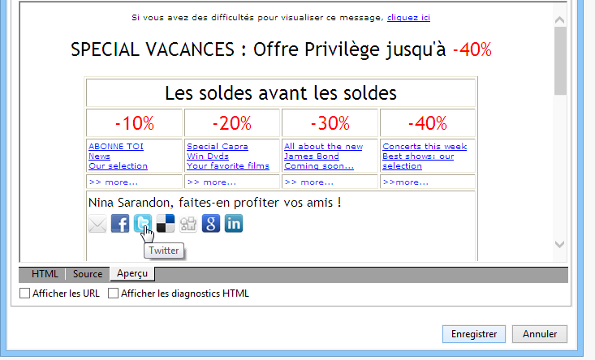
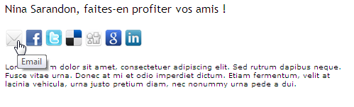
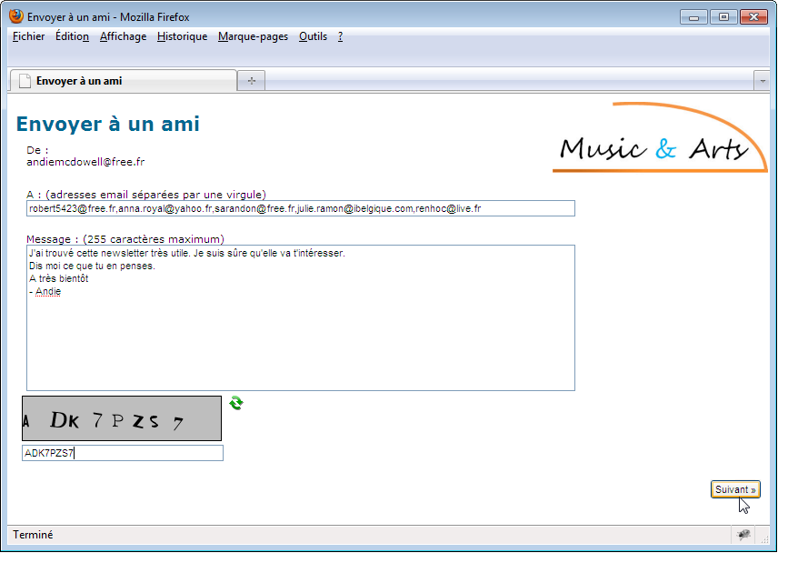
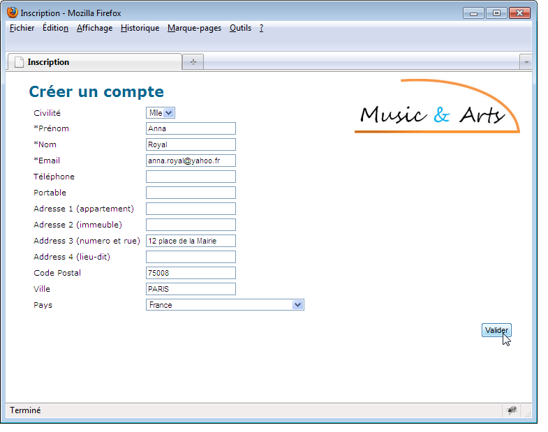
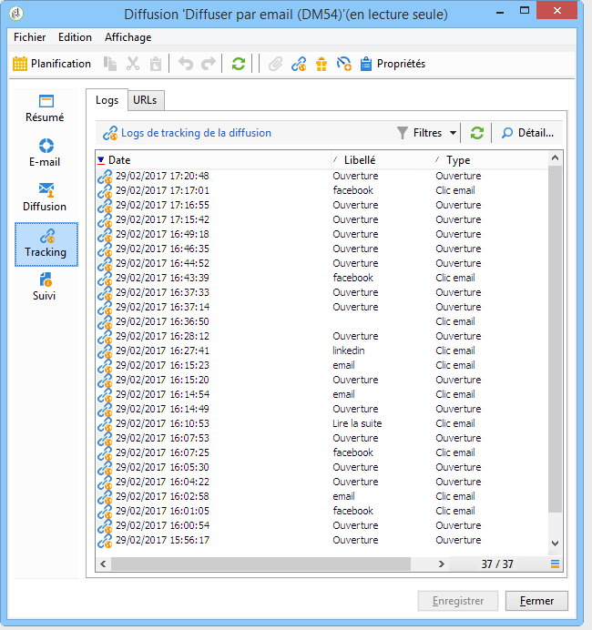
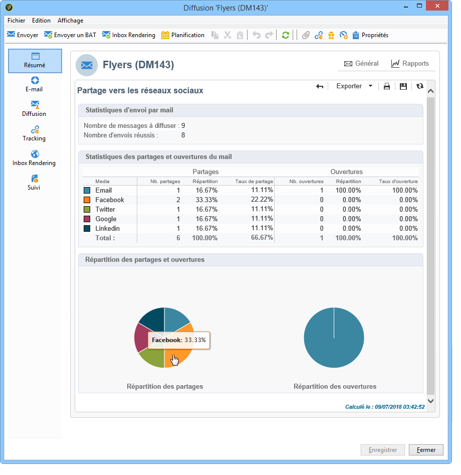

# Marketing viral et réseaux sociaux{#viral-and-social-marketing}

Adobe Campaign permet de mettre en place les outils favorisant le marketing viral.

Vous pouvez ainsi permettre aux personnes destinataires de vos diffusions, ou encore aux personnes qui consultent votre site web, de partager l’information avec leur réseau : elles peuvent ainsi ajouter le lien à leur profil Facebook ou X (anciennement Twitter) ou envoyer un message à une connaissance.

>[!CAUTION]
>
>Pour que les liens ajoutés fonctionnent correctement, la page miroir du message correspondant doit obligatoirement être disponible. Pour cela, vous devez inclure dans la diffusion le lien vers la page miroir.

## Réseaux sociaux : partager un lien {#social-networks--sharing-a-link}

Pour permettre aux destinataires de vos diffusions de partager le contenu des messages avec les membres de leur réseau, vous devez inclure le bloc de personnalisation correspondant.

>[!NOTE]
>
>Par défaut, ce lien n&#39;est pas proposé dans la liste des blocs. Vous pouvez y accéder en cliquant sur **[!UICONTROL Autre...]**. Choisissez ensuite le bloc **[!UICONTROL Liens de partage vers réseaux sociaux]**.

Le rendu sera le suivant :

Lorsque le destinataire clique sur l&#39;icône d&#39;un des réseaux sociaux proposés, il est automatiquement redirigé vers son compte afin de partager le lien vers le contenu de ce message. Les membres de son réseau pourront ainsi accéder à cette communication.

>[!NOTE]
>
>Ce bloc de personnalisation contient tous les liens (envoi de messages et partage sur tous les réseaux sociaux). Il peut être modifié selon vos besoins. La configuration est toutefois réservée aux utilisateurs avancés. Pour cela, éditez le bloc de personnalisation correspondant accessible à partir du noeud **[!UICONTROL Ressources > Gestion de campagne > Blocs de personnalisation]** de l&#39;arborescence Adobe Campaign.

## Marketing viral : transférer à un ami {#viral-marketing--forward-to-a-friend}

Un service viral permet de mettre en place des actions de type parrainage : ces actions permettent de transférer un message à un ami. Le profil du ou des filleuls est alors stocké provisoirement dans la base de données (dans une table dédiée). Le message transféré propose un lien afin de permettre au filleul de s&#39;abonner : il sera alors ajouté dans la base de données Adobe Campaign.

Pour permettre le transfert d&#39;un message, le principe est le même que pour le lien vers les réseaux sociaux.

Les étapes sont les suivantes :

1. Ajoutez le bloc de personnalisation **[!UICONTROL Liens de partage vers réseaux sociaux]** dans le corps du message d&#39;origine.
1. Le destinataire du message peut cliquer sur l&#39;icône **[!UICONTROL Email]** afin d&#39;envoyer ce message à un ou plusieurs amis.

   

   Un formulaire de parrainage permet de renseigner les adresses email des filleuls.

   

   Le message leur est envoyé lorsque le destinataire principal clique sur le bouton **[!UICONTROL Suivant]**.

   >[!NOTE]
   >
   >Le contenu de ce message peut être personnalisé selon vos besoins. Il est créé à partir du modèle **[!UICONTROL Transfert du message initial]**, stocké dans le noeud **[!UICONTROL Administration > Gestion de campagne > Modèles des diffusions techniques]** de l&#39;arborescence.
   >
   >Vous pouvez également modifier le formulaire de transfert du message proposé au parrain. Pour cela, vous devez modifier l&#39;application Web **Formulaire de partage** stockée dans le noeud **[!UICONTROL Ressources > On-line > Applications Web]** de l&#39;arborescence.

1. Dans le message transféré, un lien permet au filleul d&#39;enregistrer son profil dans la base de données. Pour cela, il dispose d&#39;un formulaire de saisie.

   

   >[!NOTE]
   >
   >Ce paramétrage peut être adapté. Pour cela, vous devez modifier l&#39;application Web **Inscription de destinataire** stockée dans le noeud **[!UICONTROL Ressources > On-line > Applications Web]** de l&#39;arborescence.
   >
   >Pour plus d&#39;informations sur les applications Web, consultez [cette section](../../web/using/about-web-applications.md).

   A la validation du formulaire, un message de confirmation est adressé au filleul : il ne sera définitivement inscrit que lorsqu&#39;il aura activé le lien contenu dans le message de confirmation. Ce message est créé à partir du modèle **[!UICONTROL Confirmation d&#39;inscription]**, stocké dans le nœud **[!UICONTROL Administration > Gestion de campagnes > Modèles des diffusions techniques]** de l&#39;arborescence.

   Le filleul est alors ajouté dans le dossier **Destinataires** de la base de données, et il est abonné (par défaut) au service d&#39;information **Newsletter**.

## Tracking du partage vers les réseaux sociaux {#tracking-social-network-sharing}

Chaque partage et chaque accès à l&#39;information partagée fait l&#39;objet d&#39;un tracking au niveau de la diffusion. Les informations de tracking collectées par Adobe Campaign sont accessibles à deux niveaux :

* Dans l&#39;onglet **[!UICONTROL Tracking]** de la diffusion (ou unitairement au niveau d&#39;un destinataire):

  

* Dans un rapport dédié **[!UICONTROL Partage vers les réseaux sociaux]** :

  
