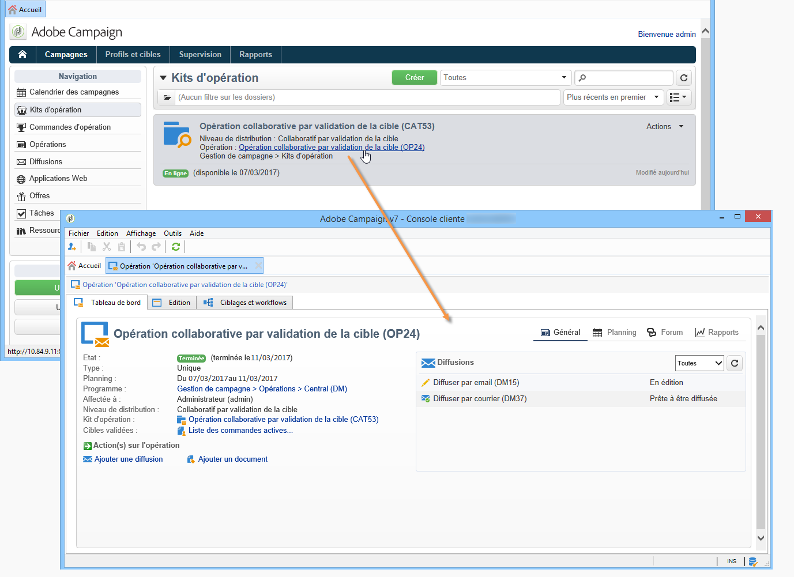

# Accès aux campagnes{#accessing-campaigns}

Une fois une opération commandée, la commande validée, et la date de disponibilité atteinte, elle peut être exécutée.

Selon le type d&#39;opération et les options sélectionnées, elle est exécutée au niveau de chaque entité locale ou par l&#39;entité centrale.

## Accès à la campagne {#accessing-the-campaign}

Une fois la commande validée et la date de disponibilité atteinte, la campagne est créée localement et peut être utilisée. Les opérateurs locaux sont informés de sa disponibilité.

Il est ajouté au détail de l’ordre correspondant et peut être modifié. Le tableau de bord complet permet de le gérer au niveau local.

L&#39;opération est également accessible à partir de la vue d&#39;ensemble des opérations affichées à partir du lien **[!UICONTROL Opérations]** de la page d&#39;accueil.

## Paramétrages disponibles {#available-settings}

Les entités locales peuvent adapter le contenu de la campagne selon leurs besoins, à l&#39;aide de tous les éléments du tableau de bord de la campagne. Leur tâche principale sera d&#39;adapter le workflow de ciblage et éventuellement de personnaliser le contenu de la diffusion.

## Exécution de l’opération {#campaign-execution}

Chaque entité locale peut exécuter le workflow de l&#39;opération puis procéder aux validations nécessaires, selon le processus de validation défini dans le modèle associé à l&#39;opération.
