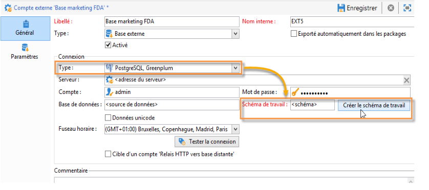

# Commencer avec Federated Data Access {#about-federated-data-access}

Adobe Campaign propose l’option **Federated Data Access** (FDA) afin d’exploiter des informations stockées dans une ou plusieurs bases de données externes : vous pouvez accéder à des données externes sans modifier la structure des données d’Adobe Campaign.

## Prérequis {#operating-principle}

L’option FDA permet d’étendre votre modèle de données dans une base de données tierce. Le module détecte automatiquement la structure des tables ciblées et utilise les données provenant des sources SQL.

Pour utiliser cette fonctionnalité, les conditions préalables sont énumérées ci-dessous :

* **Configuration**: à l’exception du Snowflake, vous avez besoin d’un modèle d’hébergement **sur site** ou **hybride** pour configurer Federated Data Access. [En savoir plus](../../installation/using/hosting-models.md)
* **Version** de base de données externe : vous devez disposer d’une base de données externe compatible avec le module Adobe Campaign FDA. La liste des systèmes de base de données et des versions compatibles est détaillée dans la matrice [de](../../rn/using/compatibility-matrix.md#FederatedDataAccessFDA)compatibilité de Campaign.
* **Autorisations**: les utilisateurs doivent également disposer des autorisations  nécessaires en Adobe Campaign et dans la base de données externe.

## Limitations {#limitations}

L’option FDA est utilisée pour manipuler les données des bases de données externes en mode batch dans les workflows. Pour éviter les problèmes de performance, il n&#39;est pas recommandé d&#39;utiliser le module FDA dans le cadre d&#39;opérations unitaires, par exemple : personnalisation, interaction, messagerie en temps réel, etc.

Evitez autant que possible les opérations nécessitant d’utiliser à la fois la base Adobe Campaign et la base externe. Pour cela, vous pouvez :

* exporter les données de la base Adobe Campaign vers la base externe et effectuer les opérations uniquement depuis la base externe avant de réimporter les résultats dans Adobe Campaign.

* collecter les données de la base externe dans Adobe Campaign et effectuer les opérations localement.

Si vous souhaitez effectuer de la personnalisation dans vos diffusions à l’aide des données de la base externe, collectez les données à utiliser dans un workflow afin de les rendre disponibles dans une table temporaire. Utilisez alors les données de la table temporaire pour personnaliser votre diffusion.

L&#39;option FDA est soumise aux limitations du système de base de données externe que vous utilisez.

## Recommandations {#recommendations}

### Créer des schémas temporaires {#create-temporary-schemas}

Vous pouvez gérer plusieurs accès à la base de données externe de Greenplum par FDA. Une option dédiée vous permet de créer un schéma de travail directement lors de la configuration du compte externe.

>[!NOTE]
>
>Cette option est uniquement disponible avec PostgreSQL Greenplum.

### Optimize email personalization with external data {#optimizing-email-personalization-with-external-data}

Vous pouvez prétraiter la personnalisation des messages dans un processus dédié. Pour ce faire, utilisez l’option **[!UICONTROL Préparer les données de personnalisation avec un processus]** , disponible dans l’onglet **[!UICONTROL Analyse]** des propriétés de la diffusion.

Pendant l&#39;analyse de diffusion, cette option crée et exécute automatiquement un processus qui stocke toutes les données liées à la cible dans une table temporaire, y compris les données provenant de tables liées dans une base de données externe.

Cette option améliore considérablement les performances lors de l’exécution de l’étape de personnalisation.

### Use data from an external database in a workflow {#using-data-from-an-external-database-in-a-workflow}

Dans plusieurs activités de processus Adobe Campaign, vous pouvez utiliser les données stockées dans une base de données externe.

* **Filtrer sur des données** externes : l&#39;activité de [Requête](../../workflow/using/targeting-data.md#selecting-data) vous permet d&#39;ajouter des données externes et de les utiliser dans les configurations de filtre définies. Voir à ce propos [cette page](../../workflow/using/targeting-data.md#selecting-data).

* **Créer des sous-ensembles** : l&#39;activité de [fractionnement](../../workflow/using/split.md) vous permet de créer des sous-ensembles. Vous pouvez utiliser des données externes pour définir les critères de filtrage à utiliser. Voir à ce propos [cette page](../../workflow/using/split.md).

* **Charger la base de données** externe : vous pouvez utiliser les données externes dans l&#39;activité de chargement [des](../../workflow/using/data-loading--rdbms-.md) données (RDBMS). En savoir plus sur [cette page](../../workflow/using/data-loading--rdbms-.md).

* **Ajouter des informations et des liens** - L&#39;activité d&#39; [Enrichissement](../../workflow/using/enrichment.md) vous permet d&#39;ajouter des données supplémentaires à la table de travail du processus et de créer des liens vers une table externe. Dans ce contexte, il peut utiliser des données provenant d’une base de données externe. En savoir plus sur [cette page](../../workflow/using/enrichment.md).
