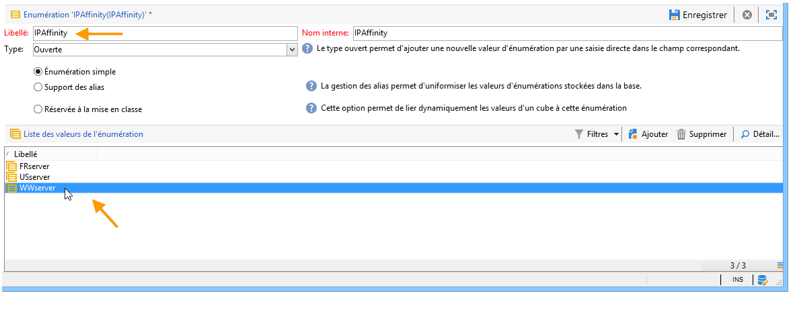
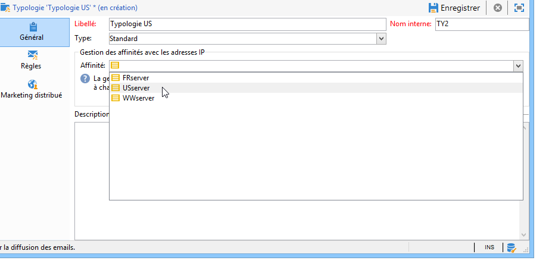

# Configurer les paramètres de diffusion {#delivery-settings}


Les paramètres de diffusion doivent être configurés dans le dossier **serverConf.xml**.

* **Configuration DNS** : renseignez le domaine de diffusion ainsi que les adresses IP (ou host) des serveurs DNS utilisés pour répondre aux requêtes DNS de type MX par le module MTA à partir de **`<dnsconfig>`**.

  >[!NOTE]
  >
  >Le paramètre **nameServers** est indispensable pour une installation sous Windows. Pour une installation Linux, il doit être laissé vide.

  ```
  <dnsConfig localDomain="domain.com" nameServers="192.0.0.1,192.0.0.2"/>
  ```

Vous pouvez également effectuer les configurations suivantes en fonction de vos besoins et de vos paramètres : configurer un [relais SMTP](#smtp-relay), adapter le nombre de [processus enfants MTA](#mta-child-processes), [gérer le trafic SMTP sortant](#managing-outbound-smtp-traffic-with-affinities).

## Relais SMTP {#smtp-relay}

Le module MTA agit comme un agent de transfert de mails natif pour la diffusion par le protocole SMTP (port 25).

Il est cependant possible de le remplacer par un serveur de messagerie relais si la politique de sécurité l&#39;impose. Le cas échéant, le débit global sera le relais (si le débit du serveur relais est inférieur à celui d&#39;Adobe Campaign).

Dans ce cas, ces paramètres sont définis en configurant le serveur SMTP dans la section **`<relay>`**. Vous devez spécifier l’adresse IP (ou hôte) du serveur SMTP utilisé pour transférer l’email et son port associé (25 par défaut).

```
<relay address="192.0.0.3" port="25"/>
```

>[!IMPORTANT]
>
>Ce mode de fonctionnement implique des limitations critiques sur les diffusions. Il peut en effet considérablement réduire le débit en raison des performances propres au serveur de relais (latence, bande passante…). De plus, la capacité de qualifier les erreurs de diffusion synchrones (détectées par l’analyse du trafic SMTP) est limitée et l’envoi est impossible si le serveur relais n’est pas disponible.

## Processus MTA enfants {#mta-child-processes}

Il est possible de contrôler le nombre de processus enfants (maxSpareServers par défaut 2) afin d’optimiser les performances de diffusion en fonction de la puissance CPU des serveurs et des ressources réseau disponibles. Cette configuration doit être effectuée dans la section **`<master>`** de la configuration MTA sur chaque ordinateur individuel.

```
<master dataBasePoolPeriodSec="30" dataBaseRetryDelaySec="60" maxSpareServers="2" minSpareServers="0" startSpareServers="0">
```

Voir également la section [Optimisation de l’envoi d’emails](../../installation/using/email-deliverability.md#email-sending-optimization).

## Gérer le trafic SMTP sortant avec les affinités {#managing-outbound-smtp-traffic-with-affinities}

>[!IMPORTANT]
>
>La configuration des affinités doit être cohérente d’un serveur à l’autre. Nous vous recommandons de contacter Adobe pour obtenir une configuration d’affinité, car les modifications de configuration doivent être répliquées sur tous les serveurs d’applications qui exécutent la MTA.

Vous pouvez améliorer le trafic SMTP sortant grâce à des affinités avec les adresses IP.

Pour cela, les étapes sont les suivantes :

1. Saisissez les affinités dans la section **`<ipaffinity>`** du fichier **serverConf.xml**.

   Vous pouvez définir plusieurs noms pour une même affinité : ces noms doivent être séparés les uns des autres par le caractère **;**.

   Exemple:

   ```
    IPAffinity name="mid.Server;WWserver;local.Server">
             <IP address="XX.XXX.XX.XX" heloHost="myserver.us.campaign.net" publicId="123" excludeDomains="neo.*" weight="5"/
   ```

   Reportez-vous au fichier **serverConf.xml** pour consulter les paramètres à utiliser.

1. Pour permettre la sélection de l&#39;affinité dans les listes déroulantes, vous devez ajouter le ou les noms des affinités dans l&#39;énumération **IPAffinity**.

   

   >[!NOTE]
   >
   >Les énumérations sont présentées dans [ce document](../../platform/using/managing-enumerations.md).

   Il est ensuite possible de sélectionner l&#39;affinité à utiliser, comme ci-dessous au niveau des typologies :

   

   >[!NOTE]
   >
   >Vous pouvez également vous référer à la section [Configuration des serveurs de diffusion](../../installation/using/email-deliverability.md#delivery-server-configuration).

**Rubriques connexes :**
* [Configurations techniques du canal e-mail](email-deliverability.md)
* [Utilisation de serveurs MX avec Campaign](using-mx-servers.md)
* [Configuration du Cci d’email](email-archiving.md)
