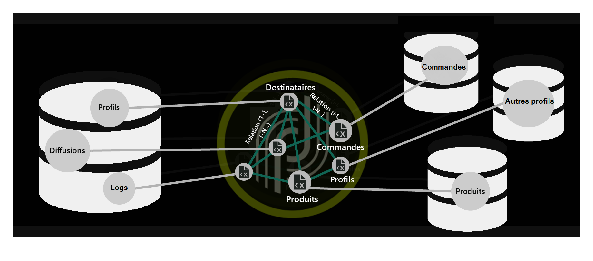
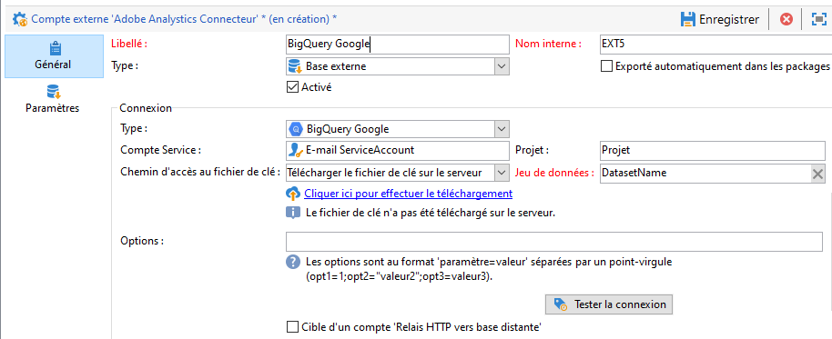

# Configuration de l&#39;accès à BigQuery Google {#configure-fda-google-big-query}


Utilisez l&#39;option Adobe Campaign Classic **Federated Data Access** (FDA) pour traiter les informations stockées dans une base de données externe. Suivez les étapes ci-dessous pour Configuration de l&#39;accès à [!DNL Google BigQuery].

1. Configuration de [!DNL Google BigQuery] sous [Windows](#google-windows) ou [Linux](#google-linux)
1. Configuration du [compte externe](#google-external) [!DNL Google BigQuery] dans Adobe Campaign Classic
1. Configuration du chargement en masse du connecteur [!DNL Google BigQuery] sous [Windows](#bulk-load-windows) ou [Linux](#bulk-load-linux)

>[!NOTE]
>
> Le connecteur [!DNL Google BigQuery] est disponible pour les déploiements hébergés, hybrides et on-premise. Pour plus dʼinformations, consultez [cette page](../../installation/using/capability-matrix.md).



## BigQuery Google sous Windows {#google-windows}

### Configuration du pilote sous Windows {#driver-window}

1. Téléchargez le pilote [ODBC pour Windows](https://cloud.google.com/bigquery/docs/reference/odbc-jdbc-drivers).

1. Configurez le pilote ODBC sous Windows. Pour plus d&#39;informations à ce sujet, consultez [cette page](https://storage.googleapis.com/simba-bq-release/jdbc/Simba%20JDBC%20Driver%20for%20Google%20BigQuery%20Install%20and%20Configuration%20Guide.pdf).

1. Pour que le connecteur [!DNL Google BigQuery] fonctionne, Adobe Campaign Classic requiert les paramètres de connexion suivants :

   * **[!UICONTROL Projet]** : permet de créer ou utiliser un projet existant.

      Pour plus d&#39;informations, consultez cette [page](https://cloud.google.com/resource-manager/docs/creating-managing-projects).

   * **[!UICONTROL Compte Service]** : permet de créer un compte de service.

      Pour plus d&#39;informations, consultez cette [page](https://cloud.google.com/iam/docs/creating-managing-service-accounts).

   * **[!UICONTROL Chemin d&#39;accès au fichier de clé]** : le **[!UICONTROL compte Service]** nécessite un **[!UICONTROL fichier de clé]** pour une connexion [!DNL Google BigQuery] via ODBC.

      Pour plus d&#39;informations, consultez cette [page](https://cloud.google.com/iam/docs/creating-managing-service-account-keys).

   * **[!UICONTROL Jeu de données]** : le **[!UICONTROL jeu de données]** est facultatif pour une connexion ODBC. Comme chaque requête doit fournir le jeu de données dans lequel se trouve la table, la spécification d&#39;un **[!UICONTROL jeu de données]** est obligatoire pour le connecteur FDA [!DNL Google BigQuery] dans Adobe Campaign Classic.

      Pour plus d&#39;informations, consultez cette [page](https://cloud.google.com/bigquery/docs/datasets).

1. Dans Adobe Campaign Classic, vous pouvez ensuite configurer votre compte externe [!DNL Google BigQuery]. Pour plus d&#39;informations sur la configuration de votre compte externe, voir [cette section](#google-external).

### Configuration du chargement en masse sous Windows {#bulk-load-window}

>[!NOTE]
>
>Pour que le SDK Google Cloud fonctionne, vous devez installer Python.
>
>Nous vous recommandons d&#39;utiliser Python3 ; voir cette [page](https://www.python.org/downloads/).

L&#39;utilitaire de chargement en masse permet un transfert plus rapide grâce au SDK Google Cloud.

1. Téléchargez l&#39;archive Windows 64 bits (x86_64) à partir de cette [page](https://cloud.google.com/sdk/docs/downloads-versioned-archives) et extrayez-la dans le répertoire correspondant.

1. Exécutez le script `google-cloud-sdk\install.sh`. Vous devez accepter le paramètre de variable de chemin.

1. Après l&#39;installation, vérifiez que la variable de chemin `...\google-cloud-sdk\bin` est définie. Sinon, ajoutez-la manuellement.

1. Dans le fichier `..\google-cloud-sdk\bin\bq.cmd`, ajoutez la variable locale `CLOUDSDK_PYTHON`, qui redirigera vers l&#39;emplacement de l&#39;installation Python.

   Par exemple :

   

1. Redémarrez Adobe Campaign Classic pour que les modifications soient prises en compte.

## BigQuery Google sous Linux {#google-linux}

### Configuration du pilote sous Linux {#driver-linux}

Avant de configurer le pilote, notez que le script et les commandes doivent être exécutés par l’utilisateur racine. Il est également recommandé d’utiliser Google DNS 8.8.8.8 lors de l’exécution du script.

Pour effectuer la configuration de [!DNL Google BigQuery] sur Linux, procédez comme suit :

1. Avant d’installer ODBC, vérifiez que les packages suivants sont installés sur votre distribution Linux :

   * Pour Red Hat/CentOS :

      ```
      yum update
      yum upgrade
      yum install -y grep sed tar wget perl curl
      ```

   * Sous Debian :

      ```
      apt-get update
      apt-get upgrade
      apt-get install -y grep sed tar wget perl curl
      ```

1. Mise à jour du système avant installation :

   * Pour Red Hat/CentOS :

      ```
      # install unixODBC driver manager
      yum install -y unixODBC
      ```

   * Sous Debian :

      ```
      # install unixODBC driver manager
      apt-get install -y odbcinst1debian2 libodbc1 odbcinst unixodbc
      ```

1. Avant d’exécuter le script, vous pouvez obtenir plus d’informations en spécifiant l’argument —help :

   ```
   cd /usr/local/neolane/nl6/bin/fda-setup-scripts
   ./bigquery_odbc-setup.sh --help
   ```

1. Accédez au répertoire où se trouve le script et exécutez le script suivant en tant qu’utilisateur root :

   ```
   cd /usr/local/neolane/nl6/bin/fda-setup-scripts
   ./bigquery_odbc-setup.sh
   ```

### Configuration du chargement en masse sous Linux {#bulk-load-linux}

>[!NOTE]
>
>Pour que le SDK Google Cloud fonctionne, vous devez installer Python.
>
>Nous vous recommandons d&#39;utiliser Python3 ; voir cette [page](https://www.python.org/downloads/).

L&#39;utilitaire de chargement en masse permet un transfert plus rapide grâce au SDK Google Cloud.

1. Avant d’installer ODBC, vérifiez que les packages suivants sont installés sur votre distribution Linux :

   * Pour Red Hat/CentOS :

      ```
      yum update
      yum upgrade
      yum install -y python3
      ```

   * Sous Debian :

      ```
      apt-get update
      apt-get upgrade
      apt-get install -y python3
      ```

1. Accédez au répertoire où se trouve le script et exécutez le script suivant :

   ```
   cd /usr/local/neolane/nl6/bin/fda-setup-scripts
   ./bigquery_sdk-setup.sh
   ```

## Compte externe BigQuery Google {#google-external}

Vous devez créer un compte externe [!DNL Google BigQuery] pour connecter votre instance Adobe Campaign Classic à votre base de données [!DNL Google BigQuery] externe.

1. Dans l&#39;**[!UICONTROL Explorateur]** Adobe Campaign Classic, cliquez sur **[!UICONTROL Administration]** &#39;>&#39; **[!UICONTROL Plateforme]** &#39;>&#39; **[!UICONTROL Comptes externes]**.

1. Cliquez sur **[!UICONTROL Nouveau]**.

1. Sélectionnez **[!UICONTROL Base de données externe]** en tant que **[!UICONTROL Type]** de compte externe.

1. Configurez le compte externe [!DNL Google BigQuery]. Vous devez indiquer les informations suivantes :

   * **[!UICONTROL Type]**: [!DNL Google BigQuery]

   * **[!UICONTROL Compte Service]** : adresse e-mail de votre **[!UICONTROL compte Service]**. Pour plus d&#39;informations à ce propos, consultez la [documentation Google Cloud](https://cloud.google.com/iam/docs/creating-managing-service-accounts).

   * **[!UICONTROL Projet]** : nom de votre **[!UICONTROL projet]**. Pour plus d&#39;informations à ce propos, consultez la [documentation Google Cloud](https://cloud.google.com/resource-manager/docs/creating-managing-projects).

   * **[!UICONTROL Chemin d&#39;accès au fichier de clé]** :
      * **[!UICONTROL Télécharger le fichier de clé sur le serveur]** : sélectionnez **[!UICONTROL Cliquer ici pour effectuer le téléchargement]** si vous choisissez de télécharger la clé via Adobe Campaign Classic.

      * **[!UICONTROL Saisir manuellement le chemin d&#39;accès au fichier de clé]** : copiez/collez votre chemin absolu dans ce champ si vous choisissez d&#39;utiliser une clé préexistante.
   * **[!UICONTROL Jeu de données]** : nom de votre **[!UICONTROL jeu de données]**. Pour plus d&#39;informations à ce propos, consultez la [documentation Google Cloud](https://cloud.google.com/bigquery/docs/datasets-intro).

   

Le connecteur prend en charge les options suivantes :

| Option | Description |
|:-:|:-:|
| ProxyType | Type de proxy utilisé pour se connecter à BigQuery par le biais des connecteurs ODBC et SDK. </br>HTTP (par défaut), http_no_tunnel, socks4 et socks5 sont actuellement pris en charge. |
| ProxyHost | Nom d’hôte ou adresse IP où le proxy peut être atteint. |
| ProxyPort | Numéro de port sur lequel le proxy s’exécute, par exemple 8080 |
| ProxyUid | Nom d’utilisateur utilisé pour le proxy authentifié |
| ProxyPwd | Mot de passe ProxyUid |
| bqpath | Notez que cela s’applique uniquement à l’outil de chargement en masse (SDK Cloud). </br> Pour éviter d’utiliser la variable PATH ou si le répertoire google-cloud-sdk doit être déplacé vers un autre emplacement, vous pouvez spécifier avec cette option le chemin exact du répertoire bin du sdk cloud sur le serveur. |
