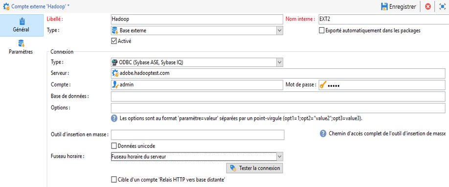

# Configurer l’accès à Hadoop  {#configure-access-to-hadoop}


Utilisez l’option Campaign **Federated Data Access** (FDA) pour traiter les informations stockées dans des bases de données externes. Suivez les étapes ci-dessous pour configurer l’accès à Hadoop.

1. Configuration de la [base de données Hadoop](#configuring-hadoop)
1. Configuration du [compte externe](#hadoop-external) Hadoop dans Campaign

## Configuration de Hadoop 3.0 {#configuring-hadoop}

La connexion à une base de données externe Hadoop dans FDA requiert les paramétrages suivants sur le serveur Adobe Campaign. Notez que cette configuration est possible pour Windows et Linux.

1. Téléchargez les pilotes ODBC pour Hadoop en fonction de votre version de système d’exploitation. Les pilotes se trouvent dans [cette page](https://www.cloudera.com/downloads.html).

1. Vous devez ensuite installer les pilotes ODBC et créer un DSN pour votre connexion Hive. Les instructions se trouvent dans [cette page](https://docs.cloudera.com/documentation/other/connectors/hive-odbc/2-6-5/Cloudera-ODBC-Driver-for-Apache-Hive-Install-Guide.pdf)

1. Après avoir téléchargé et installé les pilotes ODBC, vous devez redémarrer Campaign Classic. Pour cela, exécutez la commande suivante :

   ```
   systemctl stop nlserver.service
   systemctl start nlserver.service
   ```

1. Dans Campaign Classic, vous pouvez ensuite configurer votre compte externe [!DNL Hadoop]. Pour plus d’informations sur la configuration de votre compte externe, voir [cette section](#hadoop-external).

## Compte externe Hadoop {#hadoop-external}

Le compte externe [!DNL Hadoop] vous permet de connecter votre instance Campaign à votre base de données externe Hadoop.

1. Dans Campaign Classic, configurez votre compte externe [!DNL Hadoop]. Dans l’**[!UICONTROL Explorateur]**, cliquez sur **[!UICONTROL Administration]** / **[!UICONTROL Plateforme]** / **[!UICONTROL Comptes externes]**.

1. Cliquez sur **[!UICONTROL Nouveau]**.

1. Sélectionnez **[!UICONTROL Base de données externe]** en tant que **[!UICONTROL Type]** de compte externe.

1. Pour configuer le compte externe **[!UICONTROL Hadoop]**, vous devez indiquer les informations suivantes :

   * **[!UICONTROL Type]** : ODBC (Sybase ASE, Sybase IQ)

   * **[!UICONTROL Serveur]** : nom du DNS

   * **[!UICONTROL Compte]** : nom de l’utilisateur

   * **[!UICONTROL Mot de passe]** : mot de passe du compte utilisateur

   * **[!UICONTROL Base de données]** : nom de la base de données s’il n’est pas spécifié dans le DSN. Il peut rester vide s’il est spécifié dans le DSN

   * **[!UICONTROL Fuseau horaire]** : fuseau horaire du serveur

   

Le connecteur prend en charge les options ODBC suivantes :

| Nom | Valeur |
|---|---|
| ODBCMgr | iODBC |
| warehouse | 1/2/4 |

Le connecteur prend également en charge les options Hive suivantes :

| Nom | Valeur | Description |
|---|---|---|
| bulkKey | Clé d’accès Azure Blob ou DataLake. | Pour les chargeurs en masse wasb:// ou wasbs:// (c.-à-d. si l’outil de chargement en masse a pour préfixe wasb:// ou wasbs://). <br>Il s’agit de la clé d’accès pour le compartiment de blob ou de DataLake servant au chargement en masse. |
| hdfsPort | Numéro de port <br>défini par défaut sur 8020 | Pour le chargement HDFS en masse (c.-à-d. si l’outil de chargement en masse a pour préfixe webhdfs:// ou webhdfss://). |
| bucketsNumber | 20 | Nombre de compartiments lors de la création d’une table regroupée. |
| fileFormat | PARQUET | Format de fichier par défaut pour les tables de travail. |


## Configuration de Hadoop 2.1 {#configure-access-hadoop-2}

Si vous devez vous connecter à Hadoop 2.1, suivez les étapes décrites ci-dessous pour [Windows](#for-windows) ou [Linux](#for-linux).

### Hadoop 2.1 pour Windows {#for-windows}

1. Installez les pilotes ODBC et [Azure HD Insight](https://www.microsoft.com/en-us/download/details.aspx?id=40886) pour Windows.
1. Créez le nom de la source de données (DSN) en exécutant l’outil d’administrateur de la source de données ODBC. Un exemple de DSN système pour Hive vous est fourni. Vous pouvez le modifier.

   ```
   Description: vorac (or any name you like)
   Host: vorac.azurehdinsight.net
   Port: 443
   Database: sm_tst611 (or your database name)
   Mechanism: Azure HDInsight Service
   User/Password: admin/<your password here>
   ```

1. Créez le compte externe Hadoop, comme décrit dans [cette section](#hadoop-external).

### Hadoop 2.1 pour Linux {#for-linux}

1. Installez unixodbc pour Linux.

   ```
   apt-get install unixodbc
   ```

1. Téléchargez et installez les pilotes ODBC pour Apache Hive depuis HortonWorks : [https://www.cloudera.com/downloads.html](https://www.cloudera.com/downloads.html).

   ```
   dpkg -i hive-odbc-native_2.1.10.1014-2_amd64.deb
   ```

1. Vérifiez l’emplacement des fichiers ODBC.

   ```
   root@campadpac71:/tmp# odbcinst -j
   unixODBC 2.3.1
   DRIVERS............: /etc/odbcinst.ini
   SYSTEM DATA SOURCES: /etc/odbc.ini
   FILE DATA SOURCES..: /etc/ODBCDataSources
   USER DATA SOURCES..: /root/.odbc.ini
   SQLULEN Size.......: 8
   SQLLEN Size........: 8
   SQLSETPOSIROW Size.: 8
   ```

1. Créez le nom de la source de données et éditez le fichier odbc.ini. Puis, créez un nom de source de données pour votre connexion Hive.

   Voici un exemple pour HDInsight destiné à configurer une connexion appelée &quot;viral&quot; :

   ```
   [ODBC Data Sources]
   vorac 
   
   [vorac]
   Driver=/usr/lib/hive/lib/native/Linux-amd64-64/libhortonworkshiveodbc64.so
   HOST=vorac.azurehdinsight.net
   PORT=443
   Schema=sm_tst611
   HiveServerType=2
   AuthMech=6
   UID=admin
   PWD=<your password here>
   HTTPPath=
   UseNativeQuery=1
   ```

   >[!NOTE]
   >
   >Le paramètre **UseNativeQuery** est ici très important. Campaign est basé sur Hive et ne fonctionnera pas correctement si le paramètre UseNativeQuery n’est pas défini. En règle générale, le pilote ou Hive SQL Connector réécrit les requêtes et modifie l’ordre des colonnes.

   La configuration de l’authentification dépend de la configuration de Hive/Hadoop. Par exemple, pour HDInsight, utilisez AuthMech=6 pour l’authentification par utilisateur/mot de passe, comme décrit [ici](https://www.simba.com/products/Spark/doc/ODBC_InstallGuide/unix/content/odbc/hi/configuring/authenticating/azuresvc.htm).

1. Exportez les variables.

   ```
   export ODBCINI=/etc/myodbc.ini
   export ODBCSYSINI=/etc/myodbcinst.ini
   ```

1. Configurez les pilotes Hortonworks via /usr/lib/hive/lib/native/Linux-amd64-64/hortonworks.hiveodbc.ini.

   Vous devez utiliser UTF-16 pour vous connecter à Campaign et unix-odbc (libodbcinst).

   ```
   [Driver]
   
   DriverManagerEncoding=UTF-16
   ErrorMessagesPath=/usr/lib/hive/lib/native/hiveodbc/ErrorMessages/
   LogLevel=0
   LogPath=/tmp/hive
   SwapFilePath=/tmp
   
   ODBCInstLib=libodbcinst.so
   ```

1. Vous pouvez maintenant tester votre connexion en utilisant isql.

   ```
   isql vorac
   isql vorac -v
   ```

1. Créez le compte externe Hadoop, comme décrit dans [cette section](#hadoop-external).
