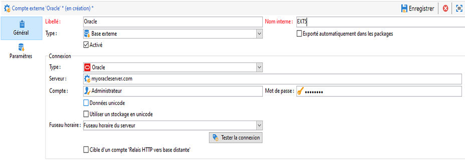

# Configurer l’accès à Oracle {#configure-access-to-oracle}


Utilisez l’option Campaign [Federated Data Access](../../installation/using/about-fda.md) (FDA) pour traiter les informations stockées dans des bases de données externes. Suivez les étapes ci-dessous pour configurer l’accès à Oracle.

1. Configuration d’Oracle sous [Linux](#oracle-linux) ou [Windows](#azure-windows)
1. Configuration du [compte externe](#oracle-external) Oracle dans Campaign

## Oracle sous Linux {#oracle-linux}

La connexion à une base de données externe Oracle en FDA requiert les paramétrages additionnels ci-dessous sur le serveur Adobe Campaign.

1. Installez le client complet Oracle correspondant à votre version d’Oracle.
1. Ajoutez vos définitions TNS à votre installation. Pour cela, indiquez-les dans un fichier **tnsnames.ora** dans le répertoire /etc/oracle. Si ce répertoire n’existe pas, créez-le.

   Créez alors une nouvelle variable d&#39;environnement TNS_ADMIN : export TNS_ADMIN=/etc/oracle et redémarrez la machine.

1. Intégrez Oracle à votre serveur Adobe Campaign (nlserver). Pour cela, vérifiez que le fichier **customer.sh** est bien présent dans le dossier &quot;nl6&quot; de l’arborescence du serveur Adobe Campaign et que ce dernier comprend bien les liens vers les bibliothèques Oracle.

   Par exemple pour un client 11.2 :

   ```
   export ORACLE_HOME=/usr/lib/oracle/11.2
   export TNS_ADMIN=/etc/oracle
   export LD_LIBRARY_PATH=$ORACLE_HOME/client64/lib:$LD_LIBRARY_PATH
   ```

   >[!NOTE]
   >
   >Ces valeurs (notamment ORACLE_HOME), dépendent de vos répertoires d’installation. Vérifiez bien votre arborescence avant de référencer ces valeurs.

1. Installez les librairies nécessaires à Oracle :

   * **libclntsh.so**

      ```
      cd /usr/lib/oracle/<version>/client<architecture>/lib
      ln -s libclntsh.so.<version> libclntsh.so
      ```

   * **libaio1**

      ```
      aptitude install libaio1
      or
      yum install libaio1
      ```

1. Dans Campaign Classic, vous pouvez ensuite configurer votre compte externe [!DNL Oracle]. Pour plus d’informations sur la configuration de votre compte externe, voir [cette section](#oracle-external).

## Oracle sous Windows {#oracle-windows}

La connexion à une base de données externe Oracle en FDA requiert les paramétrages additionnels ci-dessous sur le serveur Adobe Campaign.

1. Installez le client Oracle.

1. Dans le dossier C:Oracle, créez un fichier **tnsnames.ora** contenant vos définitions TNS.

1. Ajoutez une variable d’environnement TNS_ADMIN avec pour valeur C:Oracle et redémarrez la machine.

1. Dans Campaign Classic, vous pouvez ensuite configurer votre compte externe [!DNL Oracle]. Pour plus d’informations sur la configuration de votre compte externe, voir [cette section](#oracle-external).

## Compte externe Oracle {#oracle-external}

Le compte externe [!DNL Oracle] permet de connecter votre instance Campaign à votre base de données externe Oracle.

1. Dans l&#39;**[!UICONTROL Explorateur]** Campaign, cliquez sur **[!UICONTROL Administration]** &#39;>&#39; **[!UICONTROL Plateforme]** &#39;>&#39; **[!UICONTROL Comptes externes]**.

1. Choisissez **[!UICONTROL Nouveau]**.

1. Sélectionnez **[!UICONTROL Base de données externe]** en tant que **[!UICONTROL Type]** de compte externe.

1. Pour configurer le compte externe **[!UICONTROL Oracle]**, vous devez indiquer les informations suivantes :

   * **[!UICONTROL Type]** : Oracle

   * **[!UICONTROL Serveur]** : nom du DNS

   * **[!UICONTROL Compte]** : nom de l’utilisateur

   * **[!UICONTROL Mot de passe]** : mot de passe du compte utilisateur

   * **[!UICONTROL Fuseau horaire]** : fuseau horaire du serveur
   
