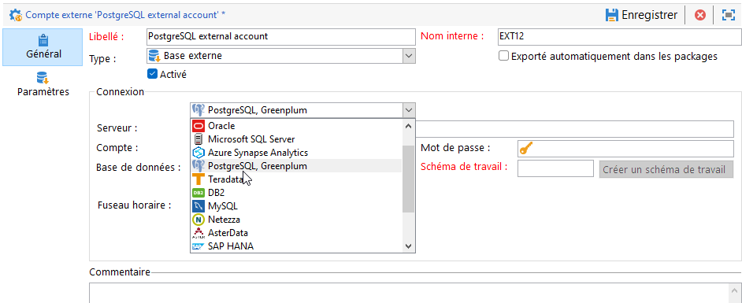

# Configurer l’accès à PostgreSQL {#configure-fda-postgresql}

Utilisez l’option Campaign **Federated Data Access** (FDA) pour traiter les informations stockées dans une base de données PostgreSQL externe.

## Configuration de PostgreSQL {#postgresql-configuration}

Vous devez d’abord installer Libpq. Libpq permet aux programmes clients d’envoyer des requêtes au serveur principal PostgreSQL et de recevoir les résultats de ces requêtes.

Suivez les étapes ci-dessous pour configurer l’accès à [!DNL PostgreSQL] :

* Pour CentOS, exécutez la commande suivante : `sudo apt-get -y install libpq-dev`.

* Pour Linux, exécutez la commande suivante : `yum install postgresql-devel`.

* Pour Windows, Libpq est implémenté via `libpq.dll` qui est inclus dans l’installation d’Adobe Campaign.

Dans Adobe Campaign, vous pouvez ensuite configurer votre compte externe [!DNL PostgreSQL]. Pour plus d&#39;informations sur la configuration de votre compte externe, voir [cette section](#postgresql-external).

## Compte externe PostgreSQL {#postgresql-external}

>[!NOTE]
>
> PostgreSQL est disponible sous CentOS 7 et 6.

Vous devez créer un compte externe [!DNL PostgreSQL] pour connecter votre instance Campaign à votre base de données [!DNL PostgreSQL] externe.

1. Depuis l&#39;**[!UICONTROL Explorateur]** Campaign, cliquez sur **[!UICONTROL Administration]** &#39;>&#39; **[!UICONTROL Plateforme]** &#39;>&#39; **[!UICONTROL Comptes externes]**.

1. Cliquez sur **[!UICONTROL Nouveau]**.

1. Sélectionnez **[!UICONTROL Base de données externe]** en tant que **[!UICONTROL Type]** de compte externe.

1. Sous **[!UICONTROL Configuration]**, sélectionnez [!DNL PostgreSQL, Greenplum] dans le menu déroulant **[!UICONTROL Type]**.

   

1. Configurez l’authentification du compte externe **[!UICONTROL PostgreSQL]** :

   * **[!UICONTROL Serveur]** : URL du serveur [!DNL PostgreSQL].

   * **[!UICONTROL Compte]** : nom de l’utilisateur.

   * **[!UICONTROL Mot de passe]** : mot de passe du compte utilisateur.

   * **[!UICONTROL Base de données]** : nom de la base de données (facultatif).

   * **[!UICONTROL Schéma de travail]** : nom de votre schéma de travail. [En savoir plus](https://www.postgresql.org/docs/current/ddl-schemas.html)

   * **[!UICONTROL Fuseau horaire]** : fuseau horaire défini dans [!DNL PostgreSQL]. [En savoir plus](https://www.postgresql.org/docs/7.2/timezones.html)

1. Cliquez sur l’onglet **[!UICONTROL Paramètres]**, puis sur le bouton **[!UICONTROL Déployer les fonctions]** pour créer des fonctions.

   >[!NOTE]
   >
   >Pour que toutes les fonctions soient disponibles, vous devez créer les fonctions SQL Adobe Campaign dans la base de données distante. Pour plus d’informations, consultez cette [page](../../configuration/using/adding-additional-sql-functions.md).

1. Cliquez sur **[!UICONTROL Enregistrer]** lorsque la configuration est terminée.

Le connecteur prend en charge les options suivantes :

| Option | Description |
|:-:|:-:|
| PGSQL_CONNECT_TIMEOUT | Attente maximale de la connexion, en secondes.  Pour plus d’informations à ce propos, consultez la [documentation PostgreSQL](https://www.postgresql.org/docs/12/libpq-connect.html#LIBPQ-CONNECT-CONNECT-TIMEOUT). |
| PGSQL_KEEPALIVES_IDLE | Nombre de secondes d’inactivité au-delà desquelles le protocole TCP doit envoyer un message de maintien en vie au serveur.  Pour plus d’informations à ce propos, consultez la [documentation PostgreSQL](https://www.postgresql.org/docs/12/libpq-connect.html#LIBPQ-KEEPALIVES-IDLE). |
| PGSQL_KEEPALIVES_INTVL | Nombre de secondes au-delà desquelles le message TCP de maintien en vie non reconnu par le serveur doit être retransmis.   Pour plus d’informations à ce propos, consultez la [documentation PostgreSQL](https://www.postgresql.org/docs/12/libpq-connect.html#LIBPQ-KEEPALIVES-INTERVAL). |
| PGSQL_KEEPALIVES_CNT | Nombre de maintiens en vie TCP pouvant être perdus avant que la connexion du client au serveur ne soit considérée comme morte.  Pour plus d’informations à ce propos, consultez la [documentation PostgreSQL](https://www.postgresql.org/docs/12/libpq-connect.html#LIBPQ-KEEPALIVES-COUNT). |
