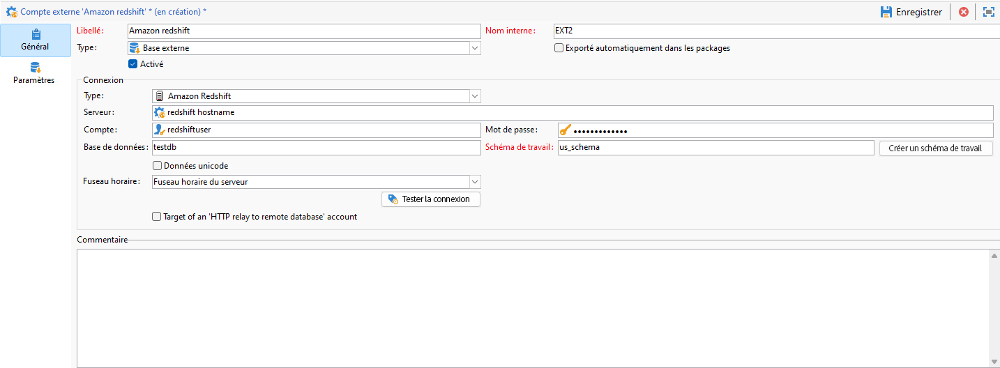

# Configurer l’accès à Amazon Redshift {#configure-access-to-redshift}

Utilisez l’option Campaign **Federated Data Access** (FDA) pour traiter les informations stockées dans des bases de données externes. Suivez les étapes ci-dessous pour configurer l’accès à Amazon Redshift.

1. Configurer la [base de données Amazon Redshift](#configuring-redshift)
1. Configurer le [compte externe](#redshift-external) Amazon Redshift dans Campaign

## Amazon Redshift sous Linux {#redshift-linux}

Pour effectuer la configuration de [!DNL Amazon Redshift] sur Linux, procédez comme suit :

1. Avant d’installer ODBC, vérifiez que les packages suivants sont installés sur votre distribution Linux :

   * Pour Red Hat/CentOS :

     ```
      yum update
      yum upgrade
      yum install -y grep sed tar wget perl curl
     ```

   * Sous Debian :

     ```
      apt-get update
      apt-get upgrade
      apt-get install -y grep sed tar wget perl curl
     ```

1. Avant d’exécuter le script, vous pouvez avoir accès à plus d’informations avec l’option `--help` :

   ```
   cd /usr/local/neolane/nl6/bin/fda-setup-scripts/
   ./redshift_odbc-setup.sh --help
   ```

1. Accédez au répertoire où se trouve le script et exécutez le script suivant en tant qu’utilisateur racine :

   ```
     cd /usr/local/neolane/nl6/bin/fda-setup-scripts
     ./redshift_odbc-setup.sh
   ```

1. Après avoir installé les pilotes ODBC, vous devez redémarrer Campaign Classic. Pour cela, exécutez la commande suivante :

   ```
   systemctl stop nlserver.service
   systemctl start nlserver.service
   ```

1. Dans Campaign, vous pouvez ensuite configurer votre compte externe [!DNL Amazon Redshift]. Pour plus d’informations sur la configuration de votre compte externe, voir [cette section](#redshift-external).

## Compte externe Amazon Redshift {#redshift-external}

Le compte externe [!DNL Amazon Redshift] vous permet de connecter l’instance Campaign à la base de données externe Amazon Redshift.

1. Dans Campaign Classic, configurez votre compte externe [!DNL Amazon Redshift]. Dans l’**[!UICONTROL Explorateur]**, cliquez sur **[!UICONTROL Administration]** / **[!UICONTROL Plateforme]** / **[!UICONTROL Comptes externes]**.

1. Cliquez sur **[!UICONTROL Nouveau]**.

1. Sélectionnez **[!UICONTROL Base de données externe]** en tant que **[!UICONTROL Type]** de compte externe.

1. Pour configurer le compte externe **[!UICONTROL Amazon Redshift]**, vous devez spécifier :

   * **[!UICONTROL Type]** : Amazon Redshift

   * **[!UICONTROL Serveur]** : nom du DNS

   * **[!UICONTROL Compte]** : nom de l’utilisateur

   * **[!UICONTROL Mot de passe]** : mot de passe du compte d’utilisateur

   * **[!UICONTROL Base de données]** : nom de la base de données s’il n’est pas spécifié dans le DSN. Il peut rester vide s’il est spécifié dans le DSN

   * **[!UICONTROL Schéma de travail]** : nom de votre schéma de travail. [En savoir plus](https://docs.aws.amazon.com/redshift/latest/dg/r_Schemas_and_tables.html)

   * **[!UICONTROL Fuseau horaire]** : fuseau horaire du serveur

   

1. Cliquez sur **[!UICONTROL Enregistrer]**.
