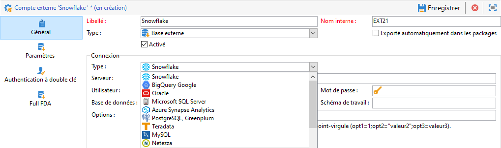
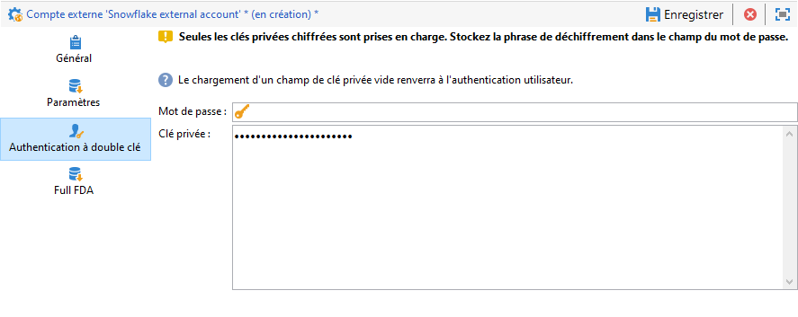

# Configurer l’accès à Snowflake {#configure-access-to-snowflake}


Utilisez l&#39;option Campaign **Federated Data Access** (FDA) pour traiter les informations stockées dans une base de données externe. Suivez les étapes ci-dessous pour Configuration de l&#39;accès à [!DNL Snowflake].

1. Configurer [!DNL Snowflake] on [Linux](#snowflake-linux).
1. Configuration du [compte externe](#snowflake-external) [!DNL Snowflake] dans Campaign

>[!NOTE]
>
>Le connecteur [!DNL Snowflake] est disponible pour les déploiements hébergés et on-premise. Voir à ce propos [cette page](../../installation/using/capability-matrix.md).


## Snowflake sous Linux {#snowflake-linux}

Pour configurer [!DNL Snowflake] sous Linux, procédez comme suit :

1. Avant d’installer ODBC, vérifiez que les packages suivants sont installés sur votre distribution Linux :

   * Pour Red Hat/CentOS :

      ```
      yum update
      yum upgrade
      yum install -y grep sed tar wget perl curl
      ```

   * Sous Debian:

      ```
      apt-get update
      apt-get upgrade
      apt-get install -y grep sed tar wget perl curl
      ```

1. Avant d’exécuter le script, vous pouvez accéder à plus d’informations avec la variable `--help` option :

   ```
   cd /usr/local/neolane/nl6/bin/fda-setup-scripts/
   ./snowflake_odbc-setup.sh --help
   ```

1. Accédez au répertoire où se trouve le script et exécutez le script suivant en tant qu’utilisateur root :

   ```
   cd /usr/local/neolane/nl6/bin/fda-setup-scripts
   ./snowflake_odbc-setup.sh
   ```

1. Après avoir installé les pilotes ODBC, vous devez redémarrer Campaign Classic. Pour cela, exécutez la commande suivante :

   ```
   systemctl stop nlserver.service
   systemctl start nlserver.service
   ```

1. Dans Campaign, vous pouvez ensuite configurer votre compte externe [!DNL Snowflake]. Pour plus d’informations sur la configuration de votre compte externe, voir [cette section](#snowflake-external).

## Compte externe Snowflake {#snowflake-external}

Vous devez créer un compte externe [!DNL Snowflake] pour connecter votre instance Campaign à votre base de données [!DNL Snowflake] externe.

1. Depuis l&#39;**[!UICONTROL Explorateur]** Campaign, cliquez sur **[!UICONTROL Administration]** &#39;>&#39; **[!UICONTROL Plateforme]** &#39;>&#39; **[!UICONTROL Comptes externes]**.

1. Cliquez sur **[!UICONTROL Nouveau]**.

1. Sélectionnez **[!UICONTROL Base de données externe]** en tant que **[!UICONTROL Type]** de compte externe.

1. Sous **[!UICONTROL Configuration]**, sélectionnez [!DNL Snowflake] de la **[!UICONTROL Type]** menu déroulant.

   

1. Ajoutez vos **[!UICONTROL Serveur]** URL et **[!UICONTROL Base]**.

1. Configurez la variable **[!UICONTROL Snowflake]** authentification de compte externe :

   * Pour l&#39;authentification Compte/Mot de passe, vous devez indiquer :

      * **[!UICONTROL Compte]** : nom de l&#39;utilisateur

      * **[!UICONTROL Mot de passe]** : mot de passe du compte utilisateur.

      

   * Pour l’authentification Keypair, cliquez sur le **[!UICONTROL Keypair Auth]** pour utiliser votre **[!UICONTROL Clé privée]** pour vous authentifier et copier, collez votre **[!UICONTROL Clé privée]**.

      


1. Cliquez sur l&#39;onglet **[!UICONTROL Paramètres]**, puis sur le bouton **[!UICONTROL Déployer les fonctions]** pour créer des fonctions.

   >[!NOTE]
   >
   >Pour que toutes les fonctions soient disponibles, vous devez créer les fonctions Adobe Campaign SQL dans la base distante. Pour plus d&#39;informations, consultez cette [page](../../configuration/using/adding-additional-sql-functions.md).

   

1. Cliquez sur **[!UICONTROL Enregistrer]** une fois la configuration terminée.

Le connecteur prend en charge les options suivantes :

| Option | Description |
|---|---|
| workschema | Schéma de base de données à utiliser pour les tables de travail. |
| warehouse | Nom de l&#39;entrepôt par défaut à utiliser. Il remplace la valeur par défaut de l&#39;utilisateur. |
| TimeZoneName | Vide par défaut. C&#39;est le fuseau horaire système du serveur applicatif Campaign Classic qui est utilisé. Il est possible d&#39;utiliser cette option pour forcer le paramètre de session TIMEZONE. <br>Pour plus d&#39;informations à ce sujet, consultez [cette page](https://docs.snowflake.net/manuals/sql-reference/parameters.html#timezone). |
| WeekStart | Paramètre de session WEEK_START. Par défaut, cette valeur est définie sur 0. <br>Pour plus d&#39;informations à ce sujet, consultez [cette page](https://docs.snowflake.com/en/sql-reference/parameters.html#week-start). |
| UseCachedResult | Paramètre de session USE_CACHED_RESULTS. Par défaut, cette valeur est définie sur TRUE. Il est possible d&#39;utiliser cette option pour désactiver les résultats de Snowflake mis en mémoire cache. <br>Pour plus d&#39;informations à ce sujet, voir [cette page](https://docs.snowflake.net/manuals/user-guide/querying-persisted-results.html). |
