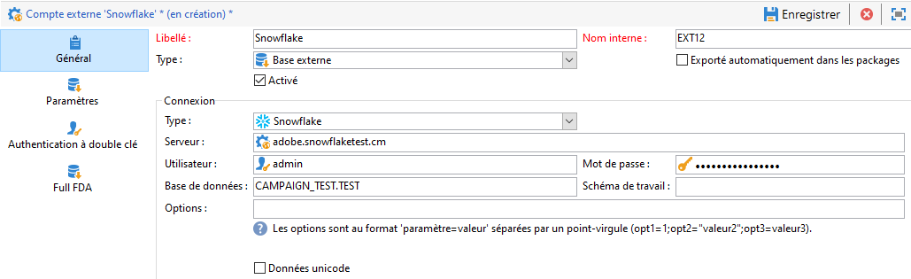
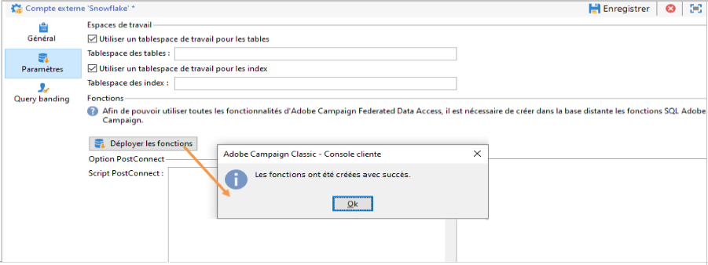

# Configurer l’accès à Snowflake {#configure-access-to-snowflake}


Utilisez l&#39;option Campaign **Federated Data Access** (FDA) pour traiter les informations stockées dans une base de données externe. Suivez les étapes ci-dessous pour Configuration de l&#39;accès à [!DNL Snowflake].

1. Configuration de [!DNL Snowflake] sous [CentOS](#snowflake-centos), [Windows](#snowflake-windows) ou [Debian](#snowflake-debian)
1. Configuration du [compte externe](#snowflake-external) [!DNL Snowflake] dans Campaign


>[!NOTE]
>
>Le connecteur [!DNL Snowflake] est disponible pour les déploiements hébergés et on-premise. Voir à ce propos [cette page](../../installation/using/capability-matrix.md).


## Snowflake sous CentOS {#snowflake-centos}

Pour effectuer la configuration de [!DNL Snowflake] sous CentOS, procédez comme suit :

1. Téléchargez les pilotes ODBC pour [!DNL Snowflake]. [Cliquez ici](https://sfc-repo.snowflakecomputing.com/odbc/linux/latest/snowflake-odbc-2.20.2.x86_64.rpm) pour lancer le téléchargement.
1. Vous devez ensuite installer les pilotes ODBC sur CentOs à l’aide de la commande suivante :

   ```
   rpm -Uvh unixodbc
   rpm -Uvh snowflake-odbc-2.20.2.x86_64.rpm
   ```

1. Après avoir téléchargé et installé les pilotes ODBC, vous devez redémarrer Campaign Classic. Pour cela, exécutez la commande suivante :

   ```
   /etc/init.d/nlserver6 stop
   /etc/init.d/nlserver6 start
   ```

1. Dans Campaign, vous pouvez ensuite configurer votre compte externe [!DNL Snowflake]. Pour plus d’informations sur la configuration de votre compte externe, voir [cette section](#snowflake-external).

## Snowflake sous Windows {#snowflake-windows}

1. Téléchargez le pilote [ODBC pour Windows](https://docs.snowflake.net/manuals/user-guide/odbc-download.html). Notez la nécessité de disposer de privilèges de niveau administrateur pour installer le pilote. Voir à ce propos [cette page](https://docs.snowflake.net/manuals/user-guide/admin-user-management.html)

1. Configurez le pilote ODBC. Voir à ce propos [cette page](https://docs.snowflake.net/manuals/user-guide/odbc-windows.html#step-2-configure-the-odbc-driver)

1. Dans Campaign, vous pouvez ensuite configurer votre compte externe [!DNL Snowflake]. Pour plus d’informations sur la configuration de votre compte externe, voir [cette section](#snowflake-external).

## Snowflake sous Debian {#snowflake-debian}

1. Téléchargez les pilotes ODBC pour [!DNL Snowflake]. [Cliquez ici](https://sfc-repo.snowflakecomputing.com/odbc/linux/latest/index.html) pour lancer le téléchargement.

1. Vous devez ensuite installer les pilotes ODBC sous Debian à l’aide de la commande suivante :

   ```
   apt-get install unixodbc
   apt-get install snowflake-odbc-x.xx.x.x86_64.deb
   ```

1. Après avoir téléchargé et installé les pilotes ODBC, vous devez redémarrer Campaign Classic. Pour cela, exécutez la commande suivante :

   ```
   systemctl stop nlserver.service
   systemctl start nlserver.service
   ```

1. Dans Campaign, vous pouvez ensuite configurer votre compte externe [!DNL Snowflake]. Pour plus d’informations sur la configuration de votre compte externe, voir [cette section](#snowflake-external).

## Compte externe Snowflake {#snowflake-external}

Vous devez créer un compte externe [!DNL Snowflake] pour connecter votre instance Campaign à votre base de données [!DNL Snowflake] externe.

1. Depuis l&#39;**[!UICONTROL Explorateur]** Campaign, cliquez sur **[!UICONTROL Administration]** &#39;>&#39; **[!UICONTROL Plate-forme]** &#39;>&#39; **[!UICONTROL Comptes externes]**.

1. Cliquez sur **[!UICONTROL Nouveau]**.

1. Sélectionnez **[!UICONTROL Base de données externe]** en tant que **[!UICONTROL Type]** de compte externe.

1. Pour configurer le compte externe **[!UICONTROL Snowflake]**, vous devez indiquer les informations suivantes :

   * **[!UICONTROL Type]**: [!DNL Snowflake]

   * **[!UICONTROL Serveur]** : URL du serveur [!DNL Snowflake]

   * **[!UICONTROL Compte]** : nom de l&#39;utilisateur

   * **[!UICONTROL Mot de passe]** : mot de passe du compte utilisateur

   * **[!UICONTROL Base de données]** : nom de la base de données

   

1. Cliquez sur l’onglet **[!UICONTROL Paramètres]**, puis sur le bouton **[!UICONTROL Déployer les fonctions]** pour créer des fonctions.

   

Le connecteur prend en charge les options suivantes :

| Option | Description |
|---|---|
| workschema | Schéma de base de données à utiliser pour les tables de travail. |
| warehouse | Nom de l&#39;entrepôt par défaut à utiliser. Il remplace la valeur par défaut de l&#39;utilisateur. |
| TimeZoneName | Vide par défaut. C&#39;est le fuseau horaire système du serveur applicatif Campaign Classic qui est utilisé. Il est possible d&#39;utiliser cette option pour forcer le paramètre de session TIMEZONE. <br>Pour plus d&#39;informations à ce sujet, consultez [cette page](https://docs.snowflake.net/manuals/sql-reference/parameters.html#timezone). |
| WeekStart | Paramètre de session WEEK_START. Par défaut, cette valeur est définie sur 0. <br>Pour plus d&#39;informations à ce sujet, consultez [cette page](https://docs.snowflake.com/en/sql-reference/parameters.html#week-start). |
| UseCachedResult | Paramètre de session USE_CACHED_RESULTS. Par défaut, cette valeur est définie sur TRUE. Il est possible d&#39;utiliser cette option pour désactiver les résultats de Snowflake mis en mémoire cache. <br>Pour plus d&#39;informations à ce sujet, voir [cette page](https://docs.snowflake.net/manuals/user-guide/querying-persisted-results.html). |
