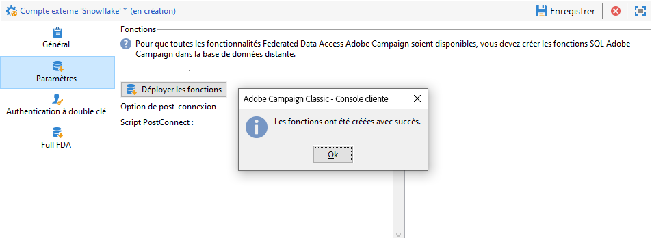

# Configurer l’accès à Snowflake {#configure-access-to-snowflake}


Utilisez l&#39;option Campaign **Federated Data Access** (FDA) pour traiter les informations stockées dans une base de données externe. Suivez les étapes ci-dessous pour Configuration de l&#39;accès à [!DNL Snowflake].

1. Configurez [!DNL Snowflake] sous [Linux](#snowflake-linux).
1. Configuration du [compte externe](#snowflake-external) [!DNL Snowflake] dans Campaign

>[!NOTE]
>
>Le connecteur [!DNL Snowflake] est disponible pour les déploiements hébergés et on-premise. Voir à ce propos [cette page](../../installation/using/capability-matrix.md).


## Snowflake sous Linux {#snowflake-linux}

Pour effectuer la configuration de [!DNL Snowflake] sous Linux, procédez comme suit :

1. Avant d’installer ODBC, vérifiez que les packages suivants sont installés sur votre distribution Linux :

   * Pour Red Hat/CentOS :

      ```
      yum update
      yum upgrade
      yum install -y grep sed tar wget perl curl
      ```

   * Sous Debian :

      ```
      apt-get update
      apt-get upgrade
      apt-get install -y grep sed tar wget perl curl
      ```

1. Avant d’exécuter le script, vous pouvez avoir accès à plus d’informations avec l’option `--help` :

   ```
   cd /usr/local/neolane/nl6/bin/fda-setup-scripts/
   ./snowflake_odbc-setup.sh --help
   ```

1. Accédez au répertoire où se trouve le script et exécutez le script suivant en tant qu’utilisateur racine :

   ```
   cd /usr/local/neolane/nl6/bin/fda-setup-scripts
   ./snowflake_odbc-setup.sh
   ```

1. Après avoir installé les pilotes ODBC, vous devez redémarrer Campaign Classic. Pour cela, exécutez la commande suivante :

   ```
   systemctl stop nlserver.service
   systemctl start nlserver.service
   ```

1. Dans Campaign, vous pouvez ensuite configurer votre compte externe [!DNL Snowflake]. Pour plus d’informations sur la configuration de votre compte externe, voir [cette section](#snowflake-external).

## Compte externe Snowflake {#snowflake-external}

Vous devez créer un compte externe [!DNL Snowflake] pour connecter votre instance Campaign à votre base de données [!DNL Snowflake] externe.

1. Depuis l&#39;**[!UICONTROL Explorateur]** Campaign, cliquez sur **[!UICONTROL Administration]** &#39;>&#39; **[!UICONTROL Plateforme]** &#39;>&#39; **[!UICONTROL Comptes externes]**.

1. Cliquez sur **[!UICONTROL Nouveau]**.

1. Sélectionnez **[!UICONTROL Base de données externe]** en tant que **[!UICONTROL Type]** de compte externe.

1. Sous **[!UICONTROL Configuration]**, sélectionnez [!DNL Snowflake] dans le menu déroulant **[!UICONTROL Type]**.

   

1. Ajoutez l’URL de votre **[!UICONTROL Serveur]** et votre **[!UICONTROL Base de données]**.

1. Configurez l’authentification du compte externe **[!UICONTROL Snowflake]** :

   * Pour l’authentification par compte/mot de passe, vous devez indiquer :

      * **[!UICONTROL Compte]** : nom de l’utilisateur

      * **[!UICONTROL Mot de passe]** : mot de passe du compte utilisateur.

      

   * Pour l’authentification par paire de clés, cliquez sur l’onglet **[!UICONTROL Authentification par paire de clés]** pour utiliser votre **[!UICONTROL Clé privée]** afin de vous authentifier et de copier/coller votre **[!UICONTROL Clé privée]**.

      


1. Cliquez sur l’onglet **[!UICONTROL Paramètres]**, puis sur le bouton **[!UICONTROL Déployer les fonctions]** pour créer des fonctions.

   >[!NOTE]
   >
   >Pour que toutes les fonctions soient disponibles, vous devez créer les fonctions SQL Adobe Campaign dans la base de données distante. Pour plus d’informations, consultez cette [page](../../configuration/using/adding-additional-sql-functions.md).

   

1. Cliquez sur **[!UICONTROL Enregistrer]** lorsque la configuration est terminée.

Le connecteur prend en charge les options suivantes :

| Option | Description |
|---|---|
| workschema | Schéma de base de données à utiliser pour les tables de travail. |
| warehouse | Nom de l&#39;entrepôt par défaut à utiliser. Il remplace la valeur par défaut de l&#39;utilisateur. |
| TimeZoneName | Vide par défaut. C&#39;est le fuseau horaire système du serveur applicatif Campaign Classic qui est utilisé. Il est possible d&#39;utiliser cette option pour forcer le paramètre de session TIMEZONE. <br>Pour plus d&#39;informations à ce sujet, consultez [cette page](https://docs.snowflake.net/manuals/sql-reference/parameters.html#timezone). |
| WeekStart | Paramètre de session WEEK_START. Par défaut, cette valeur est définie sur 0. <br>Pour plus d&#39;informations à ce sujet, consultez [cette page](https://docs.snowflake.com/en/sql-reference/parameters.html#week-start). |
| UseCachedResult | Paramètre de session USE_CACHED_RESULTS. Par défaut, cette valeur est définie sur TRUE. Il est possible d&#39;utiliser cette option pour désactiver les résultats de Snowflake mis en mémoire cache. <br>Pour plus d&#39;informations à ce sujet, voir [cette page](https://docs.snowflake.net/manuals/user-guide/querying-persisted-results.html). |
| bulkThreads | Nombre de threads à utiliser pour le chargeur en masse de Snowflake ; plus de threads signifient de meilleures performances pour les chargements en masse plus volumineux. Par défaut, cette valeur est définie sur 1. Le nombre peut être ajusté en fonction du nombre de threads de la machine. |
| chunkSize | Détermine la taille de fichier du bloc de chargeur en masse. Par défaut, cette valeur est définie sur 128 Mo. Peut être modifiée pour des performances plus optimales, lorsqu’elle est utilisée avec bulkThreads. Plus de threads actifs simultanément signifie de meilleures performances. <br>Pour plus d’informations à ce propos, consultez la [documentation Snowflake](https://docs.snowflake.net/manuals/sql-reference/sql/put.html). |
| StageName | Nom de l’étape interne préconfigurée. Elle sera utilisée en chargement massif au lieu de créer une nouvelle étape temporaire. |
